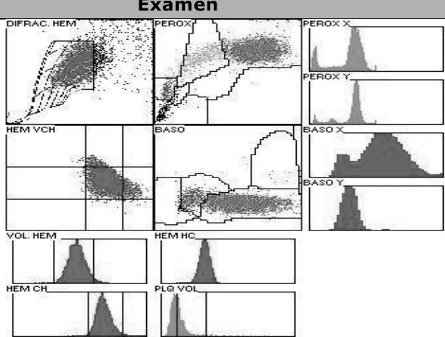
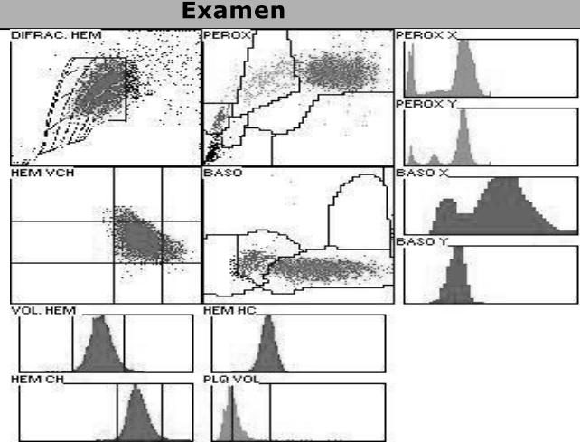
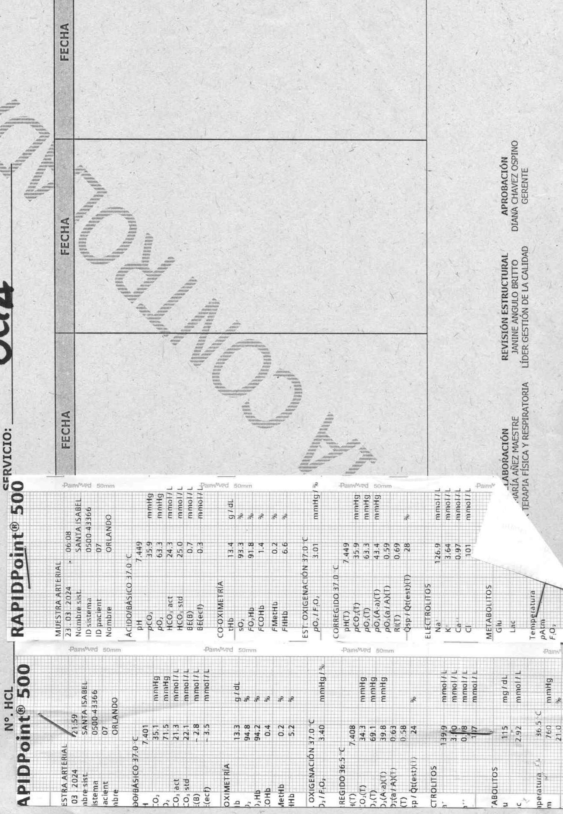
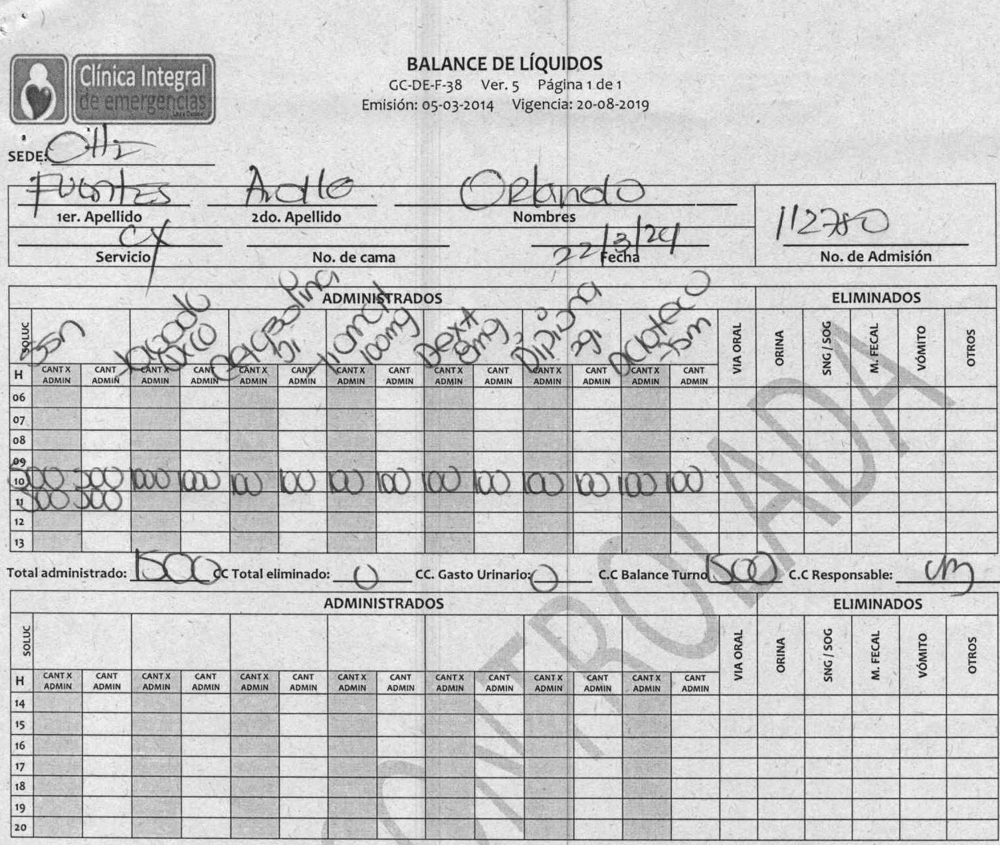
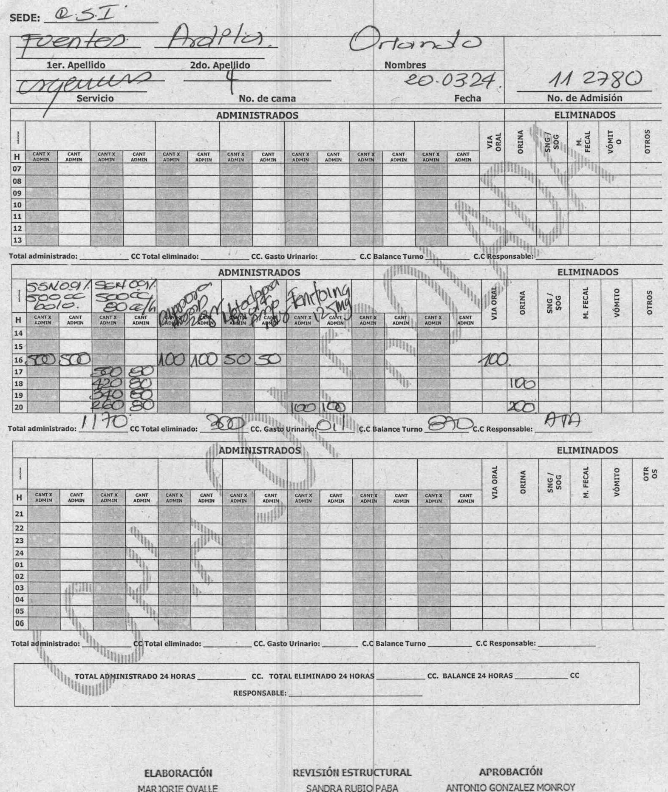
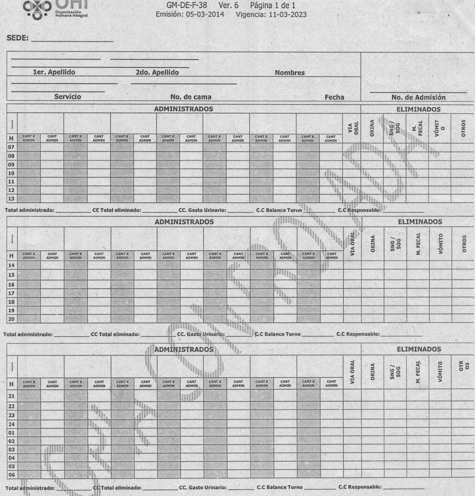
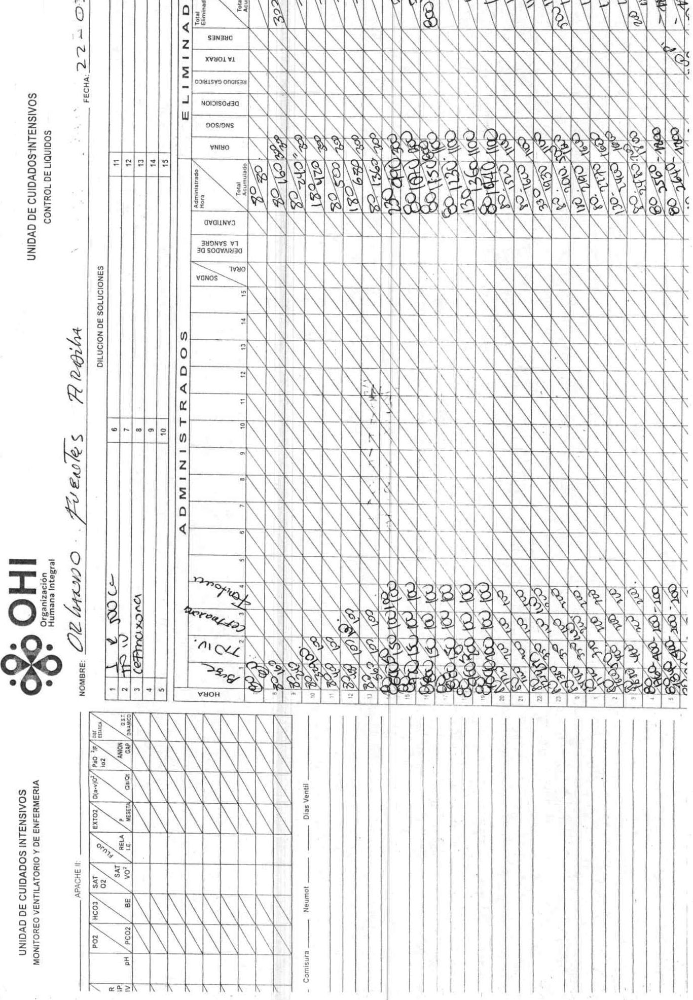
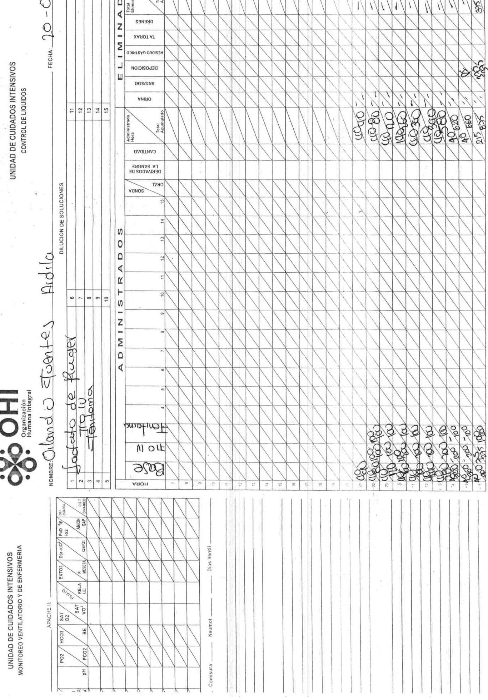
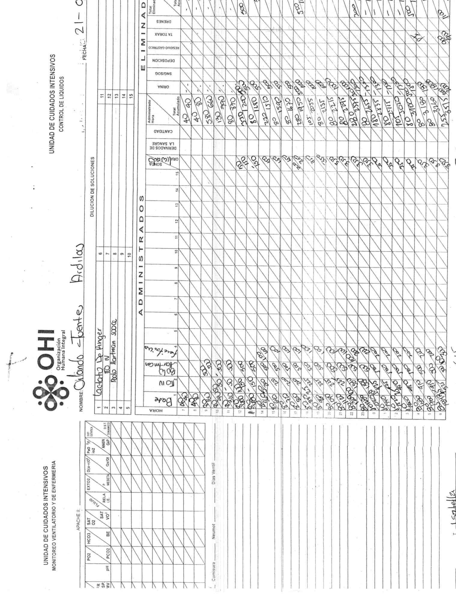
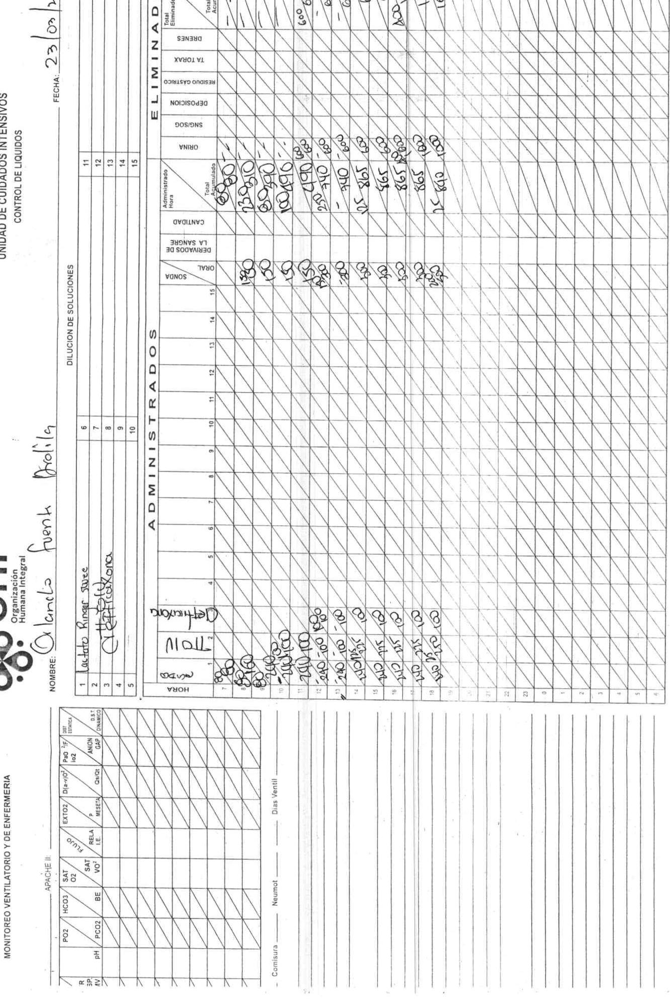

## Página 1 

# OHI Organizacion Humana Integral S.A. 

<table><tr><td colspan="2">Cliente 901037916-1 ADMINISTRADORA DE LOS RECURSOS DEL SISTEMA GENERAL DE SEGURIDAD</td><td colspan="3">Fecha Factura: 27.03.2024 15:42 Fecha Validación: 30.03.2024 11:35</td></tr><tr><td colspan="2">SOCIAL EN SALUD - ADRES CR 13 32 76 MINISTERIO DE SALUD Y PROTECCION SOCIAL</td><td colspan="3">Fecha Vencimiento: 26.04.2024 Fecha Ingreso: 20.03.2024 15:59</td></tr><tr><td colspan="2">BOGOTA D.C</td><td>Fecha Egreso:</td><td>23.03.2024 14:21</td><td></td></tr><tr><td colspan="2">Paciente FUENTES ARDILA ORLANDO Tipo Doc.: CC No. Doc77151487 Sexo: Masculino Edad: 58 Años</td><td>No. Admisión: 0300112780</td><td>Dias:</td><td>3</td></tr><tr><td>Dirección: VDA ALTO SICARARE</td><td>Plan ADRES Otro Teléfono 3143119553 Nivel: 1</td><td>Tipo: Cotizante</td><td></td><td></td></tr><tr><td colspan="3">No.Autoriz.: No Poliza:</td><td>Valor</td><td>SubTotal</td></tr><tr><td>100 CONSULTAS Y VALORACIONES</td><td></td><td>Cantidad 6.00</td><td>79,100.00</td><td>474,600.00</td></tr><tr><td>39140</td><td>INTERCONSULTA MEDICA ESPECIALIZADA AMBULATORIA O INTRAHOSPITALARIA</td><td></td><td>Subtotal&gt;:</td><td>474,600.00</td></tr><tr><td>21 RADIOLOGIA</td><td></td><td>Cantidad</td><td>Valor</td><td>SubTotal</td></tr><tr><td>21101</td><td>RAYOS X DE MANO DEDOS PUÑO (MUÑECA) CODO PIE CLAVÍCULA ANTEBRAZO CUELLO DE PIE</td><td>1.00</td><td>69,700.00</td><td>69,700.00</td></tr><tr><td></td><td>(TOBILLO) EDAD ÓSEA (CARPOGRAMA) CALCANEO</td><td></td><td>90,400.00</td><td>90,400.00</td></tr><tr><td>21102</td><td>RADIOGRAFIA DE BRAZO PIERNA RODILLA FEMUR HOMBRO OMOPLATO</td><td>1.00 1.00</td><td>99,300.00</td><td>99,300.00</td></tr><tr><td>21201 21601</td><td>RADIOGRAFIA DE TORAX (PA O P A Y LATERAL). REJA COSTAL PORTATILES SIN FLUOROSCOPIA E INTENSIFICADOR DE IMAGENES (PRACTICADO EN HABITACION. UCI.</td><td>1.00</td><td>72,500.00</td><td>72,500.00</td></tr><tr><td></td><td>RN O QUIROFANOS)</td><td></td><td></td><td></td></tr><tr><td></td><td></td><td></td><td>Subtotal&gt;;</td><td>331,900.00</td></tr><tr><td>21A</td><td>TOMOGRAFIA COMPUTARIZADA</td><td>Cantidad</td><td>Valor</td><td>SubTotal</td></tr><tr><td>21701</td><td>TOMOGRAFIA DE CRANEO SIMPLE</td><td>2.00</td><td>690,900.00</td><td>1,381,800.00</td></tr><tr><td>21706</td><td>TOMOGRAFIA DE SENOS PARANASALES O RINOFARINGE (INCLUYE CORTES AXIALES Y CORONALES)</td><td>1.00</td><td>758,200.00</td><td>758,200.00</td></tr><tr><td>21708</td><td>TOMOGRAFIA DE COLUMNA CERVICAL DORSAL O LUMBAR (HASTA TRES ESPACIOS)</td><td>1.00</td><td>643,400.00</td><td>643,400.00</td></tr><tr><td>21709</td><td>TOMOGRAFIA DE COLUMNA CERVICAL DORSAL O LUMBAR (ESPACIO ADICIONAL)</td><td>4.00</td><td>153,900.00</td><td>615,600.00</td></tr><tr><td>21712</td><td>TOMOGRAFIA DE TORAX</td><td>1.00</td><td>719,200.00</td><td>719,200.00</td></tr><tr><td>21715</td><td>TOMOGRAFIA DE ABDOMEN TOTAL</td><td>1.00</td><td>946,500.00</td><td>946,500.00</td></tr><tr><td>21722</td><td>RECONSTRUCCION TRIDIMENSIONAL PARA TOMOGRAFIA AGREGAR AL COSTO DEL EXAMEN:</td><td>1.00</td><td>1,002,500.00</td><td>1,002,500.00</td></tr><tr><td></td><td></td><td></td><td>Subtotal&gt;:</td><td>6,067,200.00</td></tr><tr><td>38 38825</td><td>INTERNACION (ESTANCIA) UNIDAD DE CUIDADO INTERMEDIO SALA ESPECIAL 2 Y 3 NIVEL</td><td>Cantidad 3.00</td><td>Valor 1,103,700.00</td><td>SubTotal 3,311,100.00</td></tr><tr><td></td><td></td><td></td><td>Subtotal&gt;:</td><td>3,311,100.00</td></tr><tr><td>51L</td><td>LIQUIDOS - BALANCE LIQUIDOS</td><td>Cantidad</td><td>Valor</td><td>SubTotal</td></tr><tr><td>29523-3</td><td>SOLUCION SALINA 0.9 X 100 ML</td><td>28.00</td><td>3,400.00</td><td>95,200.00</td></tr><tr><td>29523-2</td><td>SOLUCION SALINA 0.9 X 50 ML</td><td>12.00</td><td>2,800.00</td><td>33,600.00</td></tr><tr><td>32611-1</td><td>LACTATO DE RINGER X 500 ML</td><td>8.00</td><td>4,100.00</td><td>32,800.00</td></tr><tr><td>29523-6</td><td>SOLUCION SALINA 0.9 X1000 ML</td><td>1.00</td><td>6,700.00</td><td>6,700.00</td></tr><tr><td>29523-1</td><td>SOLUCION SALINA 0.9 X 25 ML</td><td>10.00</td><td>2,400.00</td><td>24,00000</td></tr><tr><td>29523-5</td><td>SOLUCION SALINA 0.9 X 500 ML</td><td>2.00</td><td>4,100.00</td><td>8,200.00</td></tr><tr><td></td><td></td><td></td><td>Subtotal&gt;</td><td>200,500.00</td></tr><tr><td>56</td><td>CONSUMO DE OXIGENO</td><td>Cantidad</td><td>Valor</td><td>SubTotal</td></tr><tr><td>20052866-2</td><td>OXIGENO - CATETER O CANULA NASAL horas a 3 Itr x min</td><td>29.00</td><td>3,200.00</td><td>92,800.00</td></tr><tr><td></td><td></td><td></td><td>Subtotal&gt;:</td><td>92,800.00</td></tr><tr><td>90 LABORATORIO CLINICO</td><td></td><td>Cantidad</td><td>Valor</td><td>SubTotal</td></tr><tr><td>19177</td><td>CALCIO COLORIMETRICO</td><td>3.00</td><td>29,300.00</td><td>87,900.00</td></tr><tr><td>19224</td><td>CLORO ( CLORURO )</td><td>4.00</td><td>15,700.00</td><td>62,800.00</td></tr><tr><td>19290</td><td>CREATININA. SUERO ORINA Y OTROS</td><td>4.00</td><td>19,800.00</td><td>79,200.00</td></tr><tr><td>19304</td><td>CUADRO HEMATICO O HEMOGRAMA HEMATOCRITO Y LEUCOGRAMA</td><td>4.00</td><td>34,300.00</td><td>137,200.00</td></tr><tr><td>19490</td><td>GLUCOSA (EN SUERO LCR OTRO FLUIDO)</td><td>3.00</td><td>20,700.00</td><td>6,100.00</td></tr><tr><td>19509</td><td>HEMOCLASIFICACION GRUPO ABO Y FACTOR RH</td><td>1.00</td><td>43,800.00</td><td>43,800.00</td></tr><tr><td></td><td>HEMOCULTIVO</td><td>2.00</td><td>97,900.00</td><td>195,800.00</td></tr><tr><td>19514</td><td></td><td></td><td></td><td></td></tr><tr><td>19749</td><td>NITROGENO UREICO Resolucion DIAN 18764051847160 de 14- Jul-2023. Auto OHL 1 al OHL 125000. Via</td><td>4.00 cia hasta el 14- Jul-2024</td><td>16,500.00</td><td>66,000.00</td></tr></table>

[p1](#p1)

## Página 2 

# OHI Organizacion Humana Integral S.A. 

<table><tr><td colspan="2">Cliente 901037916-1</td><td colspan="2">Fecha Factura:</td></tr><tr><td colspan="2">ADMINISTRADORA DE LOS RECURSOS DEL SISTEMA GENERAL DE SEGURIDAD</td><td>Fecha Validación:</td><td>27.03.2024 15:42 30.03.2024 11:35</td></tr><tr><td colspan="2">SOCIAL EN SALUD - ADRES</td><td>Fecha Vencimiento: 26.04.2024</td><td></td></tr><tr><td colspan="2">CR 13 32 76 MINISTERIO DE SALUD Y PROTECCION SOCIAL BOGOTA D.C</td><td>Fecha Ingreso: Fecha Egreso:</td><td>20.03.2024 15:59 23.03.2024 14:21</td></tr><tr><td colspan="2">Paciente FUENTES ARDILA ORLANDO</td><td colspan="2">0300112780</td></tr><tr><td colspan="2">No. Admisión: Tipo Doc.: CC No. Doc77151487 Sexo: Masculino Edad: 58 Años Plan ADRES</td><td colspan="2">Dias:</td></tr><tr><td colspan="2">Dirección: VDA ALTO SICARARE Teléfono 3143119553</td><td rowspan="3">Tipo: Cotizante</td><td></td></tr><tr><td>No.Autoriz.: No Poliza:</td><td>Nivel: 1</td><td></td></tr><tr><td></td><td>4.00</td><td>48,900.00</td></tr><tr><td>19792 POTASIO 19827 PROTROMBINA TIEMPO PT</td><td></td><td>4.00</td><td>195,600.00 49,900.00 199,600.00</td></tr><tr><td>19828</td><td>PRUEBA DE COMPATIBILIDAD CRUZADA MAYOR INCLUYE: HEMOCLASIFICACION DE DONANTE RECEPTOR</td><td>2.00 58,800.00</td><td>117,600.00</td></tr><tr><td>19842</td><td>RASTREO DE ANTICUERPOS IRREGULARES</td><td>1.00</td><td>55,500.00 55,500.00</td></tr><tr><td>19891 SODIO</td><td></td><td>4.00</td><td>40,500.00 162,000.00</td></tr><tr><td>19958</td><td>TROMBOPLASTINA. TIEMPO PARCIAL (PTT)</td><td>4.00</td><td>48,500.00 194,000.00</td></tr><tr><td>19966 UROCULTIVO CON RECUENTO DE COLONIAS</td><td></td><td>1.00</td><td>90,400.00 _90,400.00</td></tr><tr><td colspan="2"></td><td></td><td>Subtotal&gt; 1,749,500.00</td></tr><tr><td>MAT</td><td>MATERIAL MEDICO QUIRURGICO</td><td>Cantidad</td><td>Valor SubTotal</td></tr><tr><td>1030</td><td>JERINGA 10ml CON AGUJA 21G x 1 1/2</td><td>44.00</td><td>600.00 26,400.00</td></tr><tr><td>1031</td><td>JERINGA 5ml CON AGUJA 21G x 1 1/2</td><td>5.00</td><td>600.00 3,000.00</td></tr><tr><td>1254</td><td>CATETER INTRAVENOSO 20 G (INTROCAN BRAUN)</td><td>1.00</td><td>3,000.00 3,000.00</td></tr><tr><td>1257</td><td>CATETER INTRAVENOSO 18 G (INTROCAN BRAUN)</td><td>1.00</td><td>3,000.00 3,000.00</td></tr><tr><td>13750_M</td><td>EQUIPO DE EXTENSION PARA CATETER CON MICROCALIBRE EN Y SIN DEHP REF: 7N8371</td><td>1.00</td><td>20,900.00 20,900.00</td></tr><tr><td>1384</td><td>CATETER INTRAVENOSO 16 G</td><td>1.00</td><td>3,700.00 3,700.00</td></tr><tr><td>20026_M</td><td>SET PARA INFUSION VL ST02 REF: M46441900</td><td>1.00</td><td>40,000.00 40,000.00</td></tr><tr><td>5956_M</td><td>CATETER CON VALVULA CLEARLINK(PTO. DE INYECCION)2N8399</td><td>1.00</td><td>4,100.00 4,100.00</td></tr><tr><td>639_M EQUIPO MACROGOTEO</td><td></td><td>1.00</td><td>2,200.00 2,200.00 106,300.00</td></tr><tr><td colspan="2">MATERIALES DE OSTEOSINTESIS</td><td>Cantidad</td><td>Subtotal&gt;</td></tr><tr><td>MATQ 5712</td><td>ALAMBRE PARA CERCLAJE 0.5MM X METRO TRAUMEDICS IMPLANT</td><td>1.00</td><td>Valor SubTotal 42,100.00 42,100.00</td></tr><tr><td>S.A.S</td><td></td><td></td><td></td></tr><tr><td>7028_M</td><td>TORNILLO AUTOPERFORANTE</td><td>4.00</td><td>360,900.00 1,443,600.00</td></tr><tr><td>7032_M</td><td>PLACA RECTA PUENTE</td><td>1.00</td><td>940,600.00 940,600.00</td></tr><tr><td>7033_M</td><td>TORNILLO AUTORROSCANTE DE 1.6 MM X6 MM LINEAS HOSPITALARIAS S.A.S</td><td>14.00</td><td>201,500.00 2,821,000.00</td></tr><tr><td>7035_M</td><td>PLACA ANATOMICA PISO DE ORBITA REVERSIBLE &quot;S&quot;</td><td>1.00</td><td>3,694,300.00 3,694,300.00</td></tr><tr><td>7604_M</td><td>PLACA EN L PUENTE DE 3 MM PERFIL 0.6 FDE 4 ORIFICIOS LINEAS HOPSITALARIAS S.A.S</td><td>1.00</td><td>940,600.00 940,600.00 Subtotal&gt;</td></tr><tr><td>MDP</td><td></td><td></td><td>9,882,200.00</td></tr><tr><td>MEDICAMENTOS POS (GENERICOS) 212037-6</td><td>DIPIRONA MAGNESICA 2GR/5ML AMPOLLA</td><td>Cantidad 10.00</td><td>Valor SubTotal 4,500.00</td></tr><tr><td>19990588-9</td><td>FENITOINA SODICA 250 MG 5 ML AMPOLLA</td><td>10.00 27,600.00</td><td>45,000.00 276,000.00</td></tr><tr><td>19997313-3</td><td>TRAMADOL 50 MG AMPOLLA X 1 ML</td><td>6.00</td><td>2,700.00 16,200.00</td></tr><tr><td></td><td>DEXAMETASONA FOSFATO 4 MG AMPOLLA</td><td></td><td>3,500.00 21,000.00</td></tr><tr><td>19959764-1</td><td>CEFTRIAXONA 1 GR VIAL</td><td>6.00</td><td>294,000.00</td></tr><tr><td>19985517-2</td><td></td><td>6.00</td><td>49,000.00</td></tr><tr><td>29653-1 20070385-2</td><td>METOCLOPRAMIDA 10MG/2ML AMPOLLA</td><td>1.00 3.00</td><td>3,100.00 3,100.00 27,300.00 81,900.00</td></tr><tr><td>OMEPRAZOL 40MG VIAL</td><td></td><td>Subtotal&gt;:</td><td>737,200.000</td></tr><tr><td>PROC PROCEDIMIENTOS DIARIOS</td><td>Cantidad</td><td></td><td>Valor SubTotal</td></tr><tr><td>19275 GLUCOSA SEMIAUTOMATIZADA GLUCOMETRIA ( ART. 87)</td><td></td><td>2.00 8,500.00</td><td>17,000.00</td></tr><tr><td></td><td></td><td>Subtotal&gt;:</td><td>17,000.00</td></tr><tr><td colspan="2">PROCEDIMIENTOS</td><td></td><td>22/03/2024</td></tr><tr><td>16206 DECORTICACION O CURETAJE OSEO EN HUESO FACIAL 39006 39006 GRUPO 08 SERVICIOS PROFESIONALES DE CIRUJANO O GINECOOBST</td><td></td><td>1.00</td><td>323,300.00</td></tr><tr><td></td><td></td><td></td><td>323,300.00</td></tr><tr><td colspan="2">Resolucion DIAN 18764051847160 d 14-Jul-2023, Autoriza Factura Electronica del No. OHl al OHl 12500, Vigencia hasta el 14-Jul-2024 Regimen comun</td><td></td><td></td></tr></table>

[p2](#p2)

## Página 3 

<table><tr><td colspan="5">OHI Organizacion Humana Integral S.A. NIT 900008328-1 Carrera 18D No 22-33 - SEDE: Santa Isabel</td></tr><tr><td colspan="5">5803535 VALLEDUPAR</td></tr><tr><td>Código SGSSS: 200010001803 Clinte 901037916-1</td><td colspan="2">FACTURA ELECTRONICA DE VENTA</td><td>OHI47048 Fecha Factura:</td><td>27.03.2024 15:42</td></tr><tr><td colspan="4">ADMINISTRADORA DE LOS RECURSOS DEL SISTEMA GENERAL DE SEGURIDAD</td><td>Fecha Validación: 30.03.2024 11:35</td></tr><tr><td colspan="3" rowspan="3">SOCIAL EN SALUD - ADRES CR 13 32 76 MINISTERIO DE SALUD Y PROTECCION SOCIAL</td><td>Fecha Vencimiento: 26.04.2024</td></tr><tr><td>Fecha Ingreso:</td><td colspan="2">20.03.2024 15:59 23.03.2024 14:21</td></tr><tr><td>Fecha Egreso:</td><td></td></tr><tr><td colspan="4">BOGOTA D.C Paciente FUENTES ARDILA ORLANDO</td></tr><tr><td colspan="2">Tipo Doc.: CC No. Doc77151487 Sexo: Masculino</td><td colspan="2">Edad: 58 Años Plan ADRES Otro Teléfono 3143119553 Nivel: 1 Tipo:</td><td>0300112780 Cotizante</td><td>Dias: 3</td></tr><tr><td colspan="6">Dirección: VDA ALTO SICARARE</td></tr><tr><td colspan="6">No.Autoriz.: No Poliza:</td></tr><tr><td colspan="6">39106 GRUPO 08 SERVICIOS PROF DEL ANESTESIOLOGO</td></tr><tr><td>39106 39119</td><td colspan="3">1.00 191,000.00 191,000.00 39119 GRUPO 08 SERVICIOS PROFESIONALES DE AYUDANTIA QUIRURGICA</td><td>1.00 84,800.00</td><td>84,800.00</td></tr><tr><td>39210</td><td colspan="3">39210 GRUPO 08 DERECHOS DE SALA DE CIRUGIA</td><td>1.00 382,200.00</td><td>382,200.00</td></tr><tr><td>39303</td><td colspan="3">39303 MATERIALES QUIRURGICOS GRUPOS 07 - 08 - 09 1.00</td><td>307,100.00</td><td>307,100.00 22/03/2024</td></tr><tr><td colspan="6">16402 REDUCCION ABIERTA DE FRACTURA MALAR, CON REDUCCION PISO DE ORBITA, INJERTO Y/O FIJACION INTERNA [DISPOSITIVOS DE FIJACION U OSTEOSINTESIS] +</td></tr><tr><td>39008</td><td colspan="3">39008 GRUPO 10 SERVICIOS PROFESIONALES DE CIRUJANO O GINECOOBST</td><td>1.00 486,500.00</td><td>486,500.00</td></tr><tr><td>39108</td><td colspan="3">39108 GRUPO 10 SERVICIOS PROF DEL ANESTESIOLOGO</td><td>1.00 279,200.00 1.00 132,400.00</td><td>279,200.00 132,400.00</td></tr><tr><td>39121 39304</td><td colspan="3">39121 GRUPO 10 SERVICIOS PROFESIONALES DE AYUDANTIA QUIRURGICA</td><td>486,800.00</td><td>486,800.00</td></tr><tr><td>16507</td><td colspan="3">39304 MATERIALES QUIRURGICOS GRUPOS 10 - 11 - 12 - 13 1.00</td><td>22/03/2024</td><td></td></tr><tr><td colspan="6">OSTEOPLASTIA SIMULTANEA DE VARIOS HUESOS FACIALES</td></tr><tr><td>39008</td><td colspan="3">39008 GRUPO 10 SERVICIOS PROFESIONALES DE CIRUJANO O GINECOOBST</td><td>1.00 486,500.00</td><td>486,500.00</td></tr><tr><td>39108</td><td>39108 GRUPO 10 SERVICIOS PROF DEL ANESTESIOLOGO</td><td></td><td>1.00</td><td>279,200.00</td><td>279,200.00</td></tr><tr><td>39121</td><td>39121 GRUPO 10 SERVICIOS PROFESIONALES DE AYUDANTIA QUIRURGICA</td><td></td><td>1.00</td><td>132,400.00</td><td>132,400.00</td></tr><tr><td>39212</td><td colspan="3">39212 GRUPO 10 DERECHOS DE SALA DE CIRUGIA</td><td>1.00 579,600.00 1.00 486,800.00</td><td>579,600.00</td></tr><tr><td>39304 16508</td><td colspan="3">39304 MATERIALES QUIRURGICOS GRUPOS 10 - 11 - 12 - 13</td><td></td><td>486,800.00</td></tr><tr><td colspan="3">OSTEOPLASTIA SIMULTANEA DE VARIOS HUESOS FACIALES</td><td colspan="3">22/03/2024</td></tr><tr><td>39010</td><td colspan="3">39010 GRUPO 12 SERVICIOS PROFESIONALES DE CIRUJANO O GINECOOBST</td><td>1.00 810,500.00</td><td>810,500.00</td></tr><tr><td>39110</td><td>39110 GRUPO 12 SERVICIOS PROF DEL ANESTESIOLOGO 39123 GRUPO 12 SERVICIOS PROFESIONALES DE AYUDANTIA QUIRURGICA</td><td></td><td>1.00</td><td>472,100.00</td><td>472,100.00</td></tr><tr><td>39123</td><td></td><td></td><td>1.00</td><td>221,200.00</td><td>221,200.00</td></tr><tr><td>39214</td><td>39214 GRUPO 12 DERECHOS DE SALA DE CIRUGIA</td><td></td><td>1.00 1.00</td><td>1,299,000.00</td><td>1,299,000.00</td></tr><tr><td>39304 16552</td><td colspan="3">39304 MATERIALES QUIRURGICOS GRUPOS 10 - 11 - 12 - 13</td><td>649,000.00 22/03/2024</td><td>649,000.00</td></tr><tr><td colspan="3">NEURECTOMIA DE NERVIO PERIFERICO EN CABEZA O CUELLO NCOC + 39008 GRUPO 10 SERVICIOS PROFESIONALES DE CIRUJANO O GINECOOBST</td><td colspan="3"></td></tr><tr><td>39008 39108</td><td>39108 GRUPO 10 SERVICIOS PROF DEL ANESTESIOLOGO</td><td></td><td>1.00</td><td>486,500.00</td><td>486,500.00</td></tr><tr><td>39121</td><td>39121 GRUPO 10 SERVICIOS PROFESIONALES DE AYUDANTIA QUIRURGICA</td><td></td><td>1.00</td><td>279,200.00</td><td>279,200.00</td></tr><tr><td>39212</td><td>39212 GRUPO 10 DERECHOS DE SALA DE CIRUGIA</td><td></td><td>1.00</td><td>132,400.00</td><td>132,400.00 579,600.00</td></tr><tr><td>39304</td><td>39304 MATERIALES QUIRURGICOS GRUPOS 10 - 11 - 12 - 13</td><td></td><td>1.00 1.00</td><td>579,600.00 486,800.00</td><td>486,800.00</td></tr><tr><td></td><td colspan="2">Recibimos los servicios expresados en esta factura y en consecuencia pagaremos a la orden de CLINICA LAURA</td><td>TOTAL COSTO SERVICIOS:</td><td></td><td>33,024,400.00</td></tr><tr><td colspan="2" rowspan="2">DANIELA . La totalidad de su impo de Venta se asimila a una Letra de Cambio para todos sus efectos (Art. 774 C. Co.) y generara intereses de mora al 4% a partir de su vencimiento.No se aceptan reclamos despues de 20 días de presentada.</td><td colspan="2">TOTAL COPAGO</td><td colspan="2"></td></tr><tr><td colspan="2">TAL FACTURA ADMINISTRADORA:</td><td></td><td>0.00 33,024,400.00</td></tr></table>

[p3](#p3)

## Página 4 

# OHI Organizacion Humana Integral S.A. 

<table><tr><td colspan="2">Cliente 901037916-1 ADMINISTRADORA DE LOS RECURSOS DEL SISTEMA GENERAL DE SEGURIDAD SOCIAL EN SALUD - ADRES</td><td>Fecha Factura: 27.03.2024 15:42 Fecha Validación: 30.03.2024 11:35 Fecha Vencimiento: 26.04.2024</td></tr><tr><td colspan="2">CR 13 32 76 MINISTERIO DE SALUD Y PROTECCION SOCIAL BOGOTA D.C</td><td>Fecha Ingreso: 20.03.2024 15:59 Fecha Egreso: 23.03.2024 14:21</td></tr><tr><td colspan="2">Paciente FUENTES ARDILA ORLANDO No. Admisión: Tipo Doc.: CC No. Doc77151487 Sexo: Masculino Edad: 58 Años Plan ADRES</td><td>0300112780 Dias:</td></tr></table>

[p4](#p4)

# TREINTA Y TRES MILLONES VEINTICUATRO MIL CUATROCIENTOS PESOS M/CTE. 

# 33,024,400.00 

Se hace constar que la firma distinta al comprador supone que dicha persona está autorizada para firmar y recibir, confesar la deuda y obligar al contratante. Recibí conforme el servicio, acepto esta factura  [p4](#p4)

<table><tr><td>Afiliado:</td><td>Nombre: ARCE GARCIA JAIME Cargo: Representante Legal am</td></tr><tr><td>Firma</td><td></td></tr></table>

[p4](#p4)

## Página 5 

<table><tr><td colspan="2">Nombre: FUENTES ARDILA ORLANDO</td><td rowspan="2"></td><td rowspan="2">Fecha: 21.03.2024 E dad: 58 A¿os</td><td rowspan="2">Cama: TMPSIUA10 Habit: TMP Sector: SIPISO3UCI</td></tr><tr><td>IdentificaciAn: 0300079443 Tipo Ingreso: S OAT ConVeniO: ADMINISTRADORA DE LOS RECURSOS DEL SISTEMA GENERAL DE SEGURIDAD SOCIAL EN S. PiSO: SIPISO3</td><td>Sexo: Masculino F_Nacimiento: 9.03.1966 No.AdmisiAn: 0300112780</td></tr><tr><td colspan="2">Solicitado Por: CLINICA LAURA DANIE LA S.A. Area Funcional: UNIDAD FUNCIONAL DE QUIROFANOS Y SALAS DE PAR</td><td colspan="3">Plan: VADRES</td></tr><tr><td colspan="2"></td><td></td><td></td><td>Sede Afiliado: AGUSTIN CODAZZI</td></tr><tr><td colspan="2">Item C Adigo Servicio</td><td>Cant.</td><td>Vr. Copago 0.00</td><td>Valor Vr. Prestadora</td></tr><tr><td>001 5712_M ALAMBRE PARA CERCLAJ E</td><td></td><td>1</td><td>42,100.00</td><td>42,100.00</td></tr><tr><td>002 7035_M</td><td>PLACA ANATOMICA PISO DE ORBITA REVERSIBLE</td><td>1</td><td>0.00 3,694,300.00</td><td>3,694,300.00</td></tr><tr><td>003 7604_M</td><td>PLACA EN L PUENTE DERECHA E IZQ</td><td>1</td><td>0.00 940,600.00</td><td>940,600.00</td></tr><tr><td>004 7032_M</td><td>PLACA RECTA PUENTE</td><td>1</td><td>0.00</td><td>940,600.00 940,600.00</td></tr><tr><td>005 7028_M</td><td>TORNILLO AUTOPE RFORANTE</td><td>4</td><td>0.00</td><td>1,443,600.00 1,443,600.00</td></tr><tr><td>006 7033_M</td><td>TOR NILLO AUTORROS CANTE</td><td>14</td><td>0.00</td><td>2,821,000.00 2,821,000.00</td></tr></table>

[p5](#p5)

## Página 6 

Total ítems: 8 

<table><tr><td colspan="3">INFORMACIÓN DEL CLIENTE</td><td colspan="2">FACTURA ELECTRÓNICA DE VENTA No.</td><td></td><td>VD - 14465</td></tr><tr><td colspan="3">OHI ORGANIZACION HUMANA INTEGRAL S.A. .</td><td colspan="4">FECHA GENERACIÓN: 26/03/2024 5:00 AM FECHA EXPEDICIÓN: 26/03/2024 8:12 AM</td></tr><tr><td colspan="3">NIT o C.c: 900.008.328 - 1</td><td colspan="4">FECHA VENCIMIENTO: 25/05/2024</td></tr><tr><td colspan="3">DIRECCIÓN: CR 19 14 47 BRR SAN VICENTE</td><td colspan="4">FORMA DE PAGO: CREDITO 60 DIAS</td></tr><tr><td colspan="3">TELÉFONO:3153538752</td><td colspan="4">MEDIO DE PAGO:ACUERDO MUTUO</td></tr><tr><td colspan="3">CIUDAD: VALLEDUPAR PAÍS:COLOMBIA</td><td colspan="4">VENDEDOR: 1065637384-ADRIANA ALEXANDRA CAMARGO OROZCO</td></tr><tr><td colspan="3">Paciente: 77151487-ORLANDO FUENTES ARDILA Institución: 900008328-OHI ORGANIZACION HUMANA INTEGRAL S.A. .</td><td colspan="4">Médico: 1018425531-NORBIN JOSE MENDOZA CUELLO Ase. Med. Quir: 1019114179-MAYRA ALEJANDRA BETANCOURT</td></tr><tr><td>CANT</td><td>COD.</td><td>DESCRIPCIÓN</td><td>LOTE</td><td>VR. UNIT</td><td>%DESC VLR-DESC</td><td>%IVA VR. TOTAL</td></tr><tr><td>1</td><td>TIA06-90-104</td><td>UNIDAD</td><td>H1123 J1522</td><td>$ 940,580</td><td></td><td>$ 940,580</td></tr><tr><td>1</td><td>TIA04-87-003 4 GR -UNIDAD</td><td></td><td></td><td>$ 3,694,203</td><td></td><td>$ 3,694,203</td></tr><tr><td>1</td><td>TIB06-92-006 UNIDAD</td><td></td><td>K4522</td><td>$ 940,580</td><td></td><td>$ 940,580</td></tr><tr><td>5</td><td>TIS13-10-004</td><td>T01514 80-OLANADO FEU ENTES AR L A- MAO:3 DRN-ONDA -</td><td>E0122</td><td>$ 201,449</td><td></td><td>$ 1,007,245</td></tr><tr><td>8</td><td>TIS16-10-004</td><td>T71514 3-TOLANaDO FUENTES ARD LAN- MAsO: 3 DR -ONDAAS</td><td>F0722</td><td>$ 201,449</td><td></td><td>$ 1,611,592</td></tr><tr><td>1</td><td>TIS19-10-004</td><td>T01514 80-OLAADO EU ENTES AR L A- MAO:3 DRN-ONAS</td><td>C3422</td><td>$ 201,449</td><td></td><td>$ 201,449</td></tr><tr><td>4</td><td>TIS19-90-010</td><td>To174 3 -7 715180-OoRLAN O FUENTES AR ILA- PAsO: 3  -</td><td>J4722</td><td>$ 360,870</td><td></td><td>$ 1,443,480</td></tr><tr><td>1</td><td>4080400141</td><td>A715148 -O LAND PFUENTES ARDILA - A o: 3 a- -UNDAD</td><td>N2306001229</td><td>$ 42,029</td><td></td><td>$ 42,029</td></tr></table>

[p6](#p6)

<table><tr><td colspan="2">SON: NUEVE MILLONES OCHOCIENTOS OCHENTA Y UN MIL CIENTO CINCUENTA Y OCHO PESO(S) CON CERO CENTAVO(S)</td><td>SUBTOTAL</td><td>$ 9,881,158</td></tr><tr><td colspan="2">Observaciones: PV-CX-VALLEDUPAR PCT ORLANDO FUENTES ARDILA I.D 77151487</td><td>ANTICIPO/COPAGO</td><td></td></tr><tr><td colspan="2">CÓDIGO PRESTADOR: 6800104032 MODALIDAD: Por servicio</td><td>CUOTA MODERADORA</td><td>$ 0</td></tr><tr><td rowspan="3">TIPO DE DocuMENTO: Cédula de ciudadanía N. DE DOCUMENTO: 77151487 P. APELLIDO: FUENTES S. APELLIDO: ARDILA N. ID DE MIPRES:</td><td rowspan="3">coBERTURA: Cobertura Póliza SOAT No. AUTO: N. DE MIPRES:</td><td>CUOTA DE RECUPERACIÓN</td><td>$ 0</td></tr><tr><td>IVA</td><td>$ 0</td></tr><tr><td colspan="2">TOTAL</td></tr><tr><td colspan="3">P. NOMBRE: ORLANDO N. DE CONTRATO: S. NOMBRE: N. DE PÓLIZA: TIPO DE UsuARIO: Subsidiado PAGOS COMPARTIDOS: O</td><td colspan="2">FIRMA Y SELLO DEL CLIENTE</td></tr><tr><td colspan="3" rowspan="3">FECHA INICIAL: 22/03/2024 12:00:00 a. m. FECHA FINAL:22/03/2024 12:00:00 a. m. Esta factra se asila a tos sus efectos legales a na letra de cambio (rt 4 del cdigo de Comercio) y gnera su vencimiento intereses por mora del _%</td><td colspan="2">ACEPTADA</td></tr><tr><td colspan="2">LH SA.S. manifieta bajo lagravedad del juramento qe entregó coia origial de la presente factur al comprador, e informamos que transcuridos los tres cc FECHA</td></tr><tr><td colspan="2"></td></tr><tr><td colspan="2">*AUTORRETENEDORES DEL IMPUESTO SOBRE LA RENTA Resolución No.001351 del 25/02/2015.</td><td colspan="2"></td></tr><tr><td colspan="3">Pacho, Paipa, Pamplona, Pereira, Piedecuesta, Pitalito, Riohacha, San Juan del Cesar, Santa Marta y Valledupar. *Grandes contribuyentes en Cali resolución 4131.040. 21.1.0470 del 22/09/2023 *SEDE FABRIL : Girón/Stder.</td><td colspan="2">LH S.A.S ELABORADO POR SPINILLA</td></tr><tr><td colspan="4">Resolución de facturación No. 18764062102552 d feca 18/12/2023 1:0:0 a. m. Rangos VD-14079-1500-Fecha de Vencimient: 1812025 - 24 Meses</td></tr><tr><td colspan="4">Actividad Económica 4645</td></tr></table>

[p6](#p6)

## Página 7 

900008328-1-   
CARRERA 19 # 14 - 47   
Teléfonos: 5803535   
VALLEDUPAR   
Paciente: ORLANDO FUENTES ARDILA   
Identificación: CC 77151487   
Edad / Sexo: 58 Años 0 Meses 11 Dias / M   
Sede: SANTA ISABEL   
Contratante: ADMINISTRADORA DE RECURSOS DEL SIS"  [p7](#p7)

Admisión: 3200201 Fecha Ingreso: 20-03-2024 05:14 p. m. Fecha impresión: 21/03/2024 Médico:  [p7](#p7)

<table><tr><td>Examen</td><td>Resultado</td><td>Unidades</td><td>Valores De Referencia</td></tr><tr><td></td><td>HEMATOLOGIA</td><td></td><td></td></tr><tr><td colspan="4">CUADRO HEMATICO O HEMOGRAMA HEMATOCRITO Y LEUCOGRAMA</td></tr><tr><td>Método: AUTOMATIZADO GLOBULOS BLANCOS O LEUCOCITOS (WBC)</td><td>*15.8</td><td>XMM3</td><td>3.9 a 10.2</td></tr><tr><td>valor de referencia: 3,90-10,2 (10 9/L)</td><td></td><td></td><td></td></tr><tr><td>GLOBULOS ROJOS O ERITROCITOS (RBC)</td><td>4.4</td><td>Millones/mm3</td><td>4.3 a 5.8</td></tr><tr><td>HEMATOCRITO</td><td>42.1</td><td>%</td><td>37 a 52</td></tr><tr><td>Método: MICROCENTRIFUGACION</td><td></td><td></td><td></td></tr><tr><td colspan="4">valor de referencia: hombres 42-52 % Mujeres: de 36.1% a 44.3%</td></tr><tr><td>HEMOGLOBINA Método: COLORIMETRICO-ESPECTOFOTOMETRICO</td><td>14.2</td><td>g/dL</td><td>12 a 18</td></tr><tr><td colspan="4">valor de referencia:Hombres: de 14,0- 18 ,0 gramos (g) de hemoglobina por</td></tr><tr><td>decilitro (dL) de sangre Mujeres: 11,6 a 15 gramos por decilitro RECUENTO DE PLAQUETAS METODO AUTOMATICO</td><td>*236.0</td><td>x10^3/μL</td><td>150000 a 450000</td></tr><tr><td>VOLUMEN CORPUSCULAR MEDIO (MCV)</td><td>*95.6</td><td>FT</td><td>80 a 90</td></tr><tr><td>PORCENTAJE DE LINFOCITOS (LYMPH%)</td><td>*7.0</td><td>%</td><td>20 a 44</td></tr><tr><td>PORCENTAJE DE MONOCITOS (MID%)</td><td>8.3</td><td>%</td><td>2 a 9.5</td></tr><tr><td>PORCENTAJE DE EOSINOFILOS (EOS%)</td><td>*0.1</td><td>%</td><td>1 a 4</td></tr><tr><td>PORCENTAJE DE NEUTROFILOS (NEU%)</td><td>*83.6</td><td></td><td></td></tr><tr><td>PORCENTAJE DE BASOFILOS (BASF%)</td><td>*0.2</td><td></td><td>40 a 70</td></tr><tr><td></td><td></td><td></td><td>0.5 a 1.0</td></tr><tr><td>CV ANCHO DE DISTRIBUCION DE GLOBULOS ROJOS (RDW CV)</td><td>13.1</td><td>*3</td><td>1.5 a 14.5</td></tr><tr><td>HEMOGLOBINA CORPUSCULAR MEDIA (MCH)</td><td>32.1</td><td>pg</td><td>27 a 33.5</td></tr><tr><td>CONCENTRACION DE HEMOGLOBINA CORPUSCULAR MEDIA (MCHC)</td><td>33.6</td><td>%</td><td>31.5 a 36.0</td></tr><tr><td>LINFOCITOS (LYMPH#)</td><td>1.1</td><td>103/ml</td><td>1.1 a 4.5</td></tr><tr><td>SD ANCHO DE DISTRIBUCIÓN DE GLOBULOS ROJOS (RDW SD)</td><td>2.8</td><td>%</td><td>1 a 3</td></tr><tr><td>MONOCITOS O CELULAS DE TAMAÑO MEDIO (MID#)</td><td>*1.3</td><td>103/ml</td><td>0.1 a 0.9</td></tr><tr><td>EOSINOFILOS (EOS#)</td><td>*0.0</td><td>103/ml</td><td>1.5 a 5.0</td></tr><tr><td>BASOFILOS (BASF#)</td><td>0.0</td><td></td><td>0 a 0.2</td></tr><tr><td>VOLUMEN MEDIO PLAQUETARIO (MPV)</td><td>7.1</td><td>ft</td><td>5.9 a 9.9</td></tr><tr><td>PLAQUETOCRITO (PCT)</td><td>0.17</td><td>%</td><td>0.1 a 0.3</td></tr><tr><td>ANCHO DISTRIBUCION DE PLAQUETAS (PDW)</td><td>50.7</td><td>%</td><td>25 a 65</td></tr></table>

[p7](#p7)

## Página 8 

# OHI Organización Humana Integral S.A. 

900008328-1-   
CARRERA 19 # 14 - 47   
Teléfonos: 5803535   
VALLEDUPAR   
(Paciente: ORLANDO FUENTES ARDILA   
Identificación: CC 77151487   
Edad / Sexo: 58 Años 0 Meses 11 Dias / M   
Sede: SANTA ISABEL   
Contratante: ADMINISTRADORA DE RECURSOS DEL SISTEMA ADRES  [p8](#p8)

Admisión: 3200201 Fecha Ingreso: 20-03-2024 05:14 p. m. Fecha impresión: 21/03/2024 Médico:  [p8](#p8)

# Examen 

 [p8](#p8)

<table><tr><td>Resultado</td><td>Unidades Valores De Referencia</td></tr></table>

[p8](#p8)

# QUIMICA 

<table><tr><td>CREATININA EN SUERO U OTROS FLUIDOS</td><td>0.79</td><td>mg/dL</td><td></td></tr><tr><td>Método: BIOQUIMICA-ENZIMATICO</td><td></td><td></td><td></td></tr><tr><td colspan="4">valor de referencia: Normal: Hombres: 0.73 a 1.18 mg/dL y Muejeres de 0.55 a 1.02 mg/Dl, lactantes : 0,2-0,3 mg/dL niños dee 0,6-0,8 mg/dL</td></tr><tr><td>Validado: 20-03-2024 18:01 p. m.</td><td rowspan="2">20.7</td><td rowspan="2">mg/dL</td><td rowspan="2">9 a 23</td></tr><tr><td>NITROGENO UREICO (BUN)</td></tr><tr><td>Método: COLORIMETRICO</td><td rowspan="2"></td><td rowspan="2"></td><td rowspan="2"></td></tr><tr><td>Validado: 20-03-2024 18:01 p. m.</td></tr><tr><td>POTASIO</td><td>4.0</td><td>mEq/L</td><td>3.5 a 5.1</td></tr><tr><td>Método: COLORIMETRICO</td><td></td><td></td><td></td></tr><tr><td>Validado: 20-03-2024 18:01 p. m.</td><td></td><td></td><td></td></tr><tr><td>CLORO [CLORURO]</td><td>105.0</td><td>mEq/L</td><td>98 a 107</td></tr><tr><td></td><td></td><td></td><td></td></tr><tr><td>Método: COLORIMETRICO</td><td></td><td></td><td></td></tr><tr><td>Validado: 20-03-2024 18:01 p. m.</td><td>141.0</td><td>mEq/L</td><td>136 a 145</td></tr><tr><td>SODIO</td><td></td><td></td><td></td></tr><tr><td>Método: COLORIMETRICO IONES -ELECTRODO SELECTIVO</td><td></td><td></td><td></td></tr><tr><td>Validado: 20-03-2024 18:01 p. m.</td><td></td><td></td><td></td></tr><tr><td></td><td></td><td></td><td></td></tr></table>

[p8](#p8)

 [p8](#p8)

## Página 9 

# OHI Organización Humana Integral S.A. 

900008328-1-   
CARRERA 19 # 14 - 47   
Teléfonos: 5803535   
VALLEDUPAR  [p9](#p9)

Paciente: ORLANDO FUENTES ARDILA Identificación: CC 77151487  [p9](#p9)

Admisión: 3200201 Fecha Ingreso: 20-03-2024 05:14 p. m. Fecha impresión: 21/03/2024 Médico:  [p9](#p9)

<table><tr><td>Examen</td><td>Resultado</td><td>Unidades</td><td>Valores De Referencia</td></tr><tr><td></td><td>COAGULACION</td><td></td><td></td></tr><tr><td>TIEMPO DE PROTROMBINA [PT] Método: COAGULOMETRIA</td><td></td><td rowspan="3">Segundos</td><td rowspan="3">9.7 a 11.8</td></tr><tr><td>TIEMPO DE PROTROMBINA [PT]</td><td>11</td></tr><tr><td>CONTROL NORMAL PROTROMBINA</td><td>11.3</td></tr><tr><td>INR (NORMALIZED INTERNATIONAL INDEX)</td><td>1.03</td><td></td><td></td></tr><tr><td>TIEMPO DE TROMBOPLASTINA PARCIAL [PTT]</td><td></td><td></td><td></td></tr><tr><td>Método: COAGULOMETRIA TIEMPO DE TROMBOPLASTINA PARCIAL (TTP)</td><td>*22.7</td><td>Segundos</td><td>24.6 a 31.2</td></tr><tr><td>CONTROL NORMAL TROMBOPLASTINA</td><td>25</td><td></td><td></td></tr></table>

[p9](#p9)

## Página 10 

900008328-1-   
CARRERA 19 # 14 - 47   
Teléfonos: 5803535   
VALLEDUPAR  [p10](#p10)

Paciente: ORLANDO FUENTES ARDILA Identificación: CC 77151487  [p10](#p10)

Admisión: 3200268 Fecha Ingreso: 20-03-2024 11:01 p. m. Fecha impresión: 21/03/2024 MédiCO: WILSON JUNIOR HOYOS CORTINA  [p10](#p10)

<table><tr><td></td><td colspan="3"></td></tr><tr><td>Examen</td><td>Resultado</td><td>Unidades</td><td>Valores De Referencia</td></tr><tr><td></td><td>HEMATOLOGIA</td><td></td><td></td></tr><tr><td>CUADRO HEMATICO O HEMOGRAMA HEMATOCRITO Y LEUCOGRAMA Método: AUTOMATIZADO</td><td></td><td></td><td></td></tr><tr><td>GLOBULOS BLANCOS O LEUCOCITOS (WBC)</td><td>*14.5</td><td>XMM3</td><td>3.9 a 10.2</td></tr><tr><td>valor de referencia: 3,90-10,2 (10 9/L)</td><td></td><td></td><td></td></tr><tr><td>GLOBULOS ROJOS O ERITROCITOS (RBC)</td><td>4.4</td><td>Millones/mm3</td><td>4.3 a 5.8</td></tr><tr><td>HEMATOCRITO</td><td>43.5</td><td>%</td><td>37 a 52</td></tr><tr><td>Método: MICROCENTRIFUGACION</td><td></td><td></td><td></td></tr><tr><td>valor de referencia: hombres 42-52 % Mujeres: de 36.1% a 44.3%</td><td></td><td></td><td></td></tr><tr><td>HEMOGLOBINA Método: COLORIMETRICO-ESPECTOFOTOMETRICO</td><td>13.7</td><td>g/dL</td><td>12 a 18</td></tr><tr><td>valor de referencia:Hombres: de 14,0- 18 ,0 gramos (g) de hemoglobina por</td><td></td><td></td><td></td></tr><tr><td>decilitro (dL) de sangre Mujeres: 11,6 a 15 gramos por decilitro</td><td></td><td></td><td></td></tr><tr><td>RECUENTO DE PLAQUETAS METODO AUTOMATICO</td><td>*231.0</td><td>x10^3/μL</td><td>150000 a 450000</td></tr><tr><td>VOLUMEN CORPUSCULAR MEDIO (MCV)</td><td>*98.5</td><td>FT</td><td>80 a 90</td></tr><tr><td>PORCENTAJE DE LINFOCITOS (LYMPH%)</td><td>*6.8</td><td>%</td><td>20 a 44</td></tr><tr><td>PORCENTAJE DE MONOCITOS (MID%)</td><td>7.4</td><td>%</td><td>2 a 9.5</td></tr><tr><td>PORCENTAJE DE EOSINOFILOS (EOS%)</td><td>*0.2</td><td>%</td><td>1 a 4</td></tr><tr><td>PORCENTAJE DE NEUTROFILOS (NEU%)</td><td>*84.3</td><td></td><td>40 a 70</td></tr><tr><td>PORCENTAJE DE BASOFILOS (BASF%)</td><td>*0.3</td><td></td><td>0.5 a 1.0</td></tr><tr><td>CV ANCHO DE DISTRIBUCION DE GLOBULOS ROJOS (RDW CV)</td><td>13.2</td><td>*3</td><td>1.5 a 14.5</td></tr><tr><td>HEMOGLOBINA CORPUSCULAR MEDIA (MCH)</td><td>31.0</td><td>pg</td><td>27 a 33.5</td></tr><tr><td>CONCENTRACION DE HEMOGLOBINA CORPUSCULAR MEDIA (MCHC)</td><td>31.5</td><td>%</td><td>31.5 a 36.0</td></tr><tr><td>LINFOCITOS (LYMPH#)</td><td>*1.0</td><td>103/ml</td><td>1.1 a 4.5</td></tr><tr><td>SD ANCHO DE DISTRIBUCIÓN DE GLOBULOS ROJOS (RDW SD)</td><td>2.8</td><td>%</td><td>1 a 3</td></tr><tr><td>MONOCITOS O CELULAS DE TAMAÑO MEDIO (MID#)</td><td>*1.1</td><td>103/ml</td><td>0.1 a 0.9</td></tr><tr><td>EOSINOFILOS (EOS#)</td><td>*0.0</td><td>103/ml</td><td>1.5 a 5.0</td></tr><tr><td>BASOFILOS (BASF#)</td><td>0.0</td><td></td><td>0 a 0.2</td></tr><tr><td>VOLUMEN MEDIO PLAQUETARIO (MPV)</td><td>8.1</td><td>ft</td><td>5.9 a 9.9</td></tr><tr><td></td><td>0.19</td><td>%</td><td></td></tr><tr><td>PLAQUETOCRITO (PCT) ANCHO DISTRIBUCION DE PLAQUETAS (PDW)</td><td>41.0</td><td>%</td><td>0.1 a 0.3 25 a 65</td></tr></table>

[p10](#p10)

## Página 11 

# OHI Organización Humana Integral S.A. 

900008328-1-   
CARRERA 19 # 14 - 47   
Teléfonos: 5803535   
VALLEDUPAR  [p11](#p11)

Paciente: ORLANDO FUENTES ARDILA Identificación: CC 77151487  [p11](#p11)

Admisión: 3200268 Fecha Ingreso: 20-03-2024 11:01 p. m. Fecha impresión: 21/03/2024 MédiCO: WILSON JUNIOR HOYOS CORTINA  [p11](#p11)

<table><tr><td>Examen</td><td>Resultado</td><td>Unidades</td><td>Valores De Referencia</td></tr><tr><td colspan="3">QUIMICA</td><td></td></tr><tr><td>CREATININA EN SUERO U OTROS FLUIDOS</td><td>0.84</td><td>mg/dL</td><td></td></tr><tr><td colspan="3">Método: BIOQUIMICA-ENZIMATICO valor de referencia: Normal: Hombres: 0.73 a 1.18 mg/dL y Muejeres de 0.55</td><td></td></tr><tr><td>a 1.02 mg/Dl, lactantes : 0,2-0,3 mg/dL niños dee 0,6-0,8 mg/dL Validado: 21-03-2024 06:23 a. m.</td><td></td><td></td><td></td></tr><tr><td>NITROGENO UREICO (BUN) Método: COLORIMETRICO</td><td>22.2</td><td>mg/dL</td><td>9 a 23</td></tr><tr><td>Validado: 21-03-2024 06:23 a. m. CALCIO POR COLORIMETRIA</td><td>8.7</td><td>mg/dL</td><td>8.3 a 10.6</td></tr><tr><td>Método: COLORIMETRICO Validado: 21-03-2024 06:23 a. m.</td><td></td><td></td><td></td></tr><tr><td>POTASIO</td><td>4.3</td><td>mEq/L</td><td>3.5 a 5.1</td></tr><tr><td>Método: COLORIMETRICO</td><td></td><td></td><td></td></tr><tr><td>Validado: 21-03-2024 06:23 a. m.</td><td></td><td></td><td></td></tr><tr><td>CLORO [CLORURO]</td><td>106.0</td><td>mEq/L</td><td>98 a 107</td></tr><tr><td>Método: COLORIMETRICO</td><td></td><td></td><td></td></tr><tr><td></td><td></td><td></td><td></td></tr><tr><td>Validado: 21-03-2024 06:23 a. m.</td><td></td><td></td><td></td></tr><tr><td>SODIO</td><td>139.0</td><td>mEq/L</td><td>136 a 145</td></tr><tr><td>Método: COLORIMETRICO IONES -ELECTRODO SELECTIVO</td><td></td><td></td><td></td></tr><tr><td>Validado: 21-03-2024 06:23 a. m.</td><td></td><td></td><td></td></tr><tr><td>GLUCOSA EN SUERO LCR U OTRO FLUIDO DIFERENTE A ORINA</td><td>122</td><td>mg/dL</td><td></td></tr><tr><td>Método: ENZIMATICO</td><td></td><td></td><td></td></tr><tr><td></td><td></td><td></td><td></td></tr><tr><td>valor de referencia: Adultos 74-106 mg/dl, Recien Nacido 40-60, Neonato 50-80 mg/dl, Niños 60-100 mg/dl</td><td></td><td></td><td></td></tr><tr><td>Validado: 21-03-2024 06:23 a. m.</td><td></td><td></td><td></td></tr></table>

[p11](#p11)

## Página 12 

# OHI Organización Humana Integral S.A. 

900008328-1-   
CARRERA 19 # 14 - 47   
Teléfonos: 5803535   
VALLEDUPAR   
Paciente: ORLANDO FUENTES ARDILA   
Identificación: CC 77151487   
Edad / Sexo: 58 Años 0 Meses 11 Dias / M   
Sede: SANTA ISABEL   
Contratante: ADMINISTRADORA DE RECURSOS DEL SISTEMA ADRES  [p12](#p12)

Admisión: 3200268 Fecha Ingreso: 20-03-2024 11:01 p. m. Fecha impresión: 25/04/2024 MédiCO: WILSON JUNIOR HOYOS CORTINA  [p12](#p12)

# MICROBIOLOGIA 

HEMOCULTIVO X 2  [p12](#p12)

Método: MANUAL-AUTOMATICA  [p12](#p12)

HEMOCULTIVO DE MIEMBRO SUPERIOR IZQUIERDO  [p12](#p12)

NEGATIVO A LAS 12 HORAS DE INCUBACION. NEGATIVO A LAS 48 HORAS DE INCUBACION. NEGATIVO A LAS 72 HORAS DE INCUBACION. NEGATIVO A LOS 4 DIAS DE INCUBACION. NEGATIVO A LOS 7 DIAS DE INCUBACION INFORME FINAL  [p12](#p12)

Validado: 27-03-2024 09:03 a. m. HEMOCULTIVO AEROBIO POR METODO AUTOMATICO Método: MANUAL-AUTOMATICA HEMOCULTIVO DE MIEMBRO SUPERIOR DERECHO  [p12](#p12)

NEGATIVO A LAS 12 HORAS DE INCUBACION. NEGATIVO A LAS 48 HORAS DE INCUBACION. NEGATIVO A LAS 72 HORAS DE INCUBACION. NEGATIVO A LOS 4 DIAS DE INCUBACION. NEGATIVO A LOS 7 DIAS DE INCUBACION INFORME FINAL  [p12](#p12)

Valor de referencia: negativo a los 7 dias de incubacion Validado: 27-03-2024 09:03 a. m.  [p12](#p12)

KARINA ARROYO MARTINEZ Microbióloga T.P 1065585709 UFC/mL  [p12](#p12)

UROCULTIVO [ANTIOGRAMA MIC AUTOMATICO]  [p12](#p12)

Método: CULTIVOS  [p12](#p12)

## Página 13 

# OHI Organización Humana Integral S.A. 

900008328-1-   
CARRERA 19 # 14 - 47   
Teléfonos: 5803535   
VALLEDUPAR  [p13](#p13)

Paciente: ORLANDO FUENTES ARDILA Identificación: CC 77151487  [p13](#p13)

Admisión: 3200268 Fecha Ingreso: 20-03-2024 11:01 p. m. Fecha impresión: 21/03/2024 MédiCO: WILSON JUNIOR HOYOS CORTINA  [p13](#p13)

<table><tr><td>Examen</td><td>Resultado</td><td>Unidades</td><td>Valores De Referencia</td></tr><tr><td colspan="3">COAGULACION</td></tr><tr><td>TIEMPO DE PROTROMBINA [PT] Método: COAGULOMETRIA</td><td></td><td></td></tr><tr><td>TIEMPO DE PROTROMBINA [PT]</td><td>10</td><td>Segundos 9.7 a 11.8</td></tr><tr><td>CONTROL NORMAL PROTROMBINA</td><td>11.2</td><td></td></tr><tr><td>INR (NORMALIZED INTERNATIONAL INDEX)</td><td>0.99</td><td></td></tr><tr><td>TIEMPO DE TROMBOPLASTINA PARCIAL [PTT]</td><td></td><td></td></tr><tr><td>Método: COAGULOMETRIA</td><td></td><td>Segundos</td></tr><tr><td>TIEMPO DE TROMBOPLASTINA PARCIAL (TTP) CONTROL NORMAL TROMBOPLASTINA</td><td>*24.5 25</td><td>24.6 a 31.2</td></tr></table>

[p13](#p13)

 [p13](#p13)

## Página 14 

900008328-1-   
CARRERA 19 # 14 - 47   
Teléfonos: 5803535   
VALLEDUPAR  [p14](#p14)

Paciente: ORLANDO FUENTES ARDILA Identificación: CC 77151487  [p14](#p14)

Admisión: 3210216 Fecha Ingreso: 21-03-2024 11:17 p. m. Fecha impresión: 24/03/2024 MédiCO: WILSON JUNIOR HOYOS CORTINA  [p14](#p14)

<table><tr><td></td><td colspan="3"></td></tr><tr><td>Examen</td><td>Resultado</td><td>Unidades</td><td>Valores De Referencia</td></tr><tr><td></td><td>HEMATOLOGIA</td><td></td><td></td></tr><tr><td>CUADRO HEMATICO O HEMOGRAMA HEMATOCRITO Y LEUCOGRAMA Método: AUTOMATIZADO</td><td></td><td></td><td></td></tr><tr><td>GLOBULOS BLANCOS O LEUCOCITOS (WBC)</td><td>10.1</td><td>XMM3</td><td>3.9 a 10.2</td></tr><tr><td>valor de referencia: 3,90-10,2 (10 9/L)</td><td></td><td></td><td></td></tr><tr><td>GLOBULOS ROJOS O ERITROCITOS (RBC)</td><td>*3.9</td><td>Millones/mm3</td><td>4.3 a 5.8</td></tr><tr><td>HEMATOCRITO Método: MICROCENTRIFUGACION</td><td>37.9</td><td>%</td><td>37 a 52</td></tr><tr><td>valor de referencia: hombres 42-52 % Mujeres: de 36.1% a 44.3%</td><td></td><td></td><td></td></tr><tr><td>HEMOGLOBINA</td><td>12.5</td><td>g/dL</td><td>12 a 18</td></tr><tr><td>Método: COLORIMETRICO-ESPECTOFOTOMETRICO valor de referencia:Hombres: de 14,0- 18 ,0 gramos (g) de hemoglobina por</td><td></td><td></td><td></td></tr><tr><td>decilitro (dL) de sangre Mujeres: 11,6 a 15 gramos por decilitro</td><td></td><td></td><td></td></tr><tr><td>RECUENTO DE PLAQUETAS METODO AUTOMATICO</td><td>*184.0</td><td>x10^3/μL</td><td>150000 a 450000</td></tr><tr><td>VOLUMEN CORPUSCULAR MEDIO (MCV)</td><td>*96.3</td><td>FT</td><td>80 a 90</td></tr><tr><td>PORCENTAJE DE LINFOCITOS (LYMPH%)</td><td>*7.1</td><td>%</td><td>20 a 44</td></tr><tr><td>PORCENTAJE DE MONOCITOS (MID%)</td><td>3.3</td><td>%</td><td>2 a 9.5</td></tr><tr><td>PORCENTAJE DE EOSINOFILOS (EOS%)</td><td>*0.3</td><td>%</td><td>1 a 4</td></tr><tr><td>PORCENTAJE DE NEUTROFILOS (NEU%)</td><td>*88.9</td><td></td><td>40 a 70</td></tr><tr><td>PORCENTAJE DE BASOFILOS (BASF%)</td><td>*0.1</td><td></td><td>0.5 a 1.0</td></tr><tr><td>CV ANCHO DE DISTRIBUCION DE GLOBULOS ROJOS (RDW CV)</td><td>13.1</td><td></td><td></td></tr><tr><td>HEMOGLOBINA CORPUSCULAR MEDIA (MCH)</td><td></td><td>*3</td><td>1.5 a 14.5</td></tr><tr><td>CONCENTRACION DE HEMOGLOBINA CORPUSCULAR MEDIA (MCHC)</td><td>31.7</td><td>pg</td><td>27 a 33.5</td></tr><tr><td>LINFOCITOS (LYMPH#)</td><td>32.9</td><td>%</td><td>31.5 a 36.0</td></tr><tr><td>SD ANCHO DE DISTRIBUCIÓN DE GLOBULOS ROJOS (RDW SD)</td><td>*0.7</td><td>103/ml</td><td>1.1 a 4.5</td></tr><tr><td>MONOCITOS O CELULAS DE TAMAÑO MEDIO (MID#)</td><td>2.8</td><td>%</td><td>1 a 3</td></tr><tr><td>EOSINOFILOS (EOS#)</td><td>0.3</td><td>103/ml</td><td>0.1 a 0.9</td></tr><tr><td></td><td>*0.0</td><td>103/ml</td><td>1.5 a 5.0</td></tr><tr><td>NEUTROFILOS (NEU#)</td><td>*9.0</td><td></td><td>1.2 a 6.8</td></tr><tr><td>BASOFILOS (BASF#)</td><td>0.0</td><td></td><td>0 a 0.2</td></tr><tr><td>VOLUMEN MEDIO PLAQUETARIO (MPV)</td><td>7.7</td><td>ft</td><td>5.9 a 9.9</td></tr><tr><td>PLAQUETOCRITO (PCT)</td><td>0.14</td><td>%</td><td>0.1 a 0.3</td></tr><tr><td>ANCHO DISTRIBUCION DE PLAQUETAS (PDW)</td><td>45.3</td><td>%</td><td>25 a 65</td></tr></table>

[p14](#p14)

# QUIMICA 

## Página 15 

# OHI Organización Humana Integral S.A. 

900008328-1-   
CARRERA 19 # 14 - 47   
Teléfonos: 5803535   
VALLEDUPAR  [p15](#p15)

Paciente: ORLANDO FUENTES ARDILA Admisión: 3210216 Identificación: CC 77151487 Fecha Ingreso: 21-03-2024 11:17 p. m. Edad / Sexo: 58 Años 0 Meses 12 Dias / M Fecha impresión: 24/03/2024 Sede: SANTA ISABEL MédiCO: WILSON JUNIOR HOYOS CORTINA Contratante: ADMINISTRADORA DE RECURSOS DEL SISTEMA ADRES  [p15](#p15)

<table><tr><td>Examen</td><td>Resultado</td><td>Unidades</td><td>Valores De Referenc</td></tr><tr><td>Método: BIOQUIMICA-ENZIMATICO valor de referencia: Normal: Hombres: 0.73 a 1.18 mg/dL y Muejeres de 0.55</td><td></td><td></td><td></td></tr><tr><td>a 1.02 mg/Dl, lactantes : 0,2-0,3 mg/dL niños dee 0,6-0,8 mg/dL Validado: 22-03-2024 02:12 a. m.</td><td></td><td>mg/dL</td><td>9 a 23</td></tr><tr><td>NITROGENO UREICO (BUN) Método: COLORIMETRICO Validado: 22-03-2024 02:12 a. m.</td><td>17.1</td><td></td><td></td></tr><tr><td>CALCIO POR COLORIMETRIA Método: COLORIMETRICO</td><td>*8.1</td><td>mg/dL</td><td>8.3 a 10.6</td></tr><tr><td>Validado: 22-03-2024 02:12 a. m. POTASIO Método: COLORIMETRICO</td><td>4.5</td><td>mEq/L</td><td>3.5 a 5.1</td></tr><tr><td>Validado: 22-03-2024 02:12 a. m. CLORO [CLORURO]</td><td>102.0</td><td>mEq/L</td><td>98 a 107</td></tr><tr><td>Método: COLORIMETRICO</td><td></td><td></td><td></td></tr><tr><td>Validado: 22-03-2024 02:12 a. m.</td><td></td><td></td><td></td></tr><tr><td>SODIO</td><td>*135.0</td><td>mEq/L</td><td></td></tr><tr><td>Método: COLORIMETRICO IONES -ELECTRODO SELECTIVO</td><td></td><td></td><td>136 a 145</td></tr><tr><td></td><td></td><td></td><td></td></tr><tr><td>Validado: 22-03-2024 02:12 a. m.</td><td></td><td></td><td></td></tr><tr><td></td><td>123</td><td>mg/dL</td><td></td></tr><tr><td>GLUCOSA EN SUERO LCR U OTRO FLUIDO DIFERENTE A ORINA</td><td></td><td></td><td></td></tr><tr><td>Método: ENZIMATICO</td><td></td><td></td><td></td></tr><tr><td></td><td></td><td></td><td></td></tr><tr><td>valor de referencia: Adultos 74-106 mg/dl, Recien Nacido 40-60, Neonato 50-80</td><td></td><td></td><td></td></tr><tr><td>mg/dl, Niños 60-100 mg/dl</td><td></td><td></td><td></td></tr></table>

[p15](#p15)

# TIEMPO DE PROTROMBINA [PT] Método: COAGULOMETRIA 

TIEMPO DE PROTROMBINA [PT] 10   
CONTROL NORMAL PROTROMBINA 11.9   
INR (NORMALIZED INTERNATIONAL INDEX) 0.94   
TIEMPO DE TROMBOPLASTINA PARCIAL (TTP) \*24.4   
CONTROL NORMAL TROMBOPLASTINA 26  [p15](#p15)

## Página 16 

# OHI Organización Humana Integral S.A. 

900008328-1-   
CARRERA 19 # 14 - 47   
Teléfonos: 5803535   
VALLEDUPAR   
Paciente: ORLANDO FUENTES ARDILA   
Identificación: CC 77151487   
Edad / Sexo: 58 Años 0 Meses 12 Dias / M   
Sede: SANTA ISABEL   
Contratante: ADMINISTRADORA DE RECURSOS DEL SISTEMA ADRES  [p16](#p16)

Admisión: 3210216 Fecha Ingreso: 21-03-2024 11:17 p. m. Fecha impresión: 24/03/2024 MédiCO: WILSON JUNIOR HOYOS CORTINA  [p16](#p16)

## Página 17 

900008328-1-   
CARRERA 19 # 14 - 47   
Teléfonos: 5803535   
VALLEDUPAR   
Paciente: ORLANDO FUENTES ARDILA   
Identificación: CC 77151487   
Edad / Sexo: 58 Años 0 Meses 13 Dias / M   
Sede: SANTA ISABEL   
Contratante: ADMINISTRADORA DE RECURSOS DEL SIS  [p17](#p17)

Admisión: 3220275 Fecha Ingreso: 22-03-2024 11:39 p. m. Fecha impresión: 24/03/2024 Médico:  [p17](#p17)

<table><tr><td colspan="4"></td></tr><tr><td>Examen</td><td>Resultado</td><td>Unidades</td><td>Valores De Referencia</td></tr><tr><td></td><td>HEMATOLOGIA</td><td></td><td></td></tr><tr><td>CUADRO HEMATICO O HEMOGRAMA HEMATOCRITO Y LEUCOGRAMA Método: AUTOMATIZADO</td><td></td><td></td><td></td></tr><tr><td>GLOBULOS BLANCOS O LEUCOCITOS (WBC)</td><td>*11.7</td><td>XMM3</td><td>3.9 a 10.2</td></tr><tr><td>valor de referencia: 3,90-10,2 (10 9/L)</td><td></td><td></td><td></td></tr><tr><td>GLOBULOS ROJOS O ERITROCITOS (RBC)</td><td>*3.7</td><td>Millones/mm3</td><td>4.3 a 5.8</td></tr><tr><td>HEMATOCRITO</td><td>*34.7</td><td>%</td><td>37 a 52</td></tr><tr><td>Método: MICROCENTRIFUGACION</td><td></td><td></td><td></td></tr><tr><td>valor de referencia: hombres 42-52 % Mujeres: de 36.1% a 44.3%</td><td></td><td></td><td></td></tr><tr><td>HEMOGLOBINA</td><td>*11.6</td><td>g/dL</td><td>12 a 18</td></tr><tr><td>Método: COLORIMETRICO-ESPECTOFOTOMETRICO</td><td></td><td></td><td></td></tr><tr><td>valor de referencia:Hombres: de 14,0- 18 ,0 gramos (g) de hemoglobina por decilitro (dL) de sangre Mujeres: 11,6 a 15 gramos por decilitro</td><td></td><td></td><td></td></tr><tr><td>RECUENTO DE PLAQUETAS METODO AUTOMATICO</td><td>*216.0</td><td>x10^3/μL</td><td>150000 a 450000</td></tr><tr><td>VOLUMEN CORPUSCULAR MEDIO (MCV)</td><td>* 94.4</td><td>FT</td><td>80 a 90</td></tr><tr><td>PORCENTAJE DE LINFOCITOS (LYMPH%)</td><td>*11.4</td><td>%</td><td>20 a 44</td></tr><tr><td>PORCENTAJE DE MONOCITOS (MID%)</td><td>7.4</td><td>%</td><td>2 a 9.5</td></tr><tr><td>PORCENTAJE DE EOSINOFILOS (EOS%)</td><td>*0.4</td><td>%</td><td>1 a 4</td></tr><tr><td>PORCENTAJE DE NEUTROFILOS (NEU%)</td><td>*80.0</td><td></td><td>40 a 70</td></tr><tr><td>PORCENTAJE DE BASOFILOS (BASF%)</td><td></td><td></td><td></td></tr><tr><td>CV ANCHO DE DISTRIBUCION DE GLOBULOS ROJOS (RDW CV)</td><td>*0.1</td><td></td><td>0.5 a 1.0</td></tr><tr><td>HEMOGLOBINA CORPUSCULAR MEDIA (MCH)</td><td>13.0</td><td>*3</td><td>1.5 a 14.5</td></tr><tr><td>CONCENTRACION DE HEMOGLOBINA CORPUSCULAR MEDIA (MCHC)</td><td>31.6</td><td>pg</td><td>27 a 33.5</td></tr><tr><td>LINFOCITOS (LYMPH#)</td><td>33.5</td><td>%</td><td>31.5 a 36.0</td></tr><tr><td>SD ANCHO DE DISTRIBUCIÓN DE GLOBULOS ROJOS (RDW SD)</td><td>1.3</td><td>103/ml</td><td>1.1 a 4.5</td></tr><tr><td>MONOCITOS O CELULAS DE TAMAÑO MEDIO (MID#)</td><td>2.8</td><td>%</td><td>1 a 3</td></tr><tr><td>EOSINOFILOS (EOS#)</td><td>0.9</td><td>103/ml</td><td>0.1 a 0.9</td></tr><tr><td>NEUTROFILOS (NEU#)</td><td>*0.1</td><td>103/ml</td><td>1.5 a 5.0</td></tr><tr><td></td><td>*9.3</td><td></td><td>1.2 a 6.8</td></tr><tr><td>BASOFILOS (BASF#)</td><td>0.0</td><td></td><td>0 a 0.2</td></tr><tr><td>VOLUMEN MEDIO PLAQUETARIO (MPV)</td><td>7.2</td><td>ft</td><td>5.9 a 9.9</td></tr><tr><td>PLAQUETOCRITO (PCT)</td><td>0.15</td><td>%</td><td>0.1 a 0.3</td></tr><tr><td>ANCHO DISTRIBUCION DE PLAQUETAS (PDW)</td><td>48.0</td><td>%</td><td>25 a 65</td></tr></table>

[p17](#p17)

## Página 18 

900008328-1-   
CARRERA 19 # 14 - 47   
Teléfonos: 5803535   
VALLEDUPAR   
(Paciente: ORLANDO FUENTES ARDILA   
Identificación: CC 77151487   
Edad / Sexo: 58 Años 0 Meses 13 Dias / M   
Sede: SANTA ISABEL   
Contratante: ADMINISTRADORA DE RECURSOS DEL SISTEMA ADRES  [p18](#p18)

 [p18](#p18)

Admisión: 3220275 Fecha Ingreso: 22-03-2024 11:39 p. m. Fecha impresión: 24/03/2024 Médico:  [p18](#p18)

IRINA MARCELA CASTILLA GUERRA Validación: 23-03-2024 01:25 a. m.  [p18](#p18)

# QUIMICA 

<table><tr><td>CREATININA EN SUERO U OTROS FLUIDOS</td><td>0.81</td><td>mg/dL</td><td></td></tr><tr><td>Método: BIOQUIMICA-ENZIMATICO</td><td></td><td></td><td></td></tr><tr><td colspan="4">valor de referencia: Normal: Hombres: 0.73 a 1.18 mg/dL y Muejeres de 0.55 a 1.02 mg/Dl, lactantes : 0,2-0,3 mg/dL niños dee 0,6-0,8 mg/dL</td></tr><tr><td>Validado: 23-03-2024 08:58 a. m.</td><td></td><td></td><td></td></tr><tr><td>NITROGENO UREICO (BUN)</td><td>13.6</td><td>mg/dL</td><td>9 a 23</td></tr><tr><td>Método: COLORIMETRICO</td><td></td><td></td><td></td></tr><tr><td>Validado: 23-03-2024 08:58 a. m.</td><td></td><td></td><td></td></tr><tr><td>CALCIO POR COLORIMETRIA</td><td>*7.5</td><td>mg/dL</td><td>8.3 a 10.6</td></tr><tr><td>Método: COLORIMETRICO</td><td></td><td></td><td></td></tr><tr><td>Validado: 23-03-2024 08:58 a. m. GLUCOSA EN SUERO LCR U OTRO FLUIDO DIFERENTE A ORINA</td><td>120</td><td>mg/dL</td><td></td></tr><tr><td>Método: ENZIMATICO</td><td></td><td></td><td></td></tr><tr><td></td><td></td><td></td><td></td></tr><tr><td>valor de referencia: Adultos 74-106 mg/dl, Recien Nacido 40-60, Neonato 50-80</td><td></td><td></td><td></td></tr><tr><td>mg/dl, Niños 60-100 mg/dl</td><td></td><td></td><td></td></tr><tr><td></td><td></td><td></td><td></td></tr><tr><td></td><td></td><td></td><td></td></tr><tr><td>Validado: 23-03-2024 08:58 a. m.</td><td></td><td></td><td></td></tr></table>

[p18](#p18)

## Página 19 

900008328-1-   
CARRERA 19 # 14 - 47   
Teléfonos: 5803535   
VALLEDUPAR   
(Paciente: ORLANDO FUENTES ARDILA   
Identificación: CC 77151487   
Edad / Sexo: 58 Años 0 Meses 13 Dias / M   
Sede: SANTA ISABEL   
Contratante: ADMINISTRADORA DE RECURSOS DEL SISTEMA ADRES  [p19](#p19)

Admisión: 3220275 Fecha Ingreso: 22-03-2024 11:39 p. m. Fecha impresión: 24/03/2024 Médico:  [p19](#p19)

<table><tr><td>Examen</td><td>Resultado</td><td>Unidades</td><td>Valores De Referencia</td></tr><tr><td>POTASIO</td><td>4.2</td><td>mEq/L</td><td>3.5 a 5.1</td></tr><tr><td>Método: COLORIMETRICO</td><td></td><td></td><td></td></tr><tr><td>Validado: 23-03-2024 03:26 a. m.</td><td></td><td></td><td></td></tr><tr><td>CLORO [CLORURO]</td><td>99.8</td><td>mEq/L</td><td>98 a 107</td></tr><tr><td>Método: COLORIMETRICO</td><td></td><td></td><td></td></tr><tr><td>Validado: 23-03-2024 03:26 a. m.</td><td>*134.0</td><td></td><td></td></tr><tr><td>SODIO Método: COLORIMETRICO IONES -ELECTRODO SELECTIVO</td><td></td><td>mEq/L</td><td>136 a 145</td></tr><tr><td></td><td></td><td></td><td></td></tr><tr><td>Validado: 23-03-2024 03:26 a. m.</td><td></td><td></td><td></td></tr></table>

[p19](#p19)

 [p19](#p19)

NEIVIS OSMARY URECHE ESTRADA  [p19](#p19)

# COAGULACION 

TIEMPO DE PROTROMBINA [PT] 10   
CONTROL NORMAL PROTROMBINA 11.4   
INR (NORMALIZED INTERNATIONAL INDEX) 0.98  [p19](#p19)

TIEMPO DE TROMBOPLASTINA PARCIAL [PTT] Método: COAGULOMETRIA   
TIEMPO DE TROMBOPLASTINA PARCIAL (TTP) \*23.9   
CONTROL NORMAL TROMBOPLASTINA 26  [p19](#p19)

Segundos 9.7 a 11.8  [p19](#p19)

Segundos 24.6 a 31.2  [p19](#p19)

IRINA MARCELA CASTILLA GUERRA Validación: 23-03-2024 01:37 a. m.  [p19](#p19)

## Página 20 

# OHI Organizacion Humana Integral S.A. 

900008328-1   
Carrera 18D No 22-33 - SEDE: Santa Isabel   
Teléfonos: 5803535   
VALLEDUPAR  [p20](#p20)

No. Ingreso: 0101838324   
No. Orden: 0104993486  [p20](#p20)

# Paciente: FUENTES ARDILA ORLANDO 

Identificación: 77151487 Sexo: Masculino Edad: 58 Convenio: ADMINISTRADORA DE LOS RECURSOS DEL SISTEMA GENERAL DE SEGURIDAD SOCIAL EN S.   
Solicitado Por: HOYOS CORTINAS WILSON JUNIOR  [p20](#p20)

Fecha: 22.03.2024 2:07  [p20](#p20)

Exámen : 19842  [p20](#p20)

# RASTREO DE ANTICUERPOS IRREGULARES 

<table><tr><td>Profesional que Realizó:1067726527 AÑEZ LARA PAOLA ANDREA ) OBSERVACION</td></tr><tr><td></td></tr><tr><td>COOMBS INDIRECTO</td></tr><tr><td>RASTREO IRREGULAR I NEGATIVO RASTREO IRREGULAR II NEGATIVO</td></tr></table>

[p20](#p20)

## Página 21 

# OHI Organizacion Humana Integral S.A. 

900008328-1   
Carrera 18D No 22-33 - SEDE: Santa Isabel   
Teléfonos: 5803535   
VALLEDUPAR  [p21](#p21)

No. Ingreso: 0101838325   
No. Orden: 0104993487  [p21](#p21)

# Paciente: FUENTES ARDILA ORLANDO 

Fecha: 22.03.2024 2:07  [p21](#p21)

Identificación: 77151487 Sexo: Masculino Edad: 58 Convenio: ADMINISTRADORA DE LOS RECURSOS DEL SISTEMA GENERAL DE SEGURIDAD SOCIAL EN S.   
Solicitado Por: HOYOS CORTINAS WILSON JUNIOR  [p21](#p21)

Exámen : 911021  [p21](#p21)

# PRUEBA DE COMPATIBILIDAD CRUZADA MAYOR POR MICROTECNICA 

<table><tr><td colspan="2">Profesional que Realizó1067726527 AÑEZ LARA PAOLA ANDREA )</td></tr><tr><td>PRUEBAS CRUZADAS</td><td>COMPATIBLE (Valor Normal: .00 - .00)</td></tr><tr><td>HEMOCOMPONENTE</td><td>GRPL (GLOBULOS ROJOS POBRES EN LEUCOCITOS)</td></tr><tr><td>SELLO DE CALIDAD</td><td>24100840</td></tr><tr><td>NUMERO DE UNIDAD</td><td>24100840</td></tr><tr><td>GRUPO SANGUINEO DE LA BOLSA</td><td>&quot;O&quot;</td></tr><tr><td>FACTOR RH DE LA BOLSA</td><td>POSITIVO</td></tr><tr><td>GRUPO SANGUINEO Y RH DEL PACIENTE</td><td>O POSITIVO</td></tr><tr><td>FECHA DE VENCIMIENTO</td><td>27.04.2024</td></tr><tr><td>BANCO DE SANGRE</td><td>OHI</td></tr></table>

[p21](#p21)

Exámen : 911021 PRUEBA DE COMPATIBILIDAD CRUZADA MAYOR POR MICROTECNICA 

(Profesional que Realizó:1067726527 AÑEZ LARA PAOLA ANDREA )  [p21](#p21)

<table><tr><td>PRUEBAS CRUZADAS</td><td>COMPATIBLE (Valor Normal: .00 - .00)</td></tr><tr><td>HEMOCOMPONENTE</td><td>GRPL (GLOBULOS ROJOS POBRES EN LEUCOCITOS)</td></tr><tr><td>SELLO DE CALIDAD</td><td>24200801</td></tr><tr><td>NUMERO DE UNIDAD</td><td>24200801</td></tr><tr><td>GRUPO SANGUINEO DE LA BOLSA</td><td>&quot;O&quot;</td></tr><tr><td>FACTOR RH DE LA BOLSA</td><td>POSITIVO</td></tr><tr><td>GRUPO SANGUINEO Y RH DEL PACIENTE</td><td>O POSITIVO</td></tr><tr><td>FECHA DE VENCIMIENTO</td><td>27.04.2024</td></tr><tr><td>BANCO DE SANGRE</td><td>OHI</td></tr></table>

[p21](#p21)

## Página 22 

# OHI Organizacion Humana Integral S.A. 

900008328-1   
Carrera 18D No 22-33 - SEDE: Santa Isabel   
Teléfonos: 5803535   
VALLEDUPAR  [p22](#p22)

No. Ingreso: 0300456753   
No. Orden: 0301441405  [p22](#p22)

Paciente: FUENTES ARDILA ORLANDO Fecha: 20.03.2024 22:20 Identificación: 77151487 Sexo: Masculino Edad: 58 ConveniO: ADMINISTRADORA DE LOS RECURSOS DEL SISTEMA GENERAL DE SEGURIDAD SOCIAL EN S. Solicitado Por: HOYOS CORTINAS WILSON JUNIOR  [p22](#p22)

# ámen :19509 HEMOCLASIFICACION GRUPO ABO Y FACTOR RH 

(Profesional que Realizó:1065844361 GUTIÉRREZ RAMÍREZ LUIS DANII  [p22](#p22)

<table><tr><td>GRUPO SANGUINEO &quot;O&quot;</td></tr><tr><td>FACTOR RH POSITIVO</td></tr><tr><td>VARIANTE Du</td></tr><tr><td>OBSERVACIONES</td></tr></table>

[p22](#p22)

Exámen : 901221 HEMOCULTIVO AEROBIO POR METODO AUTOMATICO  [p22](#p22)

(Profesional que Realizó: GUTIÉRREZ RAMÍREZ LUIS DANII  [p22](#p22)

<table><tr><td>sionar que Realizo. HEMOCULTIVO #1</td></tr><tr><td>HEMOCULTIVO #2</td></tr><tr><td>HEMOCULTIVO #3</td></tr><tr><td>MICROORGANISMOS</td></tr><tr><td>ANTIBIOGRAMA</td></tr><tr><td>OBSERVACION</td></tr></table>

[p22](#p22)

Exámen : 901221 HEMOCULTIVO AEROBIO POR METODO AUTOMATICO  [p22](#p22)

<table><tr><td>(Profesional que Realizó: (cid:)</td><td></td></tr><tr><td>HEMOCULTIVO #1</td><td></td></tr><tr><td>HEMOCULTIVO #2</td><td></td></tr><tr><td>HEMOCULTIVO #3</td><td></td></tr><tr><td>MICROORGANISMOS</td><td></td></tr><tr><td>ANTIBIOGRAMA</td><td></td></tr><tr><td>OBSERVACION</td><td></td></tr></table>

[p22](#p22)

Exámen :903841 GLUCOSA EN SUERO LCR U OTRO FLUIDO DIFERENTE A ORINA  [p22](#p22)

(Profesional que Realizó: )  [p22](#p22)

RESULTADO mg/dl (Valor Normal: 70.00 - 110.00) OBSERVACION  [p22](#p22)

## Página 23 

# IMAGENOLOGIA 

# OHI Organizacion Humana Integral S.A. 

900008328-1   
Carrera 18D No 22-33 - SEDE: Santa Isabel   
Teléfonos: 5803535   
VALLEDUPAR  [p23](#p23)

No. Ingreso: 0300456768   
No. Orden: 0301441473  [p23](#p23)

Nombre: FUENTES ARDILA ORLANDO Fecha: 21.03.2024 1:57 Identificación: 77151487 Sexo: Masculino Edad: 58 Convenio: ADMINISTRADORA DE LOS RECURSOS DEL SISTEMA GENERAL DE SEGURIDAD SOCIAL EN S. Solicitado Por: HOYOS CORTINAS WILSON JUNIOR  [p23](#p23)

Exámen : 21101  [p23](#p23)

# Resultado: 

# RADIOGRAFÍA DE MANO IZQUIERDA 

Estructuras óseas que conforman la articulación de la mano de configuración, número, tamaño, y posición anatómic normal. cd:  [p23](#p23)

Densidad ósea conservada.  [p23](#p23)

Superficies articulares lisas.  [p23](#p23)

Espacios articulares conservados, sin calcificaciones interarticulares ni peri-articulares.  [p23](#p23)

Planos blandos radiografiados sin alteraciones.  [p23](#p23)

# OPINIÓN: 

Rx de mano sin evidencia de fractura.  [p23](#p23)

# Resultado: 

# RX DE PIERNA DERECHA 

Elementos que conforman las articulaciones de la pierna de número, configuración y posición anatómica normal, simétricas  [p23](#p23)

Densidad ósea conservada.  [p23](#p23)

Superficies articulares lisas.  [p23](#p23)

Espacios interarticulares conservados, sin calcificaciones intra ni peri-articulares.  [p23](#p23)

Rótulas de forma y posición normal.  [p23](#p23)

# OPINIÓN: 

Rx de pierna normal.  [p23](#p23)

## Página 24 

# IMAGENOLOGIA 

# OHI Organizacion Humana Integral S.A. 

900008328-1   
Carrera 18D No 22-33 - SEDE: Santa Isabel   
Teléfonos: 5803535   
VALLEDUPAR  [p24](#p24)

No. Ingreso: 0300456933   
No. Orden: 0301442069  [p24](#p24)

Nombre: FUENTES ARDILA ORLANDO Fecha: 23.03.2024 0:15 Identificación: 77151487 Sexo: Masculino Edad: 58 Convenio: ADMINISTRADORA DE LOS RECURSOS DEL SISTEMA GENERAL DE SEGURIDAD SOCIAL EN S. Solicitado Por: HOYOS CORTINAS WILSON JUNIOR  [p24](#p24)

Exámen :21201  [p24](#p24)

# Resultado: 

# RX DE TORAX PORTATIL 

Tráquea y vía aérea en línea media.  [p24](#p24)

Silueta cardiomediastinica de tamaño normal.  [p24](#p24)

Reforzamiento del patrón bronco vascular intersticial difuso bilateral, congestión hiliar bilateral.  [p24](#p24)

Diafragma de configuración normal.  [p24](#p24)

Opacidad del campo pulmonar bilateralmente.  [p24](#p24)

Planos blandos y óseos indemnes  [p24](#p24)

# Resultado: 

<table><tr><td>Firma</td></tr><tr><td>R.M.</td></tr><tr><td>Médico Radiologo</td></tr></table>

[p24](#p24)

## Página 25 

 [p25](#p25)

oe 

## Página 26 

# OHI Organizacion Humana Integral S.A. 

900008328-1-   
Carrera 18D No 22-33 - SEDE: Santa Isabel   
Teléfonos: 5803535   
VALLEDUPAR  [p26](#p26)

# Nombre: FUENTES ARDILA ORLANDO 

# EPICRISIS 

Identificación: CC 77151487 Sexo: Masculino Fecha de nacimiento: 09/03/1966 Edad: 58 AÑOS 0 MESES 14 DIAS Dirección: VDA ALTO SICARARE Zona: U Cesar Ciudad: AGUSTIN CODAZZI Ocupación: NO APLICA Teléfonos: 3143119553 Estado Civil: Soltero Contratante: ADMINISTRADORA DE LOS RECURSOS DEL SISTEMA GENERAL DE SEGURID Plan: VADRES Régimen: Otro Escolaridad: ------ SECU Tipo Vinculación: S GrupoEtn: Autor:  [p26](#p26)

No. Admisión: 0300112780 Fecha ingreso: 20/03/2024 15:59 Habitación: TMPSIUA10 Fecha Alta: 23/03/2024 14:21 Vía de Ingreso: Remitido Causa Externa: Accidente de Tránsito Médico Ingreso: Médico Tratante: 80197021 CABAS VANEGAS EDISON JUNIOR Dx IngresO: OTROS TRAUMATISMOS DE LA CABEZA ESPECIFICADOS Tipo Dx: Acompañante: MAIRA MARTINEZ Parentesco: ESPOSA Telefono: 3143119553 Dirección Acompañante : VRDA ALTO SICARARE  [p26](#p26)

# DETALLE 

# 20.03.2024 16:30 HISTORIA CLINICA DE URGENCIAS 

GARCIA MANJARREZ JESUS DAVID/Medicina General  [p26](#p26)

03. Remitido Otros Municipios   
02. Accidente de Tránsito  [p26](#p26)

FORMA DE INGRESO: CAUSA EXTERNA VICTIMA DEL CONFLICTO ARMADO 1. SI GRUPO POBLACIONAL   
0. NINGUNA DE LAS ANTERIORES POBLACION ESPECIAL O DISCAPACITADA 2. TIPO DE VICTIMA O SITUACION ESPECIAL DESP. OCUPACION   
INFORMACION CLINICA MOTIVO DE LA CONSULTA ENFERMEDAD ACTUAL REMITIDO DE CODAZZI   
PACIENTE MASCULINO DE 58 AÑOS DE EDAD CON CUADRO CLINICO DE 1 DIA DE EVOLUICION CONSISTENTE EN ACCIDENTE DE TRANSITO DONDE IMPACTA CON VECHIULO AUTOMOTOR MOTO EN DONDE SE MOVILIZABA EN CALIDAD DE   
CONDUCTOR CON VEHICULOAUTOMOTOR CARRO, CON POSTERIOR TRAUMA   
CRANEOENCEFALICO CON PERDIDA TRANSITORIA DE CONSCIENCIA, ADEMAS DE TRAUMA EN MANO IZQUIERDA, Y EN AMBAS PIERNAS EN SU REGION ANTERIOR, RAZON POR LO CUAL ACUDE AL HOSPITAL DE SAN JOSE DE BECERRIL DESDE DONDE REMITEN AL HOSPITAL DE SAN MARTIN EN CODAZZI DONDE FUE VALORADO POREL SERVICIO DE ORTOPEDIA, CON RESULTADOS DE RADIOGRAFIAS DONDESE EVIDENCIA FRACTURA EN F2 Y F1 DE PRIMER DEDO MANO IZQUIERDA, EN DICHO CENTRO PRESENTA VOMITOS DE ASPECTO SANGUINOLENTO EN NUMERO 3, DOLOR   
ABDOMINAL Y VOMITOS, REALIZAN ECO DE ABOMEN QUE SE ENCUENTRA DENTRO DE LOS PARAMETROS NORMALES, MOTIVO POR EL CUAL REMITEN PARA VALORACION POR CIRUGIA GENERAL Y ESTUDIOS DE EXTENSION.   
ANTECEDENTES   
FAMILIARES Hereditarios No Hereditarios   
PERSONALES Patológicos Quirúrgicos Traumáticos Toxico-Alérgicos Ambientales Inmunizaciones Gestacionales Ocupacionales y/o Transfusionales  [p26](#p26)

## Página 27 

# OHI Organizacion Humana Integral S.A. 

900008328-1-   
Carrera 18D No 22-33 - SEDE: Santa Isabel   
Teléfonos: 5803535   
VALLEDUPAR  [p27](#p27)

# Nombre: FUENTES ARDILA ORLANDO 

EPICRISIS  [p27](#p27)

REVISION POR SISTEMAS .   
EXAMEN FISICO CABEZA Y ORGANOS DE LOS SENTIDOS  [p27](#p27)

PACIENTE REFIERE CEFALEA LEVE, NO REFIERE OTRA SINTOMATOLOGIA.  [p27](#p27)

ESTADO GENERAL: PACIENTE EN REGULARES CONDICIONES GENERALES, ALGICO, AFEBRIL, TOLERANDO OXIGENO AMBIENTE  [p27](#p27)

TA: 140/80 mmHg FC: 85 FR: 17 STO2: $9 8 \%$  [p27](#p27)

TORAX Y CARDIOPULMONAR  [p27](#p27)

NORMOCEFALO, MUCOSA ORAL HUMEDA, PUPILAS ISOCORICAS NORMO REACTIVAS A LA LUZ, ESCLERAS ANICTERICAS, HERIDA DE CONTUSION CUBIERTA EN REGION FRONTAL DERECHA SE EVIDENCÍA SIGNOS DE MAPACHE, RINORREA   
SEROSANGUINOLENTA POR AMBAS NARINAS.   
CUELLO MOVIL NO DOLOROSO A LA PALPACION SIN ADENOPATIAS, SIN   
INGURGITACION YUGULAR, MOVIL EN TODOS SUS ARCOS.   
TORAX SIMETRICO NORMOEXPANSIBLE, MURMULLO VESICULAR PRESENTE, AMBOS CAMPOS PULMONARES BIEN VENTILADOS SIN AGREGADOS PATOLOGICOS, RUIDOS CARDIACOS RITMICOS, REGULARES, SIN S3 NI S4 SIN FROTE PERICARDICO, SIN SOPLOS.   
ABDOMEN , BLANDO DEPRESIBLE, PLANO, NO DOLOROSO A LA PALPACION SIN SIGNOS DE IRRITACION PERITONEAL, CON ADECUADA PERISTALSIS, NO SE PALPAN MASAS NI VICEROMEGALIAS.  [p27](#p27)

ABDOMEN  [p27](#p27)

GENITOURINARIO DORSO Y EXTREMIDADES  [p27](#p27)

EXTREMIDADES EUTROFICAS SIMETRICAS SIN EDEMA, MIEMBROS SUPERIORES CON HERIDASUTURADA EN REGION POSTERIOR DE ANTEBRAZO, MULTIPLES LESIONES CUBIERTAS EN AMBAS PIERNAS.  [p27](#p27)

PELVIS NEUROLOGICO  [p27](#p27)

SNC , ALERTA, CONSCIENTE, SIN SIGNOS DE FOCALIZACION NEUROLOGICA,RESPONDE A LLAMDO GLASGOW 14/15, ECOG 0.  [p27](#p27)

PIEL Y FANERAS INTERPRETACION / ANALISIS  [p27](#p27)

PACIENTE MASCULINO DE 58 AÑOS DE EDAD EN CONTEXTO DE TRAUMA CRANEOENCEFALICO MODERADO, SE EVIDENCIAN POSIBLES SIGNOS DE HERNIACION, MULTIPLES CONTUSIONES, COSNCIENTE, ALERTA, ORIENTADO, RESPONDE AL LLAMADO, POR LO ANTERIOR SE DECIDE SOLICITAR ESTUDIOS IMAGENOLOGICOS, SE INDICA ANALGESIA, Y ADEMAS SE SOLICITA VALORACION SOLICITADA EN REMISION POR CIRUGIA GENERAL, ADEMAS SE SOLICITA VALORACION POR NEUROCIRUGIA CON REPORTE DE ESTUDIOS PARACLINICOS.  [p27](#p27)

DIAGNOSTICO (S) DE INGRESO  [p27](#p27)

1. ACCIDENTE DE TRANSITO QUE OCASIONA:   
1.1 TEC LEVE   
1.2 TRAUMA EN CARA   
1.3 CONTUSION EN ANTEBRAZO IZQUEIRDO   
1.4 CONTUSION EN AMBAS PIERNAS   
1.3 TRAUMA CERRADO DE ABDOMEN ??  [p27](#p27)

PLAN PLAN DE CUIDADO, MANEJO Y ORDEN MEDICA  [p27](#p27)

OBSERVACION   
NADA VIA ORAL   
SSN 500 CC AHORA Y LUEGO CONTINUAR A RAZON DE 80 CC/HORA   
DIPIRONA AMP 2 GR IV CADA 6 HORAS   
OMEPRAZOL TAB 20 MG IV CADA DIA   
METOCLOPRAMIDA AMP 10MG CADA 8 HORAS   
SS// HEMOGRAMA, TP, TPT, IONOGRAMA, BUN, CREATININA   
SS// TAC DE CRANEO SIMPLE, TAC DE CARA   
SS// RADIOGRAFIA DE DEDOS DE MANO IZQUIERDA   
SS// ECOGRAFIA ABDOMEN TOTAL   
SS// VX POR CIRUGIA GENERAL   
SS// VX POR NEUROCIRUGIA   
CONTROL SIGNOS VITALES Y AVISAR CAMBIOS  [p27](#p27)

CONDUCTA  [p27](#p27)

TRATAMIENTO Y RECOMENDACIONES DE SALIDA  [p27](#p27)

Protocolos de bioseguridad  [p27](#p27)

## Página 28 

# OHI Organizacion Humana Integral S.A. 

900008328-1-   
Carrera 18D No 22-33 - SEDE: Santa Isabel   
Teléfonos: 5803535   
VALLEDUPAR  [p28](#p28)

TLece  [p28](#p28)

MédiCO: GARCIA4MANJARREZ JESUS DAVID R.M. 1192812433 Medicina General  [p28](#p28)

# Evolución Subjetiva 

PACIENTE QUIEN INFORMA QUE EN EL DIA DE AYER APROXIMADAMENTE A LAS 7 PM PRESENTA POLITRAUMA SECUNDARIO A ACCIDENTE DE TRANSITO EN CALIDAD DE CONDUCTOR DE MOTOCICLETA SIN ALTERACION DEL ESTADO DE CONCIENCIA, EMESIS, RELAJACION DE ESFINTERES NICONVULSIONES POSTERIOR A TRAUMA. NIEGA DOLOR AXIAL. SOLICITAN CONCEPTO POR NEUROCIRUGIA CON RESULTADOS DE ESCANOGRAFIA CEREBRAL.  [p28](#p28)

NTECEDENTES: FARMACOLOGICOS, ALERGICOS, PATOLOGICOS NIEGA PACIENTE; QUIRURGICOS: LAPAROTOMIA EXPLORATORIA POR HERID POR ARMA CORTOPUNZANTE EN ABDOMEN HACE 30 AÑOS.  [p28](#p28)

AL EXAMEN CLINICO: ALERTA. ORIENTADO. LENGUAJE: COMPRENDE, NOMINA Y REPITE. OBEDECE ORDENES. APERTURA OCULAR ESPONTANEA. ISOCORIA DE 3 M REACTIVAS A LA LUZ. NO OFTALMOPLEJIAS. SIMETRIA FACIAL. NO DEFICIT DE PARES CRANEALES BAJOS. MOVILIZA ESPONTANEAMENTE LAS 4 EXTREMIDADES. PRIMER DEDO DE MANO IZQUIERDA INMOVILIZADO. HEMATOMA SUBCUTANEO PALPEBRAL DERECHO. LESIONES ABRASIVAS EN CARA Y EXTREMIDADES, MATERIAL DE SUTURA EN ANTEBRAZO IZQUIERDO.  [p28](#p28)

TAC DE CRANEO SIMPLE: FRACTURA LINEAL DE PARED ANTERIOR Y POSTERIOR DE SENO FRONTAL CON HEMOSENO. FRACTURA DE SENO MAXILAR DERECHO CON HEMOSENO. FRACTURA DE ARCO CIGOMATICO DERECHO. FRACTURA LINEAL NO DEPRIMIDA DE ESCAMA DE HUESO TEMPORAL IQUIERDO. CONTUSIONES FRONTALES DERECHAS NO COMPRESIVAS. LINEA MEDIA CENTRADA. SISTEMA VENTRICULAR DE FORMA Y TAMAÑO NORMAL. CISTERNAS DE LA BASE ABIERTAS.  [p28](#p28)

PACIENTE CON CUADRO DE POLITRAUMA. AL EXAMEN CLINICO SIN SIGNOS DE HIPERTENSION ENDOCRANEAL EN EL MOMENTO, CON ESTIGMAS EXTERNOS DE TRAUMA. CON HALLAZGOS DESCRITOS POR ESCANOGRAFIA CEREBRAL. EN EL MOMENTO SIN INDICACION QUIRURGICA NEUROLOGICA. NICIAR FENITOINA 125 MG C/8 HORAS IV, OMEPRAZOL 40 M/DIA IV, DIPIRONA 1 GR C/8 HORAS IV, VIGILANCIA NEUROLOGICA Y VITAL ESTRICTA HORARIA EN UNIDAD DE CUIDADO INTERMEDIO POR RIESGO DE DETERIORO CLINICO Y/O MUERTE, PRONOSTICO RESERVADO, SE DEJA ORDEN DE TAC DE CRANEO SIMPLE CONTROL COMPLETADAS 8 HORAS DE TAC DE CRANEO SIMPLE INICIA O ANTES DE PRESENTAR DETERIORO NEUROLOGICO, TODO LO ANTES MENCIONADO SE LE EXPLICA A PACIENTE Y ESPOSA DE PACIENTE, SE ACLARAN DUDAS. SE ORDENA HOSPITALIZACION. VALORACION POR CIRUGIA MAXILOFACIAL. COMPLETAR SET DE TRAUMA.  [p28](#p28)

Voretot  [p28](#p28)

Médico: SIERRA TAMAYO MEAANDRO R.M. 14001 Neurocirugía  [p28](#p28)

## Página 29 

900008328-1-   
Carrera 18D No 22-33 - SEDE: Santa Isabel   
Teléfonos: 5803535   
VALLEDUPAR  [p29](#p29)

EPICRISIS  [p29](#p29)

# Evolución Objetiva 

## Página 30 

# OHI Organizacion Humana Integral S.A. 

900008328-1-   
Carrera 18D No 22-33 - SEDE: Santa Isabel   
Teléfonos: 5803535   
VALLEDUPAR  [p30](#p30)

EPICRISIS  [p30](#p30)

# Evolución Subjetiva 

ORGANIZACIÓN HUMANA INTEGRAL SERVICIO DE MEDICINA CRITICA Y CUIDADO INTENSIVO EVOLUCION UCI DIA 21/03/2024 NOMBRE: ORLANDO FUENTES ARDILA  [p30](#p30)

DIAGNOSTICOS:   
POLITRAUMATISMO POR ACCIDENTE DE TRÁNSITO   
TRAUMATISMO CRANEOENCEFÁLICO SEVERO   
CONTUSIONES FRONTALES DERECHAS NO COMPRESIVAS   
FRACTURA LINEAL DE PARED ANTERIOR Y POSTERIOR DE SENO FRONTAL CON HEMOSENO. FRACTURA DE SENO MAXILAR DERECHO Y FRACTURA DE ARCO CIGOMÁTICO DERECHO   
ANTECEDENTES:   
-PATOLÓGICOS: NIEGA   
-FARMACOLÓGICO: NIEGA   
-QUIRÚRGICOS: HERIDA POR ARMA BLANCA EN ABDOMEN HACE 30 AÑOS   
-ALÉRGICOS: NINGUNA   
-TRANSFUSIONALES: NINGUNA   
ACCESOS Y MEDIOS INVASIVOS:   
-ACCESOS VASCULARES PERIFÉRICOS: SI   
-SONDA OROGÁSTRICA: NO   
-SONDA VESICAL: NO   
-TUBO OROTRAQUEAL O TRAQUEOSTOMÍA: NO   
INDICACIÓN DE INMOVILIZACIÓN MECÁNICA:   
-CAM-ICU: NO   
-MEDIDAS NO FARMACOLÓGICAS PARA PREVENCIÓN Y CONTROL DEL DELIRIUM  [p30](#p30)

EVALUACIÓN OBJETIVA:PACIENTE EN REGULARES CONDICIONES GENERALES  [p30](#p30)

SIGNOS VITALES:   
-TENSIÓN ARTERIAL: 124/77 MMHG TAM:95 MMHG   
-FRECUENCIA RESPIRATORIA:19 RPM   
-FRECUENCIA CARDIACA: 70 LPM   
-TEMPERATURA: $3 6 . 0 ^ { \circ } \mathsf C$   
-SATURACIÓN Y FIO2: $9 6 \%$   
-GLUCOMETROS:138 MG/DL EXAMEN FÍSICO:   
- CABEZA:NORMOCEFALO, MUCOSA ORAL HÚMEDA, PUPILAS ISOCORICAS NORMO REACTIVAS A LA LUZ, ESCLERAS ANICTERICAS, HERIDA DE CONTUSION CUBIERTA EN REGION FRONTAL DERECHA SE EVIDENCIA SIGNOS DE MAPACHE, RINORREA SEROSANGUINOLENTA POR AMBAS NARINAS.   
- CUELLO: SIMETRICO, NO ADENOPATIAS, SIN INGURGITACION YUGULAR   
-TÓRAX: SIMETRICO, NORMOEXPANSIBLE, MURMULLO VESICULAR PRESENTE, NO AGREGADOS PATOLOGICOS, RUIDOS CARDIACOS RITMICOS, SIN SOPLOS, NO AGREGADOS.   
-ABDOMEN:BLANDO DEPRESIBLE NO DOLOROSO SIN SIGNOS DE IRRITACIÓN PERITONEAL   
-EXTREMIDADES: EXTREMIDADES EUTRÓFICAS SIMÉTRICAS SIN EDEMA, MIMBROS SUPERIORES CON HERIDA SUTURADA EN REGIÓN POSTERIOR DE ANTEBRAZO, MÚLTIPLES LESIONES CUBIERTAS EN AMBAS PIERNAS.   
-NEUROLÓGICO:ALERTA, ORIENTADO, SIN ALTERACIÓN NEUROLÓGICA, FUERZA MUSCULAR 5/5   
-ESTADO DE LA PIEL: DESCRITO  [p30](#p30)

BALANCE HIDRICO LIQUIDOS ADMINSTRADOS 875ML LIQUIDOS ELIMINADOS 375 DIURESIS: 0 (ESPONTANEO)  [p30](#p30)

REPORTE DE LABORATORIOS   
21/03/2024   
HEMOGRAMA PENDIENTE   
NA 139 K 4.3 TP TPT PENDIENTE CR 0.69 BUN 22  [p30](#p30)

20/03/2024   
HB 14.2 PLAQ 236.000 LEUCO 15000  [p30](#p30)

## Página 32 

# OHI Organizacion Humana Integral S.A. 

900008328-1-   
Carrera 18D No 22-33 - SEDE: Santa Isabel   
Teléfonos: 5803535   
VALLEDUPAR  [p32](#p32)

EPICRISIS  [p32](#p32)

# Análisis: 

ORDENES MÉDICAS:ESTANCIA: INTERMEDIO [p32](#p32)

JUSTIFICACIÓN ALTO RIESGO DE INESTABILIDAD HEMODINÁMICA  [p32](#p32)

SOPORTE RESPIRATORIO -CANULA NASAL A 3L SI $5 0 2 > 9 4 \%$  [p32](#p32)

SOPORTE METABÓLICO Y NUTRICIONAL -DIETA LIQUIDA -GLUCOMETRÍAS CADA DIA  [p32](#p32)

SOPORTE CARDIOVASCULAR -LACTATO DE RINGER 500 ML EN BOLO Y DEJAR A 80 ML/H  [p32](#p32)

ANALGESIA Y SEDACIÓN -NO  [p32](#p32)

SOPORTE RENAL - NO  [p32](#p32)

SOPORTE HEMATOLÓGICO - NO  [p32](#p32)

CUIDADOS DE ENFERMERÍA DEL CRÍTICO   
-CUIDADOS DE LA PIEL   
-CABECERA A 45 GRADOS   
-CAMBIOS DE POSICIÓN CADA 2 HORAS   
-REGISTRO DE HOJA NEUROLÓGICA HORARIA   
-CONTROL Y REGISTRO DE SIGNOS VITALES HORARIO   
-CONTROL Y REGISTRO DE LÍQUIDOS ADMINISTRADOS Y ELIMINADOS HORARIO  [p32](#p32)

PROCEDIMIENTOS - TOMA DE LABORATORIOS - TOMA DE HEMOCULTIVOS - COLOCACIÓN DE SONDA VESICAL  [p32](#p32)

INDICACIÓN DE AISLAMIENTO: -NO  [p32](#p32)

MEDICAMENTOS - OMEPRAZOL AMP 40 MG IV DÍA - TRAMADOL 50 MG IV CADA 12 HORAS - DIPIRONA 2 GR IV CADA 8 HORAS - FENITOÍNA 125 MG IV CADA 8 HORAS - DEXAMETAZONA 4 MG IV CADA 8 HORAS\*\*\*\*\*\*  [p32](#p32)

ANTIBIÓTICO -CEFTRIAXONA 1 GR IV CADA 12 HORAS FI: 20/03/2024  [p32](#p32)

SOLICITUDES:   
- PARACLÍNICOS DE RUTINA   
-RADIOGRAFIA DE TORAX   
-HEMOCULTIVO X2, UROCULTIVO   
-HEMOCLASIFICACIÓN   
TOMOGRAFIA DE CRANEO CONTROL  [p32](#p32)

INTERCONSULTA SGTO POR NEUROCIRUGÍA VALORACIÓN POR CIRUGÍA GENERAL VALORACIÓN POR CIRUGÍA MAXILOFACIAL VALORACIÓN POR ORTOPEDIA  [p32](#p32)

## Página 33 

Evolución Objetiva   
TAC DE CARA SE OBSERVA:FRACTURA FRONTAL Y REBORDE SUPRAORBITARIO DERECHO FRACTURA DE ARCO CIGOMATICO DERECHO DESPLAZADA, FRACTURA DE MAXILAR SUPERIOR DERECHO, FRACTURA DE HUESO MALAR DERECHO, HEMOSENO BILATERAL, FRACTURA DE PISO DE ORBITA BILATERAL. RESTO DE ESTRUCTURAS EN NORMALIDAD  [p33](#p33)

# Evolución Subjetiva 

PACIENET DE 58 AÑOS DE EDAD QUE INGRESA A UCI POR POLITAU,ATISMO ASOCIADO A ACCIDENTE DE TRANSITO, PACIENTE LUCIDO UBICADO EN TIEMPO ESPACIO Y PERSONA. AL EXAMEN CERVICOFACIAL PACIENTE PRESENTA ASIMETRIA A EXPENSA DE AUMENTO DE EN TEERCIO MEDIO FACIAL DRECHO ASOCIADO A SOSPECHA DE FRACTURA, PACIENTE CON HEMATOMA PERIOBITARIO BILATERAL, SE PALPAN ESCALONES OSEOS EN ARCO CIGOMATICO DERECHO, Y REVORDE INFRAORBITARIO DRECHO, PACIENTE REFIERE PARESTESIA EN REGION GENIANA DERECHA. CON MOVIMIENTOS OCULARES LIMITADOS EN ORBITA DERECHA, APERTURA BUCAL CONSERVADA, PACIENTE PARCIALEMNETE EDEENTULO.  [p33](#p33)

# Análisis: 

PÁCIENTE CON MULTIPLES FRACTURA FACIALES QUE REQUIEREN CONDUCTA QUIRURGICA POR CIRUGIA MAXILOFACIAL  [p33](#p33)

Justificación Estancia   
MISMAS INDICACIONES   
- SOLICITO ESTUDIOS PREQUIRURGICOS   
A LA ESPERA DE ALTA POR NEUROCIRUGIA   
- VALORACION PREANESSTESICA   
SOLICITO AUTORIZACION PARA LOS SIGUIENTES PROCEDIMIENTOS:   
-REDUCCION ABIERTA DE FRACTURA MAXILAR SUPERIOR   
-REDUCCION ABIERTA FRACTURA DE ARCO CIGOMATICO DERECHO DESPLAZADA,   
-REDUCCION ABIERTA FRACTURA DE HUESO MALAR DERECHO,   
-DRENAJE DEHEMOSENO BILATERAL,   
-REDUCCION ABIERTA FRACTURA DE PISO DE ORBITA BILATERAL  [p33](#p33)

SOLICTO KIT MAXILOFACIAL 1.2 Y 1.5 4 TORNILLOS IMF 1 METRO DE ALAMBRE 0.40  [p33](#p33)

PORGRAMAR CIRUGIA VIERNES 22 DE MARZO 8 AM  [p33](#p33)

Resumen:   
MISMAS INDICACIONES   
- SOLICITO ESTUDIOS PREQUIRURGICOS   
- VALORACION PREANESSTESICA   
SOLICITO AUTORIZACION PARA LOS SIGUIENTES PROCEDIMIENTOS:   
-REDUCCION ABIERTA DE FRACTURA MAXILAR SUPERIOR   
-REDUCCION ABIERTA FRACTURA DE ARCO CIGOMATICO DERECHO DESPLAZADA,   
-REDUCCION ABIERTA FRACTURA DE HUESO MALAR DERECHO,   
-DRENAJE DEHEMOSENO BILATERAL,   
-REDUCCION ABIERTA FRACTURA DE PISO DE ORBITA BILATERAL  [p33](#p33)

SOLICTO KIT MAXILOFACIAL 1.2 Y 1.5 4 TORNILLOS IMF 1 METRO DE ALAMBRE 0.40  [p33](#p33)

## Página 34 

Evolución Subjetiva   
NEUROCIRUGIA   
DIAGNOSTICOS   
POLITRAUMATISMO   
-TRAUMA CRANEOFACIAL   
-- FRACTURA HUESOS PROPIOS DE LA CARA   
-- FRACTURA LINEAL DE ESCAMA DE HUESO TEMPORAL IZQUIERDO   
-- FRACTURA DE PARED ANTERIOR Y POSTERIOR DE SENO FRONTAL LINEAL   
-- CONTUSION FRONTAL DERECHA NO COMPRESIVA  [p34](#p34)

S NO CEFALEA. NO EMESIS. NO CONVULSIONES.  [p34](#p34)

O ALERTA. ORIENTADO. LENGUAJE: COMPRENDE, NOMINA Y REPITE. OBEDECE ORDENES. APERTURA OCULAR ESPONTANEA. ISOCORIA DE 3 MM REACTIVAS A LA LUZ. NO OFTALMOPLEJIAS. SIMETRIA FACIAL. NO DEFICIT DE PARES CRANEALES BAJOS. MOVILIZA ESPONTANEAMENTE LAS 4 EXTREMIDADES. PRIMER DEDO DE MANO IZQUIERDA INMOVILIZADO. HEMATOMA SUBCUTANEO PALPEBRAL DERECHO. LESIONES ABRASIVAS EN CARA Y EXTREMIDADES, MATERIAL DE SUTURA EN ANTEBRAZO IZQUIERDO.  [p34](#p34)

TAC DE CRANEO SIMPLE: FRACTURA LINEAL DE PARED ANTERIOR Y POSTERIOR DE SENO FRONTAL CON HEMOSENO. FRACTURA DE SENO MAXILAR DERECHO CON HEMOSENO. FRACTURA DE ARCO CIGOMATICO DERECHO. FRACTURA LINEAL NO DEPRIMIDA DE ESCAMA DE HUESO TEMPORAL IZQUIERDO. CONTUSIONES FRONTALES DERECHAS NO COMPRESIVAS. LINEA MEDIA CENTRADA. SISTEMA VENTRICULAR DE FORMA Y TAMAÑO NORMAL. CISTERNAS DE LA BASE ABIERTAS.  [p34](#p34)

TAC DE CRANEO SIMPLE CONTROL: SIN CAMBIOS SIGNIFICATIVOS DE CONTUSION FRONTAL DERECHA RESPECTO A ESTUDIO PREVIO. NO SIGNOS RADIOLOGICOS DE HERNIACION CEREBRAL.  [p34](#p34)

TAC DE COLUMNA CERVICAL SIMPLE: SIN IMAGENES SUGERENTES DE LESION TRAUMATICA AGUDA DE CUERPOS VERTEBRALES NI ELEMENTI POSTERIORES. NO COLECCIONES INTRARRAQUIDEAS.  [p34](#p34)

PACIENTE CON DIAGNOSTICOS ANOTADOS. NO DETERIORO NEUROLOGICO. ESCANOGRAFIA CEREBRAL CONTROL SIN CAMBIOS SIGNIFICATIVOS DE CONTUSION CEREBRAL FRONTAL DERECHA RESPECTO A ESTUDIOS PREVIOS. TAC DE COLUMNA CERVICAL SIN IMAGENES SUGERENTES DE LESION TRAUMATICA AGUDA. SE CONSIDERA NO INDICACION QUIRURGICA NEUROLOGICA. CONTINUA VIGILANCIA Y MANEJO EN UCI, ATENTOS A CAMBIOS. SE DA INFORME MEDICO A PACIENTE Y SE ACLARAN DUDAS.  [p34](#p34)

MédicO: SIERRA TAMAYO AIMEALEANDRO R.M. 14001 Neurocirugía  [p34](#p34)

## Página 35 

# OHI Organizacion Humana Integral S.A. 

900008328-1-   
Carrera 18D No 22-33 - SEDE: Santa Isabel   
Teléfonos: 5803535   
VALLEDUPAR  [p35](#p35)

EPICRISIS  [p35](#p35)

Evolución Subjetiva ORTOPEDIA  [p35](#p35)

PACIENTE DE 58 AÑOS DE EDAD POR CUADRO DE 2 DIAS DE EVOLUCION CONSISTENTE EN ACCIDENTE DE TRANSITO DE ALTO IMPACTO CON POSTERIOR DOLOR Y EDEMA EN PRIMER DEDO DE MANO IZQUIERDA Y EN RODILLAS  [p35](#p35)

EXAMEN FISICO DOLOR A LA PALPACION EN PRIMER DEDO DE MANO IZQUIERDA, NO LIMITACION DE ARCOS DE MOVILIDAD, LIGERO EDEMA, PERFUSION DSTAL CONSERVADA. MIEMBROS INFERIORES CON ARCOS DE MOVILIDAD TOLERANDOS , RODILL IQUIERDA LEVEMENTE DOLOROSA CON ARCOS CONSERVADOS, NO EDEMA, NO DEFORMIDAD , RODILLA DERECHA SIN DOLOR , NO DEFORMIDAD , PERFUSION DISTAL CONSERVADA  [p35](#p35)

RX DE MANO IQUIERDA: FRACTURA NO DESPLAZADA DE FALANGE DISTAL DE PRIMER DEDO DE MANO IZQUIERDA, NO REQUIERE MANEJO   
QUIRURGICO   
RX DE PIERNA: NO FRACTURA NO LUXACIONES  [p35](#p35)

'ACIENTE CON BUEN CONTROL DEL DOLOR CON FRACTURA NO QUIRURGICA POR LO QE SE CIERRA INTERCONSULTA  [p35](#p35)

PLAN   
SE CIERRA INTERCONSULTA   
CITA CON ORTOPEDIA 20 DIAS POSTERIOR A EGRESO   
CONTINUAR MANEJO INSTAURADO EN UCI POR RESTO DE TRAUMA  [p35](#p35)

Evolución Subjetiva CIRUGIA GENERAL:  [p35](#p35)

PACIENTE MASCULINO CON Dx:   
1. TCE MODERADO   
2. POLITRAUMATISMO SECUNDARIO A ACCIDENTE DE TRANSITO.  [p35](#p35)

PACIENTE REIFERE SENTIRSE MEJOR, REFIERE CEFALEA LEVE, NIEGA DIFICULTAD PARA RESPIRAR, NIEGA DOLOR ABDOM,INAL, E. FISICO: FC: 80LPN. TA: 120/78  [p35](#p35)

CCC: MOH   
C7P: RUIDOS CARDIACOS RIRTMICVOS, RUIDOS REPSIRATORIOS PRESENTES. ABD: BLANDO, DEPRESIBLE, NO DOLOROSO, NO MASAS.  [p35](#p35)

TAC TORACO ABDOMINAL CON LEVE CONTUSION PULMONAR BALASL DERECHA, NO LIQUIDO LIBNRE EN ABDOMEN  [p35](#p35)

PACIENTE QUE NO PRERSDERNTA MANEJO QUIRURGICO POR PARTE DEL SERVICIO DE CIRUGIA GENERAL.  [p35](#p35)

PLAN: SE CIERRA IC POR CIRUGIA GENERAL.  [p35](#p35)

## Página 37 

# OHI Organizacion Humana Integral S.A. 

900008328-1-   
Carrera 18D No 22-33 - SEDE: Santa Isabel   
Teléfonos: 5803535   
VALLEDUPAR  [p37](#p37)

EPICRISIS  [p37](#p37)

# Evolución Subjetiva 

ORGANIZACIÓN HUMANA INTEGRAL SERVICIO DE MEDICINA CRITICA Y CUIDADO INTENSIVO EVOLUCION UCI NOCHE 21/03/2024 NOMBRE: ORLANDO FUENTES ARDILA  [p37](#p37)

DIAGNOSTICOS:   
POLITRAUMATISMO POR ACCIDENTE DE TRÁNSITO   
TRAUMATISMO CRANEOENCEFÁLICO SEVERO   
CONTUSIONES FRONTALES DERECHAS NO COMPRESIVAS   
FRACTURA LINEAL DE PARED ANTERIOR Y POSTERIOR DE SENO FRONTAL CON HEMOSENO. FRACTURA DE SENO MAXILAR DERECHO Y FRACTURA DE ARCO CIGOMÁTICO DERECHO   
ANTECEDENTES:   
-PATOLÓGICOS: NIEGA   
-FARMACOLÓGICO: NIEGA   
-QUIRÚRGICOS: HERIDA POR ARMA BLANCA EN ABDOMEN HACE 30 AÑOS   
-ALÉRGICOS: NINGUNA   
-TRANSFUSIONALES: NINGUNA   
ACCESOS Y MEDIOS INVASIVOS:   
-ACCESOS VASCULARES PERIFÉRICOS: SI   
-SONDA OROGÁSTRICA: NO   
-SONDA VESICAL: NO   
-TUBO OROTRAQUEAL O TRAQUEOSTOMÍA: NO   
INDICACIÓN DE INMOVILIZACIÓN MECÁNICA:   
-CAM-ICU: NO   
-MEDIDAS NO FARMACOLÓGICAS PARA PREVENCIÓN Y CONTROL DEL DELIRIUM  [p37](#p37)

EVALUACIÓN OBJETIVA:PACIENTE EN REGULARES CONDICIONES GENERALES  [p37](#p37)

SIGNOS VITALES:   
-TENSIÓN ARTERIAL: 11/79 MMHG TAM:90 MMHG   
-FRECUENCIA RESPIRATORIA:189 RPM   
-FRECUENCIA CARDIACA: 70 LPM   
-TEMPERATURA: $3 6 . 0 ^ { \circ } \mathsf C$   
-SATURACIÓN Y FIO2: $9 6 \%$   
-GLUCOMETROS:124 MG/DL EXAMEN FÍSICO:   
- CABEZA:NORMOCEFALO, MUCOSA ORAL HÚMEDA, PUPILAS ISOCORICAS NORMO REACTIVAS A LA LUZ, ESCLERAS ANICTERICAS, HERIDA DE CONTUSION CUBIERTA EN REGION FRONTAL DERECHA SE   
EVIDENCIA SIGNOS DE MAPACHE, RINORREA SEROSANGUINOLENTA POR AMBAS NARINAS.   
- CUELLO: SIMETRICO, NO ADENOPATIAS, SIN INGURGITACION YUGULAR   
-TÓRAX: SIMETRICO, NORMOEXPANSIBLE, MURMULLO VESICULAR PRESENTE, NO AGREGADOS PATOLOGICOS, RUIDOS CARDIACOS RITMICOS, SIN SOPLOS, NO AGREGADOS.   
-ABDOMEN:BLANDO DEPRESIBLE NO DOLOROSO SIN SIGNOS DE IRRITACIÓN PERITONEAL   
-EXTREMIDADES: EXTREMIDADES EUTRÓFICAS SIMÉTRICAS SIN EDEMA, MIEMBROS SUPERIORES CON HERIDA SUTURADA EN REGIÓN POSTERIOR DE ANTEBRAZO, MÚLTIPLES LESIONES CUBIERTAS EN   
AMBAS PIERNAS.   
-NEUROLÓGICO:ALERTA, ORIENTADO, SIN ALTERACIÓN NEUROLÓGICA, FUERZA MUSCULAR 5/5   
-ESTADO DE LA PIEL: DESCRITO  [p37](#p37)

BALANCE HIDRICO LIQUIDOS ADMINSTRADOS 875ML LIQUIDOS ELIMINADOS 375 DIURESIS: 0 (ESPONTANEO)  [p37](#p37)

REPORTE DE LABORATORIOS   
21/03/2024   
HEMOGRAMA PENDIENTE   
NA 139 K 4.3 TP TPT PENDIENTE CR 0.69 BUN 22  [p37](#p37)

20/03/2024  [p37](#p37)

## Página 38 

# OHI Organizacion Humana Integral S.A. 

900008328-1-   
Carrera 18D No 22-33 - SEDE: Santa Isabel   
Teléfonos: 5803535   
VALLEDUPAR  [p38](#p38)

# Evolución Subjetiva 

NEUROCIRUGIA   
DIAGNOSTICOS   
POLITRAUMATISMO   
-TRAUMA CRANEOFACIAL   
-- FRACTURA HUESOS PROPIOS DE LA CARA   
-- FRACTURA LINEAL DE ESCAMA DE HUESO TEMPORAL IZQUIERDO   
-- FRACTURA DE PARED ANTERIOR Y POSTERIOR DE SENO FRONTAL LINEAL   
-- CONTUSION FRONTAL DERECHA NO COMPRESIVA  [p38](#p38)

S NO CEFALEA. NO EMESIS. NO CONVULSIONES.  [p38](#p38)

O ALERTA. ORIENTADO. LENGUAJE: COMPRENDE, NOMINA Y REPITE. OBEDECE ORDENES. APERTURA OCULAR ESPONTANEA. ISOCORIA DE 3 MM REACTIVAS A LA LUZ. NO OFTALMOPLEJIAS. SIMETRIA FACIAL. NO DEFICIT DE PARES CRANEALES BAJOS. MOVILIZA ESPONTANEAMENTE LAS 4 EXTREMIDADES. PRIMER DEDO DE MANO IZQUIERDA INMOVILIZADO. HEMATOMA SUBCUTANEO PALPEBRAL DERECHO. LESIONES ABRASIVAS EN CARA Y EXTREMIDADES, MATERIAL DE SUTURA EN ANTEBRAZO IZQUIERDO.  [p38](#p38)

TAC DE CRANEO SIMPLE: FRACTURA LINEAL DE PARED ANTERIOR Y POSTERIOR DE SENO FRONTAL CON HEMOSENO. FRACTURA DE SENO MAXILAR DERECHO CON HEMOSENO. FRACTURA DE ARCO CIGOMATICO DERECHO. FRACTURA LINEAL NO DEPRIMIDA DE ESCAMA DE HUESO TEMPORAL IQUIERDO. CONTUSIONES FRONTALES DERECHAS NO COMPRESIVAS. LINEA MEDIA CENTRADA. SISTEMA VENTRICULAR DE FORM Y TAMAÑO NORMAL. CISTERNAS DE LA BASE ABIERTAS.  [p38](#p38)

TAC DE CRANEO SIMPLE CONTROL: SIN CAMBIOS SIGNIFICATIVOS DE CONTUSION FRONTAL DERECHA RESPECTO A ESTUDIO PREVIO. NO SIGNOS RADIOLOGICOS DE HERNIACION CEREBRAL.  [p38](#p38)

'AC DE COLUMNA CERVICAL SIMPLE: SIN IMAGENES SUGERENTES DE LESION TRAUMATICA AGUDA DE CUERPOS VERTEBRALES NI ELEMENTO POSTERIORES. NO COLECCIONES INTRARRAQUIDEAS.  [p38](#p38)

PACIENTE CON DIAGNOSTICOS ANOTADOS. NO DETERIORO NEUROLOGICO. CONTINUA VIGILANCIA Y MANEJO EN UCI, ATENTOS A CAMBIOS. SE SOLICITA TAC DE CRANEO SIMPLE CONTROL PARA MAÑANA AM. EN EL MOMENTO SI INDICACION QUIRURGICA NEUROLOGICA. SE DA INFORME MEDICO A PACIENTE Y SE ACLARAN DUDAS.  [p38](#p38)

## Página 39 

# OHI Organizacion Humana Integral S.A. 

900008328-1-   
Carrera 18D No 22-33 - SEDE: Santa Isabel   
Teléfonos: 5803535   
VALLEDUPAR  [p39](#p39)

1 PARESTESIA EN LABIO SUPERIOR DERECHO   
2. TRAUMA EN ORBITA DERECHO   
3. TRAUMA FACIAL LADO DERECHO   
4. FRACTURA DE REBORDE INFRAORBITARIO DERECHO   
6. FRACTURA DE PISO DE ORBITA DERECHA   
7. COMPRESION DE ORBITA DERECHA   
8. FRACTURA DE MALAR DERECHO   
9. FRACTURA DE MAXILAR SUPERIOR DERECHO   
10. FRACTURA DE PARED ANTERIOR Y POSTERIOR DE SENO MAXILAR DERECHO   
22.MAR.2024 - 9:30  [p39](#p39)

22.MAR.2024 - 11:30  [p39](#p39)

VIA 1:   
NEURECTOMÍA PERIFÉRICA; INCLUYE INFRAORBITARIO, LARGO BUCAL, LINGUAL, MENTONERO   
REDUCCIÓN ABIERTA FRACTURA DE MAXILAR SUPERIOR (LEFORT I); INCLUYE INMOVILIZACIÓN INTERMAXILAR.   
REDUCCIÓN ABIERTA FRACTURA DE MALAR; INCLUYE FRACTURA DEL PISO DE LA ÓRBITA (BLOW OUT)   
OPERACIÓN DE CADW ELL LUC (SINUSOTOMÍA MAXILAR)   
DESCOMPRESIÓN DE ÓRBITA (EXCEPTO VÍA TECHO ÓRBITA)   
RECONSTRUCCIÓN PISO   
REDUCCION DE FRACTURA DE REBORDE INFRAORBITARIO DERECHO   
OSTEOPLASTIA VARIOS HUESOS, LESIÓN FIBRO ÓSEA   
REDUCCIÓN ABIERTA FRACTURA DE ARCO CIGOMÁTICO  [p39](#p39)

## Página 40 

# OHI Organizacion Humana Integral S.A. 

900008328-1-   
Carrera 18D No 22-33 - SEDE: Santa Isabel   
Teléfonos: 5803535   
VALLEDUPAR  [p40](#p40)

# Nombre: FUENTES ARDILA ORLANDO 

# EPICRISIS 

PREVIA ASEPSIA Y ANTISEPSIA, COLOCACION DE CAMPOS QUIRURGICOS, BAJO ANESTESIA GENERAL, SE REALIZA INFILTRACION DE 2 CC DE XILOCAINA AL $2 \%$ CON EPINEFRINA AL 1:200000. SE COLOCAN 4 IMF Y UN METRO DE ALAMBRE DE LIGADURA 0.45 , CON EL CUAL SE LLEVA AL PACIENTE A NORMOCLUSION.  [p40](#p40)

VIA 1: SE REALIZA INCISION CIRCUNSVESTIBULAR DERECHA, SE REALIZA DISECCION DE TEJIDOS, HASTA EVIDENCIAR Y LOCALIZACION DE FRACTURA MAXILOMALAR, MAXILAR Y PARED ANTERIOR DE SENO MAXILAR Y COMPRESION DE NERVIO INFRAORBITARIO DERECHO, SE INTRODUCE PALANCA DE GILLIES PARA REDUCCCION ABIERTA DE FRACTURA DE ARCO CIGOMATICO DERECHO, SE DIFIERE Y SE RELAIZA ANTROTOMIA O SINUSOTOMIA DE SENO MAXILAR DERECHO, SE DRENA, CON SONDA DE FOLEY SE REALIZA REDUCCION DE FRACTRA DE PARED POSTERIOR DE SENO MAXILAR DERECHO, EL CUAL ES RETIRADA Y SE REALIZA LAVADO, DESCOMPRESION Y MOVILIZACION DE NERVIO INFRAORBITARIO DERECHO,(HOMOLOGAR POR NERVIO DENTARIO INFERIOR) RETIRANDO FRAGMENTOS OSEOS EN CONDUTO DE SALIDA DEL NERVIO, SE REALIZA REDUCCION ABIERTA DE FRACTURA, MAXILAR Y PARED ANTERIOR DE SENO MAXILAR CON 1 PLACA RECTA PERFIL 0.6 DE 4 ORIFICIOS CON PUENTE, Y UNA OTRA PLACA EN PILAR MAXILOMALAR EN L PUENTE 6 MM PERFIL 0.6 DE 4 ORIFICIOS FIJADA CON 8 TORNILLOS SISTEMA 1,6 X 4 MM,SE REALIZA OSTEOPLASTIA CON FRESON QUIRURGICO EN EXOSTOSIS ENCONTRADA INTRAOPERATORIAMENTE DEJANDO UN AFORMA ANATOMICA AL MAXILAR, SE REALIZA LAVADO CON SOLUCIOON FISIOLOGICA Y SE REALIZA CIERRE DE HERIDA CON VICRYL 3-0, DEJANDO UN CIERRE HERMETICO.  [p40](#p40)

VIA 2: SE REALIZA INCISION INFRAORBITARIA DERECHA, HASTA EXPONER FRATURA DE REBORDE INFRAORBITARIO Y PISO DE ORBITA, SE DESCOMPRIME ORBITA DERECHA, REACOMODANDO GRASA PERIORBITARIA DERECHA, ELIMIANOD HEMATOMA RETROVULAVAR ENCONTRADO INTRAOPERATORIAMENTE Y LIBERANDO MUSCULO RECTO INFERIOR DE ORBITA RETIRANDO FRACMENTOS OSEOS EN PISO DE ORBITA, SE REALIZA OSTEOPLASTIA Y CURTEJAE CON FRESON QUIRURGICO, SE PROCEDE A REALIZAR LAVADO CON SOLUCION FISIOLOGICA Y A REALIZAR RECOSTRUCCION DE PISO DE ORBITA Y REDUCCION DE FRACTURA DE REBORDE INFRAORBITARIO CON 1 PLACA ANATOMICA PISO DE ORBITA DE PERFIL DE 0.3 MM TALLA M, FIJANDOLA CON 4 TORNILLOS DE $1 . 3 \times 4 + 1$ TORNILLO DE EMERGENCIA DE $1 . 9 \times 4$ MM. SE REALIZA CIERRE DE HERIDAS POR PLANOS CON VICRYL 4- 0 Y PÍEL CON NY7LON 5 -0. NO SE PRESENTARON COMPLICACIONES. SE RETITRAN LOS 4 TORNILLOS IMF Y EL ALAMBRE DE LIGADURA, DEJANDO AL PACIENTE A BOCA ABIERTA.  [p40](#p40)

## Página 41 

# OHI Organizacion Humana Integral S.A. 

900008328-1-   
Carrera 18D No 22-33 - SEDE: Santa Isabel   
Teléfonos: 5803535   
VALLEDUPAR  [p41](#p41)

EPICRISIS  [p41](#p41)

# Evolución Subjetiva 

\*\*\*\*\*\*\*\* \*\*\*\*\*\*\*\* ORGANIZACIÓN HUMANA INTEGRAL SERVICIO DE MEDICINA CRITICA Y CUIDADO INTENSIVO EVOLUCION UCI DIA 22/03/2024 NOMBRE: ORLANDO FUENTES ARDILA  [p41](#p41)

DIAGNOSTICOS:   
POLITRAUMATISMO POR ACCIDENTE DE TRÁNSITO   
TRAUMATISMO CRANEOENCEFÁLICO SEVERO   
CONTUSIONES FRONTALES DERECHAS NO COMPRESIVAS   
FRACTURA LINEAL DE PARED ANTERIOR Y POSTERIOR DE SENO FRONTAL CON HEMOSENO. FRACTURA DE SENO MAXILAR DERECHO Y FRACTURA DE ARCO CIGOMÁTICO DERECHO   
ANTECEDENTES:   
-PATOLÓGICOS: NIEGA   
-FARMACOLÓGICO: NIEGA   
-QUIRÚRGICOS: HERIDA POR ARMA BLANCA EN ABDOMEN HACE 30 AÑOS   
-ALÉRGICOS: NINGUNA   
-TRANSFUSIONALES: NINGUNA   
ACCESOS Y MEDIOS INVASIVOS:   
-ACCESOS VASCULARES PERIFÉRICOS: SI   
-SONDA OROGÁSTRICA: NO   
-SONDA VESICAL: NO   
-TUBO OROTRAQUEAL O TRAQUEOSTOMÍA: NO   
INDICACIÓN DE INMOVILIZACIÓN MECÁNICA:   
-CAM-ICU: NO   
-MEDIDAS NO FARMACOLÓGICAS PARA PREVENCIÓN Y CONTROL DEL DELIRIUM  [p41](#p41)

EVALUACIÓN OBJETIVA:PACIENTE EN REGULARES CONDICIONES GENERALES  [p41](#p41)

SIGNOS VITALES:   
-TENSIÓN ARTERIAL: 160/89 MMHG TAM:119 MMHG   
-FRECUENCIA RESPIRATORIA:19 RPM   
-FRECUENCIA CARDIACA: 70 LPM   
-TEMPERATURA: $3 6 . 0 ^ { \circ } \mathsf C$   
-SATURACIÓN Y FIO2: $9 6 \%$   
-GLUCOMETROS:138 MG/DL EXAMEN FÍSICO:   
- CABEZA:NORMOCEFALO, MUCOSA ORAL HÚMEDA, PUPILAS ISOCORICAS NORMO REACTIVAS A LA LUZ, ESCLERAS ANICTERICAS, HERIDA DE CONTUSION CUBIERTA EN REGION FRONTAL DERECHA SE   
EVIDENCIA SIGNOS DE MAPACHE, RINORREA SEROSANGUINOLENTA POR AMBAS NARINAS.   
- CUELLO: SIMETRICO, NO ADENOPATIAS, SIN INGURGITACION YUGULAR   
-TÓRAX: SIMETRICO, NORMOEXPANSIBLE, MURMULLO VESICULAR PRESENTE, NO AGREGADOS PATOLOGICOS, RUIDOS CARDIACOS RITMICOS, SIN SOPLOS, NO AGREGADOS.   
-ABDOMEN:BLANDO DEPRESIBLE NO DOLOROSO SIN SIGNOS DE IRRITACIÓN PERITONEAL   
-EXTREMIDADES: EXTREMIDADES EUTRÓFICAS SIMÉTRICAS SIN EDEMA, MIEMBROS SUPERIORES CON HERIDA SUTURADA EN REGIÓN POSTERIOR DE ANTEBRAZO, MÚLTIPLES LESIONES CUBIERTAS EN   
AMBAS PIERNAS.   
-NEUROLÓGICO:ALERTA, ORIENTADO, SIN ALTERACIÓN NEUROLÓGICA, FUERZA MUSCULAR 5/5   
-ESTADO DE LA PIEL: DESCRITO   
BALANCE HIDRICO   
LIQUIDOS ADMINSTRADOS 3515ML   
LIQUIDOS ELIMINADOS 2900ML   
DIURESIS: 2000ML   
GU 1.1ML  [p41](#p41)

REPORTE DE LABORATORIOS 22/03/2024 HB 12.2 PLAQ 184.000 LEUCO 10100  [p41](#p41)

## Página 42 

# OHI Organizacion Humana Integral S.A. 

900008328-1-   
Carrera 18D No 22-33 - SEDE: Santa Isabel   
Teléfonos: 5803535   
VALLEDUPAR   
NA 135 K 4.5 CA 8.1 CR 0.75 BUN 17   
21/03/2024   
HEMOGRAMA PENDIENTE   
NA 139 K 4.3 TP TPT PENDIENTE CR 0.69 BUN 22  [p42](#p42)

20/03/2024   
HB 14.2 PLAQ 236.000 LEUCO 15000   
NA 141 K 4.0 TP 11 INR 1.03 TPT 22 CR 0.79 BUN 22.2  [p42](#p42)

## Página 43 

900008328-1-   
Carrera 18D No 22-33 - SEDE: Santa Isabel   
Teléfonos: 5803535   
VALLEDUPAR  [p43](#p43)

EPICRISIS  [p43](#p43)

Análisis: ORDENES MÉDICAS: ESTANCIA: INTERMEDIO  [p43](#p43)

JUSTIFICACIÓN ALTO RIESGO DE INESTABILIDAD HEMODINÁMICA  [p43](#p43)

SOPORTE RESPIRATORIO -CANULA NASAL A 3L SI $5 0 2 > 9 4 \%$  [p43](#p43)

SOPORTE METABÓLICO Y NUTRICIONAL -DIETA LIQUIDA -GLUCOMETRÍAS CADA DIA  [p43](#p43)

SOPORTE CARDIOVASCULAR -LACTATO DE RINGER 500 ML A 80 ML/H  [p43](#p43)

ANALGESIA Y SEDACIÓN -NO  [p43](#p43)

SOPORTE RENAL - NO  [p43](#p43)

SOPORTE HEMATOLÓGICO - NO  [p43](#p43)

CUIDADOS DE ENFERMERÍA DEL CRÍTICO   
-CUIDADOS DE LA PIEL   
-CABECERA A 45 GRADOS   
-CAMBIOS DE POSICIÓN CADA 2 HORAS   
-REGISTRO DE HOJA NEUROLÓGICA HORARIA   
-CONTROL Y REGISTRO DE SIGNOS VITALES HORARIO   
-CONTROL Y REGISTRO DE LÍQUIDOS ADMINISTRADOS Y ELIMINADOS HORARIO  [p43](#p43)

PROCEDIMIENTOS - TOMA DE LABORATORIOS - TOMA DE HEMOCULTIVOS - COLOCACIÓN DE SONDA VESICAL  [p43](#p43)

INDICACIÓN DE AISLAMIENTO: -NO  [p43](#p43)

MEDICAMENTOS - OMEPRAZOL AMP 40 MG IV DÍA - TRAMADOL 50 MG IV CADA 12 HORAS - DIPIRONA 2 GR IV CADA 8 HORAS - FENITOÍNA 125 MG IV CADA 8 HORAS - DEXAMETAZONA 4 MG IV CADA 8 HORAS  [p43](#p43)

ANTIBIÓTICO -CEFTRIAXONA 1 GR IV CADA 12 HORAS FI: 20/03/2024  [p43](#p43)

SOLICITUDES:   
- PARACLÍNICOS DE RUTINA   
-RADIOGRAFIA DE TORAX   
-HEMOCULTIVO X2, UROCULTIVO   
-HEMOCLASIFICACIÓN   
TOMOGRAFIA DE CRANEO CONTROL   
INTERCONSULTA   
SGTO POR NEUROCIRUGÍA   
VALORACIÓN POR CIRUGÍA GENERAL -YA   
VALORACIÓN POR CIRUGÍA MAXILOFACIAL- YA   
VALORACIÓN POR ORTOPEDIA-YA  [p43](#p43)

## Página 44 

# Evolución Objetiva 

## Página 45 

# OHI Organizacion Humana Integral S.A. 

900008328-1-   
Carrera 18D No 22-33 - SEDE: Santa Isabel   
Teléfonos: 5803535   
VALLEDUPAR  [p45](#p45)

EPICRISIS  [p45](#p45)

Evolución Subjetiva   
\*\*\*\*\*\*\*\*\*\*\*\*\*\*\*\*\*\*\*\*\*\*\*\*\*\*\*\*\*\*\*\*\*\*\*\*   
ORGANIZACIÓN HUMANA INTEGRAL   
SERVICIO DE MEDICINA CRITICA Y CUIDADO INTENSIVO   
EVOLUCION UCI DIA 22/03/2024   
NOMBRE: ORLANDO FUENTES ARDILA DIAGNOSTICOS:   
POLITRAUMATISMO POR ACCIDENTE DE TRÁNSITO   
TRAUMATISMO CRANEOENCEFÁLICO SEVERO   
CONTUSIONES FRONTALES DERECHAS NO COMPRESIVAS   
FRACTURA LINEAL DE PARED ANTERIOR Y POSTERIOR DE SENO FRONTAL CON HEMOSENO.   
FRACTURA DE SENO MAXILAR DERECHO Y FRACTURA DE ARCO CIGOMÁTICO DERECHO   
POP DE REDUCCION ABIERTA DFE FX MALAR $^ +$ REDUCCION DE FX DE ARCO CIGOMATICO $^ +$ REDUCCION DE FX MAXILAR SUPERIOR   
ANTECEDENTES:   
-PATOLÓGICOS: NIEGA   
-FARMACOLÓGICO: NIEGA   
-QUIRÚRGICOS: HERIDA POR ARMA BLANCA EN ABDOMEN HACE 30 AÑOS   
-ALÉRGICOS: NINGUNA   
-TRANSFUSIONALES: NINGUNA   
ACCESOS Y MEDIOS INVASIVOS:   
-ACCESOS VASCULARES PERIFÉRICOS: SI   
-SONDA OROGÁSTRICA: NO   
-SONDA VESICAL: NO   
-TUBO OROTRAQUEAL O TRAQUEOSTOMÍA: NO   
INDICACIÓN DE INMOVILIZACIÓN MECÁNICA:   
-CAM-ICU: NO   
-MEDIDAS NO FARMACOLÓGICAS PARA PREVENCIÓN Y CONTROL DEL DELIRIUM  [p45](#p45)

EVALUACIÓN OBJETIVA:PACIENTE EN REGULARES CONDICIONES GENERALES  [p45](#p45)

SIGNOS VITALES:   
-TENSIÓN ARTERIAL: 160/89 MMHG TAM:119 MMHG   
-FRECUENCIA RESPIRATORIA:19 RPM   
-FRECUENCIA CARDIACA: 70 LPM   
-TEMPERATURA: $3 6 . 0 ^ { \circ } \mathsf C$   
-SATURACIÓN Y FIO2: $9 6 \%$   
-GLUCOMETROS:138 MG/DL EXAMEN FÍSICO:   
- CABEZA:NORMOCEFALO, MUCOSA ORAL HÚMEDA, PUPILAS ISOCORICAS NORMO REACTIVAS A LA LUZ, ESCLERAS ANICTERICAS, HERIDA DE CONTUSION CUBIERTA EN REGION FRONTAL DERECHA SE   
EVIDENCIA SIGNOS DE MAPACHE, RINORREA SEROSANGUINOLENTA POR AMBAS NARINAS.   
- CUELLO: SIMETRICO, NO ADENOPATIAS, SIN INGURGITACION YUGULAR   
-TÓRAX: SIMETRICO, NORMOEXPANSIBLE, MURMULLO VESICULAR PRESENTE, NO AGREGADOS PATOLOGICOS, RUIDOS CARDIACOS RITMICOS, SIN SOPLOS, NO AGREGADOS.   
-ABDOMEN:BLANDO DEPRESIBLE NO DOLOROSO SIN SIGNOS DE IRRITACIÓN PERITONEAL   
-EXTREMIDADES: EXTREMIDADES EUTRÓFICAS SIMÉTRICAS SIN EDEMA, MIEMBROS SUPERIORES CON HERIDA SUTURADA EN REGIÓN POSTERIOR DE ANTEBRAZO, MÚLTIPLES LESIONES CUBIERTAS EN   
AMBAS PIERNAS.   
-NEUROLÓGICO:ALERTA, ORIENTADO, SIN ALTERACIÓN NEUROLÓGICA, FUERZA MUSCULAR 5/5   
-ESTADO DE LA PIEL: DESCRITO   
BALANCE HIDRICO   
LIQUIDOS ADMINSTRADOS 3515ML   
LIQUIDOS ELIMINADOS 2900ML   
DIURESIS: 2000ML   
GU 1.1ML  [p45](#p45)

REPORTE DE LABORATORIOS 22/03/2024 HB 12.2 PLAQ 184.000 LEUCO 10100 NA 135 K 4.5 CA 8.1 CR 0.75 BUN 17  [p45](#p45)

## Página 46 

# OHI Organizacion Humana Integral S.A. 

900008328-1-   
Carrera 18D No 22-33 - SEDE: Santa Isabel   
Teléfonos: 5803535   
VALLEDUPAR  [p46](#p46)

EPICRISIS  [p46](#p46)

21/03/2024   
HEMOGRAMA PENDIENTE   
NA 139 K 4.3 TP TPT PENDIENTE CR 0.69 BUN 22  [p46](#p46)

20/03/2024   
HB 14.2 PLAQ 236.000 LEUCO 15000   
NA 141 K 4.0 TP 11 INR 1.03 TPT 22 CR 0.79 BUN 22.2  [p46](#p46)

Evolución Objetiva   
NEUROCIRUGIA   
DIAGNOSTICOS   
POLITRAUMATISMO   
-TRAUMA CRANEOFACIAL   
-- FRACTURA HUESOS PROPIOS DE LA CARA   
-- FRACTURA LINEAL DE ESCAMA DE HUESO TEMPORAL IZQUIERDO   
-- FRACTURA DE PARED ANTERIOR Y POSTERIOR DE SENO FRONTAL LINEAL   
-- CONTUSION FRONTAL DERECHA NO COMPRESIVA  [p46](#p46)

S NO CEFALEA. NO EMESIS. NO CONVULSIONES.  [p46](#p46)

O ALERTA. ORIENTADO. LENGUAJE: COMPRENDE, NOMINA Y REPITE. OBEDECE ORDENES. APERTURA OCULAR ESPONTANEA. ISOCORIA DE 3 MM REACTIVAS A LA LUZ. NO OFTALMOPLEJIAS. SIMETRIA FACIAL. NO DEFICIT DE PARES CRANEALES BAJOS. MOVILIZA ESPONTANEAMENTE LAS 4 EXTREMIDADES. PRIMER DEDO DE MANO IZQUIERDA INMOVILIZADO. HEMATOMA SUBCUTANEO PALPEBRAL DERECHO. LESIONES ABRASIVAS EN CARA Y EXTREMIDADES, MATERIAL DE SUTURA EN ANTEBRAZO IZQUIERDO.  [p46](#p46)

TAC DE CRANEO SIMPLE: FRACTURA LINEAL DE PARED ANTERIOR Y POSTERIOR DE SENO FRONTAL CON HEMOSENO. FRACTURA DE SENO MAXILAR DERECHO CON HEMOSENO. FRACTURA DE ARCO CIGOMATICO DERECHO. FRACTURA LINEAL NO DEPRIMIDA DE ESCAMA DE HUESO TEMPORAL IQUIERDO. CONTUSIONES FRONTALES DERECHAS NO COMPRESIVAS. LINEA MEDIA CENTRADA. SISTEMA VENTRICULAR DE FORMA Y TAMAÑO NORMAL. CISTERNAS DE LA BASE ABIERTAS.  [p46](#p46)

TAC DE CRANEO SIMPLE CONTROL: SIN CAMBIOS SIGNIFICATIVOS DE CONTUSION FRONTAL DERECHA RESPECTO A ESTUDIO PREVIO. N SIGNOS RADIOLOGICOS DE HERNIACION CEREBRAL.  [p46](#p46)

TAC DE COLUMNA CERVICAL SIMPLE: SIN IMAGENES SUGERENTES DE LESION TRAUMATICA AGUDA DE CUERPOS VERTEBRALES NI ELEMENTOS POSTERIORES. NO COLECCIONES INTRARRAQUIDEAS.  [p46](#p46)

ANALISIS Y PLAN: PACIENTE SIN CAMBIOS CLINICOS, EN ESPERA DE REALIZAR TAC DE CRANEO CONTROL CONTINUA MANEJO EN UCI  [p46](#p46)

## Página 47 

# Evolución Objetiva 

ANÁLISIS:  [p47](#p47)

## Página 48 

# OHI Organizacion Humana Integral S.A. 

900008328-1-   
Carrera 18D No 22-33 - SEDE: Santa Isabel   
Teléfonos: 5803535   
VALLEDUPAR  [p48](#p48)

EPICRISIS  [p48](#p48)

Evolución Subjetiva   
\*\*\*\*\*\*\*\*\*\*\*\*\*\*\*\*\*\*\*\*\*\*\*\*\*\*\*\*\*\*\*\*\*\*\*\*   
ORGANIZACIÓN HUMANA INTEGRAL   
SERVICIO DE MEDICINA CRITICA Y CUIDADO INTENSIVO   
EVOLUCION UCI DIA 23/03/2024   
NOMBRE: ORLANDO FUENTES ARDILA DIAGNOSTICOS:   
POLITRAUMATISMO POR ACCIDENTE DE TRÁNSITO   
TRAUMATISMO CRANEOENCEFÁLICO SEVERO   
CONTUSIONES FRONTALES DERECHAS NO COMPRESIVAS   
FRACTURA LINEAL DE PARED ANTERIOR Y POSTERIOR DE SENO FRONTAL CON HEMOSENO.   
FRACTURA DE SENO MAXILAR DERECHO Y FRACTURA DE ARCO CIGOMÁTICO DERECHO   
POP DE REDUCCION ABIERTA DFE FX MALAR $^ +$ REDUCCION DE FX DE ARCO CIGOMATICO $^ +$ REDUCCION DE FX MAXILAR SUPERIOR   
ANTECEDENTES:   
-PATOLÓGICOS: NIEGA   
-FARMACOLÓGICO: NIEGA   
-QUIRÚRGICOS: HERIDA POR ARMA BLANCA EN ABDOMEN HACE 30 AÑOS   
-ALÉRGICOS: NINGUNA   
-TRANSFUSIONALES: NINGUNA   
ACCESOS Y MEDIOS INVASIVOS:   
-ACCESOS VASCULARES PERIFÉRICOS: SI   
-SONDA OROGÁSTRICA: NO   
-SONDA VESICAL: NO   
-TUBO OROTRAQUEAL O TRAQUEOSTOMÍA: NO   
INDICACIÓN DE INMOVILIZACIÓN MECÁNICA:   
-CAM-ICU: NO   
-MEDIDAS NO FARMACOLÓGICAS PARA PREVENCIÓN Y CONTROL DEL DELIRIUM  [p48](#p48)

EVALUACIÓN OBJETIVA:PACIENTE EN REGULARES CONDICIONES GENERALES  [p48](#p48)

SIGNOS VITALES:   
-TENSIÓN ARTERIAL: 131/73 MMHG TAM:104 MMHG   
-FRECUENCIA RESPIRATORIA:19 RPM   
-FRECUENCIA CARDIACA: 70 LPM   
-TEMPERATURA: $3 6 . 0 ^ { \circ } \mathsf C$   
-SATURACIÓN Y FIO2: $9 6 \%$   
-GLUCOMETROS:131 MG/DL EXAMEN FÍSICO:   
- CABEZA:NORMOCEFALO, MUCOSA ORAL HÚMEDA, PUPILAS ISOCORICAS NORMO REACTIVAS A LA LUZ, ESCLERAS ANICTERICAS, HERIDA DE CONTUSION CUBIERTA EN REGION FRONTAL DERECHA SE   
EVIDENCIA SIGNOS DE MAPACHE, RINORREA SEROSANGUINOLENTA POR AMBAS NARINAS.   
- CUELLO: SIMETRICO, NO ADENOPATIAS, SIN INGURGITACION YUGULAR   
-TÓRAX: SIMETRICO, NORMOEXPANSIBLE, MURMULLO VESICULAR PRESENTE, NO AGREGADOS PATOLOGICOS, RUIDOS CARDIACOS RITMICOS, SIN SOPLOS, NO AGREGADOS.   
-ABDOMEN:BLANDO DEPRESIBLE NO DOLOROSO SIN SIGNOS DE IRRITACIÓN PERITONEAL   
-EXTREMIDADES: EXTREMIDADES EUTRÓFICAS SIMÉTRICAS SIN EDEMA, MIEMBROS SUPERIORES CON HERIDA SUTURADA EN REGIÓN POSTERIOR DE ANTEBRAZO, MÚLTIPLES LESIONES CUBIERTAS EN   
AMBAS PIERNAS.   
-NEUROLÓGICO:ALERTA, ORIENTADO, SIN ALTERACIÓN NEUROLÓGICA, FUERZA MUSCULAR 5/5   
-ESTADO DE LA PIEL: DESCRITO   
BALANCE HIDRICO   
LIQUIDOS ADMINSTRADOS 2770ML   
LIQUIDOS ELIMINADOS 2700ML   
DIURESIS: 1800ML   
GU 1.0ML   
REPORTE DE LABORATORIOS   
23/03/2024   
PENDIENTE   
22/03/2024  [p48](#p48)

## Página 49 

# OHI Organizacion Humana Integral S.A. 

900008328-1-   
Carrera 18D No 22-33 - SEDE: Santa Isabel   
Teléfonos: 5803535   
VALLEDUPAR  [p49](#p49)

EPICRISIS  [p49](#p49)

HB 12.2 PLAQ 184.000 LEUCO 10100   
NA 135 K 4.5 CA 8.1 CR 0.75 BUN 17   
21/03/2024   
HEMOGRAMA PENDIENTE   
NA 139 K 4.3 TP TPT PENDIENTE CR 0.69 BUN 22   
20/03/2024   
HB 14.2 PLAQ 236.000 LEUCO 15000   
NA 141 K 4.0 TP 11 INR 1.03 TPT 22 CR 0.79 BUN 22.2  [p49](#p49)

## Página 50 

900008328-1-   
Carrera 18D No 22-33 - SEDE: Santa Isabel   
Teléfonos: 5803535   
VALLEDUPAR  [p50](#p50)

EPICRISIS  [p50](#p50)

# Análisis: 

ORDENES MÉDICAS: ESTANCIA: TRASLADO A HOSPITALIZACION BASICO  [p50](#p50)

JUSTIFICACIÓN ALTO RIESGO DE INESTABILIDAD HEMODINÁMICA  [p50](#p50)

SOPORTE RESPIRATORIO -CANULA NASAL A 3L SI $5 0 2 > 9 4 \%$  [p50](#p50)

SOPORTE METABÓLICO Y NUTRICIONAL -DIETA LIQUIDA -GLUCOMETRÍAS CADA DIA  [p50](#p50)

SOPORTE CARDIOVASCULAR -LACTATO DE RINGER 500 ML A 80 ML/H\*\*\*SUSPENDER\*\*\*  [p50](#p50)

ANALGESIA Y SEDACIÓN -NO  [p50](#p50)

SOPORTE RENAL - NO  [p50](#p50)

SOPORTE HEMATOLÓGICO - NO  [p50](#p50)

CUIDADOS DE ENFERMERÍA DEL CRÍTICO   
-CUIDADOS DE LA PIEL   
-CABECERA A 45 GRADOS   
-CAMBIOS DE POSICIÓN CADA 2 HORAS   
-REGISTRO DE HOJA NEUROLÓGICA HORARIA   
-CONTROL Y REGISTRO DE SIGNOS VITALES HORARIO   
-CONTROL Y REGISTRO DE LÍQUIDOS ADMINISTRADOS Y ELIMINADOS HORARIO  [p50](#p50)

PROCEDIMIENTOS - TOMA DE LABORATORIOS - TOMA DE HEMOCULTIVOS - COLOCACIÓN DE SONDA VESICAL  [p50](#p50)

INDICACIÓN DE AISLAMIENTO: -NO  [p50](#p50)

MEDICAMENTOS - OMEPRAZOL AMP 40 MG IV DÍA - TRAMADOL 50 MG IV CADA 12 HORAS - DIPIRONA 2 GR IV CADA 8 HORAS - FENITOÍNA 125 MG IV CADA 8 HORAS - DEXAMETAZONA 4 MG IV CADA 8 HORAS  [p50](#p50)

ANTIBIÓTICO -CEFTRIAXONA 1 GR IV CADA 12 HORAS FI: 20/03/2024  [p50](#p50)

SOLICITUDES:  [p50](#p50)

INTERCONSULTA   
SGTO POR NEUROCIRUGÍA   
VALORACIÓN POR CIRUGÍA GENERAL -YA   
VALORACIÓN POR CIRUGÍA MAXILOFACIAL- YA   
VALORACIÓN POR ORTOPEDIA-YA   
900008328-1-   
Carrera 18D No 22-33 - SEDE: Santa Isabel   
Teléfonos: 5803535   
VALLEDUPAR  [p50](#p50)

## Página 52 

# Nombre: FUENTES ARDILA ORLANDO 

# HISTORIA CLINICA DE URGENCIAS 

Identificación: CC 77151487 Sexo: Masculino Fecha de nacimiento: 09/03/1966 Edad: 58 AÑOS 0 MESES 14 DIAS Dirección: VDA ALTO SICARARE Zona: UCesar Ciudad: AGUSTIN CODAZZI Ocupación: NO APLICA Teléfonos: 3143119553 Estado Civil: Soltero Contratante: ADMINISTRADORA DE LOS RECURSOS DEL SISTEMA GENERAL DE SEGURID Plan: VADRES Régimen: Otro Escolaridad: ------ SECU Tipo Vinculación: S GrupoEtn: Autor:  [p52](#p52)

No. Admisión: 0300112780 Fecha ingreso: 20/03/2024 15:59 Habitación: TMPSIUA10 Fecha Alta: 23/03/2024 14:21   
Vía de Ingreso: Remitido Causa Externa: Accidente de Tránsito   
Médico Ingreso: Médico Tratante: 80197021 CABAS VANEGAS EDISON JUNIOR Dx IngresO: OTROS TRAUMATISMOS DE LA CABEZA ESPECIFICADOS  [p52](#p52)

Tipo Dx: Presuntivo  [p52](#p52)

Acompañante: MAIRA MARTINEZ Parentesco: ESPOSA Telefono: 3143119553 Dirección Acompañante : VRDA ALTO SICARARE  [p52](#p52)

Principal: S098 OTROS TRAUMATISMOS DE LA CABEZA ESPECIFICADOS  [p52](#p52)

# DETALLE 

03. Remitido Otros Municipios   
02. Accidente de Tránsito  [p52](#p52)

FORMA DE INGRESO: CAUSA EXTERNA VICTIMA DEL CONFLICTO ARMADO 1. SI GRUPO POBLACIONAL 0. NINGUNA DE LAS ANTERIORES POBLACION ESPECIAL O DISCAPACITADA 2. NO  [p52](#p52)

INFORMACION CLINICA MOTIVO DE LA CONSULTA   
REMITIDO DE CODAZZI ENFERMEDAD ACTUAL  [p52](#p52)

PACIENTE MASCULINO DE 58 AÑOS DE EDAD CON CUADRO CLINICO DE 1 DIA DE EVOLUICION CONSISTENTE EN ACCIDENTE DE TRANSITO DONDE IMPACTA CON VECHIULO AUTOMOTOR MOTO EN DONDE SE MOVILIZABA EN CALIDAD DE CONDUCTOR CON VEHICULOAUTOMOTOR CARRO, CON POSTERIOR TRAUMA CRANEOENCEFALICO CON PERDIDA TRANSITORIA DE CONSCIENCIA, ADEMAS DE TRAUMA EN MANO IZQUIERDA, Y EN AMBAS PIERNAS EN SU REGION ANTERIOR, RAZON POR LO CUAL ACUDE AL HOSPITAL DE SAN JOSE DE BECERRIL DESDE DONDE REMITEN AL HOSPITAL DE SAN MARTIN EN CODAZZI DONDE FUE VALORADO POREL SERVICIO DE ORTOPEDIA, CON RESULTADOS DE RADIOGRAFIAS DONDESE EVIDENCIA FRACTURA EN F2 Y F1 DE PRIMER DEDO MANO IQUIERDA, EN DICHO CENTRO PRESENTA VOMITOS DE ASPECTO SANGUINOLENTO EN NUMERO 3, DOLOR ABDOMINAL Y VOMITOS, REALIZAN ECO DE ABOMEN QUE SE ENCUENTRA DENTRO DE LOS PARAMETROS NORMALES, MOTIVO POR EL CUAL REMITEN PARA VALORACION POR CIRUGIA GENERAL Y ESTUDIOS DE EXTENSION.  [p52](#p52)

ANTECEDENTES HOSPIPTALIZADO EN LOS ULTIMOS 3 MESES ? NO PERSONALES Perdida de peso reciente sin intención ? 2. NO Se alimenta mal por falta de apetito? 2. NO Patológicos   
NIEGA Quirúrgicos   
NIEGA   
REVISION POR SISTEMAS : PACIENTE REFIERE CEFALEA LEVE, NO REFIERE OTRA SINTOMATOLOGIA.   
EXAMEN FISICO   
900008328-1-   
Carrera 18D No 22-33 - SEDE: Santa Isabel   
Teléfonos: 5803535   
VALLEDUPAR  [p52](#p52)

## Página 53 

# HISTORIA CLINICA DE URGENCIAS 

CABEZA Y ORGANOS DE LOS SENTIDOS STADO GENERAL: PACIENTE EN REGULARES CONDICIONES GENERALES, ALGICO, AFEBRIL, TOLERANDO OXIGENO AMBIENTE  [p53](#p53)

TA: 140/80 mmHg FC: 85 FR: 17 STO2: $9 8 \%$  [p53](#p53)

NORMOCEFALO, MUCOSA ORAL HUMEDA, PUPILAS ISOCORICAS NORMO REACTIVAS A LA LUZ, ESCLERAS ANICTERICAS, HERIDA DE CONTUSIOR   
CUBIERTA EN REGION FRONTAL DERECHA SE EVIDENCIA SIGNOS DE MAPACHE, RINORREA SEROSANGUINOLENTA POR AMBAS NARINAS. CUELLO   
CUELLO MOVIL NO DOLOROSO A LA PALPACION SIN ADENOPATIAS, SIN INGURGITACION YUGULAR, MOVIL EN TODOS SUS ARCOS. TORAX Y CARDIOPULMONAR   
TORAX SIMETRICO NORMOEXPANSIBLE, MURMULLO VESICULAR PRESENTE, AMBOS CAMPOS PULMONARES BIEN VENTILADOS SIN   
AGREGADOS PATOLOGICOS, RUIDOS CARDIACOS RITMICOS, REGULARES, SIN S3 NI S4 SIN FROTE PERICARDICO, SIN SOPLOS. ABDOMEN   
ABDOMEN , BLANDO DEPRESIBLE, PLANO, NO DOLOROSO A LA PALPACION SIN SIGNOS DE IRRITACION PERITONEAL, CON ADECUADA   
PERISTALSIS, NO SE PALPAN MASAS NI VICEROMEGALIAS. DORSO Y EXTREMIDADES   
EXTREMIDADES EUTROFICAS SIMETRICAS SIN EDEMA, MIEMBROS SUPERIORES CON HERIDASUTURADA EN REGION POSTERIOR DE   
ANTEBRAZO, MULTIPLES LESIONES CUBIERTAS EN AMBAS PIERNAS. NEUROLOGICO   
SNC , ALERTA, CONSCIENTE, SIN SIGNOS DE FOCALIZACION NEUROLOGICA,RESPONDE A LLAMDO GLASGOW 14/15, ECOG 0. INTERPRETACION / ANALISIS   
PACIENTE MASCULINO DE 58 AÑOS DE EDAD EN CONTEXTO DE TRAUMA _CRANEOENCEFALICO MODERADO, SE EVIDENCIAN POSIBLES SIGNOS   
DE HERNIACION, MULTIPLES CONTUSIONES, COSNCIENTE, ALERTA, ORIENTADO, RESPONDE AL LLAMADO, POR LO ANTERIOR SE DECIDE   
SOLICITAR ESTUDIOS IMAGENOLOGICOS, S INDICA ANALGESIA, Y ADEMAS SE SOLICITA VALORACION SOLICITADA EN REMISION POR CIRUGIA   
GENERAL, ADEMAS SE SOLICITA VALORACION POR NEUROCIRUGIA CON REPORTE DE ESTUDIOS PARACLINICOS.  [p53](#p53)

# DIAGNOSTICO (S) DE INGRESO 

1. ACCIDENTE DE TRANSITO QUE OCASIONA:   
1.1 TEC LEVE   
1.2 TRAUMA EN CARA   
1.3 CONTUSION EN ANTEBRAZO IZQUEIRDO   
1.4 CONTUSION EN AMBAS PIERNAS   
1.3 TRAUMA CERRADO DE ABDOMEN ??  [p53](#p53)

PLAN PLAN DE CUIDADO, MANEJO Y ORDEN MEDICA  [p53](#p53)

OBSERVACION   
NADA VIA ORAL   
SSN 500 CC AHORA Y LUEGO CONTINUAR A RAZON DE 80 CC/HORA   
DIPIRONA AMP 2 GR IV CADA 6 HORAS   
OMEPRAZOL TAB 20 MG IV CADA DIA   
METOCLOPRAMIDA AMP 10MG CADA 8 HORAS   
SS// HEMOGRAMA, TP, TPT, IONOGRAMA, BUN, CREATININA   
SS// TAC DE CRANEO SIMPLE, TAC DE CARA   
SS// RADIOGRAFIA DE DEDOS DE MANO IZQUIERDA   
SS// ECOGRAFIA ABDOMEN TOTAL   
SS// VX POR CIRUGIA GENERAL   
SS// VX POR NEUROCIRUGIA   
CONTROL SIGNOS VITALES Y AVISAR CAMBIOS  [p53](#p53)

CONDUCTA  [p53](#p53)

# ORDEN MEDICA 

## Página 54 

900008328-1-   
Carrera 18D No 22-33 - SEDE: Santa Isabel   
Teléfonos: 5803535   
VALLEDUPAR  [p54](#p54)

# HISTORIA CLINICA DE URGENCIAS 

<table><tr><td>MD1482_M MD8061_M</td><td colspan="2">OMEPRAZOL 20 MG CAPSULA. Iniciar 20 Mg cada 24 horas vía Oral METOCLOPRAMIDA 10MG/2ML AMPOLLA. Iniciar 10 Mg cada 8 horas vía IntraVenoso</td><td>20.00 Mg 10.00 Mg</td><td>Oral IntraVenoso</td><td>Iniciar Iniciar</td></tr><tr><td></td><td colspan="2">diluido en 25 cc de Solución salina 0.9 en CC</td><td></td><td></td><td></td></tr><tr><td>LIQUIDOS MD927_M</td><td colspan="2">SOLUCION SALINA 0.9 X 500 ML. Iniciar con 500 y continuar con 80 cada 1 horas vía</td><td>80.00</td><td>IntraVenoso</td><td>Iniciar</td></tr><tr><td></td><td colspan="2">IntraVenoso</td><td></td><td></td><td></td></tr><tr><td>LABORATORIO CLINICO 19224</td><td colspan="2">CLORO ( CLORURO ).</td><td>1.00 UND</td><td></td><td>Iniciar</td></tr><tr><td>Resultados</td><td colspan="2"></td><td>Fecha de Reporte:</td><td>20.03.2024 17:16</td><td></td></tr><tr><td>CLORO</td><td colspan="5">mmol/L (Valor Normal: 98.00 - 107.00)</td></tr><tr><td>OBSERVACION</td><td colspan="2"></td><td></td><td></td><td></td></tr><tr><td>19749 Resultados</td><td colspan="2">NITROGENO UREICO.</td><td>1.00 UND</td><td>20.03.2024 17:16</td><td>Iniciar</td></tr><tr><td>RESULTADO</td><td colspan="2">mg/dl</td><td>Fecha de Reporte:</td><td>(Valor Normal: 15.00 - 45.00)</td><td></td></tr><tr><td>OBSERVACION</td><td colspan="2"></td><td></td><td></td><td></td></tr><tr><td>19827</td><td colspan="2">PROTROMBINA TIEMPO PT.</td><td>1.00 UND</td><td></td><td>Iniciar</td></tr><tr><td>Resultados</td><td colspan="2"></td><td>Fecha de Reporte:</td><td>20.03.2024 17:16</td><td></td></tr><tr><td></td><td>TIEMPO DE PROTROMBINA</td><td>Segundos</td><td></td><td>(Valor Normal: 10.00 - 13.00)</td><td></td></tr><tr><td>CONTROL DEL DIA</td><td></td><td>Segundos</td><td></td><td></td><td></td></tr><tr><td>OBSERVACIONES</td><td>segundos</td><td></td><td></td><td></td><td></td></tr><tr><td>902049</td><td colspan="2">TIEMPO DE TROMBOPLASTINA PARCIAL [PTT].</td><td>1.00 UND</td><td></td><td>Iniciar</td></tr><tr><td>902210</td><td colspan="2">HEMOGRAMA IV [HEMOGLOBINA HEMATOCRITO RECUENTO DE ERITROCITOS INDICES ERITROCITARIOS LEUCOGRAMA RECU.</td><td>1.00 UND</td><td></td><td>Iniciar</td></tr><tr><td>903859</td><td colspan="2">POTASIO.</td><td>1.00 UND</td><td></td><td>Iniciar</td></tr><tr><td>903864</td><td colspan="2">SODIO.</td><td>1.00 UND</td><td></td><td>Iniciar</td></tr><tr><td>903895</td><td colspan="2">CREATININA EN SUERO U OTROS FLUIDOS.</td><td>1.00 UND</td><td></td><td>Iniciar</td></tr><tr><td></td><td colspan="2"></td><td></td><td></td><td></td></tr><tr><td>PROCEDIMIENTOS DE RADIOLOGIA E IMAGENOLOGIA TOMOGRAFIA DE CRANEO SIMPLE.</td><td colspan="2"></td><td>1.00 UND</td><td></td><td></td></tr><tr><td>21701</td><td colspan="2"></td><td>Fecha de Reporte:</td><td></td><td>Iniciar</td></tr><tr><td colspan="2">Resultados</td><td colspan="2"></td><td>21.03.2024 8:24</td><td></td></tr></table>

[p54](#p54)

## Página 55 

# HISTORIA CLINICA DE URGENCIAS 

# Resultado: TOMOGRAFÍA DE CRANEO SIMPLE 

Se realizo cortes tomográficos desde la base hasta el vértices del cráneo sin infusión de contraste endovenoso, evidenciándose: Calcificación de la glándula pineal y plexos coroideos.  [p55](#p55)

Fractura multi fragmentada del diploe óseo frontal que incluye ademas seno frontal del lado derecho en cara posterior y anterior.   
Sangrado intraparenquimatoso frontal derecho.  [p55](#p55)

III y IV ventrículo en línea media de amplitud conservada  [p55](#p55)

Ventrículos laterales simétricos, de amplitud conservada, sin imágenes que produzcan desplazamiento ni oclusión a estas estructuras.  [p55](#p55)

Cisternas básales, surcos corticales y espacio subaracnoideo conservado acorde al sistema ventricular.  [p55](#p55)

Hay buena diferenciación entre sustancia blanca y sustancia gris.  [p55](#p55)

Buena neumatización de la mastoides.  [p55](#p55)

Región selar, paraselar, retro ocular y ocular de aspecto normal.  [p55](#p55)

# CONCLUSIÓN: 

-Fractura multi fragmentada del diploe óseo frontal que incluye ademas seno frontal del lado derecho en cara posterior y anterior, produciendo hemoseno a dicho nivel.   
-Sangrado intraparenquimatoso frontal derecho con edema perilesional.  [p55](#p55)

# Conclusión: 

## Página 56 

# HISTORIA CLINICA DE URGENCIAS 

# Resultado: 

# TAC DE SENOS PARANASALES. 

e practicaron cortes axiales, coronales y sagitales del macizo facial sin contraste endovenoso evidenciándose  [p56](#p56)

Opacidad de celdillas etmoidales, seno frontal senos esfenoidales lo que sugiere hemoseno a dicho nivel.  [p56](#p56)

Extenso hemoseno antral bilateral con fractura del arco cigomático derecho y de cara posterior y posterior del antro maxilar derecho.  [p56](#p56)

Fractura del diploe óseo frontal derecho.  [p56](#p56)

Enfisema subcutáneo en región periorbitaria derecha.  [p56](#p56)

Globos oculares simétricos, elementos del cono orbitario sin alteración.  [p56](#p56)

Cornetes sin evidencia de patología, mucosa nasal sin alteraciones.  [p56](#p56)

Septum en línea media.  [p56](#p56)

Región de la orofraringe retrofaringe y espacios parafaringeos sin alteraciones.  [p56](#p56)

Planos blandos y óseos sin alteraciones.  [p56](#p56)

# CONCLUSIÓN: 

Tac de senos para nasales como descrito.  [p56](#p56)

Los hallazgos anteriormente descritos sugieren valoración por maxilofacial.  [p56](#p56)

# Conclusión: 

 [p56](#p56)

MédiCO: GARCIA4MANJARREZ JESUS DAVID R.M. 1192812433 Medicina General  [p56](#p56)

## Página 57 

900008328-1-   
Carrera 18D No 22-33 - SEDE: Santa Isabel   
Teléfonos: 5803535   
VALLEDUPAR  [p57](#p57)

# Nombre: FUENTES ARDILA ORLANDO 

# INGRESO A UCI ADULTO 

Identificación: CC 77151487 Sexo: Masculino Fecha de nacimiento: 09/03/1966 Edad: 58 AÑOS 0 MESES 14 DIAS Dirección: VDA ALTO SICARARE Zona: U Cesar Ciudad: AGUSTIN CODAZZI Ocupación: NO APLICA Teléfonos: 3143119553 Estado Civil: Soltero Contratante: ADMINISTRADORA DE LOS RECURSOS DEL SISTEMA GENERAL DE SEGURID Plan: VADRES Régimen: Otro Escolaridad: ------ SECU Tipo Vinculación: S GrupoEtn: Autor:  [p57](#p57)

No. Admisión: 0300112780 Fecha ingreso: 20/03/2024 15:59 Habitación: TMPSIUA10 Fecha Alta: 23/03/2024 14:21 Vía de Ingreso: Remitido Causa Externa: Accidente de Tránsito Médico Ingreso: Médico Tratante: 80197021 CABAS VANEGAS EDISON JUNIOR Dx IngreSO: OTROS TRAUMATISMOS DE LA CABEZA ESPECIFICADOS Tipo Dx: Presuntivo Acompañante: MAIRA MARTINEZ Parentesco: ESPOSA Telefono: 3143119553 Dirección Acompañante : VRDA ALTO SICARARE  [p57](#p57)

Principal: S098 OTROS TRAUMATISMOS DE LA CABEZA ESPECIFICADOS  [p57](#p57)

# DETALLE 

INGRESO A UCI VALOR APACHE AL INGRESO VIA DE INGRESO A UCI Urgencias EN CASO DE ACCIDENTE Y/O VIOLENCIA FECHA DE INGRESO A UCI 20.MAR.2024 - 0:00 DIAGNOSTICO DE INGRESO A UCI   
POLITRAUMATISMO POR ACCIDENTE DE TRÁNSITO   
TRAUMATISMO CRANEOENCEFÁLICO SEVERO   
CONTUSIONES FRONTALES DERECHAS NO COMPRESIVAS   
FRACTURA LINEAL DE PARED ANTERIOR Y POSTERIOR DE SENO FRONTAL CON HEMOSENO.   
FRACTURA DE SENO MAXILAR DERECHO Y FRACTURA DE ARCO CIGOMÁTICO DERECHO  [p57](#p57)

EXAMEN FISICO EVALUACION PRIMARIA LLENADO CAPILAR  [p57](#p57)

CARDIOPULMONAR LABORATORIOS  [p57](#p57)

## Página 58 

900008328-1-   
Carrera 18D No 22-33 - SEDE: Santa Isabel   
Teléfonos: 5803535   
VALLEDUPAR  [p58](#p58)

# INGRESO A UCI ADULTO 

Resumen de Evolucion de Ingreso ORGANIZACIÓN HUMANA INTEGRAL SERVICIO DE MEDICINA CRITICA Y CUIDADO INTENSIVO HISTORIA CLÍNICA DE INGRESO 20/03/2024  [p58](#p58)

NOMBRE: ORLANDO FUENTES ARDILA   
CC 77151487   
EDAD 58 AÑOS   
-NACIONALIDAD: COLOMBIANA   
-IDIOMA PRINCIPAL DE COMUNICACIÓN: ESPAÑOL   
-LIMITACIONES PARA LA COMUNICACIÓN: NINGUNA   
-OCUPACIÓN:EMPLEADO   
-RESPONSABLE O ACUDIENTE Y TELÉFONO DE CONTACTO:NINGUNO  [p58](#p58)

MOTIVO DE CONSULTA: " ACCIDENTE DE TRANSITO "  [p58](#p58)

ANTECEDENTES:   
-PATOLÓGICOS: NIEGA   
-FARMACOLÓGICO: NIEGA   
-QUIRÚRGICOS: HERIDA POR ARMA BLANCA EN ABDOMEN HACE 30 AÑOS   
-ALÉRGICOS: NINGUNA   
-TRANSFUSIONALES: NINGUNA   
ACCESOS Y MEDIOS INVASIVOS:   
-ACCESOS VASCULARES PERIFÉRICOS: SI   
-SONDA OROGÁSTRICA: NO   
-SONDA VESICAL: NO   
-TUBO OROTRAQUEAL O TRAQUEOSTOMÍA: NO   
INDICACIÓN DE INMOVILIZACIÓN MECÁNICA:   
-CAM-ICU: NO   
-MEDIDAS NO FARMACOLÓGICAS PARA PREVENCIÓN Y CONTROL DEL DELIRIUM  [p58](#p58)

EVALUACIÓN OBJETIVA:PACIENTE EN REGULARES CONDICIONES GENERALES  [p58](#p58)

SIGNOS VITALES:   
-TENSIÓN ARTERIAL: 115/71 MMHG TAM:95 MMHG   
-FRECUENCIA RESPIRATORIA:19 RPM   
-FRECUENCIA CARDIACA: 72 LPM   
-TEMPERATURA: $3 6 . 0 ^ { \circ } \mathsf C$   
-SATURACIÓN Y FIO2: $9 6 \%$   
-GLUCOMETROS:120 MG/DL  [p58](#p58)

## Página 59 

# INGRESO A UCI ADULTO 

PLAN Y ORDENES MEDICAS  [p59](#p59)

## Página 60 

# INGRESO A UCI ADULTO 

Plan de manejo ORDENES MÉDICAS: ESTANCIA: INTERMEDIO  [p60](#p60)

JUSTIFICACIÓN ALTO RIESGO DE INESTABILIDAD HEMODINÁMICA  [p60](#p60)

SOPORTE RESPIRATORIO -CANULA NASAL A 3L SI $5 0 2 > 9 4 \%$  [p60](#p60)

SOPORTE METABÓLICO Y NUTRICIONAL -DIETA LIQUIDA -GLUCOMETRÍAS CADA DIA  [p60](#p60)

SOPORTE CARDIOVASCULAR -LACTATO DE RINGER PASAR A 40 ML/H  [p60](#p60)

ANALGESIA Y SEDACIÓN -NO  [p60](#p60)

SOPORTE RENAL - NO  [p60](#p60)

SOPORTE HEMATOLÓGICO - NO  [p60](#p60)

CUIDADOS DE ENFERMERÍA DEL CRÍTICO   
-CUIDADOS DE LA PIEL   
-CABECERA A 45 GRADOS   
-CAMBIOS DE POSICIÓN CADA 2 HORAS   
-REGISTRO DE HOJA NEUROLÓGICA HORARIA   
-CONTROL Y REGISTRO DE SIGNOS VITALES HORARIO   
-CONTROL Y REGISTRO DE LÍQUIDOS ADMINISTRADOS Y ELIMINADOS HORARIO  [p60](#p60)

PROCEDIMIENTOS - TOMA DE LABORATORIOS - TOMA DE HEMOCULTIVOS - COLOCACIÓN DE SONDA VESICAL  [p60](#p60)

INDICACIÓN DE AISLAMIENTO: -NO  [p60](#p60)

MEDICAMENTOS - OMEPRAZOL AMP 40 MG IV DÍA - TRAMADOL 50 MG IV CADA 12 HORAS - DIPIRONA 2 GR IV CADA 8 HORAS - FENITOÍNA 125 MG IV CADA 8 HORAS  [p60](#p60)

ANTIBIÓTICO -CEFTRIAXONA 1 GR IV CADA 12 HORAS FI: 20/03/2024  [p60](#p60)

SOLICITUDES:   
- PARACLÍNICOS DE INGRESO   
-RADIOGRAFIA DE TORAX   
-HEMOCULTIVO X2, UROCULTIVO   
-HEMOCLASIFICACIÓN   
TOMOGRAFIA DE CRANEO CONTROL  [p60](#p60)

INTERCONSULTA SGTO POR NEUROCIRUGÍA VALORACIÓN POR CIRUGÍA GENERAL VALORACIÓN POR CIRUGÍA MAXILOFACIAL VALORACIÓN POR ORTOPEDIA  [p60](#p60)

## Página 61 

MD1482_M MD2678_M  [p61](#p61)

MD3500_M  [p61](#p61)

MD4045_M  [p61](#p61)

MD8061_M  [p61](#p61)

MD8064_M  [p61](#p61)

MD12_M  [p61](#p61)

ESTANCIA EST-4  [p61](#p61)

900008328-1-   
Carrera 18D No 22-33 - SEDE: Santa Isabel   
Teléfonos: 5803535   
VALLEDUPAR  [p61](#p61)

# Nombre: FUENTES ARDILA ORLANDO 

# INGRESO A UCI ADULTO 

<table><tr><td>DIPIRONA MAGNESICA 2GR/5ML AMPOLLA. Cambio 2000 Mg cada 8 horas vía IntraVenoso diluido en 100 cc de Solución salina 0.9 en CC</td><td>2,000.00 Mg</td><td>IntraVenoso</td><td></td></tr><tr><td>OMEPRAZOL 20 MG CAPSULA. Suspender vía Oral</td><td>20.00 Mg</td><td>Oral</td><td>Suspender</td></tr><tr><td>FENITOINA SODICA 250 MG 5 ML AMPOLLA. Iniciar 125 Mg cada 8 horas vía IntraVenoso diluido en 50 cc de Solución salina 0.9 en CC</td><td>125.00 Mg</td><td>IntraVenoso</td><td>Iniciar</td></tr><tr><td>TRAMADOL 50 MG AMPOLLA X 1 ML. Iniciar 50 Mg cada 12 horas vía IntraVenoso diluido en 100 cc de Solución salina 0.9 en CC</td><td>50.00 Mg</td><td>IntraVenoso</td><td>Iniciar</td></tr><tr><td>CEFTRIAXONA 1 GR VIAL. Iniciar 1000 Mg cada 12 horas vía IntraVenoso diluido en 100 cc de Solución salina 0.9 en CC</td><td>1,000.00 Mg</td><td>IntraVenoso</td><td>Iniciar</td></tr><tr><td>METOCLOPRAMIDA 10MG/2ML AMPOLLA. Suspender vía IntraVenoso diluido en 25 cc de Solución salina 0.9 en CC</td><td>10.00 Mg</td><td>IntraVenoso</td><td>Suspender</td></tr><tr><td>OMEPRAZOL 40MG VIAL. Iniciar 40 Mg cada 24 horas vía IntraVenoso diluido en 50 cc de Solución salina 0.9 en CC</td><td>40.00 Mg</td><td>IntraVenoso</td><td>Iniciar</td></tr><tr><td>LACTATO DE RINGER X 500 ML. Iniciar 40 cada 1 horas vía IntraVenoso</td><td>40.00</td><td>IntraVenoso</td><td>Iniciar</td></tr><tr><td>HospitalizaciOn UCI Intermedia.</td><td>0.00</td><td>No Aplica</td><td>Iniciar</td></tr></table>

[p61](#p61)

## Página 62 

900008328-1-   
Carrera 18D No 22-33 - SEDE: Santa Isabel   
Teléfonos: 5803535   
VALLEDUPAR  [p62](#p62)

# INFORME QUIRURGICO 

Identificación: CC 77151487 Sexo: Masculino Fecha de nacimiento: 09/03/1966 Edad: 58 AÑOS 0 MESES 14 DIAS Dirección: VDA ALTO SICARARE Zona: U Cesar Ciudad: AGUSTIN CODAZZI Ocupación: NO APLICA Teléfonos: 3143119553 Estado Civil: Soltero Contratante: ADMINISTRADORA DE LOS RECURSOS DEL SISTEMA GENERAL DE SEGURID Plan: VADRES Régimen: Otro Escolaridad.: ----- SECU Tipo Vinculación: S GrupoEtn: Autor:  [p62](#p62)

No. Admisión: 0300112780 Fecha ingreso: 20/03/2024 15:59 Habitación: TMPSIUA10 Fecha Alta: 23/03/2024 14:21   
Vía de Ingreso: Remitido Causa Externa: Accidente de Tránsito   
Médico Ingreso: Médico Tratante: 80197021 CABAS VANEGAS EDISON JUNIOR Dx IngresO: OTROS TRAUMATISMOS DE LA CABEZA ESPECIFICADOS  [p62](#p62)

Tipo Dx: Presuntivo  [p62](#p62)

Acompañante: MAIRA MARTINEZ Dirección Acompañante : VRDA ALTO SICARARE  [p62](#p62)

Parentesco: ESPOSA Telefono: 3143119553  [p62](#p62)

# DETALLE 

TIPO CIRUGIA CIRUJANO 1er.AYUDANTE 2do.AYUDANTE 3er.AYUDANTE ANESTESIOLOGO  [p62](#p62)

2. Programada   
1018425531 - MENDOZA CUELLO NORBIN JOSE   
1234092781 - POVEDA BALETA JOHNNY ALBERTO   
-   
1103111974 - MONTERROZA HERNANDEZ MARIA PAOLA   
B. DIAGNOSTICO:   
PRE-OPERATORIO   
1 PARESTESIA EN LABIO SUPERIOR DERECHO   
2. TRAUMA EN ORBITA DERECHO   
3. TRAUMA FACIAL LADO DERECHO   
4. FRACTURA DE REBORDE INFRAORBITARIO DERECHO   
6. FRACTURA DE PISO DE ORBITA DERECHA   
7. COMPRESION DE ORBITA DERECHA   
8. FRACTURA DE MALAR DERECHO   
9. FRACTURA DE MAXILAR SUPERIOR DERECHO   
10. FRACTURA DE PARED ANTERIOR Y POSTERIOR DE SENO MAXILAR DERECHO  [p62](#p62)

# POST-OPERATATORIO

1 PARESTESIA EN LABIO SUPERIOR DERECHO   
2. TRAUMA EN ORBITA DERECHO   
3. TRAUMA FACIAL LADO DERECHO   
4. FRACTURA DE REBORDE INFRAORBITARIO DERECHO   
6. FRACTURA DE PISO DE ORBITA DERECHA   
7. COMPRESION DE ORBITA DERECHA   
8. FRACTURA DE MALAR DERECHO   
9. FRACTURA DE MAXILAR SUPERIOR DERECHO   
10. FRACTURA DE PARED ANTERIOR Y POSTERIOR DE SENO MAXILAR DERECHO FECHA Y HORA DE INICIO 22.MAR.2024 - 9:30 FECHA Y HORA DE TERMINACION 22.MAR.2024 - 11:30 PROCEDIMIENTOS REALIZADOS   
900008328-1-   
Carrera 18D No 22-33 - SEDE: Santa Isabel   
Teléfonos: 5803535   
VALLEDUPAR  [p62](#p62)

## Página 63 

# INFORME QUIRURGICO 

GENERAL CON INTUBACION NASOTRAQUEAL  [p63](#p63)

D. DESCRIPCION:HALLAZGOS OPERATORIOS: [p63](#p63)

DESCRIPCION QUIRURGICA: PREVIA ASEPSIA Y ANTISEPSIA, COLOCACION DE CAMPOS QUIRURGICOS, BAJO ANESTESIA GENERAL, SE REALIZA INFILTRACION DE 2 C DE XILOCAINA AL $2 \%$ CON EPINEFRINA AL 1:2000. SE COLOCAN 4 IMF Y UN METRO DE ALAMBRE DE LIGADURA 0.45 , CON EL CUAL SE LLEVA AL PACIENTE A NORMOCLUSION.  [p63](#p63)

VIA 1: SE REALIZA INCISION CIRCUNSVESTIBULAR DERECHA, SE REALIZA DISECCION DE TEJIDOS, HASTA EVIDENCIAR Y LOCALIZACION DE FRACTURA MAXILOMALAR, MAXILAR Y PARED ANTERIOR DE SENO MAXILAR Y COMPRESION DE NERVIO INFRAORBITARIO DERECHO, SE INTRODUCE PALANCA DE GILLIES PARA REDUCCCION ABIERTA DE FRACTURA DE ARCO CIGOMATICO DERECHO, SE DIFIERE Y SE RELAIZA ANTROTOMIA O SINUSOTOMIA DE SENO MAXILAR DERECHO, SE DRENA, CON SONDA DE FOLEY SE REALIZA REDUCCION DE FRACTRA DE PARED POSTERIOR DE SENO MAXILAR DERECHO, EL CUAL ES RETIRADA Y SE REALIZA LAVADO, DESCOMPRESION Y MOVILIZACION DE NERVIC INFRAORBITARIO DERECHO,(HOMOLOGAR POR NERVIO DENTARIO INFERIOR) RETIRANDO FRAGMENTOS OSEOS EN CONDUTO DE SALIDA DEL NERVIO, SE REALIZA REDUCCION ABIERTA DE FRACTURA, MAXILAR Y PARED'ANTERIOR DE SENO MAXILAR CON 1 PLACA RECTA PERFIL O.6 DE ORIFICIOS CON PUENTE, Y UNA OTRA PLACA EN PILAR MAXILOMALAR EN L PUENTE 6 MM PERFI O. DE 4 ORIFICIOS FIJADA CON 8 TORNILLOS SISTEMA 1,6 X 4 MM,SE REALIZA OSTEOPLASTIA CON FRESON QUIRURGICO EN EXOSTOSIS ENCONTRADA INTRAOPERATORIAMENTE DEJANDO UN AFORMA ANATOMICA AL MAXILAR, SE REALIZA LAVADO CON SOLUCIOON FISIOLOGICA Y SE REALIZA CIERRE DE HERIDA CON VICRYL 3-0, DEJANDO UN CIERRE HERMETICO.  [p63](#p63)

VIA 2: SE REALIZA INCISION INFRAORBITARIA DERECHA, HASTA EXPONER FRATURA DE REBORDE INFRAORBITARIO Y PISO DE ORBITA, SE DESCOMPRIME ORBITA DERECHA, REACOMODANDO GRASA PERIORBITARIA DERECHA, ELIMIANOD HEMATOMA RETROVULAVAR ENCONTRADO INTRAOPERATORIAMENTE Y LIBERANDO MUSCULO RECTO INFERIOR DE ORBITA RETIRANDO FRACMENTOS OSEOS EN PISO DE ORBITA, SE REALIZA OSTEOPLASTIA Y CURTEJAE CON FRESON QUIRURGICO, SE PROCEDE A REALIZAR LAVADO CON SOLUCION FISIOLOGICA Y A REALIAI RECOSTRUCCION DE PISO DE ORBITA Y REDUCCION DE FRACTURA DE REBORDE INFRAORBITARIO CON 1 PLACA ANATOMICA PISO DE ORBITA DE PERFIL DE 0.3 MM TALLA M, FIJANDOLA CON 4 TORNILLOS DE $1 . 3 \times 4 + 1$ TORNILLO DE EMERGENCIA DE $1 . 9 \times 4$ MM.   
SE REALIZA CIERRE DE HERIDAS POR PLANOS CON VICRYL 4- 0 Y PÍEL CON NY7LON 5-0.   
NO SE PRESENTARON COMPLICACIONES. SE RETITRAN LOS 4 TORNILOS IMF Y EL ALAMBRE DE LIGADURA, DEJANDO AL PACIENTE A BOCA ABIERTA.  [p63](#p63)

1er. PROCEDIMIENTO  [p63](#p63)

2do. PROCEDEMIENTO   
3er. PROCEDEMIENTO   
4to.PROCEDIMIENTO   
5to.PROCEDIMIENTO   
6to.PROCEDIMIENTO  [p63](#p63)

767203 - REDUCCION ABIERTA FRACTURA MALAR _CON REDUCCION PISO DE ORBITA INJERTO Y/O FIJACION INTERNA [DISPOSITIVOS DE FIJACION U OSTEOSINTESIS] $^ +$ 16507 - OSTEOPLASTIA MAXILAR DE LESION FIBRO OSEA   
16206 - CURETAJE OSEO. MAXILAR O MANDIBULAR   
516004 - REDUCCION ABIERTA DE FRACTURA DE ARCO CIGOMATICO   
1166 - TRATAMIENTO PARA DESCOMPRESION Y CORRECCION ORBITARIA.   
516002 - REDUCCION ABIERTA DE FRACTURA DE MAXILAR SUPERIOR (LEFORT IIY III) INCLUYE INMOVILIZACION INTERMAXILAR Y OSTEOSISNTESIS   
16551 - EXPLORACION CONDUCTO DENTARIO INFERIOR INCLUYE DESCOMPRESION. NEURECTOMIAS  [p63](#p63)

7mo.PROCEDIMIENTO  [p63](#p63)

VIAS DE ACCESO DIF. VIA IGUAL CIRUJANO TEJIDOS O MUESTRA ENVIADOS A PATOLOGIA  [p63](#p63)

## Página 64 

900008328-1-   
Carrera 18D No 22-33 - SEDE: Santa Isabel   
Teléfonos: 5803535   
VALLEDUPAR  [p64](#p64)

# INFORME QUIRURGICO 

1. IGUAL INDICACIONES MEDICAS   
2. POSICION DE CABECERA A $4 5 ^ { \circ }$   
3. DIETA LIQUIDA A BLANDA EN 4 HRS POSTQUIRURGICO   
4. LAVAR HERIDAS UNA VEZ POR DIA   
5. ALTA POR MAXILOFACIAL EN 24 HRS POSQUIRURGICA   
6. RETIRAR PUNTOS DE SUTURA EN 15 DIAS POSTQUIRUGICO   
7. CITA CONTROL EN 1 MES   
8. INCAPACIDAD POR 1 MES   
9. REALIZAR TAC DE CARA PARA CONTROL EN 1 MES  [p64](#p64)

# ORDEN MEDICA 

<table><tr><td colspan="2">MEDICAMENTOS POS</td><td rowspan="2">2,000.00 Mg</td><td rowspan="2">IntraVenoso</td><td rowspan="2">Continuar</td></tr><tr><td>MD12_M</td><td>DIPIRONA MAGNESICA 2GR/5ML AMPOLLA. Continuar 2000 Mg cada 8 horas vía IntraVenoso diluido en 100 cc de Solución salina 0.9 en CC</td></tr><tr><td>MD2678_M</td><td>FENITOINA SODICA 250 MG 5 ML AMPOLLA. Continuar 125 Mg cada 8 horas vía IntraVenoso diluido en 50 cc de Solución salina 0.9 en CC</td><td>125.00 Mg</td><td>IntraVenoso</td><td>Continuar</td></tr><tr><td>MD3500_M</td><td>TRAMADOL _ 50 MG _ AMPOLLA X 1 ML. Continuar 50 Mg cada 12 horas vía IntraVenoso diluido en 100 cc de Solución salina 0.9 en CC</td><td>50.00 Mg</td><td>IntraVenoso</td><td>Continuar</td></tr><tr><td>MD3645_M</td><td>DEXAMETASONA FOSFATO 4 MG AMPOLLA. Continuar 4 Mg cada 8 horas vía</td><td>4.00 Mg</td><td>IntraVenoso</td><td>Continuar</td></tr><tr><td>MD4045_M</td><td>IntraVenoso diluido en 25 cc de Solución salina 0.9 en CC CEFTRIAXONA 1 GR VIAL. Continuar 1000 Mg cada 12 horas vía IntraVenoso diluido en</td><td>1,000.00 Mg</td><td>IntraVenoso</td><td>Continuar</td></tr><tr><td>MD8064_M</td><td>100 cc de Solución salina 0.9 en CC OMEPRAZOL 40MG VIAL. Continuar 40 Mg cada 24 horas vía IntraVenoso diluido en 50 cc de Solución salina 0.9 en CC</td><td>40.00 Mg</td><td>IntraVenoso</td><td>Continuar</td></tr><tr><td>LIQUIDOS MD4918_M</td><td></td><td></td><td></td><td></td></tr><tr><td>ESTANCIA</td><td>LACTATO DE RINGER X 500 ML. Continuar 80 cada 1 horas vía IntraVenoso</td><td>80.00</td><td>IntraVenoso</td><td>Continuar</td></tr><tr><td>EST-4</td><td>HospitalizaciOn UCI Intermedia.</td><td>0.00</td><td>No Aplica</td><td>Continuar</td></tr></table>

[p64](#p64)

## Página 65 

900008328-1-   
Carrera 18D No 22-33 - SEDE: Santa Isabel   
Teléfonos: 5803535   
VALLEDUPAR  [p65](#p65)

# Nombre: FUENTES ARDILA ORLANDO 

# NOTA DE ANESTESIOLOGIA 

Identificación: CC 77151487 Sexo: Masculino Fecha de nacimiento: 09/03/1966 Edad: 58 AÑOS 0 MESES 14 DIAS Dirección: VDA ALTO SICARARE Zona: U Cesar Ciudad: AGUSTIN CODAZZI Ocupación: NO APLICA Teléfonos: 3143119553 Estado Civil: Soltero Contratante: ADMINISTRADORA DE LOS RECURSOS DEL SISTEMA GENERAL DE SEGURID Plan: VADRES Régimen: Otro Escolaridad: ----- SECU Tipo Vinculación: S GrupoEtn: Autor:  [p65](#p65)

No. Admisión: 0300112780 Fecha ingreso: 20/03/2024 15:59 Habitación: TMPSIUA10 Fecha Alta: 23/03/2024 14:21 Vía de Ingreso: Remitido Causa Externa: Accidente de Tránsito Médico Ingreso: Médico Tratante: 80197021 CABAS VANEGAS EDISON JUNIOR Dx IngresO: OTROS TRAUMATISMOS DE LA CABEZA ESPECIFICADOS Tipo Dx: Presuntivo Acompañante: MAIRA MARTINEZ Parentesco: ESPOSA Telefono: 3143119553 Dirección Acompañante : VRDA ALTO SICARARE  [p65](#p65)

Principal: S069 TRAUMATISMO INTRACRANEAL NO ESPECIFICADO  [p65](#p65)

# DETALLE 

INFORME DE ANESTESIOLOGIA TIEMPO DE DURACION DE LA CIRUGIA 2 HORA NOMBRE DE LA(S) CIRUGIA REALIZADA(S) REDUCCION ABIERTA DE FRCTURA MALAR DERCHA $^ +$ REDUCCION ABIERTA DE FRACTURA DE PISO DE OSBITA DERECHA $^ +$ PARED LATERAL ORBITA DERECHA $^ +$ REDUCCION ABIERTA DE ARCO CIGOMATIO DERECHO TIPO DE ANESTESIA 02. GENERAL NOMBRE DE CIRUJANO QUE REALIZO LA CIRUGIA  [p65](#p65)

DRO NORBIN MENDOZA DESCRIPCION DE ANESTESIA REALIZADA:  [p65](#p65)

PREVIA REVISIÓN DE MÁQUINA DE ANESTESIA, VERIFICACIÓN Y FIRMA DE LISTA DE CHEQUEO, CONSENTIMIENTO INFORMADO DE ANESTESIA VERIFICADO Y FIRMADO, EXPLICACIÓN A LOS FAMILIARES Y PACIENTE SOBRE EL ACTO ANESTÉSICO - QUIRÚRGICO Y SUS POSIBLES COMPLICACIONES SE PROCEDE BAJO MONITORIA BÁSICA TENSION ARTERIAL, FRECUENCIA CARDIACA, FRECUENCIA RESPIRATORIA, SATURACION DE OXIGENO (TA 152/85, FC 82, FR 15, SO2 $9 9 \%$ ) A REALIZAR ANESTESIA GENERAL. SE INICIA INDUCCIÓN INTRAVENOSA CON PROPOFOL 200 MG $^ +$ SUCCINILCOLINA $1 0 0 ~ \mathsf { M G } +$ ROCURONIO 30 MG, OBTENIENDO PLANO ANESTÉSICO, SE REALIZA LARINGOSCOPIA DIRECTA COMRMACK IV, SE PASA TUBO NASOTRAQUEAL No. 7.5 FR CON BALON ANILLADO, MALEABLE, SE VERIFICA SIMETRÍA Y VENTILACIÓN PULMONAR PARA LUEGO FIJACIÓN Y CONEXIÓN A MÁQUINA DE ANESTESIA PARA INICIAR VENTILACIÓN MECÁNICA A PARÁMETROS FISIOLÓGICOS. SE MANTIENE CON SEVORANE $2 . 5 \% + 0 2$ A 1.5 L/MIN $^ +$ REMIFENTANILO 0.004 MCG/KG/H. POR VÍA INTRAVENOSA SE APLICA LÍQUIDOS TIPO SSN $0 9 \%$ 1500 CC, COMO ANALGESIA SE UTILIZA DICLODFENACO 75 MG $^ +$ DIPIRONA 2 GR IV $^ +$ TRAMADOL 100 MG ${ \mathsf { S C } } +$ DEXAMETASONA 8 MG EV, SE EXTUBA Y CULMINA PROCEDIMIENTO SIN NINGÚN TIPO DE COMPLICACIONES ANESTÉSICAS.  [p65](#p65)

PLAN: TRASLADAR ARECUPERACION NADA VIA ORAL  [p65](#p65)

<table><tr><td colspan="5">ORDEN MEDICA</td></tr><tr><td>MEDICAMENTOS POS MD12_M</td><td>DIPIRONA MAGNESICA 2GR/5ML AMPOLLA. Continuar 2000 Mg cada 8 horas vía</td><td>2,000.00 Mg</td><td>IntraVenoso</td><td>Continuar</td></tr><tr><td>MD1534_M</td><td>IntraVenoso diluido en 100 cc de Solución salina 0.9 en CC SUCCINILCOLINA 1000 MG X 10 ML VIAL. Dosis única de 100 Mg vía IntraVenoso diluido</td><td>100.00 Mg</td><td>IntraVenoso</td><td>Iniciar</td></tr><tr><td>MD2678_M</td><td>en 10 cc de Solución salina 0.9 en CC FENITOINA SODICA 250 MG 5 ML AMPOLLA. Continuar 125 Mg cada 8 horas vía</td><td>125.00 Mg</td><td>IntraVenoso</td><td>Continuar</td></tr><tr><td>MD2709_M</td><td>IntraVenoso diluido en 50 cc de Solución salina 0.9 en CC DICLOFENACO 75 MG / 3ML AMPOLLA. Dosis única de 75 Mg vía IntraVenoso diluido en</td><td>75.00 Mg</td><td>IntraVenoso</td><td>Iniciar</td></tr><tr><td>MD3055_M</td><td>100 cc de Solución salina 0.9 en CC TRAMADOL 100 MG / 2 ML AMPOLLA. Dosis única de 100 Mg vía IntraVenoso</td><td>100.00 Mg</td><td>IntraVenoso</td><td>Iniciar</td></tr><tr><td>MD3500_M</td><td>TRAMADOL 50 MG AMPOLLA X 1 ML. Continuar 50 Mg cada 12 horas vía IntraVenoso</td><td>50.00 Mg</td><td>IntraVenoso</td><td>Continuar</td></tr><tr><td></td><td>diluido en 100 cc de Solución salina 0.9 en CC</td><td></td><td></td><td></td></tr></table>

[p65](#p65)

## Página 66 

MD3645_M  [p66](#p66)

MD8064_M  [p66](#p66)

LIQUIDOS MD4918_M  [p66](#p66)

ESTANCIA EST-4  [p66](#p66)

900008328-1-   
Carrera 18D No 22-33 - SEDE: Santa Isabel   
Teléfonos: 5803535   
VALLEDUPAR  [p66](#p66)

# Nombre: FUENTES ARDILA ORLANDO 

# NOTA DE ANESTESIOLOGIA 

<table><tr><td>DEXAMETASONA FOSFATO 4 MG AMPOLLA. Continuar 4 Mg cada 8 horas vía IntraVenoso diluido en 25 cc de Solución salina 0.9 en CC</td><td>4.00 Mg</td><td>IntraVenoso</td><td>Continuar</td></tr><tr><td>PROPOFOL AL 1% 10 MG/ML X 20 ML VIAL (200MG). Dosis única de 200 Mg vía IntraVenoso</td><td>200.00 Mg</td><td>IntraVenoso</td><td>Iniciar</td></tr><tr><td>BROMURO DE ROCURONIO 50MG/5ML VIAL X 5 ML. Dosis única de 30 Mg vía IntraVenoso diluido en 5 cc de Solución salina 0.9 en CC</td><td>30.00 Mg</td><td>IntraVenoso</td><td>Iniciar</td></tr><tr><td>DEXAMETASONA FOSFATO 8MG/2ML AMPOLLA. Dosis única de 8 Mg vía IntraVenoso diluido en 100 cc de Solución salina 0.9 en CC</td><td>8.00 Mg</td><td>IntraVenoso</td><td>Iniciar</td></tr><tr><td>CEFTRIAXONA 1 GR VIAL. Continuar 1000 Mg cada 12 horas vía IntraVenoso diluido en 100 cc de Solución salina 0.9 en CC</td><td>1,000.00 Mg</td><td>IntraVenoso</td><td>Continuar</td></tr><tr><td>REMIFENTANILO 2 MG/ML VIAL. Dosis única de 4000 Mcg vía IntraVenoso diluido en 500 cc de Solución salina 0.9 en CC</td><td>4,000.00 Mcg</td><td>IntraVenoso</td><td>Iniciar</td></tr><tr><td>OMEPRAZOL 40MG VIAL. Continuar 40 Mg cada 24 horas vía IntraVenoso diluido en 50 cc de Solución salina 0.9 en CC</td><td>40.00 Mg</td><td>IntraVenoso</td><td>Continuar</td></tr><tr><td>LACTATO DE RINGER X 500 ML. Continuar 80 cada 1 horas vía IntraVenoso</td><td>80.00</td><td>IntraVenoso</td><td>Continuar</td></tr><tr><td>HospitalizaciOn UCI Intermedia.</td><td>0.00</td><td>No Aplica</td><td>Continuar</td></tr></table>

[p66](#p66)

## Página 67 

# OHI Organizacion Humana Integral S.A. 

900008328-1-   
Carrera 18D No 22-33 - SEDE: Santa Isabel   
Teléfonos: 5803535   
VALLEDUPAR  [p67](#p67)

# Afiliado 

No. Historia: 77151487   
No. Admisión: 0300112780  [p67](#p67)

# EVOLUCION 

Nombre: FUENTES ARDILA ORLANDO Identificación: CC 77151487 Sexo: Masculino F_Nacimiento: 9.03.1966 Edad: 58 Contratante: 901037916 ADMINISTRADORA DE LOS RECURSOS DEL SISTEMA GENEF Médico Ingreso:  [p67](#p67)

Plan: VADRES  [p67](#p67)

<table><tr><td>FECHA/HORA</td><td>MEDICO</td><td colspan="7">EVOLUCION</td></tr><tr><td>20.03.2024 18:02</td><td>1192812433</td><td colspan="4">GARCIA MANJARREZ JESUS DAVID</td><td colspan="4">Estancia: HOSPITALIZACION BASICA</td></tr><tr><td rowspan="2">Signos Vitales:</td><td rowspan="2">TAS</td><td colspan="4">Medicina General</td><td rowspan="2"></td><td rowspan="2"></td><td rowspan="2"></td></tr><tr><td>TAM</td><td>FC FR</td><td></td><td>Talla</td></tr><tr><td rowspan="2"></td><td>TAD</td><td></td><td></td><td>Temp</td><td>Pulso</td><td>Peso</td><td></td><td>Hidratación Estado</td><td>Conciencia</td></tr><tr><td></td><td>0.00</td><td></td><td>0.00</td><td>0.00</td><td></td><td>0.00</td><td>Alerta</td><td></td></tr></table>

[p67](#p67)

Evolución Objetiva:  [p67](#p67)

# Evolución Subjetiva: SE EVALUA DE CRANEO Y DE CADA DONDE SE EVIDENCIAN FRACTURAS EN REGION CIGOMATICA Y CAVIDAD ORBITARIA DERECHA, ADEMAS SE OBSERVA CONTUSIONFRONTAL DERCHA. POR LO ANTERIOR SE SOLICITA VALORACION POR CIRUGIA MAXILOFACIAL. PTE VALORACION POR NEUROCIRUGIA. 

# Plan de Manejo 

1 DIPIRONA MAGNESICA 2GR/5ML AMPOLLA. Continuar 200 Mg cada 6 horas vía IntraVenoso diluido en 100cc de Solución salina 0.9 en C   
2 OMEPRAZOL 20 MG CAPSULA. Continuar 20 Mg cada 24 horas vía Oral   
3 METOCLOPRAMIDA 10MG/2ML AMPOLLA. Continuar 10 Mg cada 8 horas vía IntraVenoso diluido en 25 c de Solución salina 0.9 en CC   
4 SOLUCION SALINA $0 . 9 \times 5 0 0 ~ \mathrm { M L }$ . Continuar 80 cada 1 horas vía IntraVenoso  [p67](#p67)

# Análisis 

<table><tr><td colspan="5">Orden Medica:</td><td rowspan="2">CANT. PRESENTA( VIA</td><td rowspan="2"></td><td rowspan="2">CLASE</td><td rowspan="2">Frecuencia</td><td rowspan="2">Duración</td></tr><tr><td>MEDICAMENTOS POS</td><td colspan="4"></td></tr><tr><td>MD12_M</td><td colspan="4">DIPIRONA MAGNESICA 2GR/5ML AMPOLLA</td><td>2,000.00 Mg</td><td></td><td>IntraVenoso</td><td>Continuar</td><td>6.00 Hras.</td><td>24.00</td></tr><tr><td>MD1482_M</td><td colspan="4">OMEPRAZOL 20 MG CAPSULA</td><td>20.00 Mg</td><td></td><td>Oral</td><td>Continuar</td><td>24.00 Hras.</td><td>24.00</td></tr><tr><td>MD8061_M</td><td colspan="4">METOCLOPRAMIDA 10MG/2ML AMPOLLA</td><td>10.00 Mg</td><td></td><td>IntraVenoso</td><td>Continuar</td><td>8.00 Hras.</td><td>24.00</td></tr><tr><td>LIQUIDOS</td><td colspan="4"></td><td>CANT.</td><td>PRESENTA(</td><td>VIA</td><td>CLASE</td><td>Frecuencia</td><td>Duración</td></tr><tr><td>MD927_M</td><td colspan="4"></td><td>80.00</td><td></td><td>IntraVenoso</td><td>Continuar</td><td>1.00 Hras.</td><td>24.00</td></tr><tr><td>20.03.2024 18:36 1098646435</td><td colspan="4">SOLUCION SALINA 0.9 X 500 ML SIERRA TAMAYO JAIME ALEJANDRO</td><td></td><td></td><td>Estancia: HOSPITALIZACION BASICA</td><td></td><td></td><td></td></tr><tr><td rowspan="2">Signos Vitales:</td><td></td><td>Neurocirugía</td><td></td><td></td><td></td><td></td><td></td><td></td><td></td><td></td></tr><tr><td>TAS TAD TAM</td><td>FC FR</td><td>Temp</td><td>Talla Pulso</td><td>Peso</td><td>0.00</td><td>Hidratación</td><td>Estado</td><td>Conciencia</td><td></td></tr></table>

[p67](#p67)

## Página 68 

# OHI Organizacion Humana Integral S.A. 

900008328-1-   
Carrera 18D No 22-33 - SEDE: Santa Isabel   
Teléfonos: 5803535   
VALLEDUPAR  [p68](#p68)

# Afiliado 

# EVOLUCION 

# Fecha:20.MAR.2024 18:36 

Carnet No.: 77151487  [p68](#p68)

Nombre: FUENTES ARDILA ORLANDO Identificación: CC 77151487 Sexo: Masculino F_Nacimiento: 9.03.1966 Edad: 58 Contratante: 901037916 ADMINISTRADORA DE LOS RECURSOS DEL SISTEMA GENEF Médico Ingreso:  [p68](#p68)

Plan: VADRES  [p68](#p68)

# FECHA/HORA MEDICO EVOLUCION 

Evolución Objetiva:  [p68](#p68)

Evolución Subjetiva:   
PACIENTE QUIEN INFORMA QUE EN EL DIA DE AYER APROXIMADAMENTE A LAS 7 PM PRESENTA POLITRAUMA SECUNDARIO A ACCIDENTE DE TRANSITO EN CALIDAD DE CONDUCTOR DE MOTOCICLETA SIN ALTERACION DEL ESTADO DE CONCIENCIA, EMESIS, RELAJACION DE ESFINTERES NI CONVULSIONES POSTERIOR A TRAUMA. NIEGA DOLOR AXIAL. SOLICITAN CONCEPTO POR NEUROCIRUGIA CON RESULTADOS DE ESCANOGRAFIA CEREBRAL.  [p68](#p68)

ANTECEDENTES: FARMACOLOGICOS, ALERGICOS, PATOLOGICOS NIEGA PACIENTE; QUIRURGICOS: LAPAROTOMIA EXPLORATORIA POR :ERIDA POR ARMA CORTOPUNZANTE EN ABDOMEN HACE 30 AÑOS.  [p68](#p68)

AL EXAMEN CLINICO: ALERTA. ORIENTADO. LENGUAJE: COMPRENDE, NOMINA Y REPITE. OBEDECE ORDENES. APERTURA OCULAR ESPONTANEA. ISOCORIA DE 3 M REACTIVAS A LA LUZ. NO OFTALMOPLEJIAS. SIMETRIA FACIAL. NO DEFICIT DE PARES CRANEALES BAJOS. MOVILIZA ESPONTANEAMENTE LAS 4 EXTREMIDADES. PRIMER DEDO DE MANO IQUIERDA INMOVILIZADO. HEMATOMA SUBCUTANEO PALPEBRAL DERECHO. LESIONES ABRASIVAS EN CARA Y EXTREMIDADES, MATERIAL DE SUTURA EN ANTEBRAZO IZQUIERDO.  [p68](#p68)

TAC DE CRANEO SIMPLE: FRACTURA LINEAL DE PARED ANTERIOR Y POSTERIOR DE SENO FRONTAL CON HEMOSENO. FRACTURA DE SENO MAXILAR DERECHO CON HEMOSENO. FRACTURA DE ARCO CIGOMATICO DERECHO. FRACTURA LINEAL NO DEPRIMIDA DE ESCAMA DE HUESO TEMPORAL IZQUIERDO. CONTUSIONES FRONTALES DERECHAS NO COMPRESIVAS. LINEA MEDIA CENTRADA. SISTEMA VENTRICULAR DE FORMA Y TAMAÑO NORMAL. CISTERNAS DE LA BASE ABIERTAS.  [p68](#p68)

PACIENTE CON CUADRO DE POLITRAUMA. AL EXAMEN CLINICO SIN SIGNOS DE HIPERTENSION ENDOCRANEAL EN EL MOMENTO, CON ESTIGMAS EXTERNOS DE TRAUMA. CON HALLAZGOS DESCRITOS POR ESCANOGRAFIA CEREBRAL. EN EL MOMENTO SIN INDICACION QUIRURGICA NEUROLOGICA. NICIAR FENITOINA 125 MG C/8 HORAS IV, OMEPRAZOL 40 M/DIA IV, DIPIRONA 1 GR C/8 HORAS IV, VIGILANCIA NEUROLOGICA Y VITAL ESTRICTA HORARIA EN UNIDAD DE CUIDADO INTERMEDIO POR RIESGO DE DETERIORO CLINICO Y/O MUERTE, PRONOSTICO RESERVADO, SE DEJA ORDEN DE TAC DE CRANEO SIMPLE CONTROL COMPLETADAS 8 HORAS DE TAC DE CRANEO SIMPLE INICIAL O ANTES DE PRESENTAR DETERIORO NEUROLOGICO, TODO LO ANTES MENCIONADO SE LE EXPLICA A PACIENTE Y ESPOSA DE PACIENTE, SE ACLARAN DUDAS. SE ORDENA HOSPITALIZACION. VALORACION POR CIRUGIA MAXILOFACIAL. COMPLETAR SET DE TRAUMA.  [p68](#p68)

# Plan de Manejo 

1 DIPIRONA MAGNESICA 2GR/5ML AMPOLLA. Continuar 200 Mg cada 6 horas ví ItraVenoso diluido en 100 c de Solución salina 0. en C   
2 OMEPRAZOL 20 MG CAPSULA. Continuar 20 Mg cada 24 horas vía Oral   
3 METOCLOPRAMIDA 10MG/2ML AMPOLLA. Continuar 10 Mg cada 8 horas ví IntraVenoso diluido en 25 c de Solución salina 0.9 en CC   
4 SOLUCION SALINA 0.9 X 500 ML. Continuar 80 cada 1 horas vía IntraVenoso  [p68](#p68)

# Análisis 

<table><tr><td colspan="10">Orden Medica:</td></tr><tr><td colspan="5">MEDICAMENTOS POS</td><td>CANT.</td><td>PRESENTA(</td><td>VIA</td><td>CLASE</td><td>Frecuencia</td><td>Duración</td></tr><tr><td colspan="5">MD12_M DIPIRONA MAGNESICA 2GR/5ML AMPOLLA</td><td>2,000.00 Mg</td><td></td><td>IntraVenoso</td><td>Continuar</td><td>6.00 Hras.</td><td>24.00</td></tr><tr><td>MD1482_M</td><td colspan="5">OMEPRAZOL 20 MG CAPSULA</td><td>20.00 Mg</td><td>Oral</td><td></td><td>Continuar</td><td>24.00 Hras. 24.00</td></tr><tr><td>MD8061_M</td><td colspan="5">METOCLOPRAMIDA 10MG/2ML AMPOLLA</td><td>10.00 Mg</td><td>IntraVenoso</td><td></td><td>Continuar 8.00 Hras.</td><td>24.00</td></tr><tr><td>LIQUIDOS</td><td colspan="5"></td><td>CANT.</td><td>PRESENTA(</td><td>VIA</td><td>CLASE Frecuencia</td><td>Duración</td></tr><tr><td>MD927_M</td><td colspan="5">SOLUCION SALINA 0.9 X 500 ML</td><td>80.00</td><td>IntraVenoso</td><td></td><td>Continuar</td><td>1.00 Hras. 24.00</td></tr><tr><td>20.03.2024 19:37</td><td colspan="5">1022429193 MORENO ROMERO OSCAR ANDRES</td><td></td><td></td><td>Estancia: HOSPITALIZACION BASICA</td><td></td><td></td></tr><tr><td rowspan="2">Signos Vitales:</td><td rowspan="2">TAS TAD</td><td rowspan="2">Medicina General</td><td rowspan="2">FR Temp</td><td></td><td rowspan="2"></td><td rowspan="2"></td><td rowspan="2">Hidratación</td><td rowspan="2">Estado</td><td rowspan="2">Conciencia</td><td rowspan="2"></td></tr><tr><td>TAM FC</td></tr></table>

[p68](#p68)

## Página 69 

# OHI Organizacion Humana Integral S.A. 

900008328-1-   
Carrera 18D No 22-33 - SEDE: Santa Isabel   
Teléfonos: 5803535   
VALLEDUPAR  [p69](#p69)

# Afiliado 

# Fecha:20.MAR.2024 19:37 

Carnet No.: 77151487  [p69](#p69)

Nombre: FUENTES ARDILA ORLANDO Identificación: CC 77151487 Sexo: Masculino F_Nacimiento: 9.03.1966 Edad: 58 Contratante: 901037916 ADMINISTRADORA DE LOS RECURSOS DEL SISTEMA GENEF Médico Ingreso:  [p69](#p69)

Plan: VADRES  [p69](#p69)

# FECHA/HORA MEDICO EVOLUCION 

Evolución Objetiva:  [p69](#p69)

Evolución Subjetiva: CARGO ORDENES DE NEURO CX  [p69](#p69)

SUPENDER LEV   
ATI   
INICIAR FENITOINA 125 MG C/8 HORAS IV,   
OMEPRAZOL 40 M/DIA IV, DIPIRONA1 GR C/8 HORAS IV,   
VIGILANCIA NEUROLOGICA Y VITAL ESTRICTA HORARÍA ENUNIDAD DE CUIDADO INTERMEDIO POR RIESGO DE DETERIORO CLINICO YIO   
MUERTE,PRONOSTICO RESERVADO,   
TAC DE CRANEO SIMPLE CONTROL COMPLETADAS8 HORAS  [p69](#p69)

# Plan de Manejo 

1 DIPIRONA MAGNESICA 2GR/5ML AMPOLLA. Continuar 200 Mg cada 6 horas vía IntraVenoso diluido en 100c de Solución salina 0.9 en CC   
2 OMEPRAZOL 20 MG CAPSULA. Continuar 20 Mg cada 24 horas vía Oral   
3 METOCLOPRAMIDA 10MG/2ML AMPOLLA. Continuar 10 Mg cada 8 horas vía IntraVenoso dilido en 25cc de Solución salina 0.9 en CC   
4 SOLUCION SALINA $0 . 9 \times 5 0 0 ~ \mathrm { M L }$ . Continuar 80 cada 1 horas vía IntraVenoso   
5 FENITOINA SODICA 250 MG 5 ML AMPOLLA. Dosis única de 125 Mg vía IntraVenoso dilido en 100 c de Solución salina 0.9 en CC   
6 TOMOGRAFIA AXIAL COMPUTADA DE CRANEO SIMPLE.  [p69](#p69)

Análisis  [p69](#p69)

<table><tr><td colspan="10">Orden Medica:</td></tr><tr><td colspan="4">MEDICAMENTOS POS</td><td>CANT.</td><td>PRESENTA(</td><td>VIA</td><td>CLASE</td><td>Frecuencia</td><td>Duración</td></tr><tr><td>MD12_M</td><td colspan="4">DIPIRONA MAGNESICA 2GR/5ML AMPOLLA</td><td>2,000.00 Mg</td><td>IntraVenoso</td><td>Continuar</td><td>6.00 Hras.</td><td>24.00</td></tr><tr><td>MD1482_M</td><td colspan="4">OMEPRAZOL 20 MG CAPSULA</td><td>20.00 Mg</td><td>Oral</td><td>Continuar</td><td>24.00 Hras.</td><td>24.00</td></tr><tr><td>MD2678_M</td><td colspan="4">FENITOINA SODICA 250 MG 5 ML AMPOLLA</td><td>125.00 Mg</td><td>IntraVenoso</td><td>Iniciar</td><td>24.00 Hras.</td><td>24.00</td></tr><tr><td>MD8061_M</td><td colspan="4">METOCLOPRAMIDA 10MG/2ML AMPOLLA</td><td>10.00 Mg</td><td>IntraVenoso</td><td>Continuar</td><td>8.00 Hras.</td><td>24.00</td></tr><tr><td>LIQUIDOS</td><td colspan="4"></td><td>CANT. PRESENTA(</td><td>VIA</td><td>CLASE</td><td>Frecuencia</td><td>Duración</td></tr><tr><td>MD927_M SOLUCION SALINA 0.9 X 500 ML</td><td colspan="4"></td><td>80.00</td><td>IntraVenoso</td><td>Continuar</td><td>1.00 Hras.</td><td>24.00</td></tr><tr><td colspan="4">PROCEDIMIENTOS DE RADIOLOGIA E IMAGENOLOGIA</td><td>CANT.</td><td>PRESENTA(</td><td>VIA</td><td>CLASE</td><td>Frecuencia</td><td>Duración</td></tr><tr><td colspan="4">879111 TOMOGRAFIA AXIAL COMPUTADA DE CRANEO SIMPLE</td><td>1.00 UND</td><td></td><td></td><td></td><td></td><td></td></tr><tr><td colspan="4">20.03.2024 19:47 1022429193 MORENO ROMERO OSCAR ANDRES</td><td></td><td></td><td></td><td>Iniciar</td><td>24.00 Hras.</td><td>24.00</td></tr><tr><td rowspan="3">Signos Vitales:</td><td colspan="3">Medicina General</td><td></td><td></td><td></td><td>Estancia: HOSPITALIZACION BASICA</td><td></td><td></td></tr><tr><td></td><td>FR</td><td>Talla</td><td></td><td></td><td></td><td></td><td></td><td></td></tr><tr><td colspan="2">TAS TAD TAM FC 0.00</td><td>Temp 0.00</td><td>Pulso 0.00</td><td>Peso</td><td>Hidratación</td><td>Estado</td><td>Conciencia</td><td></td></tr></table>

[p69](#p69)

Evolución Objetiva:  [p69](#p69)

Evolución Subjetiva:  [p69](#p69)

# Plan de Manejo 

1 DiPIRONA MAGNESICA 2GR5ML AMPOLLA. Continuar 200 Mg cada 6 horas vía IntraVenoso diludo en 100c de Solución slin 0.9 en CC   
2 OMEPRAZOL 20 MG CAPSULA. Continuar 20 Mg cada 24 horas vía Oral   
3 METOCLOPRAMIDA 10MG/2ML AMPOLLA. Continuar 10 Mg cada 8 horas ví IntraVenoso diluido en 25 c de Solución salina 0.9 en CC   
4 SOLUCION SALINA $0 . 9 \times 5 0 0 ~ \mathrm { M L }$ . Suspender vía IntraVenoso  [p69](#p69)

Análisis  [p69](#p69)

## Página 70 

# OHI Organizacion Humana Integral S.A. 

900008328-1-   
Carrera 18D No 22-33 - SEDE: Santa Isabel   
Teléfonos: 5803535   
VALLEDUPAR  [p70](#p70)

# Afiliado 

# EVOLUCION 

Nombre: FUENTES ARDILA ORLANDO Identificación: CC 77151487 Sexo: Masculino F_Nacimiento: 9.03.1966 Edad: 58 Contratante: 901037916 ADMINISTRADORA DE LOS RECURSOS DEL SISTEMA GENEF Médico Ingreso:  [p70](#p70)

<table><tr><td>FECHA/HORA</td><td>MEDICO EVOLUCION</td><td></td><td></td></tr><tr><td></td><td colspan="3">OMEPRAZOL 20 MG CAPSULA</td><td></td><td>20.00 Mg</td><td colspan="3">Oral</td></tr><tr><td>MD1482_M MD8061_M</td><td colspan="4">METOCLOPRAMIDA 10MG/2ML AMPOLLA</td><td>10.00 Mg</td><td></td><td>IntraVenoso</td><td>Continuar Continuar</td><td>24.00 Hras. 24.00 8.00 Hras. 24.00</td></tr><tr><td>LIQUIDOS</td><td colspan="4"></td><td>CANT.</td><td>PRESENTA(</td><td>VIA</td><td>CLASE Frecuencia</td><td>Duración</td></tr><tr><td>MD927_M</td><td colspan="4">SOLUCION SALINA 0.9 X 500 ML</td><td>80.00</td><td>Cc IntraVenoso</td><td colspan="3">Suspender 1.00 Hras.</td></tr><tr><td>20.03.2024 21:02</td><td colspan="4">1065613149 HOYOS CORTINAS WILSON JUNIOR</td><td></td><td colspan="4">Estancia: CUIDADO INTERMEDIO</td></tr><tr><td></td><td></td><td>Medicina Interna FR</td><td></td><td>Pulso</td><td>Peso</td><td></td><td></td><td></td><td></td></tr><tr><td>Signos Vitales:</td><td>TAS TAD</td><td>TAM FC 0.00</td><td>Temp 0.00</td><td>Talla 0.00</td><td></td><td>Hidratación 0.00</td><td>Estado Alerta</td><td>Conciencia</td><td></td></tr></table>

[p70](#p70)

Evolución Objetiva:  [p70](#p70)

Evolución Subjetiva:  [p70](#p70)

Plan de Manejo 1 DIPIRONA MAGNESICA 2GR/5ML AMPOLLA. Continuar 200 Mg cada 6 horas vía IntraVenoso diluido en 10 c de Solución salina 0.9 en C 2 OMEPRAZOL 20 MG CAPSULA. Continuar 20 Mg cada 24 horas vía Oral 3 METOCLOPRAMIDA 10MG/2ML AMPOLLA. Continuar 10 Mg cada 8 horas vía IntraVenoso dilido en 25 c de Solución salina 0.9 en CC 4 HEMOGRAMA I [HEMOGLOBINA HEMATOCRITO RECUENTO DE ERITROCITOS INDICES ERITROCITARIOS LEUCOGRAMA RECU. Realizar 1 cada 6 horas 5 CALCIO POR COLORIMETRIA. Realizar 1 cada 6 horas 6 CLORO [CLORURO]. Realizar 1 cada 6 horas 7 GASES ARTERIALES (EN REPOSO O EN EJERCICIO). Realizar 1 cada 6 horas 8 MAGNESIO. Realizar 1 cada 6 horas 9 NITROGENO UREICO (BUN). Realizar 1 cada 6 horas 10 TIEMPO DE TROMBOPLASTINA PARCIAL [PTT]. 11 PROTROMBINA TIEMPO PT. 12 CREATININA. SUERO ORINA Y OTROS. 13 NITROGENO UREICO. 14 HEMOCULTIVO. Realizar 2 15 UROCULTIVO [ANTIOGRAMA MIC AUTOMATICO]. 16 HEMOCLASIFICACION GRUPO ABO Y FACTOR RH. 17 GLUCOSA PRE Y POST CARGA O TEST DE O'SULLIVAN.  [p70](#p70)

# Análisis 

<table><tr><td colspan="8">Orden Medica:</td></tr><tr><td colspan="2">MEDICAMENTOS POS</td><td>CANT.</td><td>PRESENTA(</td><td>VIA</td><td>CLASE</td><td>Frecuencia</td><td>Duración</td></tr><tr><td>MD12_M</td><td>DIPIRONA MAGNESICA 2GR/5ML AMPOLLA</td><td>2,000.00</td><td>Mg</td><td>IntraVenoso</td><td>Continuar</td><td>6.00 Hras.</td><td>24.00</td></tr><tr><td>MD1482_M</td><td>OMEPRAZOL 20 MG CAPSULA</td><td>20.00</td><td>Mg</td><td>Oral</td><td>Continuar</td><td>24.00 Hras.</td><td>24.00</td></tr><tr><td>MD8061_M</td><td>METOCLOPRAMIDA 10MG/2ML AMPOLLA</td><td>10.00</td><td>Mg</td><td>IntraVenoso</td><td>Continuar</td><td>8.00 Hras.</td><td>24.00</td></tr><tr><td colspan="2">LABORATORIO CLINICO</td><td>CANT.</td><td>PRESENTA(</td><td>VIA</td><td>CLASE</td><td>Frecuencia</td><td>Duración</td></tr><tr><td>19290</td><td>CREATININA. SUERO ORINA Y OTROS</td><td>1.00</td><td>UND</td><td></td><td>Iniciar</td><td>24.00 Hras.</td><td>24.00</td></tr><tr><td>19493</td><td>GLUCOSA PRE Y POST CARGA O TEST DE O&#x27;SULLIVAN</td><td>1.00</td><td>UND</td><td></td><td>Iniciar</td><td>24.00 Hras.</td><td>24.00</td></tr><tr><td>19509</td><td>HEMOCLASIFICACION GRUPO ABO Y FACTOR RH</td><td>1.00</td><td>UND</td><td></td><td>Iniciar</td><td>24.00 Hras.</td><td>24.00</td></tr><tr><td>19514</td><td>HEMOCULTIVO</td><td>2.00</td><td>UND</td><td></td><td>Iniciar</td><td>24.00 Hras.</td><td>24.00</td></tr><tr><td>19749</td><td>NITROGENO UREICO</td><td>1.00</td><td>UND</td><td></td><td>Iniciar</td><td>24.00 Hras.</td><td>24.00</td></tr><tr><td>19827</td><td>PROTROMBINA TIEMPO PT</td><td>1.00</td><td>UND</td><td></td><td>Iniciar</td><td>24.00 Hras.</td><td>24.00</td></tr><tr><td>901236</td><td>UROCULTIVO [ANTIOGRAMA MIC AUTOMATICO]</td><td>1.00</td><td>UND</td><td></td><td>Iniciar</td><td>24.00 Hras.</td><td>24.00</td></tr><tr><td>902049</td><td>TIEMPO DE TROMBOPLASTINA PARCIAL [PTT]</td><td>1.00 UND</td><td></td><td></td><td>Iniciar</td><td>24.00 Hras.</td><td>24.00</td></tr></table>

[p70](#p70)

## Página 71 

# OHI Organizacion Humana Integral S.A. 

900008328-1-   
Carrera 18D No 22-33 - SEDE: Santa Isabel   
Teléfonos: 5803535   
VALLEDUPAR  [p71](#p71)

# Afiliado 

No. Historia: 77151487   
No. Admisión: 0300112780  [p71](#p71)

# EVOLUCION 

Nombre: FUENTES ARDILA ORLANDO Identificación: CC 77151487 Sexo: Masculino F_Nacimiento: 9.03.1966 Edad: 58 Contratante: 901037916 ADMINISTRADORA DE LOS RECURSOS DEL SISTEMA GENEF Médico Ingreso:  [p71](#p71)

<table><tr><td>FECHA/HORA</td><td colspan="7">MEDICO EVOLUCION</td></tr><tr><td>902210</td><td colspan="7">HEMOGRAMA IV [HEMOGLOBINA HEMATOCRITO RECUENTO DE</td></tr><tr><td></td><td colspan="3">ERITROCITOS INDICES ERITROCITARIOS LEUCOGRAMA RECUENTO DE PLAQUETAS INDICES PLAQUETARIOS Y MORFOLOGIA</td><td>1.00 Mg</td><td></td><td>No Aplica</td><td>Iniciar</td><td>6.00 Hras. 24.00</td></tr><tr><td>903810</td><td colspan="6">ELECTRONICA E HISTOGRAMA] METODO AUTOMATICO (233) 1.00 Mg No Aplica</td><td>Iniciar</td><td>6.00 Hras.</td><td></td></tr><tr><td>903813</td><td colspan="6">CALCIO POR COLORIMETRIA CLORO [CLORURO]</td><td>No Aplica Iniciar</td><td>6.00 Hras.</td><td>24.00 24.00</td></tr><tr><td>903839</td><td colspan="6">GASES ARTERIALES (EN REPOSO O EN EJERCICIO)</td><td>No Aplica</td><td>Iniciar</td><td>6.00 Hras. 24.00</td></tr><tr><td>903854</td><td colspan="3">MAGNESIO</td><td>1.00 Mg</td><td>1.00 Mg 1.00 Mg</td><td>No Aplica</td><td>Iniciar</td><td>6.00 Hras.</td><td>24.00</td></tr><tr><td>903856</td><td colspan="6">NITROGENO UREICO (BUN)</td><td>No Aplica</td><td>Iniciar 6.00 Hras.</td><td>24.00</td></tr><tr><td>20.03.2024 21:05</td><td colspan="6"></td><td></td><td></td><td></td></tr><tr><td></td><td colspan="6">1022429193 MORENO ROMERO OSCAR ANDRES</td><td>Estancia: CUIDADO INTERMEDIO</td><td></td><td></td></tr><tr><td>Signos Vitales:</td><td></td><td>Medicina General</td><td></td><td></td><td></td><td></td><td></td><td></td><td></td></tr><tr><td>TAS</td><td>TAD</td><td>TAM FC</td><td>FR Temp</td><td>Talla Pulso</td><td>Peso</td><td>Hidratación</td><td>Estado</td><td>Conciencia</td><td></td></tr></table>

[p71](#p71)

Evolución Objetiva:  [p71](#p71)

Evolución Subjetiva:   
PACIENTE MASCULINO CON MULTPLES FX FACIALES CON EDEMA A NIVEL DE ARCO CIGOMATICO DERECHO SOLICITO RECONSTRUCCION 3D   
TAC DE CARA  [p71](#p71)

# Plan de Manejo 

1 DiPIRONA MAGNESICA 2GR/5ML. AMPOLLA. Continuar 200 Mg cada 6 horas va IntraVenoso diluido en 100c de Solución slin 0.9 en CC 2 OMEPRAZOL 20 MG CAPSULA. Continuar 20 Mg cada 24 horas vía Oral 3 METOCLOPRAMIDA 10MG/2ML AMPOLLA. Continuar 10 Mg cada 8 horas ví IntraVenoso diluido en 25cc de Solución salina 0.9 en CC 4 RECONSTRUCCION TRIDIMENSIONAL PARA TOMOGRAFIA AGREGAR AL COSTO DEL EXAMEN:. //OBSERVACIÓN: CARA 3D nálisis  [p71](#p71)

<table><tr><td colspan="10">Orden Medica:</td></tr><tr><td colspan="5">MEDICAMENTOS POS</td><td>CANT.</td><td>PRESENTA(</td><td>VIA</td><td>CLASE</td><td>Frecuencia</td><td>Duración</td></tr><tr><td>MD12_M</td><td colspan="5">DIPIRONA MAGNESICA 2GR/5ML AMPOLLA</td><td>2,000.00 Mg</td><td></td><td>IntraVenoso</td><td>Continuar</td><td>6.00 Hras.</td></tr><tr><td>MD1482_M</td><td colspan="5">OMEPRAZOL 20 MG CAPSULA</td><td>20.00 Mg</td><td>Oral</td><td>Continuar</td><td>24.00 Hras.</td><td>24.00 24.00</td></tr><tr><td>MD8061_M</td><td colspan="5">METOCLOPRAMIDA 10MG/2ML AMPOLLA</td><td>10.00 Mg</td><td>IntraVenoso</td><td></td><td>Continuar 8.00 Hras.</td><td>24.00</td></tr><tr><td>PROCEDIMIENTOS DE RADIOLOGIA E IMAGENOLOGIA</td><td colspan="5"></td><td>CANT.</td><td>PRESENTA(</td><td>VIA CLASE</td><td>Frecuencia</td><td>Duración</td></tr><tr><td>21722 AL COSTO DEL EXAMEN:</td><td colspan="5">RECONSTRUCCION TRIDIMENSIONAL PARA TOMOGRAFIA AGREGAR</td><td>1.00 UND</td><td></td><td></td><td>Iniciar 24.00 Hras.</td><td>24.00</td></tr><tr><td>CARA 3D</td><td colspan="5"></td><td></td><td></td><td></td><td></td><td></td></tr><tr><td>20.03.2024 22:18</td><td>1065613149</td><td colspan="5">HOYOS CORTINAS WILSON JUNIOR</td><td>Estancia: CUIDADO INTERMEDIO</td><td></td><td></td><td></td></tr><tr><td rowspan="3">Signos Vitales:</td><td></td><td>Medicina Interna</td><td></td><td></td><td></td><td></td><td></td><td></td><td></td><td></td></tr><tr><td>TAS</td><td></td><td>FR</td><td>Talla</td><td>Pulso</td><td>Peso</td><td></td><td>Estado</td><td></td><td></td></tr><tr><td>TAD TAM 0.00</td><td>FC</td><td>Temp 0.00</td><td>0.00</td><td>0.00</td><td>Hidratación</td><td>Alerta</td><td></td><td>Conciencia</td><td></td></tr></table>

[p71](#p71)

Evolución Objetiva:  [p71](#p71)

# Evolución Subjetiva: 

# Plan de Manejo 

1 DIPIRONA MAGNESICA 2GR/5ML AMPOLLA. Continuar 200 Mg cada 8 horas vía IntraVeno diludo en 100c de Solución salin 0.9 en CC   
2 FENITOINA SODICA 250 MG 5 ML AMPOLLA. Continuar 125 Mg cada 8 horas vía IntraVenoso diluido en 50 c de Solución salina 0.9 en CC   
3 TRAMADOL 50 MG AMPOLLA X 1 ML. Continuar 50 Mg cada 12 horas vía IntraVenoso dilido en 10 cc de Solución salina 0.9 en CC   
4 CEFTRIAXONA 1 GR VIAL. Continuar 1000 Mg cada 12 horas vía IntraVenoso diluido en 100cc de Solución salina 0.9 en CC   
5 OMEPRAZOL 40MG VIAL. Continuar 40 Mg cada 24 horas vía IntraVenoso diluido en 50 c de Solución salina 0.9 en CC   
6 LACTATO DE RINGER X 500 ML. Continuar 40 cada 1 horas vía IntraVenoso   
7 HospitalizaciOn UCI Intermedia.  [p71](#p71)

## Página 72 

# OHI Organizacion Humana Integral S.A. 

900008328-1-   
Carrera 18D No 22-33 - SEDE: Santa Isabel   
Teléfonos: 5803535   
VALLEDUPAR  [p72](#p72)

# Afiliado 

# EVOLUCION 

# Fecha:20.MAR.2024 22:18 

Carnet No.: 77151487  [p72](#p72)

Nombre: FUENTES ARDILA ORLANDO Identificación: CC 77151487 Sexo: Masculino F_Nacimiento: 9.03.1966 Edad: 58 Contratante: 901037916 ADMINISTRADORA DE LOS RECURSOS DEL SISTEMA GENEF Médico Ingreso:  [p72](#p72)

Plan: VADRES  [p72](#p72)

# FECHA/HORA MEDICO EVOLUCION 

8 HEMOCULTIVO AEROBIO POR METODO AUTOMATICO. Realizar 2 9 HEMOCLASIFICACION GRUPO ABO Y FACTOR RH. 10 GLUCOSA EN SUERO LCR U OTRO FLUIDO DIFERENTE A ORINA. 11 SODIO. 12 POTASIO. Análisis  [p72](#p72)

<table><tr><td colspan="10">Orden Medica:</td></tr><tr><td colspan="5">MEDICAMENTOS POS</td><td>CANT. PRESENTA(</td><td>VIA</td><td>CLASE</td><td>Frecuencia</td><td></td><td>Duración</td></tr><tr><td>MD12_M</td><td colspan="4">DIPIRONA MAGNESICA 2GR/5ML AMPOLLA</td><td>2,000.00 Mg</td><td></td><td>IntraVenoso</td><td>Continuar</td><td>8.00 Hras.</td><td>24.00</td></tr><tr><td>MD2678_M</td><td colspan="4">FENITOINA SODICA 250 MG 5 ML AMPOLLA</td><td>125.00 Mg</td><td></td><td>IntraVenoso</td><td>Continuar</td><td>8.00 Hras.</td><td>24.00</td></tr><tr><td>MD3500_M</td><td colspan="4">TRAMADOL 50 MG AMPOLLA X 1 ML</td><td>50.00 Mg</td><td></td><td>IntraVenoso</td><td>Continuar</td><td>12.00 Hras.</td><td>24.00</td></tr><tr><td>MD4045_M</td><td colspan="4">CEFTRIAXONA 1 GR VIAL</td><td>1,000.00 Mg</td><td></td><td>IntraVenoso</td><td>Continuar</td><td>12.00 Hras.</td><td>24.00</td></tr><tr><td>MD8064_M</td><td colspan="4">OMEPRAZOL 40MG VIAL</td><td>40.00 Mg</td><td></td><td>IntraVenoso</td><td>Continuar</td><td>24.00 Hras.</td><td>24.00</td></tr><tr><td>LIQUIDOS</td><td colspan="4"></td><td>CANT.</td><td>PRESENTA(</td><td>VIA</td><td>CLASE</td><td>Frecuencia</td><td>Duración</td></tr><tr><td>MD4918_M LACTATO DE RINGER X 500 ML</td><td colspan="4"></td><td>40.00</td><td></td><td>IntraVenoso</td><td>Continuar</td><td>1.00 Hras.</td><td>24.00</td></tr><tr><td colspan="4">LABORATORIO CLINICO</td><td>CANT.</td><td>PRESENTA(</td><td>VIA</td><td>CLASE</td><td>Frecuencia</td><td></td><td>Duración</td></tr><tr><td>19509</td><td colspan="4">HEMOCLASIFICACION GRUPO ABO Y FACTOR RH</td><td>1.00 UND</td><td></td><td></td><td>Iniciar</td><td>24.00 Hras.</td><td>24.00</td></tr><tr><td>19792</td><td colspan="4">POTASIO</td><td>1.00 UND</td><td></td><td></td><td>Iniciar</td><td>24.00 Hras.</td><td>24.00</td></tr><tr><td>19891</td><td colspan="4">SODIO</td><td>1.00</td><td>UND</td><td></td><td>Iniciar</td><td>24.00 Hras.</td><td>24.00</td></tr><tr><td>901221</td><td colspan="4">HEMOCULTIVO AEROBIO POR METODO AUTOMATICO</td><td>2.00</td><td>UND</td><td></td><td>Iniciar</td><td>24.00 Hras.</td><td>24.00</td></tr><tr><td>903841</td><td colspan="4">GLUCOSA EN SUERO LCR U OTRO FLUIDO DIFERENTE A ORINA</td><td>1.00</td><td>UND</td><td></td><td>Iniciar</td><td>24.00 Hras.</td><td>24.00</td></tr><tr><td>ESTANCIA</td><td colspan="4"></td><td>CANT.</td><td>PRESENTA(</td><td>VIA</td><td>CLASE</td><td>Frecuencia</td><td>Duración</td></tr><tr><td>EST-4</td><td colspan="4">HospitalizaciOn UCI Intermedia</td><td>0.00</td><td></td><td>No Aplica</td><td>Continuar</td><td>0.00 Hras.</td><td></td></tr><tr><td>21.03.2024 0:58</td><td>1065613149</td><td></td><td>HOYOS CORTINAS WILSON JUNIOR</td><td></td><td></td><td></td><td>Estancia: CUIDADO INTERMEDIO</td><td></td><td></td><td>24.00</td></tr><tr><td></td><td>TAS TAD</td><td>Medicina Interna</td><td></td><td></td><td></td><td></td><td></td><td></td><td></td><td></td></tr><tr><td colspan="2">Signos Vitales:</td><td>TAM FC 0.00</td><td>FR</td><td>Temp Talla</td><td>Pulso</td><td>Peso</td><td>Hidratación</td><td>Estado</td><td>Conciencia</td><td></td></tr></table>

[p72](#p72)

Evolución Objetiva:  [p72](#p72)

volución Subjetiva:   
: CARGA TOMOGRAFIA DE TORAX, COLUMNA CERVICAL, ABDOMEN TOTAL Y RX DE PIERNA DERECHA DERECHA Y MANO IZQUIERDA   
'lan de Manejo 1 DIPIRONA MAGNESICA 2GR/5ML AMPOLLA. Continuar 20 Mg cada 8 horas vía IntraVenoso diludo en 100cc de Solución salina 0.9 en C 2 FENITOINA SODICA 250 MG 5 ML AMPOLLA. Continuar 125 Mg cada 8 horas vía IntraVenoso diluido en 50 c de Solución salina 0.9 en CC 3 TRAMADOL 50 MG AMPOLLA X 1 ML. Continuar 50 Mg cada 12 horas vía IntraVenoso dilido en 10 cc de Solución salina 0.9 en CC 4 CEFTRIAXONA 1 GR VIAL. Continuar 1000 Mg cada 12 horas vía IntraVenoso diluido en 100 cc de Solución salina 0.9 en CC 5 OMEPRAZOL 40MG VIAL. Continuar 40 Mg cada 24 horas vía IntraVenoso diluido en 50 c de Solución salina 0.9 en CC 6 LACTATO DE RINGER X 500 ML. Continuar 40 cada 1 horas vía IntraVenoso 7 HospitalizaciOn UCI Intermedia. 8 TOMOGRAFIA AXIAL COMPUTADA DE CRANEO SIMPLE. 9 TOMOGRAFIA AXIAL COMPUTADA DE TORAX. 10 TOMOGRAFIA DE ABDOMEN TOTAL. 11 RAYOS X DE MANO DEDOS PUÑO (MUÑECA) CODO PIE CLAVÍCULA ANTEBRAZO CUELLO DE PIE (TOBILLO) EDAD ÓSEA. /I OBSERVACIÓN: MANDO IZQUIERDÀ 12 RADIOGRAFIA DE PIERNA AP Y LATERAL. // OBSERVACIÓN: DERECHA  [p72](#p72)

## Página 73 

# OHI Organizacion Humana Integral S.A. 

900008328-1-   
Carrera 18D No 22-33 - SEDE: Santa Isabel   
Teléfonos: 5803535   
VALLEDUPAR  [p73](#p73)

# Afiliado 

# EVOLUCION 

# Fecha:21.MAR.2024 0:58 

Carnet No.: 77151487  [p73](#p73)

Nombre: FUENTES ARDILA ORLANDO Identificación: CC 77151487 Sexo: Masculino F_Nacimiento: 9.03.1966 Edad: 58 Contratante: 901037916 ADMINISTRADORA DE LOS RECURSOS DEL SISTEMA GENEF Médico Ingreso:  [p73](#p73)

Plan: VADRES  [p73](#p73)

# Análisis 

<table><tr><td colspan="8">Orden Medica:</td></tr><tr><td colspan="8">MEDICAMENTOS POS</td></tr><tr><td>MD12_M</td><td>DIPIRONA MAGNESICA 2GR/5ML AMPOLLA</td><td></td><td>2,000.00 Mg</td><td>IntraVenoso</td><td></td><td>Continuar 8.00 Hras.</td><td>24.00</td></tr><tr><td>MD2678_M</td><td>FENITOINA SODICA 250 MG 5 ML AMPOLLA</td><td></td><td>125.00 Mg</td><td>IntraVenoso</td><td>Continuar</td><td>8.00 Hras.</td><td>24.00</td></tr><tr><td>MD3500_M</td><td>TRAMADOL 50 MG AMPOLLA X 1 ML</td><td></td><td>50.00 Mg</td><td>IntraVenoso</td><td>Continuar</td><td>12.00 Hras.</td><td>24.00</td></tr><tr><td>MD4045_M</td><td>CEFTRIAXONA 1 GR VIAL</td><td></td><td>1,000.00 Mg</td><td>IntraVenoso</td><td>Continuar</td><td>12.00 Hras.</td><td>24.00</td></tr><tr><td>MD8064_M</td><td>OMEPRAZOL 40MG VIAL</td><td></td><td>40.00 Mg</td><td>IntraVenoso</td><td></td><td>Continuar 24.00 Hras.</td><td>24.00</td></tr><tr><td>LIQUIDOS</td><td></td><td></td><td>CANT.</td><td>PRESENTA( VIA</td><td>CLASE</td><td>Frecuencia</td><td>Duración</td></tr><tr><td colspan="8">MD4918_M LACTATO DE RINGER X 500 ML</td></tr><tr><td>PROCEDIMIENTOS DE RADIOLOGIA E IMAGENOLOGIA</td><td></td><td></td><td>40.00 CANT.</td><td>IntraVenoso PRESENTA(</td><td>Continuar CLASE</td><td>1.00 Hras. Frecuencia</td><td>24.00 Duración</td></tr><tr><td>21101</td><td>RAYOS X DE MANO DEDOS PUÑO (MUÑECA) CODO PIE CLAVÍCULA ANTEBRAZO CUELLO DE PIE (TOBILLO) EDAD ÓSEA (CARPOGRAMA)</td><td></td><td>1.00 UND</td><td></td><td></td><td>Iniciar 24.00 Hras.</td><td>24.00</td></tr><tr><td colspan="8">CALCANEO</td></tr><tr><td>MANDO IZQUIERDA 21715 TOMOGRAFIA DE ABDOMEN TOTAL</td><td></td><td></td><td>1.00 UND</td><td></td><td>Iniciar</td><td>24.00 Hras.</td><td>24.00</td></tr><tr><td colspan="8">873313 RADIOGRAFIA DE PIERNA AP Y LATERAL</td></tr><tr><td>DERECHA</td><td></td><td></td><td>1.00 UND</td><td></td><td>Iniciar</td><td>24.00 Hras.</td><td>24.00</td></tr><tr><td colspan="7">879111 TOMOGRAFIA AXIAL COMPUTADA DE CRANEO SIMPLE</td><td>24.00 Hras.</td></tr><tr><td>879301 TOMOGRAFIA AXIAL COMPUTADA DE TORAX</td><td></td><td></td><td>1.00 UND</td><td></td><td>Iniciar Iniciar</td><td>24.00 Hras.</td><td>24.00 24.00</td></tr><tr><td>ESTANCIA</td><td></td><td></td><td>CANT.</td><td>PRESENTA( VIA</td><td>CLASE</td><td>Frecuencia</td><td>Duración</td></tr><tr><td colspan="8">EST-4 HospitalizaciOn UCI Intermedia</td></tr><tr><td>21.03.2024 6:45 1065613149</td><td>HOYOS CORTINAS WILSON JUNIOR Medicina Interna</td><td></td><td></td><td></td><td>Estancia: CUIDADO INTERMEDIO</td><td></td><td></td></tr><tr><td>Signos Vitales: TAS</td><td>TAM FC</td><td>Temp Talla</td><td>Pulso</td><td>Peso</td><td>Hidratación Estado</td><td>Conciencia</td><td></td></tr></table>

[p73](#p73)

Evolución Objetiva:  [p73](#p73)

# Evolución Subjetiva: 

# Plan de Manejo 

1 DiPIRONA MAGNESICA 2GR/5ML AMPOLLA. Continuar 200 Mg cada 8 horas vía IntraVenoso dilido en 100c de Solución slin 0.9 en CC   
2 FENITOINA SODICA 250 MG 5 ML AMPOLLA. Continuar 125 Mg cada 8 horas vía IntraVenoso diluido en 50 c de Solución salina 0.9 en CC   
3 TRAMADOL 50 MG AMPOLLA X 1 ML. Continuar 50 Mg cada 12 horas vía IntraVenoso diluido en 10 c de Solución salina 0.9 en CC   
4 CEFTRIAXONA 1 GR VIAL. Continuar $1 0 0 0 ~ \mathsf { M g }$ cada 12 horas vía IntraVenoso diluido en 100 cc de Solución salina 0.9 en CC   
5 OMEPRAZOL 40MG VIAL. Continuar 40 Mg cada 24 horas vía IntraVenoso diluido en 50 c de Solución salina 0.9 en CC   
6 LACTATO DE RINGER X 500 ML. Continuar 40 cada 1 horas vía IntraVenoso   
7 HospitalizaciOn UCI Intermedia.   
8 TOMOGRAFIA DE COLUMNA CERVICAL DORSAL O LUMBAR (ESPACIO ADICIONAL). //OBSERVACIÓN: CERVICAL  [p73](#p73)

Análisis  [p73](#p73)

# Orden Medica: MEDICAMENTOS POS 

MD12_M DIPIRONA MAGNESICA 2GR/5ML AMPOLLA MD2678_M FENITOINA SODICA 250 MG 5 ML AMPOLLA MD3500_M TRAMADOL 50 MG AMPOLLA X 1 ML  [p73](#p73)

## Página 74 

# OHI Organizacion Humana Integral S.A. 

900008328-1-   
Carrera 18D No 22-33 - SEDE: Santa Isabel   
Teléfonos: 5803535   
VALLEDUPAR  [p74](#p74)

# Afiliado 

# EVOLUCION 

Nombre: FUENTES ARDILA ORLANDO Identificación: CC 77151487 Sexo: Masculino F_Nacimiento: 9.03.1966 Edad: 58 Contratante: 901037916 ADMINISTRADORA DE LOS RECURSOS DEL SISTEMA GENEF  [p74](#p74)

<table><tr><td colspan="11">Médico Ingreso:</td></tr><tr><td>FECHA/HORA MEDICO</td><td colspan="11">EVOLUCION IntraVenoso</td></tr><tr><td>MD4045_M</td><td colspan="11">CEFTRIAXONA 1 GR VIAL 1,000.00 Mg</td><td>12.00 Hras. 24.00</td></tr><tr><td>MD8064_M</td><td colspan="4">OMEPRAZOL 40MG VIAL</td><td>40.00</td><td colspan="3">IntraVenoso Mg</td><td>Continuar Continuar CLASE</td><td>24.00 Hras.</td><td>24.00</td></tr><tr><td>LIQUIDOS</td><td colspan="7">CANT.</td><td colspan="3">PRESENTA( VIA</td><td>Frecuencia</td><td>Duración</td></tr><tr><td>MD4918_M</td><td colspan="4">LACTATO DE RINGER X 500 ML</td><td>40.00</td><td></td><td colspan="3">IntraVenoso</td><td>Continuar 1.00 Hras.</td><td>24.00</td></tr><tr><td>PROCEDIMIENTOS DE RADIOLOGIA E IMAGENOLOGIA</td><td colspan="4"></td><td>CANT.</td><td>PRESENTA(</td><td colspan="3">VIA CLASE</td><td>Frecuencia</td><td>Duración</td></tr><tr><td>21709 ADICIONAL)</td><td colspan="6">TOMOGRAFIA DE COLUMNA CERVICAL DORSAL O LUMBAR (ESPACIO</td><td>1.00 UND</td><td colspan="3">Iniciar</td><td>24.00 Hras.</td><td>24.00</td></tr><tr><td>CERVICAL ESTANCIA</td><td colspan="6"></td><td>CANT.</td><td colspan="3"></td><td></td><td></td></tr><tr><td>EST-4</td><td colspan="6"></td><td>PRESENTA( 0.00</td><td colspan="3">VIA CLASE No Aplica</td><td>Frecuencia 0.00 Hras.</td><td>Duración 24.00</td></tr><tr><td>21.03.2024 9:52</td><td colspan="6">HospitalizaciOn UCI Intermedia</td><td colspan="6">Continuar Estancia: CUIDADO INTERMEDIO</td></tr><tr><td></td><td>1065613149</td><td>Medicina Interna</td><td>HOYOS CORTINAS WILSON JUNIOR</td><td></td><td></td><td></td><td></td><td></td><td></td><td></td><td></td></tr><tr><td>Signos Vitales:</td><td>TAS TAD</td><td>TAM 0.00</td><td>FC FR</td><td>Temp Talla 0.00 0.00</td><td>Pulso</td><td>Peso</td><td>Hidratación</td><td>Estado</td><td></td><td>Conciencia</td><td></td></tr></table>

[p74](#p74)

Evolución Objetiva:  [p74](#p74)

# Evolución Subjetiva: 

# Plan de Manejo 

1 DIPIRONA MAGNESICA 2GR/5ML. AMPOLLA. Continuar 2000 Mg cada 8 horas vía IntraVenoso diludo en 100c de Solución salina 0.9 en CC 2 FENITOINA SODICA 250 MG 5 ML AMPOLLA. Continuar 125 Mg cada 8 horas vía IntraVenoso diluido en 50 c de Solución salina 0.9 en CC 3 TRAMADOL 50 MG AMPOLLA X 1 ML. Continuar 50 Mg cada 12 horas vía IntraVenoso dilido en 10 c de Solución salina 0.9 en CC 4 CEFTRIAXONA 1 GR VIAL. Continuar 1000 Mg cada 12 horas vía IntraVenoso diluido en 10 cc de Solución salina 0.9 en CC 5 OMEPRAZOL 40MG VIAL. Continuar 40 Mg cada 24 horas vía IntraVenoso diluido en 50 c de Solución salina 0.9 en CC 7 HospitalizaciOn UCI Intermedia. 8 LACTATO DE RINGER X 500 ML. Cambio con 500 y continuar con 80 cada 1 horas vía IntraVenoso 9 DEXAMETASONA FOSFATO 4 MG AMPOLLA. Iniciar 4 Mg cada 8 horas vía IntraVenoso diluido en 25 c de Solución salina 0.9 en CC Análisis  [p74](#p74)

<table><tr><td colspan="10">Orden Medica:</td></tr><tr><td colspan="4">MEDICAMENTOS POS</td><td>CANT.</td><td>PRESENTA(</td><td>VIA</td><td>CLASE</td><td>Frecuencia</td><td>Duración</td></tr><tr><td>MD12_M</td><td colspan="4">DIPIRONA MAGNESICA 2GR/5ML AMPOLLA</td><td>2,000.00 Mg</td><td>IntraVenoso</td><td></td><td>Continuar 8.00 Hras.</td><td>24.00</td></tr><tr><td>MD2678_M</td><td colspan="4">FENITOINA SODICA 250 MG 5 ML AMPOLLA</td><td>125.00 Mg</td><td>IntraVenoso</td><td>Continuar</td><td>8.00 Hras.</td><td>24.00</td></tr><tr><td>MD3500_M</td><td colspan="4">TRAMADOL 50 MG AMPOLLA X 1 ML</td><td>50.00 Mg</td><td>IntraVenoso</td><td>Continuar</td><td>12.00 Hras.</td><td>24.00</td></tr><tr><td>MD3645_M</td><td colspan="4">DEXAMETASONA FOSFATO 4 MG AMPOLLA</td><td>4.00 Mg</td><td>IntraVenoso</td><td>Iniciar</td><td>8.00 Hras.</td><td>24.00</td></tr><tr><td>MD4045_M</td><td colspan="4">CEFTRIAXONA 1 GR VIAL</td><td>1,000.00 Mg</td><td>IntraVenoso</td><td>Continuar</td><td>12.00 Hras.</td><td>24.00</td></tr><tr><td>MD8064_M</td><td colspan="4">OMEPRAZOL 40MG VIAL</td><td>40.00 Mg</td><td>IntraVenoso</td><td>Continuar</td><td>24.00 Hras.</td><td>24.00</td></tr><tr><td>LIQUIDOS</td><td colspan="4"></td><td>CANT. PRESENTA(</td><td>VIA</td><td>CLASE</td><td>Frecuencia</td><td>Duración</td></tr><tr><td>MD4918_M LACTATO DE RINGER X 500 ML</td><td colspan="4"></td><td>80.00</td><td>IntraVenoso</td><td>Continuar</td><td>1.00 Hras.</td><td>24.00</td></tr><tr><td>ESTANCIA</td><td colspan="4"></td><td>CANT. PRESENTA(</td><td>VIA</td><td>CLASE</td><td>Frecuencia</td><td>Duración</td></tr><tr><td>EST-4 HospitalizaciOn UCI Intermedia</td><td colspan="4"></td><td>0.00</td><td>No Aplica</td><td>Continuar</td><td>0.00 Hras.</td><td></td></tr><tr><td>21.03.2024 11:31</td><td>1065613149</td><td>HOYOS CORTINAS WILSON JUNIOR</td><td></td><td></td><td></td><td>Estancia: CUIDADO INTERMEDIO</td><td></td><td></td><td>24.00</td></tr><tr><td rowspan="2">Signos Vitales:</td><td rowspan="2">TAS TAD</td><td rowspan="2">Medicina Interna TAM FC FR</td><td></td><td rowspan="2">Pulso</td><td rowspan="2"></td><td rowspan="2">Hidratación</td><td rowspan="2">Estado</td><td rowspan="2">Conciencia</td><td rowspan="2"></td></tr><tr><td>Talla 0.00 0.00 Temp</td></tr></table>

[p74](#p74)

## Página 75 

# OHI Organizacion Humana Integral S.A. 

900008328-1-   
Carrera 18D No 22-33 - SEDE: Santa Isabel   
Teléfonos: 5803535   
VALLEDUPAR  [p75](#p75)

# Afiliado 

# EVOLUCION 

Nombre: FUENTES ARDILA ORLANDO Identificación: CC 77151487 Sexo: Masculino F_Nacimiento: 9.03.1966 Edad: 58 Contratante: 901037916 ADMINISTRADORA DE LOS RECURSOS DEL SISTEMA GENEF Médico Ingreso:  [p75](#p75)

# Fecha:21.MAR.2024 11:31 

Carnet No.: 77151487  [p75](#p75)

Plan: VADRES  [p75](#p75)

# FECHA/HORA MEDICO EVOLUCION 

Evolución Objetiva:  [p75](#p75)

PACIENTE MASCULINO DE ESTANCIA EN LA UNIDAD EN REGULAR ESTADO GENERAL   
HEMODINAMICAMENTE COMPENSADO CON PAM ${ > } 6 5$ MMHG - SIN SOPORTES VASOACTIVOS   
TOLERANDO O2 POR CANULA NASAL METABOLICAMENTE COMPENSADO CON GLUCOMETRIAS EN METAS- TOLERANDO NUTRICION   
ENTERAL DIURESIS ESCASA - ESPONTANEO  
NEUROLOGICAMENTE SIN DEFICIT- REPORTE DE LABORATORIOS CON HEMOGRAMA PENDIENTE - PACIENTE EN MANEJO CONJUNTO CON   
NEUROCX POR EL MOENTO SIN INDICACION QUIRURGICA - SE AJUSTA MANEJO MEDICO PACIENTE DEBE CONTINAUR MANEJO MEDICO EN   
LA UNIDAD- RIESGO DE COMPLICCIONES [p75](#p75)

## Página 76 

# OHI Organizacion Humana Integral S.A. 

900008328-1-   
Carrera 18D No 22-33 - SEDE: Santa Isabel   
Teléfonos: 5803535   
VALLEDUPAR  [p76](#p76)

# Afiliado 

# EVOLUCION 

# Fecha:21.MAR.2024 11:31 

Carnet No.: 77151487  [p76](#p76)

Nombre: FUENTES ARDILA ORLANDO Identificación: CC 77151487 Sexo: Masculino F_Nacimiento: 9.03.1966 Edad: 58 Contratante: 901037916 ADMINISTRADORA DE LOS RECURSOS DEL SISTEMA GENEF Médico Ingreso:  [p76](#p76)

Plan: VADRES  [p76](#p76)

# FECHA/HORA MEDICO EVOLUCION 

Evolución Subjetiva:  [p76](#p76)

\*\*\*\*\*\*\*\*\*\*\*\*\*\*\*\*\*\*\*\*\*\*\*\*\* \*\*\*\*\*\*\* ORGANIZACIÓN HUMANA INTEGRAL SERVICIO DE MEDICINA CRITICA Y CUIDADO INTENSIVO EVOLUCION UCI DIA 21/03/2024 NOMBRE: ORLANDO FUENTES ARDILA  [p76](#p76)

DIAGNOSTICOS:   
POLITRAUMATISMO POR ACCIDENTE DE TRÁNSITO   
TRAUMATISMO CRANEOENCEFÁLICO SEVERO   
CONTUSIONES FRONTALES DERECHAS NO COMPRESIVAS   
FRACTURA LINEAL DE PARED ANTERIOR Y POSTERIOR DE SENO FRONTAL CON HEMOSENO. FRACTURA DE SENO MAXILAR DERECHO Y FRACTURA DE ARCO CIGOMÁTICO DERECHO   
ANTECEDENTES:   
-PATOLÓGICOS: NIEGA   
-FARMACOLÓGICO: NIEGA   
-QUIRÚRGICOS: HERIDA POR ARMA BLANCA EN ABDOMEN HACE 30 AÑOS   
-ALÉRGICOS: NINGUNA   
-TRANSFUSIONALES: NINGUNA   
ACCESOS Y MEDIOS INVASIVOS:   
-ACCESOS VASCULARES PERIFÉRICOS: SI   
-SONDA OROGÁSTRICA: NO   
-SONDA VESICAL: NO   
-TUBO OROTRAQUEAL O TRAQUEOSTOMÍA: NO   
INDICACIÓN DE INMOVILIZACIÓN MECÁNICA:   
-CAM-ICU: NO   
-MEDIDAS NO FARMACOLÓGICAS PARA PREVENCIÓN Y CONTROL DEL DELIRIUM  [p76](#p76)

EVALUACIÓN OBJETIVA:PACIENTE EN REGULARES CONDICIONES GENERALES  [p76](#p76)

SIGNOS VITALES:   
-TENSIÓN ARTERIAL: 124/77 MMHG TAM:95 MMHG   
-FRECUENCIA RESPIRATORIA:19 RPM   
-FRECUENCIA CARDIACA: 70 LPM   
-TEMPERATURA: $3 6 . 0 ^ { \circ } \mathsf C$   
-SATURACIÓN Y FIO2: $9 6 \%$   
-GLUCOMETROS:138 MG/DL EXAMEN FÍSICO:   
- CABEZA:NORMOCEFALO, MUCOSA ORAL HÚMEDA, PUPILAS ISOCORICAS NORMO REACTIVAS A LA LUZ, ESCLERAS ANICTERICAS, HERI DE CONTUSION CUBIERTA EN REGION FRONTAL DERECHA SE EVIDENCIA SIGNOS DE MAPACHE, RINORREA SEROSANGUINOLENTA POR AMBAS NARINAS.   
- CUELLO: SIMETRICO, NO ADENOPATIAS, SIN INGURGITACION YUGULAR   
-TÓRAX: SIMETRICO, NORMOEXPANSIBLE, MURMULLO VESICULAR PRESENTE, NO AGREGADOS PATOLOGICOS, RUIDOS CARDIACOS RITMICOS, SIN SOPLOS, NO AGREGADOS.   
-ABDOMEN:BLANDO DEPRESIBLE NO DOLOROSO SIN SIGNOS DE IRRITACIÓN PERITONEAL   
-EXTREMIDADES: EXTREMIDADES EUTRÓFICAS SIMÉTRICAS SIN EDEMA, MIMBROS SUPERIORES CON HERIDA SUTURADA EN REGIÓN POSTERIOR DE ANTEBRAZO, MÚLTIPLES LESIONES CUBIERTAS EN AMBAS PIERNAS.   
-NEUROLÓGICO:ALERTA, ORIENTADO, SIN ALTERACIÓN NEUROLÓGICA, FUERZA MUSCULAR 5/5   
-ESTADO DE LA PIEL: DESCRITO  [p76](#p76)

BALANCE HIDRICO LIQUIDOS ADMINSTRADOS 875ML LIQUIDOS ELIMINADOS 375 DIURESIS: 0 (ESPONTANEO)  [p76](#p76)

## Página 77 

# OHI Organizacion Humana Integral S.A. 

900008328-1-   
Carrera 18D No 22-33 - SEDE: Santa Isabel   
Teléfonos: 5803535   
VALLEDUPAR  [p77](#p77)

# Afiliado 

# EVOLUCION 

# Fecha:21.MAR.2024 11:31 

Carnet No.: 77151487  [p77](#p77)

Nombre: FUENTES ARDILA ORLANDO Identificación: CC 77151487 Sexo: Masculino F_Nacimiento: 9.03.1966 Edad: 58 Contratante: 901037916 ADMINISTRADORA DE LOS RECURSOS DEL SISTEMA GENEF Médico Ingreso:  [p77](#p77)

Plan: VADRES  [p77](#p77)

# FECHA/HORA MEDICO EVOLUCION 

NA 139 K 4.3 TP TPT PENDIENTE CR 0.69 BUN 22  [p77](#p77)

20/03/2024   
HB 14.2 PLAQ 236.000 LEUCO 15000   
NA 141 K 4.0 TP 11 INR 1.03 TPT 22 CR 0.79 BUN 22.2  [p77](#p77)

TOMOGRAFIA DE CRANEO   
FRACTURA LINEAL DE PARED ANTERIOR Y POSTERIOR DE SENO FRONTAL CON HEMOSENO. FRACTURA DE SENO MAXILAR DERECHO CON HEMOSENO. FRACTURA DE ARCO CIGOMÁTICO DERECHO. FRACTURA LINEAL NO DEPRIMIDA DE ESCAMA DEL HUESO TEMPORAL IZQUIERDO. CONTUSIONES FRONTALES DERECHAS NO COMPRESIVAS ÍNEA MEDIA CENTRADA. SISTEMA VENTRICULAR DE FORMA Y TAMAÑO NORMAL. CISTERNAS DE LA BASE ABIERTAS.  [p77](#p77)

# Plan de Manejo 

1 DiPIRONA MAGNESICA 2GR5ML AMPOLLA. Continuar 200 Mg cada 8 horas ví IntraVenoso diluido en 100cc de Solución salina 0.9 en C   
2 FENITOINA SODICA 250 MG 5 ML AMPOLLA. Continuar 125 Mg cada 8 horas vía IntraVenoso diluido en 50 c de Solución salina 0.9 en CC   
3 TRAMADOL 50 MG AMPOLLA X 1 ML. Continuar 50 Mg cada 12 horas vía IntraVenoso dilido en 10 c de Solución salina 0.9 en CC   
4 DEXAMETASONA FOSFATO 4 MG AMPOLLA. Continuar 4 Mg cada 8 horas vía IntraVenoso diluido en 25 c de Solución salina 0.9 en CC   
5 CEFTRIAXONA 1 GR VIAL. Continuar 1000 Mg cada 12 horas vía IntraVenoso diluido en 100 c de Solución salina 0.9 en CC   
6 OMEPRAZOL 40MG VIAL. Continuar 40 Mg cada 24 horas vía IntraVenoso diluido en 50 cc de Solución salina 0.9 en CC   
7 LACTATO DE RINGER X 500 ML. Continuar 80 cada 1 horas vía IntraVenoso   
8 HospitalizaciOn UCI Intermedia.  [p77](#p77)

## Página 78 

# OHI Organizacion Humana Integral S.A. 

900008328-1-   
Carrera 18D No 22-33 - SEDE: Santa Isabel   
Teléfonos: 5803535   
VALLEDUPAR  [p78](#p78)

Afiliado  [p78](#p78)

# EVOLUCION 

# Fecha:21.MAR.2024 11:31 

Carnet No.: 77151487  [p78](#p78)

Nombre: FUENTES ARDILA ORLANDO Identificación: CC 77151487 Sexo: Masculino F_Nacimiento: 9.03.1966 Edad: 58 Contratante: 901037916 ADMINISTRADORA DE LOS RECURSOS DEL SISTEMA GENEF Médico Ingreso:  [p78](#p78)

Plan: VADRES  [p78](#p78)

# FECHA/HORA MEDICO EVOLUCION 

Análisis  [p78](#p78)

ORDENES MÉDICAS:ESTANCIA: INTERMEDIO [p78](#p78)

JUSTIFICACIÓN ALTO RIESGO DE INESTABILIDAD HEMODINÁMICA  [p78](#p78)

SOPORTE RESPIRATORIO -CANULA NASAL A 3L SI $5 0 2 > 9 4 \%$  [p78](#p78)

SOPORTE METABÓLICO Y NUTRICIONAL -DIETA LIQUIDA -GLUCOMETRÍAS CADA DIA  [p78](#p78)

SOPORTE CARDIOVASCULAR -LACTATO DE RINGER 500 ML EN BOLO Y DEJAR A 80 ML/H  [p78](#p78)

ANALGESIA Y SEDACIÓN -NO  [p78](#p78)

SOPORTE RENAL - NO  [p78](#p78)

SOPORTE HEMATOLÓGICO - NO  [p78](#p78)

CUIDADOS DE ENFERMERÍA DEL CRÍTICO   
-CUIDADOS DE LA PIEL   
-CABECERA A 45 GRADOS   
-CAMBIOS DE POSICIÓN CADA 2 HORAS   
-REGISTRO DE HOJA NEUROLÓGICA HORARIA   
-CONTROL Y REGISTRO DE SIGNOS VITALES HORARIO   
-CONTROL Y REGISTRO DE LÍQUIDOS ADMINISTRADOS Y ELIMINADOS HORARIO  [p78](#p78)

PROCEDIMIENTOS - TOMA DE LABORATORIOS - TOMA DE HEMOCULTIVOS - COLOCACIÓN DE SONDA VESICAL  [p78](#p78)

INDICACIÓN DE AISLAMIENTO: -NO  [p78](#p78)

MEDICAMENTOS - OMEPRAZOL AMP 40 MG IV DÍA - TRAMADOL 50 MG IV CADA 12 HORAS - DIPIRONA 2 GR IV CADA 8 HORAS - FENITOÍNA 125 MG IV CADA 8 HORAS - DEXAMETAZONA 4 MG IV CADA 8 HORAS\*\*\*\*\*  [p78](#p78)

ANTIBIÓTICO -CEFTRIAXONA 1 GR IV CADA 12 HORAS FI: 20/03/2024  [p78](#p78)

SOLICITUDES:   
- PARACLÍNICOS DE RUTINA   
-RADIOGRAFIA DE TORAX   
-HEMOCULTIVO X2, UROCULTIVO   
-HEMOCLASIFICACIÓN   
TOMOGRAFIA DE CRANEO CONTROL  [p78](#p78)

INTERCONSULTA SGTO POR NEUROCIRUGÍA VALORACIÓN POR CIRUGÍA GENERAL VALORACIÓN POR CIRUGÍA MAXILOFACIAL  [p78](#p78)

## Página 79 

# OHI Organizacion Humana Integral S.A. 

900008328-1-   
Carrera 18D No 22-33 - SEDE: Santa Isabel   
Teléfonos: 5803535   
VALLEDUPAR  [p79](#p79)

# Afiliado 

# EVOLUCION 

# Fecha:21.MAR.2024 11:31 

Carnet No.: 77151487  [p79](#p79)

Nombre: FUENTES ARDILA ORLANDO Identificación: CC 77151487 Sexo: Masculino F_Nacimiento: 9.03.1966 Edad: 58 Contratante: 901037916 ADMINISTRADORA DE LOS RECURSOS DEL SISTEMA GENEF Médico Ingreso:  [p79](#p79)

Plan: VADRES  [p79](#p79)

# FECHA/HORA MEDICO EVOLUCION 

VALORACIÓN POR ORTOPEDIA  [p79](#p79)

<table><tr><td colspan="9">Orden Medica:</td></tr><tr><td colspan="3">MEDICAMENTOS POS</td><td>CANT.</td><td>PRESENTA(</td><td>VIA</td><td>CLASE</td><td>Frecuencia</td><td>Duración</td></tr><tr><td>MD12_M</td><td colspan="3">DIPIRONA MAGNESICA 2GR/5ML AMPOLLA</td><td>2,000.00 Mg</td><td>IntraVenoso</td><td>Continuar</td><td>8.00 Hras.</td><td>24.00</td></tr><tr><td>MD2678_M</td><td colspan="3">FENITOINA SODICA 250 MG 5 ML AMPOLLA</td><td>125.00 Mg</td><td>IntraVenoso</td><td>Continuar</td><td>8.00 Hras.</td><td>24.00</td></tr><tr><td>MD3500_M</td><td colspan="3">TRAMADOL 50 MG AMPOLLA X 1 ML</td><td>50.00 Mg</td><td>IntraVenoso</td><td>Continuar</td><td>12.00 Hras.</td><td>24.00</td></tr><tr><td>MD3645_M</td><td colspan="3">DEXAMETASONA FOSFATO 4 MG AMPOLLA</td><td>4.00 Mg</td><td>IntraVenoso</td><td>Continuar</td><td>8.00 Hras.</td><td>24.00</td></tr><tr><td>MD4045_M</td><td colspan="3">CEFTRIAXONA 1 GR VIAL</td><td>1,000.00 Mg</td><td>IntraVenoso</td><td>Continuar</td><td>12.00 Hras.</td><td>24.00</td></tr><tr><td>MD8064_M</td><td colspan="3">OMEPRAZOL 40MG VIAL</td><td>40.00 Mg</td><td>IntraVenoso</td><td>Continuar</td><td>24.00 Hras.</td><td>24.00</td></tr><tr><td>LIQUIDOS</td><td colspan="3"></td><td>CANT. PRESENTA(</td><td>VIA</td><td>CLASE</td><td>Frecuencia</td><td>Duración</td></tr><tr><td>MD4918_M</td><td colspan="3">LACTATO DE RINGER X 500 ML 80.00</td><td></td><td>IntraVenoso</td><td></td><td></td><td></td></tr><tr><td>ESTANCIA</td><td colspan="3">CANT.</td><td>PRESENTA(</td><td>VIA</td><td>Continuar CLASE</td><td>1.00 Hras. Frecuencia</td><td>24.00</td></tr><tr><td>EST-4</td><td colspan="3">HospitalizaciOn UCI Intermedia 0.00</td><td></td><td>No Aplica</td><td></td><td></td><td>Duración</td></tr><tr><td>21.03.2024 12:26</td><td colspan="3">1065613149 HOYOS CORTINAS WILSON JUNIOR</td><td></td><td>Estancia: CUIDADO INTERMEDIO</td><td>Continuar</td><td>0.00 Hras.</td><td>24.00</td></tr><tr><td rowspan="2">Signos Vitales: TAS</td><td rowspan="2">TAD TAM</td><td>Medicina Interna FC</td><td></td><td rowspan="2"></td><td colspan="3"></td><td></td></tr><tr><td>FR Temp Talla</td><td>Pulso Peso</td><td>Hidratación</td><td>Estado</td><td>Conciencia</td><td></td></tr></table>

[p79](#p79)

Evolución Objetiva:  [p79](#p79)

# Evolución Subjetiva: 

# Plan de Manejo 

1 DIPIRONA MAGNESICA 2GR/5ML AMPOLLA. Continuar 200 Mg cada 8 horas vía IntraVenoso dilido en 100c de Solución salin 0.9 en CC 2 FENITOINA SODICA 250 MG 5 ML AMPOLLA. Continuar 125 Mg cada 8 horas vía IntraVenoso diluido en 50 c de Solución salin 0.9 en C 3 TRAMADOL 50 MG AMPOLLA X 1 ML. Continuar 50 Mg cada 12 horas vía IntraVenoso dilido en 10 cc de Solución salina 0.9 en CC 4 DEXAMETASONA FOSFATO 4 MG AMPOLLA. Continuar 4 Mg cada 8 horas vía IntraVenoso dilido en 25 c de Solución salina 0.9 en CC 5 CEFTRIAXONA 1 GR VIAL. Continuar $1 0 0 0 ~ \mathsf { M g }$ cada 12 horas vía IntraVenoso diluido en 100 c de Solución salina 0.9 en CC 6 OMEPRAZOL 40MG VIAL. Continuar 40 Mg cada 24 horas vía IntraVenoso diluido en 50 cc de Solución salina 0.9 en CC 7 LACTATO DE RINGER X 500 ML. Continuar 80 cada 1 horas vía IntraVenoso 8 HospitalizaciOn UCI Intermedia. 9 TOMOGRAFIA DE COLUMNA CERVICAL DORSAL O LUMBAR (HASTA TRES ESPACIOS). Realizar 2 Análisis  [p79](#p79)

# 

<table><tr><td colspan="8">Orden Medica:</td></tr><tr><td>MEDICAMENTOS POS</td><td></td><td></td><td>CANT. PRESENTA(</td><td>VIA</td><td>CLASE</td><td>Frecuencia</td><td>Duración</td></tr><tr><td>MD12_M</td><td>DIPIRONA MAGNESICA 2GR/5ML AMPOLLA</td><td>2,000.00</td><td>Mg</td><td>IntraVenoso</td><td>Continuar</td><td>8.00 Hras.</td><td>24.00</td></tr><tr><td>MD2678_M</td><td>FENITOINA SODICA 250 MG 5 ML AMPOLLA</td><td>125.00 Mg</td><td></td><td>IntraVenoso</td><td>Continuar</td><td>8.00 Hras.</td><td>24.00</td></tr><tr><td>MD3500_M</td><td>TRAMADOL 50 MG AMPOLLA X 1 ML</td><td>50.00 Mg</td><td></td><td>IntraVenoso</td><td>Continuar</td><td>12.00 Hras.</td><td>24.00</td></tr><tr><td>MD3645_M</td><td>DEXAMETASONA FOSFATO 4 MG AMPOLLA</td><td></td><td>4.00 Mg</td><td>IntraVenoso</td><td>Continuar</td><td>8.00 Hras.</td><td>24.00</td></tr><tr><td>MD4045_M</td><td>CEFTRIAXONA 1 GR VIAL</td><td>1,000.00 Mg</td><td></td><td>IntraVenoso</td><td>Continuar</td><td>12.00 Hras.</td><td>24.00</td></tr><tr><td>MD8064_M</td><td>OMEPRAZOL 40MG VIAL</td><td>40.00 Mg</td><td></td><td>IntraVenoso</td><td>Continuar</td><td>24.00 Hras.</td><td>24.00</td></tr><tr><td>LIQUIDOS</td><td></td><td>CANT.</td><td>PRESENTA(</td><td>VIA</td><td>CLASE</td><td>Frecuencia</td><td>Duración</td></tr><tr><td>MD4918_M</td><td>LACTATO DE RINGER X 500 ML</td><td>80.00</td><td></td><td>IntraVenoso</td><td>Continuar</td><td>1.00 Hras.</td><td>24.00</td></tr><tr><td>PROCEDIMIENTOS DE RADIOLOGIA E IMAGENOLOGIA</td><td></td><td>CANT.</td><td>PRESENTA(</td><td>VIA</td><td>CLASE</td><td>Frecuencia</td><td>Duración</td></tr></table>

[p79](#p79)

## Página 80 

# OHI Organizacion Humana Integral S.A. 

900008328-1-   
Carrera 18D No 22-33 - SEDE: Santa Isabel   
Teléfonos: 5803535   
VALLEDUPAR  [p80](#p80)

# Afiliado 

No. Historia: 77151487   
No. Admisión: 0300112780  [p80](#p80)

Nombre: FUENTES ARDILA ORLANDO Identificación: CC 77151487 Sexo: Masculino F_Nacimiento: 9.03.1966 Edad: 58 Contratante: 901037916 ADMINISTRADORA DE LOS RECURSOS DEL SISTEMA GENEF Médico Ingreso:  [p80](#p80)

# Fecha:21.MAR.2024 12:26 

# EVOLUCION 

Carnet No.: 77151487  [p80](#p80)

Plan: VADRES  [p80](#p80)

<table><tr><td>FECHA/HORA MEDICO</td><td colspan="10">EVOLUCION</td></tr><tr><td>21708</td><td colspan="4">TOMOGRAFIA DE COLUMNA CERVICAL DORSAL O LUMBAR (HASTA TRES ESPACIOS)</td><td>2.00 UND</td><td colspan="2"></td><td>Iniciar</td><td>24.00 Hras.</td><td>24.00</td></tr><tr><td>ESTANCIA</td><td colspan="3"></td><td></td><td>CANT.</td><td>PRESENTAC</td><td>VIA</td><td>CLASE</td><td>Frecuencia</td><td>Duración</td></tr><tr><td>EST-4</td><td colspan="3">HospitalizaciOn UCI Intermedia</td><td></td><td>0.00</td><td></td><td>No Aplica</td><td>Continuar</td><td>0.00 Hras.</td><td>24.00</td></tr><tr><td>21.03.2024 12:37</td><td>1018425531</td><td>MENDOZA CUELLO NORBIN JOSE Cirugia Maxilofacial</td><td></td><td></td><td></td><td></td><td></td><td>Estancia: CUIDADO INTERMEDIO</td><td></td><td></td></tr><tr><td rowspan="2">Signos Vitales:</td><td rowspan="2">TAS TAD</td><td rowspan="2">TAM FC</td><td>Talla</td><td rowspan="2">Pulso</td><td rowspan="2">Peso</td><td rowspan="2">Hidratación</td><td rowspan="2"></td><td rowspan="2">Estado</td><td rowspan="2">Conciencia</td><td rowspan="2"></td></tr><tr><td>FR Temp 0.00</td></tr></table>

[p80](#p80)

Evolución Objetiva:   
TAC DE CARA SE OBSERVA:FRACTURA FRONTAL Y REBORDE SUPRAORBITARIO DERECHO FRACTURA DE ARCO CIGOMATICO DERECHO DESPLAZADA, FRACTURA DE MAXILAR SUPERIOR DERECHO, FRACTURA DE HUESO MALAR DERECHO, HEMOSENO BILATERAL, FRACTURA DE PISO DE ORBITA BILATERAL. RESTO DE ESTRUCTURAS EN NORMALIDAD  [p80](#p80)

# Evolución Subjetiva: 

PACIENET DE 58 AÑOS DE EDAD QUE INGRESA A UCI POR POLITAU,ATISMO ASOCIADO A ACCIDENTE DE TRANSITO, PACIENTE LUCIDO UBICADO EN TIEMPO ESPACIO Y PERSONA. AL EXAMEN CERVICOFACIAL PACIENTE PRESENTA ASIMETRIA A EXPENSA DE AUMENTO DE EN TEERCIO MEDIO FACIAL DRECHO ASOCIADO A SOSPECHA DE FRACTURA, PACIENTE CON HEMATOMA PERIOBITARIO BILATERAL, SE PALPAN ESCALONES OSEOS EN ARCO CIGOMATICO DERECHO, Y REVORDE INFRAORBITARIO DRECHO, PACIENTE REFIERE PARESTESIA EN REGION GENIANA DERECHA. CON MOVIMIENTOS OCULARES LÍMITADOS EN ORBITA DERECHA, APERTURA BUCAL CONSERVADA, PACIENTE PARCIALEMNETE EDEENTULO.  [p80](#p80)

# Plan de Manejo 

1 DIPIRONA MAGNESICA 2GR5ML AMPOLLA. Continuar 200 Mg cada 8 horas ví ItraVenoso diluido en 100 c de Solución salina 0.9 en C   
2 FENITOINA SODICA 250 MG 5 ML AMPOLLA. Continuar 125 Mg cada 8 horas vía IntraVenoso diluido en 50 cc de Solución salina 0.9 en CC   
3 TRAMADOL 50 MG AMPOLLA X 1 ML. Continuar 50 Mg cada 12 horas vía IntraVenoso dilido en 10 c de Solución salina 0.9 en CC   
4 DEXAMETASONA FOSFATO 4 MG AMPOLLA. Continuar 4 Mg cada 8 horas vía IntraVenoso dilido en 25 c de Solución salina 0.9 en CC   
5 CEFTRIAXONA 1 GR VIAL. Continuar $1 0 0 0 ~ \mathsf { M g }$ cada 12 horas vía IntraVenoso diluido en 100 cc de Solución salina 0.9 en CC   
6 OMEPRAZOL 40MG VIAL. Continuar 40 Mg cada 24 horas vía IntraVenoso diluido en 50 cc de Solución salina 0.9 en CC   
7 LACTATO DE RINGER X 500 ML. Continuar 80 cada 1 horas vía IntraVenoso   
8 HospitalizaciOn UCI Intermedia.  [p80](#p80)

# Análisis 

PÁCIENTE CON MULTIPLES FRACTURA FACIALES QUE REQUIEREN CONDUCTA QUIRURGICA POR CIRUGIA MAXILOFACIAL.  [p80](#p80)

Estancia: 002 Justificacion: MISMAS INDICACIONES - SOLICITO ESTUDIOS PREQUIRURGICOS A LA ESPERA DE ALTA POR NEUROCIRUGIA - VALORACION PREANESSTESICA SOLICITO AUTORIZACION PARA LOS SIGUIENTES PROCEDIMIENTOS: -REDUCCION ABIERTA DE FRACTURA MAXILAR SUPERIOR -REDUCCION ABIERTA FRACTURA DE ARCO CIGOMATICO DERECHO DESPLAZADA, -REDUCCION ABIERTA FRACTURA DE HUESO MALAR DERECHO, -DRENAJE DEHEMOSENO BILATERAL, -REDUCCION ABIERTA FRACTURA DE PISO DE ORBITA BILATERAL  [p80](#p80)

SOLICTO KIT MAXILOFACIAL 1.2 Y 1.5 4 TORNILLOS IMF 1 METRO DE ALAMBRE 0.40  [p80](#p80)

## Página 81 

# OHI Organizacion Humana Integral S.A. 

900008328-1-   
Carrera 18D No 22-33 - SEDE: Santa Isabel   
Teléfonos: 5803535   
VALLEDUPAR  [p81](#p81)

# Afiliado 

# EVOLUCION 

# Fecha:21.MAR.2024 12:37 

Nombre: FUENTES ARDILA ORLANDO Identificación: CC 77151487 Sexo: Masculino F_Nacimiento: 9.03.1966 Edad: 58 Contratante: 901037916 ADMINISTRADORA DE LOS RECURSOS DEL SISTEMA GENEF Médico Ingreso:  [p81](#p81)

Carnet No.: 77151487  [p81](#p81)

Plan: VADRES  [p81](#p81)

# FECHA/HORA MEDICO EVOLUCION 

# Resumen 

MISMAS INDICACIONES   
- SOLICITO ESTUDIOS PREQUIRURGICOS   
- VALORACION PREANESSTESICA   
SOLICITO AUTORIZACION PARA LOS SIGUIENTES PROCEDIMIENTOS:   
-REDUCCION ABIERTA DE FRACTURA MAXILAR SUPERIOR   
-REDUCCION ABIERTA FRACTURA DE ARCO CIGOMATICO DERECHO DESPLAZADA,   
-REDUCCION ABIERTA FRACTURA DE HUESO MALAR DERECHO,   
-DRENAJE DEHEMOSENO BILATERAL,   
-REDUCCION ABIERTA FRACTURA DE PISO DE ORBITA BILATERAL  [p81](#p81)

SOLICTO KIT MAXILOFACIAL 1.2 Y 1.5 4 TORNILLOS IMF 1 METRO DE ALAMBRE 0.40  [p81](#p81)

# PORGRAMAR CIRUGIA UNA VEZ ESTEN ESTUDIOS PREANESTESICOS Y MATERIAL DE OSTEOSINTESIS. - -FRACTURA DE PARED LATERAL DE ORBITA DERECHA 

<table><tr><td colspan="9">Orden Medica:</td></tr><tr><td colspan="3">MEDICAMENTOS POS</td><td></td><td>CANT. PRESENTA(</td><td>VIA</td><td>CLASE</td><td>Frecuencia</td><td>Duración</td></tr><tr><td>MD12_M</td><td colspan="3">DIPIRONA MAGNESICA 2GR/5ML AMPOLLA</td><td>2,000.00 Mg</td><td>IntraVenoso</td><td></td><td>Continuar 8.00 Hras.</td><td>24.00</td></tr><tr><td>MD2678_M</td><td colspan="3">FENITOINA SODICA 250 MG 5 ML AMPOLLA</td><td>125.00 Mg</td><td>IntraVenoso</td><td>Continuar</td><td>8.00 Hras.</td><td>24.00</td></tr><tr><td>MD3500_M</td><td colspan="3">TRAMADOL 50 MG AMPOLLA X 1 ML</td><td>50.00 Mg</td><td>IntraVenoso</td><td>Continuar</td><td>12.00 Hras.</td><td>24.00</td></tr><tr><td>MD3645_M</td><td colspan="3">DEXAMETASONA FOSFATO 4 MG AMPOLLA</td><td>4.00 Mg</td><td>IntraVenoso</td><td>Continuar</td><td>8.00 Hras.</td><td>24.00</td></tr><tr><td>MD4045_M</td><td colspan="3">CEFTRIAXONA 1 GR VIAL</td><td>1,000.00 Mg</td><td>IntraVenoso</td><td>Continuar</td><td>12.00 Hras.</td><td>24.00</td></tr><tr><td>MD8064_M</td><td colspan="3">OMEPRAZOL 40MG VIAL</td><td>40.00 Mg</td><td>IntraVenoso</td><td>Continuar</td><td>24.00 Hras.</td><td>24.00</td></tr><tr><td>LIQUIDOS</td><td colspan="3"></td><td>CANT.</td><td>PRESENTA( VIA</td><td>CLASE</td><td>Frecuencia</td><td>Duración</td></tr><tr><td>MD4918_M</td><td colspan="3">LACTATO DE RINGER X 500 ML</td><td>80.00</td><td>IntraVenoso</td><td>Continuar</td><td>1.00 Hras.</td><td>24.00</td></tr><tr><td>ESTANCIA</td><td colspan="3"></td><td>CANT. PRESENTA(</td><td>VIA</td><td>CLASE</td><td>Frecuencia</td><td>Duración</td></tr><tr><td>EST-4</td><td colspan="3">HospitalizaciOn UCI Intermedia</td><td>0.00</td><td>No Aplica</td><td>Continuar</td><td>0.00 Hras.</td><td>24.00</td></tr><tr><td colspan="6">21.03.2024 13:06 1098646435 SIERRA TAMAYO JAIME ALEJANDRO</td><td colspan="3">Estancia: CUIDADO INTERMEDIO</td></tr><tr><td rowspan="2">Signos Vitales:</td><td rowspan="2">Neurocirugía</td><td></td><td rowspan="2"></td><td rowspan="2"></td><td rowspan="2"></td><td rowspan="2"></td><td rowspan="2"></td></tr><tr><td colspan="3">TAM</td></tr><tr><td></td><td></td><td></td><td>Talla Pulso</td><td></td><td></td><td></td><td></td><td></td></tr><tr><td></td><td>TAS TAD FC 0.00</td><td>FR Temp 0.00</td><td>0.00</td><td>Peso 0.00</td><td>Hidratación</td><td>Estado Alerta</td><td>Conciencia</td><td></td></tr></table>

[p81](#p81)

## Página 82 

# OHI Organizacion Humana Integral S.A. 

900008328-1-   
Carrera 18D No 22-33 - SEDE: Santa Isabel   
Teléfonos: 5803535   
VALLEDUPAR  [p82](#p82)

# Afiliado 

# EVOLUCION 

# Fecha:21.MAR.2024 13:06 

Carnet No.: 77151487  [p82](#p82)

Nombre: FUENTES ARDILA ORLANDO Identificación: CC 77151487 Sexo: Masculino F_Nacimiento: 9.03.1966 Edad: 58 Contratante: 901037916 ADMINISTRADORA DE LOS RECURSOS DEL SISTEMA GENEF Médico Ingreso:  [p82](#p82)

Plan: VADRES  [p82](#p82)

# FECHA/HORA MEDICO EVOLUCION 

Evolución Objetiva:  [p82](#p82)

Evolución Subjetiva:   
NEUROCIRUGIA   
DIAGNOSTICOS   
POLITRAUMATISMO   
-TRAUMA CRANEOFACIAL   
-- FRACTURA HUESOS PROPIOS DE LA CARA   
-- FRACTURA LINEAL DE ESCAMA DE HUESO TEMPORAL IZQUIERDO   
-- FRACTURA DE PARED ANTERIOR Y POSTERIOR DE SENO FRONTAL LINEAL   
-- CONTUSION FRONTAL DERECHA NO COMPRESIVA  [p82](#p82)

S NO CEFALEA. NO EMESIS. NO CONVULSIONES.  [p82](#p82)

O ALERTA. ORIENTADO. LENGUAJE: COMPRENDE, NOMINA Y REPITE. OBEDECE ORDENES. APERTURA OCULAR ESPONTANEA ISOCORIA DE 3 MM REACTIVAS A LA LUZ. NO OFTALMOPLEJIAS. SIMETRIA FACIAL. NO DEFICIT DE PARES CRANEALES BAJOS. MOVILIZA ESPONTANEAMENTE LAS 4 EXTREMIDADES. PRIMER DEDO DE MANO IZQUIERDA INMOVILIZADO. HEMATOMA SUBCUTANEO PALPEBRAL DERECHO. LESIONES ABRASIVAS EN CARA Y EXTREMIDADES, MATERIAL DE SUTURA EN ANTEBRAZO IZQUIERDO.  [p82](#p82)

TAC DE CRANEO SIMPLE: FRACTURA LINEAL DE PARED ANTERIOR Y POSTERIOR DE SENO FRONTAL CON HEMOSENO. FRACTURA DE SENO MAXILAR DERECHO CON HEMOSENO. FRACTURA DE ARCO CIGOMATICO DERECHO. FRACTURA LINEAL NO DEPRIMIDA DE ESCAMA DE HUESO TEMPORAL IZQUIERDO. CONTUSIONES FRONTALES DERECHAS NO COMPRESIVAS. LINEA MEDIA CENTRADA. SISTEMA VENTRICULAR DE FORMA Y TAMAÑO NORMAL. CISTERNAS DE LA BASE ABIERTAS.  [p82](#p82)

'AC DE CRANEO SIMPLE CONTROL: SIN CAMBIOS SIGNIFICATIVOS DE CONTUSION FRONTAL DERECHA RESPECTO A ESTUDIO PREVIO. NC SIGNOS RADIOLOGICOS DE HERNIACION CEREBRAL.  [p82](#p82)

'AC DE COLUMNA CERVICAL SIMPLE: SIN IMAGENES SUGERENTES DE LESION TRAUMATICA AGUDA DE CUERPOS VERTEBRALES NI ELEMENTOS POSTERIORES. NO COLECCIONES INTRARRAQUIDEAS.  [p82](#p82)

PACIENTE CON DIAGNOSTICOS ANOTADOS. NO DETERIORO NEUROLOGICO. ESCANOGRAFIA CEREBRAL CONTROL SIN CAMBIOS SIGNIFICATIVOS DE CONTUSION CEREBRAL FRONTAL DERECHA RESPECTO A ESTUDIOS PREVIOS. TAC DE COLUMNA CERVICAL SIN IMAGENES SUGERENTES DE LESION TRAUMATICA AGUDA. SE CONSIDERA NO INDICACION QUIRURGICA NEUROLOGICA. CONTINUA VIGILANCIA Y MANEJO EN UCI, ATENTOS A CAMBIOS. SE DA INFORME MEDICO A PACIENTE Y SE ACLARAN DUDAS.  [p82](#p82)

# Plan de Manejo 

1 DIPIRONA MAGNESICA 2GR/5ML AMPOLLA. Continuar 200 Mg cada 8 horas vía IntraVenoso diluio en 100cc de Solución salina 0.9 en C   
2 FENITOINA SODICA 250 MG 5 ML AMPOLLA. Continuar 125 Mg cada 8 horas vía IntraVenoso diluido en 50 c de Solución salina 0.9 en CC   
3 TRAMADOL 50 MG AMPOLLA X 1 ML. Continuar 50 Mg cada 12 horas vía IntraVenoso dilido en 100cc de Solución salina 0.9 en CC   
4 DEXAMETASONA FOSFATO 4 MG AMPOLLA. Continuar 4 Mg cada 8 horas vía IntraVenoso dilido en 25 cc de Solución salina 0.9 en CC   
5 CEFTRIAXONA 1 GR VIAL. Continuar 1000 Mg cada 12 horas vía IntraVenoso diluido en 100 c de Solución salina 0.9 en CC   
6 OMEPRAZOL 40MG VIAL. Continuar 40 Mg cada 24 horas vía IntraVenoso diluido en 50 c de Solución salina 0.9 en CC   
7 LACTATO DE RINGER X 500 ML. Continuar 80 cada 1 horas vía IntraVenoso   
8 HospitalizaciOn UCI Intermedia.  [p82](#p82)

# Análisis 

<table><tr><td colspan="8">Orden Medica:</td></tr><tr><td>MEDICAMENTOS POS</td><td></td><td></td><td>CANT. PRESENTA(</td><td>VIA</td><td>CLASE</td><td>Frecuencia</td><td>Duración</td></tr><tr><td>MD12_M</td><td>DIPIRONA MAGNESICA 2GR/5ML AMPOLLA</td><td>2,000.00</td><td>Mg</td><td>IntraVenoso</td><td>Continuar</td><td>8.00 Hras.</td><td>24.00</td></tr><tr><td>MD2678_M</td><td>FENITOINA SODICA 250 MG 5 ML AMPOLLA</td><td>125.00 Mg</td><td></td><td>IntraVenoso</td><td>Continuar</td><td>8.00 Hras.</td><td>24.00</td></tr><tr><td>MD3500_M</td><td>TRAMADOL 50 MG AMPOLLA X 1 ML</td><td>50.00 Mg</td><td></td><td>IntraVenoso</td><td>Continuar</td><td>12.00 Hras.</td><td>24.00</td></tr><tr><td>MD3645_M</td><td>DEXAMETASONA FOSFATO 4 MG AMPOLLA</td><td></td><td>4.00 Mg</td><td>IntraVenoso</td><td>Continuar</td><td>8.00 Hras.</td><td>24.00</td></tr><tr><td>MD4045_M</td><td>CEFTRIAXONA 1 GR VIAL</td><td>1,000.00</td><td>Mg</td><td>IntraVenoso</td><td>Continuar</td><td>12.00 Hras.</td><td>24.00</td></tr><tr><td>MD8064_M</td><td>OMEPRAZOL 40MG VIAL</td><td>40.00</td><td>Mg</td><td>IntraVenoso</td><td>Continuar</td><td>24.00 Hras.</td><td>24.00</td></tr><tr><td>LIQUIDOS</td><td></td><td>CANT.</td><td>PRESENTA(</td><td>VIA</td><td>CLASE</td><td>Frecuencia</td><td>Duración</td></tr><tr><td>MD4918_M</td><td>LACTATO DE RINGER X 500 ML</td><td>80.00</td><td></td><td>IntraVenoso</td><td>Continuar</td><td>1.00 Hras.</td><td>24.00</td></tr><tr><td>ESTANCIA</td><td></td><td>CANT.</td><td>PRESENTA(</td><td>VIA</td><td>CLASE</td><td>Frecuencia</td><td>Duración</td></tr><tr><td>Pagina 16 de 44</td><td></td><td>GARCIA MANJARREZ JESUS DAVID</td><td></td><td></td><td>R.M.:1192812433</td><td></td><td></td></tr></table>

[p82](#p82)

## Página 83 

# OHI Organizacion Humana Integral S.A. 

900008328-1-   
Carrera 18D No 22-33 - SEDE: Santa Isabel   
Teléfonos: 5803535   
VALLEDUPAR  [p83](#p83)

# Afiliado 

# EVOLUCION 

Nombre: FUENTES ARDILA ORLANDO Identificación: CC 77151487 Sexo: Masculino F_Nacimiento: 9.03.1966 Edad: 58 Contratante: 901037916 ADMINISTRADORA DE LOS RECURSOS DEL SISTEMA GENEF Médico Ingreso:  [p83](#p83)

Plan: VADRES  [p83](#p83)

# FECHA/HORA MEDICO EVOLUCION 

<table><tr><td>EST-4</td><td colspan="6">HospitalizaciOn UCI Intermedia</td><td colspan="2">0.00</td><td>No Aplica</td><td>Continuar</td><td>0.00  Hras.</td></tr><tr><td>21.03.202414:08</td><td></td><td>1065613149</td><td>Medicina Interna</td><td>HOYOS CORTINAS WILSON JUNIOR</td><td></td><td></td><td></td><td></td><td></td><td>Estancia: CUIDADO INTERMEDIO</td><td></td></tr><tr><td rowspan="2">Signos Vitales:</td><td>TAS</td><td>TAD</td><td>TAM FC</td><td>FR</td><td>Temp</td><td>Talla</td><td>Pulso</td><td>Peso</td><td>Hidratación</td><td>Estado</td><td>Conciencia</td></tr><tr><td></td><td></td><td>0.00</td><td></td><td>0.00</td><td>0.00</td><td></td><td>0.00</td><td></td><td>Alerta</td><td></td></tr></table>

[p83](#p83)

Evolución Objetiva:  [p83](#p83)

# Evolución Subjetiva: 

Plan de Manejo 1 DIPIRONA MAGNESICA 2GR/5ML AMPOLLA. Continuar 200 Mg cada 8 horas vía IntraVenoso dilido en 100c de Solución salina 0.9 en C 2 FENITOINA SODICA 250 MG 5 ML AMPOLLA. Continuar 125 Mg cada 8 horas vía IntraVenoso diluido en 50 cc de Solución salina 0.9 en CC 3 TRAMADOL 50 MG AMPOLLA X 1 ML. Continuar 50 Mg cada 12 horas vía IntraVenoso diluido en 10 c de Solución salina 0.9 en CC 4 DEXAMETASONA FOSFATO 4 MG AMPOLLA. Continuar 4 Mg cada 8 horas vía IntraVenoso diluido en 25 c de Solución salina 0.9 en CC 5 CEFTRIAXONA 1 GR VIAL. Continuar 1000 Mg cada 12 horas vía IntraVenoso diluido en 100 cc de Solución salina 0.9 en CC 6 OMEPRAZOL 40MG VIAL. Continuar 40 Mg cada 24 horas vía IntraVenoso diluido en 50 c de Solución salina 0.9 en CC 7 LACTATO DE RINGER X 500 ML. Continuar 80 cada 1 horas vía IntraVenoso 8 HospitalizaciOn UCI Intermedia. 9 HEMOGRAMA IV [HEMOGLOBINA HEMATOCRITO RECUENTO DE ERITROCITOS INDICES ERITROCITARIOS LEUCOGRAMA RECU. 10 CALCIO POR COLORIMETRIA. 11 CLORO [CLORURO]. 12 MAGNESIO. 13 NITROGENO UREICO (BUN).   
∆nálicic  [p83](#p83)

<table><tr><td colspan="8">Orden Medica:</td></tr><tr><td>MEDICAMENTOS POS</td><td></td><td>CANT.</td><td>PRESENTA(</td><td>VIA</td><td>CLASE</td><td>Frecuencia</td><td>Duración</td></tr><tr><td>MD12_M</td><td>DIPIRONA MAGNESICA 2GR/5ML AMPOLLA</td><td>2,000.00</td><td>Mg</td><td>IntraVenoso</td><td>Continuar</td><td>8.00 Hras.</td><td>24.00</td></tr><tr><td>MD2678_M</td><td>FENITOINA SODICA 250 MG 5 ML AMPOLLA</td><td>125.00 Mg</td><td></td><td>IntraVenoso</td><td>Continuar</td><td>8.00 Hras.</td><td>24.00</td></tr><tr><td>MD3500_M</td><td>TRAMADOL 50 MG AMPOLLA X 1 ML</td><td>50.00 Mg</td><td></td><td>IntraVenoso</td><td>Continuar</td><td>12.00 Hras.</td><td>24.00</td></tr><tr><td>MD3645_M</td><td>DEXAMETASONA FOSFATO 4 MG AMPOLLA</td><td></td><td>4.00 Mg</td><td>IntraVenoso</td><td>Continuar</td><td>8.00 Hras.</td><td>24.00</td></tr><tr><td>MD4045_M</td><td>CEFTRIAXONA 1 GR VIAL</td><td>1,000.00</td><td>Mg</td><td>IntraVenoso</td><td>Continuar</td><td>12.00 Hras.</td><td>24.00</td></tr><tr><td>MD8064_M</td><td>OMEPRAZOL 40MG VIAL</td><td>40.00</td><td>Mg</td><td>IntraVenoso</td><td>Continuar</td><td>24.00 Hras.</td><td>24.00</td></tr><tr><td>LIQUIDOS</td><td></td><td>CANT.</td><td>PRESENTA(</td><td>VIA</td><td>CLASE</td><td>Frecuencia</td><td>Duración</td></tr><tr><td>MD4918_M</td><td>LACTATO DE RINGER X 500 ML</td><td>80.00</td><td></td><td>IntraVenoso</td><td>Continuar</td><td>1.00 Hras.</td><td>24.00</td></tr><tr><td>LABORATORIO CLINICO</td><td></td><td>CANT.</td><td>PRESENTA(</td><td>VIA</td><td>CLASE</td><td>Frecuencia</td><td>Duración</td></tr><tr><td>902210</td><td>HEMOGRAMA IV [HEMOGLOBINA HEMATOCRITO RECUENTO DE ERITROCITOS INDICES ERITROCITARIOS LEUCOGRAMA RECUENTO DE PLAQUETAS INDICES PLAQUETARIOS Y MORFOLOGIA</td><td>1.00</td><td></td><td>No Aplica</td><td>Iniciar</td><td>0.00 Hras.</td><td>24.00</td></tr><tr><td>903810</td><td>ELECTRONICA E HISTOGRAMA] METODO AUTOMATICO (233) CALCIO POR COLORIMETRIA</td><td>1.00</td><td></td><td></td><td></td><td></td><td></td></tr><tr><td>903813</td><td>CLORO [CLORURO]</td><td>1.00</td><td></td><td>No Aplica No Aplica</td><td>Iniciar</td><td>0.00 Hras.</td><td>24.00</td></tr><tr><td>903854</td><td>MAGNESIO</td><td>1.00</td><td></td><td>No Aplica</td><td>Iniciar Iniciar</td><td>0.00 Hras. 0.00 Hras.</td><td>24.00</td></tr><tr><td>903856</td><td>NITROGENO UREICO (BUN)</td><td>1.00</td><td></td><td>No Aplica</td><td>Iniciar</td><td>0.00 Hras.</td><td>24.00 24.00</td></tr><tr><td>ESTANCIA</td><td></td><td>CANT.</td><td>PRESENTA(</td><td>VIA</td><td>CLASE</td><td>Frecuencia</td><td></td></tr><tr><td>EST-4</td><td>HospitalizaciOn UCI Intermedia</td><td>0.00</td><td></td><td>No Aplica</td><td>Continuar</td><td>0.00 Hras.</td><td>Duración 24.00</td></tr></table>

[p83](#p83)

## Página 84 

# OHI Organizacion Humana Integral S.A. 

900008328-1-   
Carrera 18D No 22-33 - SEDE: Santa Isabel   
Teléfonos: 5803535   
VALLEDUPAR  [p84](#p84)

# Afiliado 

# EVOLUCION 

Fecha:21.MAR.2024 14:09 Carnet No.: 77151487 Plan: VADRES  [p84](#p84)

Nombre: FUENTES ARDILA ORLANDO Identificación: CC 77151487 Sexo: Masculino F_Nacimiento: 9.03.1966 Edad: 58 Contratante: 901037916 ADMINISTRADORA DE LOS RECURSOS DEL SISTEMA GENEF Médico Ingreso:  [p84](#p84)

<table><tr><td>FECHA/HORA</td><td colspan="2">MEDICO</td><td colspan="12">EVOLUCION</td></tr><tr><td rowspan="2">21.03.2024 14:09</td><td colspan="2">1085224145</td><td colspan="7">OLIVEROS RUIZ JAMES DAVID</td><td colspan="3">Estancia: CUIDADO INTERMEDIO</td></tr><tr><td></td><td></td><td>Ortopedia y Traumatología</td><td></td><td></td><td></td><td></td><td></td><td></td><td></td><td></td><td></td></tr><tr><td rowspan="2">Signos Vitales:</td><td>TAS</td><td>TAD</td><td>TAM</td><td>FC</td><td>FR</td><td>Temp</td><td>Talla</td><td>Pulso</td><td>Peso</td><td>Hidratación</td><td>Estado</td><td>Conciencia</td></tr><tr><td></td><td></td><td>0.00</td><td></td><td></td><td>0.00</td><td>0.00</td><td></td><td>0.00</td><td></td><td>Alerta</td><td></td></tr></table>

[p84](#p84)

Evolución Objetiva:  [p84](#p84)

Evolución Subjetiva: ORTOPEDIA  [p84](#p84)

'ACIENTE DE 58 AÑOS DE EDAD POR CUADRO DE 2 DIAS DE EVOLUCION CONSISTENTE EN ACCIDENTE DE TRANSITO DE ALTO IMPACTO :ON POSTERIOR DOLOR Y EDEMA EN PRIMER DEDO DE MANO IZQUIERDA Y EN RODILLAS  [p84](#p84)

EXAMEN FISICO   
DOLOR A LA PALPACION EN PRIMER DEDO DE MANO IZQUIERDA, NO LIMITACION DE ARCOS DE MOVILIDAD, IGERO EDEMA, PERFUSION   
DSTAL CONSERVADA. MIEMBROS INFERIORES CON ARCOS DE MOVILIDAD TOLERANDOS , RODILL IQUIERDA LEVEMENTE DOLOROSA CON   
ARCOS CONSERVADOS, NO EDEMA, NO DEFORMIDAD , RODILLA DERECHA SIN DOLOR , NO DEFORMIDAD , PERFUSION DISTAL   
CONSERVADA   
RX DE MANO IQUIERDA: FRACTURA NO DESPLAZADA DE FALANGE DISTAL DE PRIMER DEDO DE MANO IZQUIERDA, NO REQUIERE MANEJO   
QUIRURGICO   
RX DE PIERNA: NO FRACTURA NO LUXACIONES  [p84](#p84)

PACIENTE CON BUEN CONTROL DEL DOLOR CON FRACTURA NO QUIRURGICA POR LO QE SE CIERRA INTERCONSULTA  [p84](#p84)

PLAN   
SE CIERRA INTERCONSULTA   
CITA CON ORTOPEDIA 20 DIAS POSTERIOR A EGRESO   
CONTINUAR MANEJO INSTAURADO EN UCI POR RESTO DE TRAUMA  [p84](#p84)

# Plan de Manejo 

1 DiPIRONA MAGNESICA 2GR/5ML. AMPOLLA. Continuar 200 Mg cada 8 horas vía IntraVenoso dilido en 100c de Solución slin 0.9 en CC   
2 FENITOINA SODICA 250 MG 5 ML AMPOLLA. Continuar 125 Mg cada 8 horas vía IntraVenoso diluido en 50 cc de Solución salina 0.9 en CC   
3 TRAMADOL 50 MG AMPOLLA X 1 ML. Continuar 50 Mg cada 12 horas vía IntraVenoso dilido en 10 cc de Solución salina 0.9 en CC   
4 DEXAMETASONA FOSFATO 4 MG AMPOLLA. Continuar 4 Mg cada 8 horas vía IntraVenoso diluido en 25 c de Solución salina 0.9 en CC   
5 CEFTRIAXONA 1 GR VIAL. Continuar 1000 Mg cada 12 horas vía IntraVenoso diluido en 100 c de Solución salina 0.9 en CC   
6 OMEPRAZOL 40MG VIAL. Continuar 40 Mg cada 24 horas vía IntraVenoso diluido en 50 c de Solución salina 0.9 en CC   
7 LACTATO DE RINGER X 500 ML. Continuar 80 cada 1 horas vía IntraVenoso   
8 HospitalizaciOn UCI Intermedia.  [p84](#p84)

Análisis  [p84](#p84)

<table><tr><td colspan="8">Orden Medica:</td></tr><tr><td>MEDICAMENTOS POS</td><td></td><td></td><td>CANT. PRESENTA(</td><td>VIA</td><td>CLASE</td><td>Frecuencia</td><td>Duración</td></tr><tr><td>MD12_M</td><td>DIPIRONA MAGNESICA 2GR/5ML AMPOLLA</td><td>2,000.00 Mg</td><td></td><td>IntraVenoso</td><td>Continuar</td><td>8.00 Hras.</td><td>24.00</td></tr><tr><td>MD2678_M</td><td>FENITOINA SODICA 250 MG 5 ML AMPOLLA</td><td>125.00 Mg</td><td></td><td>IntraVenoso</td><td>Continuar</td><td>8.00 Hras.</td><td>24.00</td></tr><tr><td>MD3500_M</td><td>TRAMADOL 50 MG AMPOLLA X 1 ML</td><td>50.00 Mg</td><td></td><td>IntraVenoso</td><td>Continuar</td><td>12.00 Hras.</td><td>24.00</td></tr><tr><td>MD3645_M</td><td>DEXAMETASONA FOSFATO 4 MG AMPOLLA</td><td>4.00 Mg</td><td></td><td>IntraVenoso</td><td>Continuar</td><td>8.00 Hras.</td><td>24.00</td></tr><tr><td>MD4045_M</td><td>CEFTRIAXONA 1 GR VIAL</td><td>1,000.00</td><td>Mg</td><td>IntraVenoso</td><td>Continuar</td><td>12.00 Hras.</td><td>24.00</td></tr><tr><td>MD8064_M</td><td>OMEPRAZOL 40MG VIAL</td><td>40.00</td><td>Mg</td><td>IntraVenoso</td><td>Continuar</td><td>24.00 Hras.</td><td>24.00</td></tr><tr><td>LIQUIDOS</td><td></td><td>CANT.</td><td>PRESENTA(</td><td>VIA</td><td>CLASE</td><td>Frecuencia</td><td>Duración</td></tr><tr><td>MD4918_M</td><td>LACTATO DE RINGER X 500 ML</td><td>80.00</td><td></td><td>IntraVenoso</td><td>Continuar</td><td>1.00 Hras.</td><td>24.00</td></tr><tr><td>ESTANCIA</td><td></td><td>CANT.</td><td>PRESENTA(</td><td>VIA</td><td>CLASE</td><td>Frecuencia</td><td>Duración</td></tr><tr><td>EST-4</td><td>HospitalizaciOn UCI Intermedia</td><td>0.00</td><td></td><td>No Aplica</td><td>Continuar</td><td>0.00 Hras.</td><td>24.00</td></tr></table>

[p84](#p84)

## Página 85 

# OHI Organizacion Humana Integral S.A. 

900008328-1-   
Carrera 18D No 22-33 - SEDE: Santa Isabel   
Teléfonos: 5803535   
VALLEDUPAR  [p85](#p85)

# Afiliado 

# EVOLUCION 

Fecha:21.MAR.2024 18:14 Carnet No.: 77151487 Plan: VADRES  [p85](#p85)

Nombre: FUENTES ARDILA ORLANDO Identificación: CC 77151487 Sexo: Masculino F_Nacimiento: 9.03.1966 Edad: 58 Contratante: 901037916 ADMINISTRADORA DE LOS RECURSOS DEL SISTEMA GENEF Médico Ingreso:  [p85](#p85)

# FECHA/HORA MEDICO EVOLUCION 

21.03.2024 18:14 72281417  [p85](#p85)

Estancia: CUIDADO INTERMEDIO  [p85](#p85)

<table><tr><td>Signos Vitales:</td><td>TAS</td><td>TAD</td><td>TAM 0.00</td><td>FC</td><td>FR</td><td>Temp 0.00</td><td>Talla 0.00</td><td>Pulso</td><td>Peso 0.00</td><td>Hidratación</td><td>Estado Alerta</td><td>Conciencia</td></tr></table>

[p85](#p85)

Evolución Objetiva:  [p85](#p85)

# Evolución Subjetiva: CIRUGIA GENERAL: 

PACIENTE MASCULINO CON Dx:   
1. TCE MODERADO   
2. POLITRAUMATISMO SECUNDARIO A ACCIDENTE DE TRANSITO.  [p85](#p85)

PACIENTE REIFERE SENTIRSE MEJOR, REFIERE CEFALEA LEVE, NIEGA DIFICULTAD PARA RESPIRAR, NIEGA DOLOR ABDOM,INAL,  [p85](#p85)

E. FISICO: FC: 80LPN. TA: 120/78  [p85](#p85)

CCC: MOH   
C7P: RUIDOS CARDIACOS RIRTMICVOS, RUIDOS REPSIRATORIOS PRESENTES. ABD: BLANDO, DEPRESIBLE, NO DOLOROSO, NO MASAS.  [p85](#p85)

TAC TORACO ABDOMINAL CON LEVE CONTUSION PULMONAR BALASL DERECHA, NO LIQUIDO LIBNRE EN ABDOMER  [p85](#p85)

PACIENTE QUE NO PRERSDERNTA MANEJO QUIRURGICO POR PARTE DEL SERVICIO DE CIRUGIA GENERAL.  [p85](#p85)

PLAN: SE CIERRA IC POR CIRUGIA GENERAL. Plan de Manejo  [p85](#p85)

1 DIPIRONA MAGNESICA 2GR/5ML AMPOLLA. Continuar 200 Mg cada 8 horas vía IntraVenoso diluido en 100cc de Solución salina 0.9 en C   
2 FENITOINA SODICA 250 MG 5 ML AMPOLLA. Continuar 125 Mg cada 8 horas vía IntraVenoso diluido en 50 c de Solución salina 0.9 en CC   
3 TRAMADOL 50 MG AMPOLLA X 1 ML. Continuar 50 Mg cada 12 horas vía IntraVenoso diluido en 100 c de Solución salina 0.9 en CC   
4 DEXAMETASONA FOSFATO 4 MG AMPOLLA. Continuar 4 Mg cada 8 horas vía IntraVenoso diluido en 25 cc de Solución salina 0.9 en CC   
5 CEFTRIAXONA 1 GR VIAL. Continuar 1000 Mg cada 12 horas vía IntraVenoso diluido en 100 c de Solución salina 0.9 en CC   
6 OMEPRAZOL 40MG VIAL. Continuar 40 Mg cada 24 horas vía IntraVenoso diluido en 50 cc de Solución salina 0.9 en CC   
7 LACTATO DE RINGER X 500 ML. Continuar 80 cada 1 horas vía IntraVenoso   
8 HospitalizaciOn UCI Intermedia.  [p85](#p85)

Análisis  [p85](#p85)

<table><tr><td colspan="8">Orden Medica:</td></tr><tr><td colspan="2">MEDICAMENTOS POS</td><td></td><td>CANT. PRESENTA(</td><td>VIA</td><td>CLASE</td><td>Frecuencia</td><td>Duración</td></tr><tr><td>MD12_M</td><td>DIPIRONA MAGNESICA 2GR/5ML AMPOLLA</td><td>2,000.00</td><td>Mg</td><td>IntraVenoso</td><td>Continuar</td><td>8.00 Hras.</td><td>24.00</td></tr><tr><td>MD2678_M</td><td>FENITOINA SODICA 250 MG 5 ML AMPOLLA</td><td>125.00 Mg</td><td></td><td>IntraVenoso</td><td>Continuar</td><td>8.00 Hras.</td><td>24.00</td></tr><tr><td>MD3500_M</td><td>TRAMADOL 50 MG AMPOLLA X 1 ML</td><td>50.00 Mg</td><td></td><td>IntraVenoso</td><td>Continuar</td><td>12.00 Hras.</td><td>24.00</td></tr><tr><td>MD3645_M</td><td>DEXAMETASONA FOSFATO 4 MG AMPOLLA</td><td>4.00</td><td>Mg</td><td>IntraVenoso</td><td>Continuar</td><td>8.00 Hras.</td><td>24.00</td></tr><tr><td>MD4045_M</td><td>CEFTRIAXONA 1 GR VIAL</td><td>1,000.00</td><td>Mg</td><td>IntraVenoso</td><td>Continuar</td><td>12.00 Hras.</td><td>24.00</td></tr><tr><td>MD8064_M</td><td>OMEPRAZOL 40MG VIAL</td><td>40.00 Mg</td><td></td><td>IntraVenoso</td><td>Continuar</td><td>24.00 Hras.</td><td>24.00</td></tr><tr><td>LIQUIDOS</td><td></td><td>CANT.</td><td>PRESENTA(</td><td>VIA</td><td>CLASE</td><td>Frecuencia</td><td>Duración</td></tr><tr><td>MD4918_M</td><td>LACTATO DE RINGER X 500 ML</td><td>80.00</td><td></td><td>IntraVenoso</td><td>Continuar</td><td>1.00 Hras.</td><td>24.00</td></tr><tr><td>ESTANCIA</td><td></td><td>CANT.</td><td>PRESENTA(</td><td>VIA</td><td>CLASE</td><td>Frecuencia</td><td>Duración</td></tr><tr><td>EST-4</td><td>HospitalizaciOn UCI Intermedia</td><td>0.00</td><td></td><td>No Aplica</td><td>Continuar</td><td>0.00 Hras.</td><td>24.00</td></tr></table>

[p85](#p85)

## Página 86 

# OHI Organizacion Humana Integral S.A. 

900008328-1-   
Carrera 18D No 22-33 - SEDE: Santa Isabel   
Teléfonos: 5803535   
VALLEDUPAR  [p86](#p86)

# Afiliado 

# EVOLUCION 

Fecha:21.MAR.2024 20:28 Carnet No.: 77151487 Plan: VADRES  [p86](#p86)

Nombre: FUENTES ARDILA ORLANDO Identificación: CC 77151487 Sexo: Masculino F_Nacimiento: 9.03.1966 Edad: 58 Contratante: 901037916 ADMINISTRADORA DE LOS RECURSOS DEL SISTEMA GENEF Médico Ingreso:  [p86](#p86)

<table><tr><td>FECHA/HORA</td><td colspan="2">MEDICO</td><td colspan="12">EVOLUCION</td></tr><tr><td rowspan="2">21.03.2024 20:28</td><td rowspan="2">1065613149</td><td rowspan="2"></td><td colspan="7">HOYOS CORTINAS WILSON JUNIOR</td><td rowspan="2">Estancia: CUIDADO INTERMEDIO</td></tr><tr><td>Medicina Interna</td><td></td><td></td><td></td><td></td><td></td><td></td><td></td></tr><tr><td rowspan="2">Signos Vitales:</td><td>TAS TAD</td><td></td><td>TAM FC</td><td>FR</td><td>Temp</td><td>Talla</td><td>Pulso</td><td></td><td>Peso</td><td>Hidratación</td><td>Estado</td><td>Conciencia</td></tr><tr><td></td><td></td><td>0.00</td><td></td><td></td><td>0.00</td><td>0.00</td><td></td><td>0.00</td><td></td><td>Alerta</td><td></td></tr></table>

[p86](#p86)

Evolución Objetiva:  [p86](#p86)

# Evolución Subjetiva: 

Plan de Manejo 1 DIPIRONA MAGNESICA 2GR/5ML AMPOLLA. Continuar 200 Mg cada 8 horas ví IntraVenoso diludo en 100 c de Solución salina 0.9 en ( 2 FENITOINA SODICA 250 MG 5 ML AMPOLLA. Continuar 125 Mg cada 8 horas vía IntraVenoso diludo en 50 c de Solución salina 0.9 en CC 3 TRAMADOL 50 MG AMPOLLA X 1 ML. Continuar 50 Mg cada 12 horas vía IntraVenoso dilido en 10 cc de Solución salina 0.9 en CC 4 DEXAMETASONA FOSFATO 4 MG AMPOLLA. Continuar 4 Mg cada 8 horas vía IntraVenoso diluido en 25 cc de Solución salina 0.9 en CC 5 CEFTRIAXONA 1 GR VIAL. Continuar $1 0 0 0 ~ \mathsf { M g }$ cada 12 horas vía IntraVenoso diluido en 100 cc de Solución salina 0.9 en CC 6 OMEPRAZOL 40MG VIAL. Continuar 40 Mg cada 24 horas vía IntraVenoso diluido en 50 c de Solución salina 0.9 en CC 7 LACTATO DE RINGER X 500 ML. Continuar 80 cada 1 horas vía IntraVenoso 8 HospitalizaciOn UCI Intermedia. 9 HEMOGRAMA IV [HEMOGLOBINA HEMATOCRITO RECUENTO DE ERITROCITOS INDICES ERITROCITARIOS LEUCOGRAMA RECU. 10 CALCIO POR COLORIMETRIA. 11 CLORO [CLORURO]. 12 GASES ARTERIALES (EN REPOSO O EN EJERCICIO). 13 MAGNESIO. 14 NITROGENO UREICO (BUN). 15 PROTROMBINA TIEMPO PT. 16 TIEMPO DE TROMBOPLASTINA PARCIAL [PTT]. 17 CREATININA. SUERO ORINA Y OTROS.  [p86](#p86)

Análisis  [p86](#p86)

<table><tr><td colspan="8">Orden Medica:</td></tr><tr><td>MEDICAMENTOS POS</td><td></td><td>CANT.</td><td>PRESENTA(</td><td>VIA</td><td>CLASE</td><td>Frecuencia</td><td>Duración</td></tr><tr><td>MD12_M</td><td>DIPIRONA MAGNESICA 2GR/5ML AMPOLLA</td><td>2,000.00</td><td>Mg</td><td>IntraVenoso</td><td>Continuar</td><td>8.00 Hras.</td><td>24.00</td></tr><tr><td>MD2678_M</td><td>FENITOINA SODICA 250 MG 5 ML AMPOLLA</td><td>125.00 Mg</td><td></td><td>IntraVenoso</td><td>Continuar</td><td>8.00 Hras.</td><td>24.00</td></tr><tr><td>MD3500_M</td><td>TRAMADOL 50 MG AMPOLLA X 1 ML</td><td>50.00</td><td>Mg</td><td>IntraVenoso</td><td>Continuar</td><td>12.00 Hras.</td><td>24.00</td></tr><tr><td>MD3645_M</td><td>DEXAMETASONA FOSFATO 4 MG AMPOLLA</td><td></td><td>4.00 Mg</td><td>IntraVenoso</td><td>Continuar</td><td>8.00 Hras.</td><td>24.00</td></tr><tr><td>MD4045_M</td><td>CEFTRIAXONA 1 GR VIAL</td><td>1,000.00</td><td>Mg</td><td>IntraVenoso</td><td>Continuar</td><td>12.00 Hras.</td><td>24.00</td></tr><tr><td>MD8064_M</td><td>OMEPRAZOL 40MG VIAL</td><td>40.00</td><td>Mg</td><td>IntraVenoso</td><td>Continuar</td><td>24.00 Hras.</td><td>24.00</td></tr><tr><td>LIQUIDOS</td><td></td><td>CANT.</td><td>PRESENTA(</td><td>VIA</td><td>CLASE</td><td>Frecuencia</td><td>Duración</td></tr><tr><td>MD4918_M LACTATO DE RINGER X 500 ML</td><td></td><td>80.00</td><td></td><td>IntraVenoso</td><td>Continuar</td><td>1.00 Hras.</td><td>24.00</td></tr><tr><td>LABORATORIO CLINICO</td><td></td><td>CANT.</td><td>PRESENTA(</td><td>VIA</td><td>CLASE</td><td>Frecuencia</td><td>Duración</td></tr><tr><td>19290</td><td>CREATININA. SUERO ORINA Y OTROS</td><td>1.00 UND</td><td></td><td></td><td>Iniciar</td><td>24.00 Hras.</td><td>24.00</td></tr><tr><td>19827</td><td>PROTROMBINA TIEMPO PT</td><td>1.00</td><td>UND</td><td></td><td>Iniciar</td><td>24.00 Hras.</td><td>24.00</td></tr><tr><td>902049</td><td>TIEMPO DE TROMBOPLASTINA PARCIAL [PTT]</td><td>1.00</td><td>UND</td><td></td><td>Iniciar</td><td>24.00 Hras.</td><td>24.00</td></tr><tr><td>902210</td><td>HEMOGRAMA IV [HEMOGLOBINA HEMATOCRITO RECUENTO DE ERITROCITOS INDICES ERITROCITARIOS LEUCOGRAMA RECUENTO DE PLAQUETAS INDICES PLAQUETARIOS Y MORFOLOGIA</td><td>1.00</td><td></td><td>No Aplica</td><td>Iniciar</td><td>0.00 Hras.</td><td>24.00</td></tr><tr><td>903810</td><td>ELECTRONICA E HISTOGRAMA] METODO AUTOMATICO (233) CALCIO POR COLORIMETRIA</td><td>1.00</td><td></td><td>No Aplica</td><td>Iniciar</td><td></td><td></td></tr><tr><td>903813</td><td>CLORO [CLORURO]</td><td>1.00</td><td></td><td>No Aplica</td><td>Iniciar</td><td>0.00 Hras. 0.00 Hras.</td><td>24.00</td></tr><tr><td>903839</td><td>GASES ARTERIALES (EN REPOSO O EN EJERCICIO)</td><td>1.00</td><td></td><td>No Aplica</td><td>Iniciar</td><td>0.00 Hras.</td><td>24.00 24.00</td></tr></table>

[p86](#p86)

## Página 87 

# OHI Organizacion Humana Integral S.A. 

900008328-1-   
Carrera 18D No 22-33 - SEDE: Santa Isabel   
Teléfonos: 5803535  [p87](#p87)

<table><tr><td>OHI</td><td>LEDUPAR</td><td colspan="5">EVOLUCION</td></tr><tr><td>Afiliado Nombre: FUENTES ARDILA ORLANDO</td><td colspan="5">No. Historia:7715170</td></tr><tr><td>Identificación: CC</td><td>77151487</td><td></td><td></td><td>Fecha:21.MAR.2024 20:28 Carnet No.: 77151487</td><td></td></tr><tr><td>Sexo: Masculino</td><td>F_Nacimiento: 9.03.1966</td><td></td><td>Edad: 58 Plan: VADRES</td></tr><tr><td>Contratante: 901037916 Médico Ingreso:</td><td>ADMINISTRADORA DE LOS RECURSOS DEL SISTEMA GENEF</td></tr><tr><td>FECHA/HORA MEDICO</td><td>EVOLUCION</td></tr><tr><td>903854 MAGNESIO 903856 NITROGENO UREICO (BUN)</td><td>1.00 No Aplica Iniciar 0.00 Hras. 24.00 1.00 No Aplica Iniciar 0.00 Hras. 24.00</td></tr></table>

[p87](#p87)

## Página 88 

# OHI Organizacion Humana Integral S.A. 

900008328-1-   
Carrera 18D No 22-33 - SEDE: Santa Isabel   
Teléfonos: 5803535   
VALLEDUPAR  [p88](#p88)

# Afiliado 

# EVOLUCION 

# Fecha:21.MAR.2024 22:20 

Carnet No.: 77151487  [p88](#p88)

Nombre: FUENTES ARDILA ORLANDO Identificación: CC 77151487 Sexo: Masculino F_Nacimiento: 9.03.1966 Edad: 58 Contratante: 901037916 ADMINISTRADORA DE LOS RECURSOS DEL SISTEMA GENEF Médico Ingreso:  [p88](#p88)

Plan: VADRES  [p88](#p88)

# FECHA/HORA MEDICO EVOLUCION 

Evolución Objetiva:  [p88](#p88)

PACIENTE MASCULINO DE ESTANCIA EN LA UNIDAD EN REGULAR ESTADO GENERAL   
HEMODINAMICAMENTE COMPENSADO CON PAM >65MMHG - SIN SOPORTES VASOACTIVOS   
TOLERANDO O2 POR CANULA NASAL METABOLICAMENTE COMPENSADO CON GLUCOMETRIAS EN METAS- TOLERANDO NUTRICION   
ENTERAL DIURESIS ESCASA - ESPONTANEO  
NEUROLOGICAMENTE SIN DEFICIT- PACIENTE EN MANEJO CONJUNTO CON NEUROCX POR EL MOENTO SIN INDICACION QUIRURGICA - SE   
AJUSTA   
MANEJO MEDICO PACIENTE DEBE CONTINAUR MANEJO MEDICO EN LA UNIDAD- RIESGO DE COMPLICCIONES [p88](#p88)

## Página 89 

# OHI Organizacion Humana Integral S.A. 

900008328-1-   
Carrera 18D No 22-33 - SEDE: Santa Isabel   
Teléfonos: 5803535   
VALLEDUPAR  [p89](#p89)

# Afiliado 

# EVOLUCION 

# Fecha:21.MAR.2024 22:20 

Carnet No.: 77151487  [p89](#p89)

Nombre: FUENTES ARDILA ORLANDO Identificación: CC 77151487 Sexo: Masculino F_Nacimiento: 9.03.1966 Edad: 58 Contratante: 901037916 ADMINISTRADORA DE LOS RECURSOS DEL SISTEMA GENEF Médico Ingreso:  [p89](#p89)

Plan: VADRES  [p89](#p89)

# FECHA/HORA MEDICO EVOLUCION 

Evolución Subjetiva:  [p89](#p89)

\*\*\*\*\*\*\*\*\*\*\*\*\*\*\*\*\*\*\*\*\*\*\*\* \*\*\*\*\* ORGANIZACIÓN HUMANA INTEGRAL SERVICIO DE MEDICINA CRITICA Y CUIDADO INTENSIVO EVOLUCION UCI NOCHE 21/03/2024 NOMBRE: ORLANDO FUENTES ARDILA  [p89](#p89)

DIAGNOSTICOS:   
POLITRAUMATISMO POR ACCIDENTE DE TRÁNSITO   
TRAUMATISMO CRANEOENCEFÁLICO SEVERO   
CONTUSIONES FRONTALES DERECHAS NO COMPRESIVAS   
FRACTURA LINEAL DE PARED ANTERIOR Y POSTERIOR DE SENO FRONTAL CON HEMOSENO. FRACTURA DE SENO MAXILAR DERECHO Y FRACTURA DE ARCO CIGOMÁTICO DERECHO   
ANTECEDENTES:   
-PATOLÓGICOS: NIEGA   
-FARMACOLÓGICO: NIEGA   
-QUIRÚRGICOS: HERIDA POR ARMA BLANCA EN ABDOMEN HACE 30 AÑOS   
-ALÉRGICOS: NINGUNA   
-TRANSFUSIONALES: NINGUNA   
ACCESOS Y MEDIOS INVASIVOS:   
-ACCESOS VASCULARES PERIFÉRICOS: SI   
-SONDA OROGÁSTRICA: NO   
-SONDA VESICAL: NO   
-TUBO OROTRAQUEAL O TRAQUEOSTOMÍA: NO   
INDICACIÓN DE INMOVILIZACIÓN MECÁNICA:   
-CAM-ICU: NO   
-MEDIDAS NO FARMACOLÓGICAS PARA PREVENCIÓN Y CONTROL DEL DELIRIUM  [p89](#p89)

EVALUACIÓN OBJETIVA:PACIENTE EN REGULARES CONDICIONES GENERALES  [p89](#p89)

SIGNOS VITALES:   
-TENSIÓN ARTERIAL: 11/79 MMHG TAM:90 MMHG   
-FRECUENCIA RESPIRATORIA:189 RPM   
-FRECUENCIA CARDIACA: 70 LPM   
-TEMPERATURA: $3 6 . 0 ^ { \circ } \mathsf C$   
-SATURACIÓN Y FIO2: $9 6 \%$   
-GLUCOMETROS:124 MG/DL EXAMEN FÍSICO:   
- CABEZA:NORMOCEFALO, MUCOSA ORAL HÚMEDA, PUPILASISOCORICAS NORMO REACTIVAS A LA LUZ, ESCLERAS ANICTERICAS, HERIE DE CONTUSION CUBIERTA EN REGION FRONTAL DERECHA SE   
EVIDENCIA SIGNOS DE MAPACHE, RINORREA SEROSANGUINOLENTA POR AMBAS NARINAS.   
- CUELLO: SIMETRICO, NO ADENOPATIAS, SIN INGURGITACION YUGULAR   
-TÓRAX: SIMETRICO, NORMOEXPANSIBLE, MURMULLO VESICULAR PRESENTE, NO AGREGADOS PATOLOGICOS, RUIDOS CARDIACOS RITMICOS, SIN SOPLOS, NO AGREGADOS.   
-ABDOMEN:BLANDO DEPRESIBLE NO DOLOROSO SIN SIGNOS DE IRRITACIÓN PERITONEAL   
-EXTREMIDADES: EXTREMIDADES EUTRÓFICAS SIMÉTRICAS SIN EDEMA, MIEMBROS SUPERIORES CON HERIDA SUTURADA EN REGIÓN POSTERIOR DE ANTEBRAZO, MÚLTIPLES LESIONES CUBIERTAS EN   
AMBAS PIERNAS.   
-NEUROLÓGICO:ALERTA, ORIENTADO, SIN ALTERACIÓN NEUROLÓGICA, FUERZA MUSCULAR 5/5   
-ESTADO DE LA PIEL: DESCRITO  [p89](#p89)

## Página 90 

# OHI Organizacion Humana Integral S.A. 

900008328-1-   
Carrera 18D No 22-33 - SEDE: Santa Isabel   
Teléfonos: 5803535   
VALLEDUPAR  [p90](#p90)

# Afiliado 

# EVOLUCION 

# Fecha:21.MAR.2024 22:20 

Carnet No.: 77151487  [p90](#p90)

Nombre: FUENTES ARDILA ORLANDO Identificación: CC 77151487 Sexo: Masculino F_Nacimiento: 9.03.1966 Edad: 58 Contratante: 901037916 ADMINISTRADORA DE LOS RECURSOS DEL SISTEMA GENEF Médico Ingreso:  [p90](#p90)

Plan: VADRES  [p90](#p90)

# FECHA/HORA MEDICO EVOLUCION 

HEMOGRAMA PENDIENTE NA 139 K 4.3 TP TPT PENDIENTE CR 0.69 BUN 22  [p90](#p90)

20/03/2024   
HB 14.2 PLAQ 236.000 LEUCO 15000   
NA 141 K 4.0 TP 11 INR 1.03 TPT 22 CR 0.79 BUN 22.2  [p90](#p90)

TOMOGRAFIA DE CRANEO   
FRACTURA LINEAL DE PARED ANTERIOR Y POSTERIOR DE SENO FRONTAL CON HEMOSENO. FRACTURA DE SENO MAXILAR DERECHO CON HEMOSENO. FRACTURA DE ARCO CIGOMÁTICO DERECHO. FRACTURA   
LINEAL NO DEPRIMIDA DE ESCAMA DEL HUESO TEMPORAL IZQUIERDO. CONTUSIONES FRONTALES DERECHAS NO COMPRESIVAS. LÍNEA MEDIA CENTRADA. SISTEMA VENTRICULAR DE FORMA Y TAMAÑO   
NORMAL. CISTERNAS DE LA BASE ABIERTAS.  [p90](#p90)

# Plan de Manejo 

1 DiPIRONA MAGNESICA 2GR/5ML. AMPOLLA. Continuar 200 Mg cada 8 horas vía IntraVenoso dilido en 100c de Solución salin 0.9 en CC   
2 FENITOINA SODICA 250 MG 5 ML AMPOLLA. Continuar 125 Mg cada 8 horas vía IntraVenoso diluido en 50 c de Solución salina 0.9 en CC   
3 TRAMADOL 50 MG AMPOLLA X 1 ML. Continuar 50 Mg cada 12 horas vía IntraVenoso dilido en 10 cc de Solución salina 0.9 en CC   
4 DEXAMETASONA FOSFATO 4 MG AMPOLLA. Continuar 4 Mg cada 8 horas vía IntraVenoso dilido en 25 c de Solución salina 0.9 en CC   
5 CEFTRIAXONA 1 GR VIAL. Continuar 100 Mg cada 12 horas vía IntraVenoso diluido en 100cc de Solución salina 0.9 en CC   
6 OMEPRAZOL 40MG VIAL. Continuar 40 Mg cada 24 horas vía IntraVenoso diluido en 50 cc de Solución salina 0.9 en CC   
7 LACTATO DE RINGER X 500 ML. Continuar 80 cada 1 horas vía IntraVenoso   
8 HospitalizaciOn UCI Intermedia.  [p90](#p90)

# Análisis 

<table><tr><td colspan="9">Orden Medica:</td></tr><tr><td colspan="4">MEDICAMENTOS POS</td><td>CANT. PRESENTA(</td><td>VIA</td><td>CLASE</td><td>Frecuencia</td><td>Duración</td></tr><tr><td>MD12_M</td><td colspan="2">DIPIRONA MAGNESICA 2GR/5ML AMPOLLA</td><td>2,000.00</td><td>Mg</td><td>IntraVenoso</td><td>Continuar</td><td>8.00 Hras.</td><td>24.00</td></tr><tr><td>MD2678_M</td><td colspan="2">FENITOINA SODICA 250 MG 5 ML AMPOLLA</td><td>125.00 Mg</td><td></td><td>IntraVenoso</td><td>Continuar</td><td>8.00 Hras.</td><td>24.00</td></tr><tr><td>MD3500_M</td><td colspan="2">TRAMADOL 50 MG AMPOLLA X 1 ML</td><td>50.00 Mg</td><td></td><td>IntraVenoso</td><td>Continuar</td><td>12.00 Hras.</td><td>24.00</td></tr><tr><td>MD3645_M</td><td colspan="2">DEXAMETASONA FOSFATO 4 MG AMPOLLA</td><td>4.00</td><td>Mg</td><td>IntraVenoso</td><td>Continuar</td><td>8.00 Hras.</td><td>24.00</td></tr><tr><td>MD4045_M</td><td colspan="2">CEFTRIAXONA 1 GR VIAL</td><td>1,000.00</td><td>Mg</td><td>IntraVenoso</td><td>Continuar</td><td>12.00 Hras.</td><td>24.00</td></tr><tr><td>MD8064_M</td><td colspan="2">OMEPRAZOL 40MG VIAL</td><td>40.00</td><td>Mg</td><td>IntraVenoso</td><td>Continuar</td><td>24.00 Hras.</td><td>24.00</td></tr><tr><td>LIQUIDOS</td><td colspan="4"></td><td>CANT. PRESENTA(</td><td>VIA CLASE</td><td>Frecuencia</td><td>Duración</td></tr><tr><td>MD4918_M</td><td colspan="4">LACTATO DE RINGER X 500 ML 80.00</td><td></td><td>IntraVenoso</td><td>Continuar</td><td>1.00 Hras. 24.00</td></tr><tr><td>ESTANCIA</td><td colspan="4"></td><td>PRESENTA(</td><td>VIA CLASE</td><td>Frecuencia</td><td>Duración</td></tr><tr><td>EST-4 HospitalizaciOn UCI Intermedia</td><td></td><td></td><td>CANT. 0.00</td><td></td><td>No Aplica</td><td>Continuar</td><td>0.00 Hras.</td><td>24.00</td></tr><tr><td colspan="5">21.03.2024 22:27 1065613149 HOYOS CORTINAS WILSON JUNIOR</td><td colspan="4">Estancia: CUIDADO INTERMEDIO</td></tr><tr><td></td><td>Medicina Interna</td><td></td><td></td><td></td><td></td><td></td><td></td><td></td></tr><tr><td>Signos Vitales:</td><td>TAS TAD TAM 0.00</td><td>FC FR Temp 0.00</td><td>Talla Pulso 0.00</td><td>Peso 0.00</td><td>Hidratación</td><td>Estado Alerta</td><td>Conciencia</td><td></td></tr></table>

[p90](#p90)

Evolución Objetiva:  [p90](#p90)

Evolución Subjetiva:  [p90](#p90)

# Plan de Manejo 

1 DIPIRONA MAGNESICA 2GR/5ML AMPOLLA. Continuar 200 Mg cada 8 horas vía IntraVenoso diluido en 100cc de Solución salina 0.9 en C   
2 FENITOINA SODICA 250 MG 5 ML AMPOLLA. Continuar 125 Mg cada 8 horas vía IntraVenoso diluido en 50 c de Solución salina 0.9 en CC   
3 TRAMADOL 50 MG AMPOLLA X 1 ML. Continuar 50 Mg cada 12 horas vía IntraVenoso diluido en 10 cc de Solución salina 0.9 en CC  [p90](#p90)

## Página 91 

# OHI Organizacion Humana Integral S.A. 

900008328-1-   
Carrera 18D No 22-33 - SEDE: Santa Isabel   
Teléfonos: 5803535   
VALLEDUPAR  [p91](#p91)

# Afiliado 

# EVOLUCION 

# Fecha:21.MAR.2024 22:27 

Carnet No.: 77151487  [p91](#p91)

Nombre: FUENTES ARDILA ORLANDO Identificación: CC 77151487 Sexo: Masculino F_Nacimiento: 9.03.1966 Edad: 58 Contratante: 901037916 ADMINISTRADORA DE LOS RECURSOS DEL SISTEMA GENEF Médico Ingreso:  [p91](#p91)

Plan: VADRES  [p91](#p91)

# FECHA/HORA MEDICO EVOLUCION 

4 DEXAMETASONA FOSFATO 4 MG AMPOLLA. Continuar 4 Mg cada 8 horas vía IntraVenoso diluido en 25 c de Solución salina 0.9 en CC   
5 CEFTRIAXONA 1 GR VIAL. Continuar 1000 Mg cada 12 horas vía IntraVenoso dilido en 100 c de Solución salina 0.9 en CC   
MeEPRAZOL 40MG VIL. Continuar 4 Mg cada 24 hors ví IntraVeno diluido en 50 c de Solución salina 0.9 en C   
7 LACTATO DE RINGER X 500 ML. Continuar 80 cada 1 horas vía IntraVenoso   
8 HospitalizaciOn UCI Intermedia.   
9 SODIO.   
10 GLUCOSA (EN SUERO LCR OTRO FLUIDO).   
11 POTASIO.  [p91](#p91)

# Análisis 

<table><tr><td colspan="9">Orden Medica:</td></tr><tr><td colspan="5">MEDICAMENTOS POS CANT.</td><td>PRESENTA(</td><td>VIA</td><td>CLASE</td><td>Frecuencia</td><td>Duración</td></tr><tr><td>MD12_M</td><td colspan="3">DIPIRONA MAGNESICA 2GR/5ML AMPOLLA</td><td>2,000.00</td><td>Mg</td><td>IntraVenoso</td><td>Continuar</td><td>8.00 Hras.</td><td>24.00</td></tr><tr><td>MD2678_M</td><td colspan="3">FENITOINA SODICA 250 MG 5 ML AMPOLLA</td><td>125.00 Mg</td><td></td><td>IntraVenoso</td><td>Continuar</td><td>8.00 Hras.</td><td>24.00</td></tr><tr><td>MD3500_M</td><td colspan="3">TRAMADOL 50 MG AMPOLLA X 1 ML</td><td>50.00 Mg</td><td></td><td>IntraVenoso</td><td>Continuar</td><td>12.00 Hras.</td><td>24.00</td></tr><tr><td>MD3645_M</td><td colspan="3">DEXAMETASONA FOSFATO 4 MG AMPOLLA</td><td>4.00 Mg</td><td></td><td>IntraVenoso</td><td>Continuar</td><td>8.00 Hras.</td><td>24.00</td></tr><tr><td>MD4045_M</td><td colspan="3">CEFTRIAXONA 1 GR VIAL</td><td>1,000.00</td><td>Mg</td><td>IntraVenoso</td><td>Continuar</td><td>12.00 Hras.</td><td>24.00</td></tr><tr><td>MD8064_M</td><td colspan="3">OMEPRAZOL 40MG VIAL</td><td>40.00</td><td>Mg</td><td>IntraVenoso</td><td>Continuar</td><td>24.00 Hras.</td><td>24.00</td></tr><tr><td>LIQUIDOS</td><td colspan="3"></td><td>CANT.</td><td>PRESENTA(</td><td>VIA</td><td>CLASE</td><td>Frecuencia</td><td>Duración</td></tr><tr><td>MD4918_M LACTATO DE RINGER X 500 ML</td><td colspan="3"></td><td>80.00</td><td></td><td>IntraVenoso</td><td>Continuar</td><td>1.00 Hras.</td><td>24.00</td></tr><tr><td>LABORATORIO CLINICO</td><td colspan="3"></td><td>CANT.</td><td>PRESENTA(</td><td>VIA</td><td>CLASE</td><td>Frecuencia</td><td>Duración</td></tr><tr><td>19490</td><td colspan="3">GLUCOSA (EN SUERO LCR OTRO FLUIDO)</td><td>1.00</td><td>UND</td><td></td><td>Iniciar</td><td>24.00 Hras.</td><td>24.00</td></tr><tr><td>19792</td><td colspan="3">POTASIO</td><td>1.00 UND</td><td></td><td></td><td>Iniciar</td><td>24.00 Hras.</td><td>24.00</td></tr><tr><td>19891</td><td colspan="3">SODIO</td><td>1.00</td><td>UND</td><td></td><td>Iniciar</td><td>24.00 Hras.</td><td>24.00</td></tr><tr><td>ESTANCIA</td><td colspan="3"></td><td>CANT.</td><td>PRESENTA(</td><td>VIA</td><td>CLASE</td><td>Frecuencia</td><td>Duración</td></tr><tr><td>EST-4 HospitalizaciOn UCI Intermedia</td><td colspan="3"></td><td>0.00</td><td></td><td>No Aplica</td><td>Continuar</td><td>0.00 Hras.</td><td>24.00</td></tr><tr><td>22.03.2024 6:51</td><td rowspan="2">1098646435</td><td colspan="3">SIERRA TAMAYO JAIME ALEJANDRO</td><td colspan="3"></td><td>Estancia: CUIDADO INTERMEDIO</td><td></td></tr><tr><td></td><td>Neurocirugía</td><td></td><td></td><td></td><td></td><td></td><td></td><td></td></tr><tr><td>Signos Vitales: TAS</td><td>TAD</td><td>TAM FC FR</td><td>Temp Talla</td><td>Pulso</td><td>Peso Hidratación</td><td></td><td>Estado</td><td>Conciencia</td><td></td></tr></table>

[p91](#p91)

## Página 92 

# OHI Organizacion Humana Integral S.A. 

900008328-1-   
Carrera 18D No 22-33 - SEDE: Santa Isabel   
Teléfonos: 5803535   
VALLEDUPAR  [p92](#p92)

# Afiliado 

# EVOLUCION 

# Fecha:22.MAR.2024 6:51 

Carnet No.: 77151487  [p92](#p92)

Nombre: FUENTES ARDILA ORLANDO Identificación: CC 77151487 Sexo: Masculino F_Nacimiento: 9.03.1966 Edad: 58 Contratante: 901037916 ADMINISTRADORA DE LOS RECURSOS DEL SISTEMA GENEF Médico Ingreso:  [p92](#p92)

Plan: VADRES  [p92](#p92)

# FECHA/HORA MEDICO EVOLUCION 

Evolución Objetiva:  [p92](#p92)

Evolución Subjetiva:   
NEUROCIRUGIA   
DIAGNOSTICOS   
POLITRAUMATISMO   
-TRAUMA CRANEOFACIAL   
-- FRACTURA HUESOS PROPIOS DE LA CARA   
-- FRACTURA LINEAL DE ESCAMA DE HUESO TEMPORAL IZQUIERDO   
-- FRACTURA DE PARED ANTERIOR Y POSTERIOR DE SENO FRONTAL LINEAL   
-- CONTUSION FRONTAL DERECHA NO COMPRESIVA  [p92](#p92)

S NO CEFALEA. NO EMESIS. NO CONVULSIONES.  [p92](#p92)

O ALERTA. ORIENTADO. LENGUAJE: COMPRENDE, NOMINA Y REPITE. OBEDECE ORDENES. APERTURA OCULAR ESPONTANEA ISOCORIA DE 3 MM REACTIVAS A LA LUZ. NO OFTALMOPLEJIAS. SIMETRIA FACIAL. NO DEFICIT DE PARES CRANEALES BAJOS. MOVILIZA ESPONTANEAMENTE LAS 4 EXTREMIDADES. PRIMER DEDO DE MANO IZQUIERDA INMOVILIZADO. HEMATOMA SUBCUTANEO PALPEBRAL DERECHO. LESIONES ABRASIVAS EN CARA Y EXTREMIDADES, MATERIAL DE SUTURA EN ANTEBRAZO IZQUIERDO.  [p92](#p92)

TAC DE CRANEO SIMPLE: FRACTURA LINEAL DE PARED ANTERIOR Y POSTERIOR DE SENO FRONTAL CON HEMOSENO. FRACTURA DE SENO MAXILAR DERECHO CON HEMOSENO. FRACTURA DE ARCO CIGOMATICO DERECHO. FRACTURA LINEAL NO DEPRIMIDA DE ESCAMA DE HUESO TEMPORAL IZQUIERDO. CONTUSIONES FRONTALES DERECHAS NO COMPRESIVAS. LINEA MEDIA CENTRADA. SISTEMA VENTRICULAR DE FORMA Y TAMAÑO NORMAL. CISTERNAS DE LA BASE ABIERTAS.  [p92](#p92)

AC DE CRANEO SIMPLE CONTROL: SIN CAMBIOS SIGNIFICATIVOS DE CONTUSION FRONTAL DERECHA RESPECTO A ESTUDIO PREVIO. NC SIGNOS RADIOLOGICOS DE HERNIACION CEREBRAL.  [p92](#p92)

AC DE COLUMNA CERVICAL SIMPLE: SIN IMAGENES SUGERENTES DE LESION TRAUMATICA AGUDA DE CUERPOS VERTEBRALES NI ELEMENTOS POSTERIORES. NO COLECCIONES INTRARRAQUIDEAS.  [p92](#p92)

PACIENTE CON DIAGNOSTICOS ANOTADOS. NO DETERIORO NEUROLOGICO. CONTINUA VIGILANCIA Y MANEJO EN UCI, ATENTOS A CAMBIOS SE SOLICITA TAC DE CRANEO SIMPLE CONTROL PARA MAÑANA AM. EN EL MOMENTO SIN INDICACION QUIRURGICA NEUROLOGICA. SE DA INFORME MEDICO A PACIENTE Y SE ACLARAN DUDAS.  [p92](#p92)

# Plan de Manejo 

1 DiPIRONA MAGNESICA 2GR5ML AMPOLLA. Continuar 200 Mg cada 8 horas ví IntraVenoso diluio en 100c de Solución salin 0.9 en CC   
2 FENITOINA SODICA 250 MG 5 ML AMPOLLA. Continuar 125 Mg cada 8 horas vía IntraVenoso diluido en 50cc de Solución salina 0.9 en CC   
3 TRAMADOL 50 MG AMPOLLA X 1 ML. Continuar 50 Mg cada 12 horas vía IntraVenoso diluido en 10 c de Solución salina 0.9 en CC   
4 DEXAMETASONA FOSFATO 4 MG AMPOLLA. Continuar 4 M cada 8 horas ví IntraVenoso dilido en 25 c de Solución salina 0.9 en CC   
5 CEFTRIAXONA 1 GR VIAL. Continuar $1 0 0 0 ~ \mathsf { M g }$ cada 12 horas vía IntraVenoso diluido en 100 c de Solución salina 0.9 en CC   
OMEPRAZOL 40MG VIAL. Continuar 40 Mg cada 24 horas vía IntraVenoso diluido en 50 c de Solución salina 0.9 en CC   
7 LACTATO DE RINGER X 500 ML. Continuar 80 cada 1 horas vía IntraVenoso   
8 HospitalizaciOn UCI Intermedia.  [p92](#p92)

Análisis  [p92](#p92)

<table><tr><td colspan="8">Orden Medica:</td></tr><tr><td>MEDICAMENTOS POS</td><td></td><td>CANT.</td><td>PRESENTA(</td><td>VIA</td><td>CLASE</td><td>Frecuencia</td><td>Duración</td></tr><tr><td>MD12_M</td><td>DIPIRONA MAGNESICA 2GR/5ML AMPOLLA</td><td>2,000.00 Mg</td><td></td><td>IntraVenoso</td><td>Continuar</td><td>8.00 Hras.</td><td>24.00</td></tr><tr><td>MD2678_M</td><td>FENITOINA SODICA 250 MG 5 ML AMPOLLA</td><td>125.00 Mg</td><td></td><td>IntraVenoso</td><td>Continuar</td><td>8.00 Hras.</td><td>24.00</td></tr><tr><td>MD3500_M</td><td>TRAMADOL 50 MG AMPOLLA X 1 ML</td><td>50.00 Mg</td><td></td><td>IntraVenoso</td><td>Continuar</td><td>12.00 Hras.</td><td>24.00</td></tr><tr><td>MD3645_M</td><td>DEXAMETASONA FOSFATO 4 MG AMPOLLA</td><td>4.00</td><td>Mg</td><td>IntraVenoso</td><td>Continuar</td><td>8.00 Hras.</td><td>24.00</td></tr><tr><td>MD4045_M</td><td>CEFTRIAXONA 1 GR VIAL</td><td>1,000.00 Mg</td><td></td><td>IntraVenoso</td><td>Continuar</td><td>12.00 Hras.</td><td>24.00</td></tr><tr><td>MD8064_M</td><td>OMEPRAZOL 40MG VIAL</td><td>40.00</td><td>Mg</td><td>IntraVenoso</td><td>Continuar</td><td>24.00 Hras.</td><td>24.00</td></tr><tr><td>LIQUIDOS</td><td></td><td>CANT.</td><td>PRESENTA(</td><td>VIA</td><td>CLASE</td><td>Frecuencia</td><td>Duración</td></tr><tr><td>MD4918_M</td><td>LACTATO DE RINGER X 500 ML</td><td>80.00</td><td></td><td>IntraVenoso</td><td>Continuar</td><td>1.00 Hras.</td><td>24.00</td></tr><tr><td>ESTANCIA</td><td></td><td>CANT.</td><td>PRESENTA(</td><td>VIA</td><td>CLASE</td><td>Frecuencia</td><td>Duración</td></tr></table>

[p92](#p92)

## Página 93 

# OHI Organizacion Humana Integral S.A. 

900008328-1- Carrera 18D No 22-33 - SEDE: Santa Isabel  [p93](#p93)

<table><tr><td>OHI Afiliado</td><td>Carrera 18D No 22-33 - SEDE: Santa Isabel TeALEDs: 58035355 EVOLUCION</td><td colspan="3"></td><td colspan="3">No. Historia: 715514870</td></tr><tr><td>Nombre: FUENTES ARDILA ORLANDO Identificación: CC Sexo: Masculino Contratante: 901037916</td><td colspan="6">77151487 F_Nacimiento: 9.03.1966 Edad: 58</td><td colspan="2">Fecha:22.MAR.2024 6:51 Carnet No.: 77151487</td></tr><tr><td>Médico Ingreso:</td><td></td><td colspan="3">ADMINISTRADORA DE LOS RECURSOS DEL SISTEMA GENEF</td><td></td><td colspan="3">Plan: VADRES</td></tr><tr><td>FECHA/HORA EST-4</td><td colspan="6">MEDICO EVOLUCION 0.00</td><td>Continuar</td><td></td></tr><tr><td>22.03.2024 11:53</td><td colspan="6">HospitalizaciOn UCI Intermedia 77159380 VASQUEZ PINEDA REYNALDO ENRIQUE</td><td>No Aplica Estancia: HOSPITALIZACION BASICA</td><td>0.00 Hras. 24.00</td></tr><tr><td></td><td></td><td>Anestesiología</td><td></td><td></td><td></td><td>Estado</td><td></td><td></td></tr><tr><td>Signos Vitales:</td><td>TAS TAD</td><td>TAM FC</td><td>FR</td><td>Temp Talla</td><td>Pulso 0.00</td><td>Peso Hidratación</td></tr></table>

[p93](#p93)

Evolución Objetiva:  [p93](#p93)

Evolución Subjetiva:   
SE CARGA ANTIBIOTICO TERAPIA   
Plan de Manejo 1 DIPIRONA MAGNESICA 2GR/5ML AMPOLLA. Continuar 200 Mg cada 8 horas vía IntraVenoso dilido en 100c de Solución slin 0.9 en CC 2 FENITOINA SODICA 250 MG 5 ML AMPOLLA. Continuar 125 Mg cada 8 horas vía IntraVenoso diluido en 50cc de Solución salina 0.9 en CC 3 TRAMADOL 50 MG AMPOLLA X 1 ML. Continuar 50 Mg cada 12 horas vía IntraVenoso diluido en 100cc de Solución salina 0.9 en CC 4 DEXAMETASONA FOSFATO 4 MG AMPOLLA. Continuar 4 Mg cada 8 oras vía IntraVenoso diluido en 25 c de Solución salina 0.9 en CC 5 CEFTRIAXONA 1 GR VIAL. Continuar 1000 Mg cada 12 horas vía IntraVenoso diluido en 100 c de Solución salina 0.9 en CC 6 OMEPRAZOL 40MG VIAL. Continuar 40 Mg cada 24 horas vía IntraVenoso diluido en 50 c de Solución salina 0.9 en CC 7 LACTATO DE RINGER X 500 ML. Continuar 80 cada 1 horas vía IntraVenoso 8 HospitalizaciOn UCI Intermedia. CEFAZOLINA 1GR VIL. Dosis única d 100 Mg vía ItraVenoso diludo en10 cde Val con adaptador (Solución aia $0 . 9 \%$ ) en CC   
Análisis  [p93](#p93)

<table><tr><td colspan="9">Orden Medica:</td></tr><tr><td colspan="4">MEDICAMENTOS POS</td><td>CANT. PRESENTA(</td><td>VIA</td><td>CLASE</td><td>Frecuencia</td><td>Duración</td></tr><tr><td>MD12_M</td><td colspan="2">DIPIRONA MAGNESICA 2GR/5ML AMPOLLA</td><td>2,000.00</td><td>Mg</td><td>IntraVenoso</td><td>Continuar</td><td>8.00 Hras.</td><td>24.00</td></tr><tr><td>MD2678_M</td><td colspan="2">FENITOINA SODICA 250 MG 5 ML AMPOLLA</td><td>125.00 Mg</td><td></td><td>IntraVenoso</td><td>Continuar</td><td>8.00 Hras.</td><td>24.00</td></tr><tr><td>MD3500_M</td><td colspan="2">TRAMADOL 50 MG AMPOLLA X 1 ML</td><td>50.00 Mg</td><td></td><td>IntraVenoso</td><td>Continuar</td><td>12.00 Hras.</td><td>24.00</td></tr><tr><td>MD3645_M</td><td colspan="2">DEXAMETASONA FOSFATO 4 MG AMPOLLA</td><td>4.00 Mg</td><td></td><td>IntraVenoso</td><td>Continuar</td><td>8.00 Hras.</td><td>24.00</td></tr><tr><td>MD4045_M</td><td colspan="2">CEFTRIAXONA 1 GR VIAL</td><td>1,000.00</td><td>Mg</td><td>IntraVenoso</td><td>Continuar</td><td>12.00 Hras.</td><td>24.00</td></tr><tr><td>MD5187_M</td><td colspan="2">CEFAZOLINA 1GR VIAL</td><td>1,000.00</td><td>Mg</td><td>IntraVenoso</td><td>Iniciar</td><td>24.00 Hras.</td><td>24.00</td></tr><tr><td>MD8064_M</td><td colspan="2">OMEPRAZOL 40MG VIAL</td><td>40.00 Mg</td><td></td><td>IntraVenoso</td><td>Continuar</td><td>24.00 Hras.</td><td>24.00</td></tr><tr><td>LIQUIDOS</td><td colspan="4">CANT.</td><td>PRESENTA(</td><td>VIA</td><td>CLASE Frecuencia</td><td>Duración</td></tr><tr><td>MD4918_M</td><td colspan="4">LACTATO DE RINGER X 500 ML 80.00</td><td>IntraVenoso</td><td></td><td>Continuar</td><td>1.00 Hras. 24.00</td></tr><tr><td>ESTANCIA</td><td></td><td></td><td>CANT.</td><td>PRESENTA(</td><td>VIA</td><td>CLASE</td><td>Frecuencia</td><td>Duración</td></tr><tr><td>EST-4</td><td colspan="2">HospitalizaciOn UCI Intermedia</td><td>0.00</td><td></td><td>No Aplica</td><td>Continuar</td><td>0.00 Hras.</td><td>24.00</td></tr><tr><td>22.03.202411:54</td><td colspan="2">1065613149 HOYOS CORTINAS WILSON JUNIOR</td><td></td><td></td><td>Estancia: HOSPITALIZACION BASICA</td><td></td><td></td><td></td></tr><tr><td>Signos Vitales: TAS</td><td>Medicina Interna TAD TAM</td><td>FC FR Temp</td><td>Talla Pulso</td><td>Peso</td><td>Hidratación</td><td>Estado</td><td>Conciencia</td><td></td></tr></table>

[p93](#p93)

## Página 94 

# OHI Organizacion Humana Integral S.A. 

900008328-1-   
Carrera 18D No 22-33 - SEDE: Santa Isabel   
Teléfonos: 5803535   
VALLEDUPAR  [p94](#p94)

# Afiliado 

# EVOLUCION 

# Fecha:22.MAR.2024 11:54 

Carnet No.: 77151487  [p94](#p94)

Nombre: FUENTES ARDILA ORLANDO Identificación: CC 77151487 Sexo: Masculino F_Nacimiento: 9.03.1966 Edad: 58 Contratante: 901037916 ADMINISTRADORA DE LOS RECURSOS DEL SISTEMA GENEF Médico Ingreso:  [p94](#p94)

Plan: VADRES  [p94](#p94)

# FECHA/HORA MEDICO EVOLUCION 

Evolución Objetiva:  [p94](#p94)

ANÁLISIS:  [p94](#p94)

PACIENTE MASCULINO EN EL MOMENTO EN PROCEDIMIENTO QUIRURGICO ATENTOS A RETORNO DEL PACIENTE.  [p94](#p94)

## Página 95 

# OHI Organizacion Humana Integral S.A. 

900008328-1-   
Carrera 18D No 22-33 - SEDE: Santa Isabel   
Teléfonos: 5803535   
VALLEDUPAR  [p95](#p95)

Afiliado  [p95](#p95)

# EVOLUCION 

# Fecha:22.MAR.2024 11:54 

Carnet No.: 77151487  [p95](#p95)

Nombre: FUENTES ARDILA ORLANDO Identificación: CC 77151487 Sexo: Masculino F_Nacimiento: 9.03.1966 Edad: 58 Contratante: 901037916 ADMINISTRADORA DE LOS RECURSOS DEL SISTEMA GENEF lédico Ingreso:  [p95](#p95)

Plan: VADRES  [p95](#p95)

Evolución Subjetiva:  [p95](#p95)

ORGANIZACIÓN HUMANA INTEGRAL SERVICIO DE MEDICINA CRITICA Y CUIDADO INTENSIVO EVOLUCION UCI DIA 22/03/2024 NOMBRE: ORLANDO FUENTES ARDILA  [p95](#p95)

DIAGNOSTICOS:   
POLITRAUMATISMO POR ACCIDENTE DE TRÁNSITO   
TRAUMATISMO CRANEOENCEFÁLICO SEVERO   
CONTUSIONES FRONTALES DERECHAS NO COMPRESIVAS   
FRACTURA LINEAL DE PARED ANTERIOR Y POSTERIOR DE SENO FRONTAL CON HEMOSENO. FRACTURA DE SENO MAXILAR DERECHO Y FRACTURA DE ARCO CIGOMÁTICO DERECHO   
ANTECEDENTES:   
-PATOLÓGICOS: NIEGA   
-FARMACOLÓGICO: NIEGA   
-QUIRÚRGICOS: HERIDA POR ARMA BLANCA EN ABDOMEN HACE 30 AÑOS   
-ALÉRGICOS: NINGUNA   
-TRANSFUSIONALES: NINGUNA   
ACCESOS Y MEDIOS INVASIVOS:   
-ACCESOS VASCULARES PERIFÉRICOS: SI   
-SONDA OROGÁSTRICA: NO   
-SONDA VESICAL: NO   
-TUBO OROTRAQUEAL O TRAQUEOSTOMÍA: NO   
INDICACIÓN DE INMOVILIZACIÓN MECÁNICA:   
-CAM-ICU: NO   
-MEDIDAS NO FARMACOLÓGICAS PARA PREVENCIÓN Y CONTROL DEL DELIRIUM  [p95](#p95)

EVALUACIÓN OBJETIVA:PACIENTE EN REGULARES CONDICIONES GENERALES  [p95](#p95)

SIGNOS VITALES:   
-TENSIÓN ARTERIAL: 160/89 MMHG TAM:119 MMHG   
-FRECUENCIA RESPIRATORIA:19 RPM   
-FRECUENCIA CARDIACA: 70 LPM   
-TEMPERATURA: $3 6 . 0 ^ { \circ } \mathsf C$   
-SATURACIÓN Y FIO2: $9 6 \%$   
-GLUCOMETROS:138 MG/DL  [p95](#p95)

## Página 96 

# OHI Organizacion Humana Integral S.A. 

900008328-1-   
Carrera 18D No 22-33 - SEDE: Santa Isabel   
Teléfonos: 5803535   
VALLEDUPAR  [p96](#p96)

# Afiliado 

# EVOLUCION 

# Fecha:22.MAR.2024 11:54 

Carnet No.: 77151487  [p96](#p96)

Nombre: FUENTES ARDILA ORLANDO Identificación: CC 77151487 Sexo: Masculino F_Nacimiento: 9.03.1966 Edad: 58 Contratante: 901037916 ADMINISTRADORA DE LOS RECURSOS DEL SISTEMA GENEF Médico Ingreso:  [p96](#p96)

Plan: VADRES  [p96](#p96)

# FECHA/HORA MEDICO EVOLUCION 

REPORTE DE LABORATORIOS   
22/03/2024   
HB 12.2 PLAQ 184.000 LEUCO 10100   
NA 135 K 4.5 CA 8.1 CR 0.75 BUN 17   
21/03/2024   
HEMOGRAMA PENDIENTE   
NA 139 K 4.3 TP TPT PENDIENTE CR 0.69 BUN 22  [p96](#p96)

20/03/2024   
HB 14.2 PLAQ 236.000 LEUCO 15000   
NA 141 K 4.0 TP 11 INR 1.03 TPT 22 CR 0.79 BUN 22.2  [p96](#p96)

TOMOGRAFIA DE CRANEO   
FRACTURA LINEAL DE PARED ANTERIOR Y POSTERIOR DE SENO FRONTAL CON HEMOSENO. FRACTURA DE SENO MAXILAR DERECHO CON HEMOSENO. FRACTURA DE ARCO CIGOMÁTICO DERECHO. FRACTURA   
LINEAL NO DEPRIMIDA DE ESCAMA DEL HUESO TEMPORAL IQUIERDO. CONTUSIONES FRONTALES DERECHAS NO COMPRESIVAS. LÍNEA MEDIA CENTRADA. SISTEMA VENTRICULAR DE FORMA Y TAMAÑO   
NORMAL. CISTERNAS DE LA BASE ABIERTAS.  [p96](#p96)

# Plan de Manejo 

1 DiPIRONA MAGNESICA 2GR/5ML AMPOLLA. Continuar 20 Mg cada 8 horas ví IntraVenoso diluido en 100 c de Solución salina 0.9 en C   
2 FENITOINA SODICA 250 MG 5 ML AMPOLLA. Continuar 125 Mg cada 8 horas vía IntraVenoso diluido en 50 cc de Solución salina 0.9 en CC   
3 TRAMADOL 50 MG AMPOLLA X 1 ML. Continuar 50 Mg cada 12 horas vía IntraVenoso dilido en 100cc de Solución salina 0.9 en CC   
4 DEXAMETASONA FOSFATO 4 MG AMPOLLA. Continuar 4 Mg cada 8 horas vía IntraVenoso diluido en 25 c de Solución salina 0.9 en CC   
5 CEFTRIAXONA 1 GR VIAL. Continuar 1000 Mg cada 12 horas vía IntraVenoso diluido en 100cc de Solución salina 0.9 en CC   
6 OMEPRAZOL 40MG VIAL. Continuar 40 Mg cada 24 horas vía IntraVenoso diluido en 50 c de Solución salina 0.9 en CC   
7 LACTATO DE RINGER X 500 ML. Continuar 80 cada 1 horas vía IntraVenoso   
8 HospitalizaciOn UC Intermedia.  [p96](#p96)

## Página 97 

# OHI Organizacion Humana Integral S.A. 

900008328-1-   
Carrera 18D No 22-33 - SEDE: Santa Isabel   
Teléfonos: 5803535   
VALLEDUPAR  [p97](#p97)

Afiliado  [p97](#p97)

# EVOLUCION 

# Fecha:22.MAR.2024 11:54 

Carnet No.: 77151487  [p97](#p97)

Nombre: FUENTES ARDILA ORLANDO Identificación: CC 77151487 Sexo: Masculino F_Nacimiento: 9.03.1966 Edad: 58 Contratante: 901037916 ADMINISTRADORA DE LOS RECURSOS DEL SISTEMA GENEF Médico Ingreso:  [p97](#p97)

Plan: VADRES  [p97](#p97)

# FECHA/HORA MEDICO EVOLUCION 

Análisis ORDENES MÉDICAS: ESTANCIA: INTERMEDIO  [p97](#p97)

JUSTIFICACIÓN ALTO RIESGO DE INESTABILIDAD HEMODINÁMICA  [p97](#p97)

SOPORTE RESPIRATORIO -CANULA NASAL A 3L SI $5 0 2 > 9 4 \%$  [p97](#p97)

SOPORTE METABÓLICO Y NUTRICIONAL -DIETA LIQUIDA -GLUCOMETRÍAS CADA DIA  [p97](#p97)

SOPORTE CARDIOVASCULAR -LACTATO DE RINGER 500 ML A 80 ML/H  [p97](#p97)

ANALGESIA Y SEDACIÓN -NO  [p97](#p97)

SOPORTE RENAL - NO  [p97](#p97)

SOPORTE HEMATOLÓGICO - NO  [p97](#p97)

CUIDADOS DE ENFERMERÍA DEL CRÍTICO   
-CUIDADOS DE LA PIEL   
-CABECERA A 45 GRADOS   
-CAMBIOS DE POSICIÓN CADA 2 HORAS   
-REGISTRO DE HOJA NEUROLÓGICA HORARIA   
-CONTROL Y REGISTRO DE SIGNOS VITALES HORARIO   
-CONTROL Y REGISTRO DE LÍQUIDOS ADMINISTRADOS Y ELIMINADOS HORARIO  [p97](#p97)

PROCEDIMIENTOS - TOMA DE LABORATORIOS - TOMA DE HEMOCULTIVOS - COLOCACIÓN DE SONDA VESICAL  [p97](#p97)

INDICACIÓN DE AISLAMIENTO: -NO  [p97](#p97)

MEDICAMENTOS - OMEPRAZOL AMP 40 MG IV DÍA - TRAMADOL 50 MG IV CADA 12 HORAS - DIPIRONA 2 GR IV CADA 8 HORAS - FENITOÍNA 125 MG IV CADA 8 HORAS - DEXAMETAZONA 4 MG IV CADA 8 HORAS  [p97](#p97)

ANTIBIÓTICO -CEFTRIAXONA 1 GR IV CADA 12 HORAS FI: 20/03/2024  [p97](#p97)

SOLICITUDES:   
- PARACLÍNICOS DE RUTINA   
-RADIOGRAFIA DE TORAX   
-HEMOCULTIVO X2, UROCULTIVO   
-HEMOCLASIFICACIÓN   
TOMOGRAFIA DE CRANEO CONTROL   
INTERCONSULTA   
SGTO POR NEUROCIRUGÍA   
VALORACIÓN POR CIRUGÍA GENERAL -YA   
VALORACIÓN POR CIRUGÍA MAXILOFACIAL- YA   
VALORACIÓN POR ORTOPEDIA-YA  [p97](#p97)

## Página 98 

# OHI Organizacion Humana Integral S.A. 

900008328-1-   
Carrera 18D No 22-33 - SEDE: Santa Isabel   
Teléfonos: 5803535   
VALLEDUPAR  [p98](#p98)

# Afiliado 

# EVOLUCION 

# Fecha:22.MAR.2024 11:54 

Carnet No.: 77151487  [p98](#p98)

Nombre: FUENTES ARDILA ORLANDO Identificación: CC 77151487 Sexo: Masculino F_Nacimiento: 9.03.1966 Edad: 58 Contratante: 901037916 ADMINISTRADORA DE LOS RECURSOS DEL SISTEMA GENEF lédico Ingreso:  [p98](#p98)

Plan: VADRES  [p98](#p98)

FECHA/HORA MEDICO EVOLUCION  [p98](#p98)

<table><tr><td colspan="10">Orden Medica:</td></tr><tr><td colspan="4">MEDICAMENTOS POS</td><td>CANT.</td><td>PRESENTA(</td><td>VIA</td><td>CLASE</td><td>Frecuencia</td><td>Duración</td></tr><tr><td>MD12_M</td><td colspan="4">DIPIRONA MAGNESICA 2GR/5ML AMPOLLA</td><td>2,000.00 Mg</td><td>IntraVenoso</td><td></td><td>Continuar</td><td>8.00 Hras. 24.00</td></tr><tr><td>MD2678_M</td><td colspan="4">FENITOINA SODICA 250 MG 5 ML AMPOLLA</td><td>125.00 Mg</td><td>IntraVenoso</td><td>Continuar</td><td>8.00 Hras.</td><td>24.00</td></tr><tr><td>MD3500_M</td><td colspan="4">TRAMADOL 50 MG AMPOLLA X 1 ML</td><td>50.00 Mg</td><td>IntraVenoso</td><td>Continuar</td><td>12.00 Hras.</td><td>24.00</td></tr><tr><td>MD3645_M</td><td colspan="4">DEXAMETASONA FOSFATO 4 MG AMPOLLA</td><td>4.00 Mg</td><td>IntraVenoso</td><td>Continuar</td><td>8.00 Hras.</td><td>24.00</td></tr><tr><td>MD4045_M</td><td colspan="4">CEFTRIAXONA 1 GR VIAL</td><td>1,000.00 Mg</td><td>IntraVenoso</td><td>Continuar</td><td>12.00 Hras.</td><td>24.00</td></tr><tr><td>MD8064_M</td><td colspan="4">OMEPRAZOL 40MG VIAL</td><td>40.00 Mg</td><td>IntraVenoso</td><td>Continuar</td><td>24.00 Hras.</td><td>24.00</td></tr><tr><td>LIQUIDOS</td><td colspan="4"></td><td>CANT. PRESENTA(</td><td>VIA</td><td>CLASE</td><td>Frecuencia</td><td>Duración</td></tr><tr><td>MD4918_M</td><td colspan="4">LACTATO DE RINGER X 500 ML</td><td>80.00</td><td>IntraVenoso</td><td>Continuar</td><td>1.00 Hras.</td><td>24.00</td></tr><tr><td>ESTANCIA</td><td colspan="4"></td><td>CANT. PRESENTA(</td><td>VIA</td><td>CLASE</td><td>Frecuencia</td><td>Duración</td></tr><tr><td>EST-4 HospitalizaciOn UCI Intermedia</td><td colspan="4"></td><td>0.00</td><td>No Aplica</td><td>Continuar</td><td>0.00 Hras.</td><td>24.00</td></tr><tr><td>22.03.2024 15:22</td><td>1065613149</td><td>HOYOS CORTINAS WILSON JUNIOR</td><td></td><td></td><td></td><td>Estancia: HOSPITALIZACION BASICA</td><td></td><td></td><td></td></tr><tr><td rowspan="2">Signos Vitales:</td><td rowspan="2">TAS TAD</td><td rowspan="2">Medicina Interna TAM FC FR</td><td></td><td rowspan="2"></td><td rowspan="2">Peso</td><td rowspan="2">Hidratación</td><td rowspan="2">Estado</td><td rowspan="2">Conciencia</td><td rowspan="2"></td></tr><tr><td>Temp Talla Pulso 0.00 0.00</td></tr></table>

[p98](#p98)

Evolución Objetiva:  [p98](#p98)

# Evolución Subjetiva: 

# Plan de Manejo 

1 DIPIRONA MAGNESICA 2GR/5ML AMPOLLA. Continuar 200 Mg cada 8 horas vía IntraVenoso diludo en 100 c de Solución salina 0.9 en 2 FENITOINA SODICA 250 MG 5 ML AMPOLLA. Continuar 125 Mg cada 8 horas vía IntraVenoso diluido en 50 c de Solución salina 0.9 en CC 3 TRAMADOL 50 MG AMPOLLA X 1 ML. Continuar 50 Mg cada 12 horas vía IntraVenoso dilido en 10 cc de Solución salina 0.9 en CC 4 DEXAMETASONA FOSFATO 4 MG AMPOLLA. Continuar 4 Mg cada 8 horas vía IntraVenoso diluido en 25 c de Solución salina 0.9 en CC 5 CEFTRIAXONA 1 GR VIAL. Continuar 100 Mg cada 12 horas vía IntraVenoso diluido en 100 c de Solución salina 0.9 en CC 6 OMEPRAZOL 40MG VIAL. Continuar 40 Mg cada 24 horas vía IntraVenoso diluido en 50 c de Solución salina 0.9 en CC 7 LACTATO DE RINGER X 500 ML. Continuar 80 cada 1 horas vía IntraVenoso 8 HospitalizaciOn UCI Intermedia. 9 HEMOGRAMA I [HEMOGLOBINA HEMATOCRITO RECUENTO DE ERITROCITOS INDICES ERITROCITARIOS LEUCOGRAMA RECU. 10 CALCIO POR COLORIMETRIA. 11 CLORO [CLORURO]. 12 GASES ARTERIALES (EN REPOSO O EN EJERCICIO). 13 MAGNESIO. 14 NITROGENO UREICO (BUN). 15 SODIO. 16 POTASIO. 17 CREATININA EN SUERO U OTROS FLUIDOS. 18 TIEMPO DE TROMBOPLASTINA PARCIAL [PTT]. 19 PROTROMBINA TIEMPO PT. 20 GLUCOSA EN SUERO LCR U OTRO FLUIDO DIFERENTE A ORINA. 21 RADIOGRAFIA DE TORAX (PA O P A Y LATERAL). REJA COSTAL. 22 PORTATILES SIN FLUOROSCOPIA E INTENSIFICADOR DE IMAGENES (PRACTICADO EN HABITACION. UCI. RN O QUIROF. Análisis  [p98](#p98)

# Orden Medica: 

## Página 99 

# OHI Organizacion Humana Integral S.A. 

900008328-1-   
Carrera 18D No 22-33 - SEDE: Santa Isabel   
Teléfonos: 5803535   
VALLEDUPAR  [p99](#p99)

<table><tr><td></td><td colspan="2"></td><td colspan="3">EVOLUCION</td><td colspan="2">No. Admisión:</td><td colspan="2">0300112780</td></tr><tr><td>Afiliado Nombre: FUENTES ARDILA ORLANDO</td><td colspan="3"></td><td colspan="2"></td><td colspan="3">Fecha:22.MAR.2024 15:22</td><td></td></tr><tr><td>Identificación: CC</td><td colspan="3">77151487 F_Nacimiento: 9.03.1966</td><td colspan="2">Edad: 58</td><td colspan="3">Carnet No.: 77151487</td><td></td></tr><tr><td></td><td>Sexo: Masculino Contratante: 901037916</td><td colspan="3">ADMINISTRADORA DE LOS RECURSOS DEL SISTEMA GENEF</td><td></td><td colspan="3">Plan: VADRES</td><td></td></tr><tr><td>Médico Ingreso:</td><td colspan="3"></td><td></td><td colspan="2"></td><td></td><td></td><td></td></tr><tr><td>FECHA/HORA MEDICO</td><td colspan="9">EVOLUCION</td></tr><tr><td>MEDICAMENTOS POS</td><td colspan="3"></td><td>CANT. PRESENTA(</td><td></td><td>VIA CLASE</td><td></td><td>Frecuencia</td><td>Duración</td></tr><tr><td>MD12_M</td><td colspan="3">DIPIRONA MAGNESICA 2GR/5ML AMPOLLA</td><td>2,000.00</td><td>Mg</td><td>IntraVenoso</td><td>Continuar</td><td>8.00 Hras.</td><td>24.00</td></tr><tr><td>MD2678_M</td><td colspan="3">FENITOINA SODICA 250 MG 5 ML AMPOLLA</td><td>125.00 Mg</td><td></td><td>IntraVenoso</td><td>Continuar</td><td>8.00 Hras.</td><td>24.00</td></tr><tr><td>MD3500_M</td><td colspan="3">TRAMADOL 50 MG AMPOLLA X 1 ML</td><td>50.00 Mg</td><td></td><td>IntraVenoso</td><td>Continuar</td><td>12.00 Hras.</td><td>24.00</td></tr><tr><td>MD3645_M</td><td colspan="3">DEXAMETASONA FOSFATO 4 MG AMPOLLA</td><td>4.00 Mg</td><td></td><td>IntraVenoso</td><td>Continuar</td><td>8.00 Hras.</td><td>24.00</td></tr><tr><td>MD4045_M</td><td colspan="3">CEFTRIAXONA 1 GR VIAL</td><td>1,000.00 Mg</td><td></td><td>IntraVenoso IntraVenoso</td><td>Continuar</td><td>12.00 Hras.</td><td>24.00</td></tr><tr><td>MD8064_M</td><td colspan="3">OMEPRAZOL 40MG VIAL</td><td>40.00</td><td colspan="2">Mg</td><td>Continuar</td><td>24.00 Hras.</td><td>24.00</td></tr><tr><td>LIQUIDOS</td><td colspan="3"></td><td>CANT.</td><td colspan="2">PRESENTA( VIA</td><td>CLASE</td><td>Frecuencia</td><td>Duración</td></tr><tr><td>MD4918_M</td><td colspan="3">LACTATO DE RINGER X 500 ML</td><td>80.00</td><td colspan="2">IntraVenoso</td><td>Continuar</td><td>1.00 Hras.</td><td>24.00</td></tr><tr><td>LABORATORIO CLINICO</td><td colspan="3"></td><td>CANT.</td><td colspan="2">PRESENTA( VIA</td><td>CLASE</td><td>Frecuencia</td><td>Duración</td></tr><tr><td>19827 SODIO</td><td colspan="3">PROTROMBINA TIEMPO PT</td><td>1.00 UND</td><td></td><td></td><td>Iniciar</td><td>24.00 Hras.</td><td>24.00</td></tr><tr><td>19891 902049</td><td colspan="3">TIEMPO DE TROMBOPLASTINA PARCIAL [PTT]</td><td></td><td>1.00 UND 1.00 UND</td><td></td><td>Iniciar Iniciar</td><td>24.00 Hras.</td><td>24.00</td></tr><tr><td>902210</td><td colspan="3">HEMOGRAMA IV [HEMOGLOBINA HEMATOCRITO RECUENTO DE</td><td>1.00</td><td></td><td>No Aplica</td><td>Iniciar</td><td>24.00 Hras. 0.00 Hras.</td><td>24.00 24.00</td></tr><tr><td></td><td colspan="3">ERITROCITOS INDICES ERITROCITARIOS LEUCOGRAMA RECUENTO DE PLAQUETAS INDICES PLAQUETARIOS Y MORFOLOGIA ELECTRONICA E HISTOGRAMA] METODO AUTOMATICO (233)</td><td></td><td></td><td></td><td></td><td></td><td></td></tr><tr><td>903810 903813</td><td colspan="3">CALCIO POR COLORIMETRIA</td><td>1.00</td><td></td><td>No Aplica</td><td>Iniciar</td><td>0.00 Hras.</td><td>24.00</td></tr><tr><td>903839</td><td colspan="3">CLORO [CLORURO] GASES ARTERIALES (EN REPOSO O EN EJERCICIO)</td><td>1.00 1.00</td><td></td><td>No Aplica</td><td>Iniciar</td><td>0.00 Hras.</td><td>24.00</td></tr><tr><td></td><td colspan="3">GLUCOSA EN SUERO LCR U OTRO FLUIDO DIFERENTE A ORINA</td><td></td><td></td><td>No Aplica</td><td>Iniciar</td><td>0.00 Hras.</td><td>24.00</td></tr><tr><td>903841</td><td colspan="3"></td><td>1.00</td><td>1.00 UND</td><td></td><td>Iniciar</td><td>24.00 Hras.</td><td>24.00</td></tr><tr><td>903854</td><td colspan="3">MAGNESIO</td><td></td><td></td><td>No Aplica</td><td>Iniciar</td><td>0.00 Hras.</td><td>24.00</td></tr><tr><td>903856</td><td colspan="3">NITROGENO UREICO (BUN)</td><td>1.00</td><td></td><td>No Aplica</td><td>Iniciar</td><td>0.00 Hras.</td><td>24.00</td></tr><tr><td>903859</td><td colspan="3">POTASIO</td><td>1.00</td><td>1.00 UND</td><td></td><td>Iniciar</td><td>24.00 Hras.</td><td>24.00</td></tr><tr><td>903895</td><td colspan="3">CREATININA EN SUERO U OTROS FLUIDOS</td><td>CANT.</td><td>UND</td><td></td><td>Iniciar</td><td>24.00 Hras.</td><td>24.00</td></tr><tr><td>PROCEDIMIENTOS DE RADIOLOGIA E IMAGENOLOGIA</td><td colspan="3"></td><td>1.00 UND</td><td>PRESENTA(</td><td>VIA</td><td>CLASE</td><td>Frecuencia</td><td>Duración</td></tr><tr><td>21201</td><td colspan="6">RADIOGRAFIA DE TORAX (PA O P A Y LATERAL). REJA COSTAL PORTATILES SIN FLUOROSCOPIA E INTENSIFICADOR DE IMAGENES</td><td>Iniciar</td><td>Iniciar</td><td>24.00 Hras. 24.00 Hras.</td><td>24.00</td></tr><tr><td>21601</td><td colspan="6">(PRACTICADO EN HABITACION. UCI. RN O QUIROFANOS)</td><td></td><td></td><td></td><td>24.00</td></tr><tr><td>ESTANCIA</td><td colspan="6"></td><td>PRESENTA( VIA</td><td>CLASE</td><td>Frecuencia</td><td>Duración</td></tr><tr><td colspan="6">EST-4 HospitalizaciOn UCI Intermedia</td><td>No Aplica</td><td>Continuar</td><td></td><td>0.00 Hras.</td><td>24.00</td></tr><tr><td colspan="6">22.03.2024 18:09 1065613149 HOYOS CORTINAS WILSON JUNIOR Medicina Interna</td><td></td><td>Estancia: CUIDADO INTERMEDIO</td><td></td><td></td><td></td></tr><tr><td colspan="6">TAD TAM</td><td>Peso</td><td></td><td></td><td></td><td></td></tr><tr><td colspan="6">Signos Vitales: TAS</td><td>Hidratación</td><td>Estado</td><td>Conciencia</td><td></td><td></td></tr><tr><td colspan="6"></td><td>0.00</td><td>Alerta</td><td></td><td></td><td></td></tr><tr><td colspan="6"></td><td></td><td></td><td></td><td></td><td></td></tr></table>

[p99](#p99)

Evolución Objetiva:  [p99](#p99)

# Evolución Subjetiva: 

# Plan de Manejo 

1 DIPIRONA MAGNESICA 2GR/5ML AMPOLLA. Continuar 200 Mg cada 8 horas vía IntraVenoso diludo en 100c de Solución salina 0.9 en C   
2 FENITOINA SODICA 250 MG 5 ML AMPOLLA. Continuar 125 Mg cada 8 horas vía IntraVenoso diluido en 50 c de Solución salin 0.9 en C   
3 TRAMADOL 50 MG AMPOLLA X 1 ML. Continuar 50 Mg cada 12 horas vía IntraVenoso diluido en 100 c de Solución salina 0.9 en CC   
4 DEXAMETASONA FOSFATO 4 MG AMPOLLA. Continuar 4 Mg cada 8 horas vía IntraVenoso diluido en 25 cc de Solución salina 0.9 en CC   
5 CEFTRIAXONA 1 GR VIAL. Continuar 1000 Mg cada 12 horas vía IntraVenoso diluido en 100 c de Solución salina 0.9 en CC   
6 OMEPRAZOL 40MG VIAL. Continuar 40 Mg cada 24 horas vía IntraVenoso diluido en 50 c de Solución salina 0.9 en CC   
7 LACTATO DE RINGER X 500 ML. Continuar 80 cada 1 horas vía IntraVenoso   
8 HospitalizaciOn UCI Intermedia.  [p99](#p99)

## Página 100 

# OHI Organizacion Humana Integral S.A. 

900008328-1-   
Carrera 18D No 22-33 - SEDE: Santa Isabel   
Teléfonos: 5803535   
VALLEDUPAR  [p100](#p100)

# Afiliado 

# EVOLUCION 

# Fecha:22.MAR.2024 18:09 

Carnet No.: 77151487  [p100](#p100)

Nombre: FUENTES ARDILA ORLANDO Identificación: CC 77151487 Sexo: Masculino F_Nacimiento: 9.03.1966 Edad: 58 Contratante: 901037916 ADMINISTRADORA DE LOS RECURSOS DEL SISTEMA GENEF Médico Ingreso:  [p100](#p100)

Plan: VADRES  [p100](#p100)

# FECHA/HORA MEDICO EVOLUCION 

9 OXIGENO - CATETER O CANULA NASAL horas a Itr x min. Iniciar Análisis  [p100](#p100)

<table><tr><td colspan="9">Orden Medica:</td></tr><tr><td colspan="5">MEDICAMENTOS POS CANT.</td><td>PRESENTA(</td><td>VIA CLASE</td><td>Frecuencia</td><td>Duración</td></tr><tr><td>MD12_M</td><td>DIPIRONA MAGNESICA 2GR/5ML AMPOLLA</td><td></td><td>2,000.00</td><td>Mg</td><td>IntraVenoso</td><td>Continuar</td><td>8.00 Hras.</td><td>24.00</td></tr><tr><td>MD2678_M</td><td>FENITOINA SODICA 250 MG 5 ML AMPOLLA</td><td></td><td>125.00</td><td>Mg</td><td>IntraVenoso</td><td>Continuar</td><td>8.00 Hras.</td><td>24.00</td></tr><tr><td>MD3500_M</td><td>TRAMADOL 50 MG AMPOLLA X 1 ML</td><td></td><td>50.00</td><td>Mg</td><td>IntraVenoso</td><td>Continuar</td><td>12.00 Hras.</td><td>24.00</td></tr><tr><td>MD3645_M</td><td>DEXAMETASONA FOSFATO 4 MG AMPOLLA</td><td></td><td>4.00</td><td>Mg</td><td>IntraVenoso</td><td>Continuar</td><td>8.00 Hras.</td><td>24.00</td></tr><tr><td>MD4045_M</td><td>CEFTRIAXONA 1 GR VIAL</td><td></td><td>1,000.00</td><td>Mg</td><td>IntraVenoso</td><td>Continuar</td><td>12.00 Hras.</td><td>24.00</td></tr><tr><td>MD8064_M</td><td>OMEPRAZOL 40MG VIAL</td><td></td><td>40.00</td><td>Mg</td><td>IntraVenoso</td><td>Continuar</td><td>24.00 Hras.</td><td>24.00</td></tr><tr><td>LIQUIDOS</td><td></td><td></td><td>CANT.</td><td>PRESENTA(</td><td>VIA</td><td>CLASE</td><td>Frecuencia</td><td>Duración</td></tr><tr><td>MD4918_M</td><td>LACTATO DE RINGER X 500 ML</td><td></td><td>80.00</td><td></td><td>IntraVenoso</td><td>Continuar</td><td>1.00 Hras.</td><td>24.00</td></tr><tr><td>ESTANCIA</td><td></td><td></td><td>CANT.</td><td>PRESENTA(</td><td>VIA</td><td>CLASE</td><td>Frecuencia</td><td>Duración</td></tr><tr><td>EST-4 HospitalizaciOn UCI Intermedia</td><td></td><td></td><td>0.00</td><td></td><td>No Aplica</td><td>Continuar</td><td></td><td></td></tr><tr><td>OXIGENO Y GASES</td><td></td><td></td><td>CANT.</td><td>PRESENTA(</td><td>VIA</td><td>CLASE</td><td>0.00 Hras. Frecuencia</td><td>24.00</td></tr><tr><td>S55201-3</td><td>OXIGENO - CATETER O CANULA NASAL horas a 3 Itr x min</td><td></td><td></td><td>1.00 UND</td><td></td><td>Iniciar</td><td>24.00 Hras.</td><td>Duración</td></tr><tr><td>22.03.2024 22:51</td><td>1065613149</td><td>HOYOS CORTINAS WILSON JUNIOR</td><td></td><td></td><td>Estancia: CUIDADO INTERMEDIO</td><td></td><td></td><td>24.00</td></tr><tr><td></td><td></td><td>Medicina Interna</td><td></td><td></td><td></td><td></td><td></td><td></td></tr><tr><td>Signos Vitales:</td><td></td><td>Temp</td><td>Pulso 0.00</td><td>Peso</td><td>Hidratación</td><td>Estado</td><td></td><td></td></tr><tr><td></td><td>TAS TAD TAM</td><td>FC FR</td><td>Talla</td><td></td><td></td><td></td><td>Conciencia</td><td></td></tr></table>

[p100](#p100)

## Página 101 

# OHI Organizacion Humana Integral S.A. 

900008328-1-   
Carrera 18D No 22-33 - SEDE: Santa Isabel   
Teléfonos: 5803535   
VALLEDUPAR  [p101](#p101)

# Afiliado 

# EVOLUCION 

# Fecha:22.MAR.2024 22:51 

Nombre: FUENTES ARDILA ORLANDO Identificación: CC 77151487 Sexo: Masculino F_Nacimiento: 9.03.1966 Edad: 58 Contratante: 901037916 ADMINISTRADORA DE LOS RECURSOS DEL SISTEMA GENEF Médico Ingreso:  [p101](#p101)

Carnet No.: 77151487  [p101](#p101)

Plan: VADRES  [p101](#p101)

Evolución Objetiva:  [p101](#p101)

## Página 102 

# OHI Organizacion Humana Integral S.A. 

900008328-1-   
Carrera 18D No 22-33 - SEDE: Santa Isabel   
Teléfonos: 5803535   
VALLEDUPAR  [p102](#p102)

# Afiliado 

# EVOLUCION 

# Fecha:22.MAR.2024 22:51 

Carnet No.: 77151487  [p102](#p102)

Nombre: FUENTES ARDILA ORLANDO Identificación: CC 77151487 Sexo: Masculino F_Nacimiento: 9.03.1966 Edad: 58 Contratante: 901037916 ADMINISTRADORA DE LOS RECURSOS DEL SISTEMA GENEF Médico Ingreso:  [p102](#p102)

Plan: VADRES  [p102](#p102)

# FECHA/HORA MEDICO EVOLUCION 

Evolución Subjetiva:  [p102](#p102)

\*\*\*\*\*\*\*\*\*\*\*\*\*\*\*\*\*\*\*\*\*\*\*\*\* \*\*\*\*\*\*\* ORGANIZACIÓN HUMANA INTEGRAL SERVICIO DE MEDICINA CRITICA Y CUIDADO INTENSIVO EVOLUCION UCI DIA 22/03/2024 NOMBRE: ORLANDO FUENTES ARDILA  [p102](#p102)

DIAGNOSTICOS:   
POLITRAUMATISMO POR ACCIDENTE DE TRÁNSITO   
TRAUMATISMO CRANEOENCEFÁLICO SEVERO   
CONTUSIONES FRONTALES DERECHAS NO COMPRESIVAS   
FRACTURA LINEAL DE PARED ANTERIOR Y POSTERIOR DE SENO FRONTAL CON HEMOSENO.   
FRACTURA DE SENO MAXILAR DERECHO Y FRACTURA DE ARCO CIGOMÁTICO DERECHO   
POP DE REDUCCION ABIERTA DFE FX MALAR $^ +$ REDUCCION DE FX DE ARCO CIGOMATICO $^ { + }$ REDUCCION DE FX MAXILAR SUPERIOR   
ANTECEDENTES:   
-PATOLÓGICOS: NIEGA   
-FARMACOLÓGICO: NIEGA   
-QUIRÚRGICOS: HERIDA POR ARMA BLANCA EN ABDOMEN HACE 30 AÑOS   
-ALÉRGICOS: NINGUNA   
-TRANSFUSIONALES: NINGUNA   
ACCESOS Y MEDIOS INVASIVOS:   
-ACCESOS VASCULARES PERIFÉRICOS: SI   
-SONDA OROGÁSTRICA: NO   
-SONDA VESICAL: NO   
-TUBO OROTRAQUEAL O TRAQUEOSTOMÍA: NO   
INDICACIÓN DE INMOVILIZACIÓN MECÁNICA:   
-CAM-ICU: NO   
-MEDIDAS NO FARMACOLÓGICAS PARA PREVENCIÓN Y CONTROL DEL DELIRIUM  [p102](#p102)

EVALUACIÓN OBJETIVA:PACIENTE EN REGULARES CONDICIONES GENERALES  [p102](#p102)

SIGNOS VITALES:   
-TENSIÓN ARTERIAL: 160/89 MMHG TAM:119 MMHG   
-FRECUENCIA RESPIRATORIA:19 RPM   
-FRECUENCIA CARDIACA: 70 LPM   
-TEMPERATURA: $3 6 . 0 ^ { \circ } \mathsf C$   
-SATURACIÓN Y FIO2: $9 6 \%$   
-GLUCOMETROS:138 MG/DL EXAMEN FÍSICO:   
- CABEZA:NORMOCEFALO, MUCOSA ORAL HÚMEDA, PUPILAS ISOCORICAS NORMO REACTIVAS A LA LUZ, ESCLERAS ANICTERICAS, HERID. DE CONTUSION CUBIERTA EN REGION FRONTAL DERECHA SE   
EVIDENCIA SIGNOS DE MAPACHE, RINORREA SEROSANGUINOLENTA POR AMBAS NARINAS.   
- CUELLO: SIMETRICO, NO ADENOPATIAS, SIN INGURGITACION YUGULAR   
-TÓRAX: SIMETRICO, NORMOEXPANSIBLE, MURMULLO VESICULAR PRESENTE, NO AGREGADOS PATOLOGICOS, RUIDOS CARDIACOS RITMICOS, SIN SOPLOS, NO AGREGADOS.   
-ABDOMEN:BLANDO DEPRESIBLE NO DOLOROSO SIN SIGNOS DE IRRITACIÓN PERITONEAL   
-EXTREMIDADES: EXTREMIDADES EUTRÓFICAS SIMÉTRICAS SIN EDEMA, MIMBROS SUPERIORES CON HERIDA SUTURADA EN REGIÓN POSTERIOR DE ANTEBRAZO, MÚLTIPLES LESIONES CUBIERTAS EN   
AMBAS PIERNAS.   
-NEUROLÓGICO:ALERTA, ORIENTADO, SIN ALTERACIÓN NEUROLÓGICA, FUERZA MUSCULAR 5/5   
-ESTADO DE LA PIEL: DESCRITO  [p102](#p102)

## Página 103 

# OHI Organizacion Humana Integral S.A. 

900008328-1-   
Carrera 18D No 22-33 - SEDE: Santa Isabel   
Teléfonos: 5803535   
VALLEDUPAR  [p103](#p103)

# Afiliado 

# EVOLUCION 

# Fecha:22.MAR.2024 22:51 

Carnet No.: 77151487  [p103](#p103)

Nombre: FUENTES ARDILA ORLANDO Identificación: CC 77151487 Sexo: Masculino F_Nacimiento: 9.03.1966 Edad: 58 Contratante: 901037916 ADMINISTRADORA DE LOS RECURSOS DEL SISTEMA GENEF Médico Ingreso:  [p103](#p103)

Plan: VADRES  [p103](#p103)

# FECHA/HORA MEDICO EVOLUCION 

REPORTE DE LABORATORIOS   
22/03/2024   
HB 12.2 PLAQ 184.000 LEUCO 10100   
NA 135 K 4.5 CA 8.1 CR 0.75 BUN 17   
21/03/2024   
HEMOGRAMA PENDIENTE   
NA 139 K 4.3 TP TPT PENDIENTE CR 0.69 BUN 22   
20/03/2024   
HB 14.2 PLAQ 236.000 LEUCO 15000   
NA 141 K 4.0 TP 11 INR 1.03 TPT 22 CR 0.79 BUN 22.2  [p103](#p103)

TOMOGRAFIA DE CRANEO   
FRACTURA LINEAL DE PARED ANTERIOR Y POSTERIOR DE SENO FRONTAL CON HEMOSENO. FRACTURA DE SENO MAXILAR DERECHO CON HEMOSENO. FRACTURA DE ARCO CIGOMÁTICO DERECHO. FRACTURA   
LINEAL NO DEPRIMIDA DE ESCAMA DEL HUESO TEMPORAL IZQUIERDO. CONTUSIONES FRONTALES DERECHAS NO COMPRESIVAS. LÍNEA MEDIA CENTRADA. SISTEMA VENTRICULAR DE FORMA Y TAMAÑO   
NORMAL. CISTERNAS DE LA BASE ABIERTAS.  [p103](#p103)

# Plan de Manejo 

1 DIPIRONA MAGNESICA 2GR/5ML AMPOLLA. Continuar 2000 Mg cada 8 horas vía IntraVenoso diluido en 100cc de Solución salina 0.9 en C   
2 FENITOINA SODICA 250 MG 5 ML AMPOLLA. Continuar 125 Mg cada 8 horas ví IntraVenoso diluio en 50 c d Solución salina 0.9 en CC   
3 TRAMADOL 50 MG AMPOLLA X 1 ML. Continuar 50 Mg cada 12 horas vía IntraVenoso diluido en 10 cc de Solución salina 0.9 en CC   
4 DEXAMETASONA FOSFATO 4 MG AMPOLLA. Continuar 4 Mg cada 8 horas vía IntraVenoso dilido en 25 c de Solución salina 0.9 en CC   
5 CEFTRIAXONA 1 GR VIAL. Continuar 100 Mg cada 12 horas vía IntraVenoso dilido en 100 c de Solución salina 0.9 en C   
OMEPRAZOL 40MG VIAL. Continuar 40 Mg cada 24 horas vía IntraVenoso dilido en 50 c de Solución salina 0.9 en CC   
7 LACTATO DE RINGER X 500 ML. Continuar 80 cada 1 horas vía IntraVenoso   
8 HospitalizaciOn UCI Intermedia.   
9 OXIGENO - CATETER O CANULA NASAL horas a 3 Itr x min. Continuar  [p103](#p103)

# Análisis 

<table><tr><td colspan="9">Orden Medica: CANT.</td></tr><tr><td colspan="5">MEDICAMENTOS POS</td><td>PRESENTA( VIA</td><td>CLASE</td><td>Frecuencia</td><td>Duración</td></tr><tr><td>MD12_M</td><td>DIPIRONA MAGNESICA 2GR/5ML AMPOLLA</td><td></td><td>2,000.00 Mg</td><td></td><td>IntraVenoso</td><td>Continuar</td><td>8.00 Hras.</td><td>24.00</td></tr><tr><td>MD2678_M</td><td>FENITOINA SODICA 250 MG 5 ML AMPOLLA</td><td></td><td>125.00 Mg</td><td></td><td>IntraVenoso</td><td>Continuar</td><td>8.00 Hras.</td><td>24.00</td></tr><tr><td>MD3500_M</td><td>TRAMADOL 50 MG AMPOLLA X 1 ML</td><td></td><td>50.00 Mg</td><td></td><td>IntraVenoso</td><td>Continuar</td><td>12.00 Hras.</td><td>24.00</td></tr><tr><td>MD3645_M</td><td>DEXAMETASONA FOSFATO 4 MG AMPOLLA</td><td></td><td>4.00</td><td>Mg</td><td>IntraVenoso</td><td>Continuar</td><td>8.00 Hras.</td><td>24.00</td></tr><tr><td>MD4045_M</td><td>CEFTRIAXONA 1 GR VIAL</td><td></td><td>1,000.00 Mg</td><td></td><td>IntraVenoso</td><td>Continuar</td><td>12.00 Hras.</td><td>24.00</td></tr><tr><td>MD8064_M</td><td>OMEPRAZOL 40MG VIAL</td><td></td><td>40.00</td><td>Mg</td><td>IntraVenoso</td><td>Continuar</td><td>24.00 Hras.</td><td>24.00</td></tr><tr><td>LIQUIDOS</td><td></td><td></td><td>CANT.</td><td>PRESENTA(</td><td>VIA</td><td>CLASE</td><td>Frecuencia</td><td>Duración</td></tr><tr><td>MD4918_M</td><td>LACTATO DE RINGER X 500 ML</td><td></td><td>80.00</td><td></td><td>IntraVenoso</td><td>Continuar</td><td>1.00 Hras.</td><td>24.00</td></tr><tr><td>ESTANCIA</td><td></td><td></td><td>CANT.</td><td>PRESENTA(</td><td>VIA</td><td>CLASE</td><td>Frecuencia</td><td>Duración</td></tr><tr><td>EST-4</td><td>HospitalizaciOn UCI Intermedia</td><td></td><td>0.00</td><td></td><td>No Aplica</td><td>Continuar</td><td>0.00 Hras.</td><td></td></tr><tr><td>OXIGENO Y GASES</td><td></td><td></td><td>CANT.</td><td>PRESENTA(</td><td>VIA</td><td>CLASE</td><td>Frecuencia</td><td>24.00 Duración</td></tr><tr><td>S55201-3</td><td>OXIGENO - CATETER O CANULA NASAL horas a 3 Itr x min</td><td></td><td>1.00 UND</td><td></td><td></td><td>Continuar</td><td>24.00 Hras.</td><td></td></tr><tr><td>23.03.2024 10:40 80197021</td><td>CABAS VANEGAS EDISON JUNIOR</td><td></td><td></td><td></td><td></td><td>Estancia: CUIDADO INTERMEDIO</td><td></td><td>24.00</td></tr><tr><td></td><td>Neurocirugía</td><td></td><td></td><td></td><td></td><td></td><td></td><td></td></tr><tr><td>Signos Vitales:</td><td>TAS TAD TAM FC FR</td><td>Temp Talla</td><td>Pulso</td><td>Peso</td><td>Hidratación</td><td>Estado</td><td>Conciencia</td><td></td></tr></table>

[p103](#p103)

## Página 104 

# OHI Organizacion Humana Integral S.A. 

900008328-1-   
Carrera 18D No 22-33 - SEDE: Santa Isabel   
Teléfonos: 5803535   
VALLEDUPAR  [p104](#p104)

# Afiliado 

# EVOLUCION 

# Fecha:23.MAR.2024 10:40 

Carnet No.: 77151487  [p104](#p104)

Nombre: FUENTES ARDILA ORLANDO Identificación: CC 77151487 Sexo: Masculino F_Nacimiento: 9.03.1966 Edad: 58 Contratante: 901037916 ADMINISTRADORA DE LOS RECURSOS DEL SISTEMA GENEF Médico Ingreso:  [p104](#p104)

Plan: VADRES  [p104](#p104)

# FECHA/HORA MEDICO EVOLUCION 

Evolución Objetiva:  [p104](#p104)

NEUROCIRUGIA   
DIAGNOSTICOS   
POLITRAUMATISMO   
-TRAUMA CRANEOFACIAL   
-- FRACTURA HUESOS PROPIOS DE LA CARA   
-- FRACTURA LINEAL DE ESCAMA DE HUESO TEMPORAL IZQUIERDO   
-- FRACTURA DE PARED ANTERIOR Y POSTERIOR DE SENO FRONTAL LINEAL   
-- CONTUSION FRONTAL DERECHA NO COMPRESIVA  [p104](#p104)

S NO CEFALEA. NO EMESIS. NO CONVULSIONES.  [p104](#p104)

O ALERTA. ORIENTADO. LENGUAJE: COMPRENDE, NOMINA Y REPITE. OBEDECE ORDENES. APERTURA OCULAR ESPONTANEA. ISOCORIA DE 3 MM REACTIVAS A LA LUZ. NO OFTALMOPLEJIAS. SIMETRIA FACIAL. NO DEFICIT DE PARES CRANEALES BAJOS. MOVILIZA ESPONTANEAMENTE LAS 4 EXTREMIDADES. PRIMER DEDO DE MANO IZQUIERDA INMOVILIZADO. HEMATOMA SUBCUTANEO PALPEBRAL DERECHO. LESIONES ABRASIVAS EN CARA Y EXTREMIDADES, MATERIAL DE SUTURA EN ANTEBRAZO IZQUIERDO.  [p104](#p104)

TAC DE CRANEO SIMPLE: FRACTURA LINEAL DE PARED ANTERIOR Y POSTERIOR DE SENO FRONTAL CON HEMOSENO. FRACTURA DE SENO MAXILAR DERECHO CON HEMOSENO. FRACTURA DE ARCO CIGOMATICO DERECHO. FRACTURA LINEAL NO DEPRIMIDA DE ESCAMA DE HUESO TEMPORAL IZQUIERDO. CONTUSIONES FRONTALES DERECHAS NO COMPRESIVAS. LINEA MEDIA CENTRADA. SISTEMA VENTRICULAR DE FORMA Y TAMAÑO NORMAL. CISTERNAS DE LA BASE ABIERTAS.  [p104](#p104)

AC DE CRANEO SIMPLE CONTROL: SIN CAMBIOS SIGNIFICATIVOS DE CONTUSION FRONTAL DERECHA RESPECTO A ESTUDIO PREVIO. NO IGNOS RADIOLOGICOS DE HERNIACION CEREBRAL.  [p104](#p104)

TAC DE COLUMNA CERVICAL SIMPLE: SIN IMAGENES SUGERENTES DE LESION TRAUMATICA AGUDA DE CUERPOS VERTEBRALES A ELEMENTOS POSTERIORES. NO COLECCIONES INTRARRAQUIDEAS.  [p104](#p104)

ANALISIS Y PLAN: PACIENTE SIN CAMBIOS CLINICOS, EN ESPERA DE REALIZAR TAC DE CRANEO CONTROL   
CONTINUA MANEJO EN UCI   
Evolución Subjetiva:  [p104](#p104)

# Plan de Manejo 

1 DIPIRONA MAGNESICA 2GR/5ML AMPOLLA. Continuar 2000 Mg cada 8 oras vía IntraVenoso diluido en 100 c de Solución salina 0.9 en CC   
2 FENITOINA SODICA 250 MG 5 ML AMPOLLA. Continuar 125 Mg cada 8 horas vía IntraVenoso diluido en 50 cc de Solución salina 0.9 en CC   
3 TRAMADOL 50 MG AMPOLLA X 1 ML. Continuar 50 Mg cada 12 horas vía IntraVenoso diluido en 100cc de Solución salina 0.9 en CC   
4 DEXAMETASONA FOSFATO 4 MG AMPOLLA. Continuar 4 Mg cada 8 horas vía IntraVenoso diluido en 25 cc de Solución salina 0.9 en CC   
5 CEFTRIAXONA 1 GR VIAL. Continuar 1000 Mg cada 12 horas vía IntraVenoso diluido en 100cc de Solución salina 0.9 en CC   
6 OMEPRAZOL 40MG VIAL. Continuar 40 Mg cada 24 horas vía IntraVenoso diluido en 50 c de Solución salina 0.9 en CC   
7 LACTATO DE RINGER X 500 ML. Continuar 80 cada 1 horas vía IntraVenoso   
8 HospitalizaciOn UCI Intermedia.   
9 OXIGENO - CATETER O CANULA NASAL horas a 3 Itr x min. Continuar  [p104](#p104)

# Análisis 

<table><tr><td colspan="8">Orden Medica:</td></tr><tr><td>MEDICAMENTOS POS</td><td></td><td>CANT.</td><td>PRESENTA(</td><td>VIA</td><td>CLASE</td><td>Frecuencia</td><td>Duración</td></tr><tr><td>MD12_M</td><td>DIPIRONA MAGNESICA 2GR/5ML AMPOLLA</td><td>2,000.00</td><td>Mg</td><td>IntraVenoso</td><td>Continuar</td><td>8.00 Hras.</td><td>24.00</td></tr><tr><td>MD2678_M</td><td>FENITOINA SODICA 250 MG 5 ML AMPOLLA</td><td>125.00 Mg</td><td></td><td>IntraVenoso</td><td>Continuar</td><td>8.00 Hras.</td><td>24.00</td></tr><tr><td>MD3500_M</td><td>TRAMADOL 50 MG AMPOLLA X 1 ML</td><td>50.00</td><td>Mg</td><td>IntraVenoso</td><td>Continuar</td><td>12.00 Hras.</td><td>24.00</td></tr><tr><td>MD3645_M</td><td>DEXAMETASONA FOSFATO 4 MG AMPOLLA</td><td></td><td>4.00 Mg</td><td>IntraVenoso</td><td>Continuar</td><td>8.00 Hras.</td><td>24.00</td></tr><tr><td>MD4045_M</td><td>CEFTRIAXONA 1 GR VIAL</td><td>1,000.00</td><td>Mg</td><td>IntraVenoso</td><td>Continuar</td><td>12.00 Hras.</td><td>24.00</td></tr><tr><td>MD8064_M</td><td>OMEPRAZOL 40MG VIAL</td><td>40.00</td><td>Mg</td><td>IntraVenoso</td><td>Continuar</td><td>24.00 Hras.</td><td>24.00</td></tr><tr><td>LIQUIDOS</td><td></td><td>CANT.</td><td>PRESENTA(</td><td>VIA</td><td>CLASE</td><td>Frecuencia</td><td>Duración</td></tr><tr><td>MD4918_M</td><td>LACTATO DE RINGER X 500 ML</td><td>80.00</td><td></td><td>IntraVenoso</td><td>Continuar</td><td>1.00 Hras.</td><td>24.00</td></tr><tr><td>ESTANCIA</td><td></td><td>CANT.</td><td>PRESENTA(</td><td>VIA</td><td>CLASE</td><td>Frecuencia</td><td>Duración</td></tr></table>

[p104](#p104)

## Página 105 

# OHI Organizacion Humana Integral S.A. 

900008328-1-   
Carrera 18D No 22-33 - SEDE: Santa Isabel   
Teléfonos: 5803535   
VALLEDUPAR  [p105](#p105)

# Afiliado 

# EVOLUCION 

Nombre: FUENTES ARDILA ORLANDO Identificación: CC 77151487 Sexo: Masculino F_Nacimiento: 9.03.1966 Edad: 58 Contratante: 901037916 ADMINISTRADORA DE LOS RECURSOS DEL SISTEMA GENEF Médico Ingreso:  [p105](#p105)

<table><tr><td>FECHA/HORA</td><td>MEDICO</td><td>EVOLUCION</td><td></td><td></td><td></td><td></td><td></td><td></td><td></td><td></td><td></td></tr><tr><td>EST-4</td><td>HospitalizaciOn UCI Intermedia</td><td></td><td></td><td></td><td></td><td>0.00</td><td></td><td>No Aplica</td><td>Continuar</td><td>0.00 Hras.</td><td>24.00</td></tr><tr><td>OXIGENO Y GASES</td><td></td><td></td><td></td><td></td><td></td><td>CANT.</td><td>PRESENTAC</td><td>VIA</td><td>CLASE</td><td>Frecuencia</td><td>Duración</td></tr><tr><td>S55201-3</td><td></td><td>OXIGENO - CATETER O CANULA NASAL horas a 3 Itr x min</td><td></td><td></td><td></td><td></td><td>1.00 UND</td><td></td><td>Continuar</td><td>24.00  Hras.</td><td>24.00</td></tr><tr><td>23.03.202411:24</td><td>1065613149</td><td></td><td>HOYOS CORTINAS WILSON JUNIOR</td><td></td><td></td><td></td><td></td><td>Estancia: CUIDADO INTERMEDIO</td><td></td><td></td><td></td></tr><tr><td>Signos Vitales:</td><td></td><td></td><td>Medicina Interna</td><td></td><td></td><td></td><td></td><td></td><td></td><td></td><td></td></tr><tr><td></td><td>TAS</td><td>TAD TAM 0.00</td><td>FC</td><td>FR Temp 0.00</td><td>Talla 0.00</td><td>Pulso</td><td>Peso 0.00</td><td>Hidratación</td><td>Estado Alerta</td><td>Conciencia</td><td></td></tr></table>

[p105](#p105)

Evolución Objetiva:  [p105](#p105)

# Evolución Subjetiva: 

# Plan de Manejo 

1 DIPIRONA MAGNESICA 2GR/5ML AMPOLLA. Continuar 200 Mg cada 8 horas vía IntraVenoso diluido en 100 c de Solución salin 0.9 en CC 2 FENITOINA SODICA 250 MG 5 ML AMPOLLA. Continuar 125 Mg cada 8 horas vía IntraVenoso diluido en 50 cc de Solución salina 0.9 en CC 3 TRAMADOL 50 MG AMPOLLA X 1 ML. Continuar 50 Mg cada 12 horas vía IntraVenoso dilido en 100 cc de Solución salina 0.9 en CC 4 DEXAMETASONA FOSFATO 4 MG AMPOLLA. Continuar 4 Mg cada 8 horas vía IntraVenoso dilido en 25 cc de Solución salina 0.9 en CC 5 CEFTRIAXONA 1 GR VIAL. Continuar 1000 Mg cada 12 horas vía IntraVenoso diluido en 100 c de Solución salina 0.9 en CC 6 OMEPRAZOL 40MG VIAL. Continuar 40 Mg cada 24 horas vía IntraVenoso diluido en 50 c de Solución salina 0.9 en CC 9 OXIGENO - CATETER O CANULA NASAL horas a 3 Itr x min. Continuar 10 HospitalizaciOn BAsica. 11 LACTATO DE RINGER X 50 ML. Suspender ví ItaVenoso Análisis  [p105](#p105)

<table><tr><td colspan="9">Orden Medica:</td></tr><tr><td colspan="5">MEDICAMENTOS POS</td><td>CANT. PRESENTA( VIA</td><td>CLASE</td><td>Frecuencia</td><td>Duración</td></tr><tr><td>MD12_M</td><td>DIPIRONA MAGNESICA 2GR/5ML AMPOLLA</td><td></td><td>2,000.00</td><td>Mg</td><td>IntraVenoso</td><td>Continuar</td><td>8.00 Hras.</td><td>24.00</td></tr><tr><td>MD2678_M</td><td>FENITOINA SODICA 250 MG 5 ML AMPOLLA</td><td></td><td>125.00 Mg</td><td></td><td>IntraVenoso</td><td>Continuar</td><td>8.00 Hras.</td><td>24.00</td></tr><tr><td>MD3500_M</td><td>TRAMADOL 50 MG AMPOLLA X 1 ML</td><td></td><td>50.00 Mg</td><td></td><td>IntraVenoso</td><td>Continuar</td><td>12.00 Hras.</td><td>24.00</td></tr><tr><td>MD3645_M</td><td>DEXAMETASONA FOSFATO 4 MG AMPOLLA</td><td></td><td>4.00 Mg</td><td></td><td>IntraVenoso</td><td>Continuar</td><td>8.00 Hras.</td><td>24.00</td></tr><tr><td>MD4045_M</td><td>CEFTRIAXONA 1 GR VIAL</td><td></td><td>1,000.00 Mg</td><td></td><td>IntraVenoso</td><td>Continuar</td><td>12.00 Hras.</td><td>24.00</td></tr><tr><td>MD8064_M</td><td>OMEPRAZOL 40MG VIAL</td><td></td><td>40.00</td><td>Mg</td><td>IntraVenoso</td><td>Continuar</td><td>24.00 Hras.</td><td>24.00</td></tr><tr><td>LIQUIDOS</td><td></td><td></td><td>CANT.</td><td>PRESENTA(</td><td>VIA</td><td>CLASE</td><td>Frecuencia</td><td>Duración</td></tr><tr><td>MD4918_M</td><td>LACTATO DE RINGER X 500 ML</td><td></td><td>80.00 Cc</td><td></td><td>IntraVenoso</td><td>Suspender</td><td>1.00 Hras.</td><td>24.00</td></tr><tr><td>ESTANCIA</td><td></td><td></td><td>CANT.</td><td>PRESENTA(</td><td>VIA</td><td>CLASE</td><td>Frecuencia</td><td>Duración</td></tr><tr><td>EST-2</td><td>HospitalizaciOn BAsica</td><td></td><td>0.00</td><td></td><td>No Aplica</td><td>Iniciar</td><td>0.00 Hras.</td><td></td></tr><tr><td>OXIGENO Y GASES</td><td></td><td></td><td>CANT.</td><td>PRESENTA(</td><td>VIA</td><td>CLASE</td><td>Frecuencia</td><td>24.00 Duración</td></tr><tr><td>S55201-3</td><td>OXIGENO - CATETER O CANULA NASAL horas a 3 Itr x min</td><td></td><td>1.00 UND</td><td></td><td></td><td>Continuar</td><td>24.00 Hras.</td><td></td></tr><tr><td>23.03.2024 12:38</td><td>1065613149</td><td>HOYOS CORTINAS WILSON JUNIOR</td><td></td><td></td><td></td><td>Estancia: CUIDADO INTERMEDIO</td><td></td><td>24.00</td></tr><tr><td>Signos Vitales: TAS</td><td>Medicina Interna TAD TAM</td><td>FC FR Temp Talla</td><td>Pulso</td><td>Peso</td><td>Hidratación</td><td>Estado</td><td>Conciencia</td><td></td></tr></table>

[p105](#p105)

## Página 106 

# OHI Organizacion Humana Integral S.A. 

900008328-1-   
Carrera 18D No 22-33 - SEDE: Santa Isabel   
Teléfonos: 5803535   
VALLEDUPAR  [p106](#p106)

# Afiliado 

# EVOLUCION 

# Fecha:23.MAR.2024 12:38 

Carnet No.: 77151487  [p106](#p106)

Nombre: FUENTES ARDILA ORLANDO Identificación: CC 77151487 Sexo: Masculino F_Nacimiento: 9.03.1966 Edad: 58 Contratante: 901037916 ADMINISTRADORA DE LOS RECURSOS DEL SISTEMA GENEF Médico Ingreso:  [p106](#p106)

Plan: VADRES  [p106](#p106)

# FECHA/HORA MEDICO EVOLUCION 

Evolución Objetiva:  [p106](#p106)

ANÁLISIS:  [p106](#p106)

## Página 107 

# OHI Organizacion Humana Integral S.A. 

900008328-1-   
Carrera 18D No 22-33 - SEDE: Santa Isabel   
Teléfonos: 5803535   
VALLEDUPAR  [p107](#p107)

# Afiliado 

# EVOLUCION 

# Fecha:23.MAR.2024 12:38 

Carnet No.: 77151487  [p107](#p107)

Nombre: FUENTES ARDILA ORLANDO Identificación: CC 77151487 Sexo: Masculino F_Nacimiento: 9.03.1966 Edad: 58 Contratante: 901037916 ADMINISTRADORA DE LOS RECURSOS DEL SISTEMA GENEF Médico Ingreso:  [p107](#p107)

Plan: VADRES  [p107](#p107)

# FECHA/HORA MEDICO EVOLUCION 

Evolución Subjetiva:  [p107](#p107)

\*\*\*\*\*\*\*\*\*\*\*\*\*\*\*\*\*\*\*\*\*\*\*\*\* \*\*\*\*\*\*\* ORGANIZACIÓN HUMANA INTEGRAL SERVICIO DE MEDICINA CRITICA Y CUIDADO INTENSIVO EVOLUCION UCI DIA 23/03/2024 NOMBRE: ORLANDO FUENTES ARDILA  [p107](#p107)

DIAGNOSTICOS:   
POLITRAUMATISMO POR ACCIDENTE DE TRÁNSITO   
TRAUMATISMO CRANEOENCEFÁLICO SEVERO   
CONTUSIONES FRONTALES DERECHAS NO COMPRESIVAS   
FRACTURA LINEAL DE PARED ANTERIOR Y POSTERIOR DE SENO FRONTAL CON HEMOSENO.   
FRACTURA DE SENO MAXILAR DERECHO Y FRACTURA DE ARCO CIGOMÁTICO DERECHO   
POP DE REDUCCION ABIERTA DFE FX MALAR $^ +$ REDUCCION DE FX DE ARCO CIGOMATICO $^ { + }$ REDUCCION DE FX MAXILAR SUPERIOR   
ANTECEDENTES:   
-PATOLÓGICOS: NIEGA   
-FARMACOLÓGICO: NIEGA   
-QUIRÚRGICOS: HERIDA POR ARMA BLANCA EN ABDOMEN HACE 30 AÑOS   
-ALÉRGICOS: NINGUNA   
-TRANSFUSIONALES: NINGUNA   
ACCESOS Y MEDIOS INVASIVOS:   
-ACCESOS VASCULARES PERIFÉRICOS: SI   
-SONDA OROGÁSTRICA: NO   
-SONDA VESICAL: NO   
-TUBO OROTRAQUEAL O TRAQUEOSTOMÍA: NO   
INDICACIÓN DE INMOVILIZACIÓN MECÁNICA:   
-CAM-ICU: NO   
-MEDIDAS NO FARMACOLÓGICAS PARA PREVENCIÓN Y CONTROL DEL DELIRIUM  [p107](#p107)

EVALUACIÓN OBJETIVA:PACIENTE EN REGULARES CONDICIONES GENERALES  [p107](#p107)

SIGNOS VITALES:   
-TENSIÓN ARTERIAL: 131/73 MMHG TAM:104 MMHG   
-FRECUENCIA RESPIRATORIA:19 RPM   
-FRECUENCIA CARDIACA: 70 LPM   
-TEMPERATURA: $3 6 . 0 ^ { \circ } \mathsf C$   
-SATURACIÓN Y FIO2: $9 6 \%$   
-GLUCOMETROS:131 MG/DL EXAMEN FÍSICO:   
- CABEZA:NORMOCEFALO, MUCOSA ORAL HÚMEDA, PUPILAS ISOCORICAS NORMO REACTIVAS A LA LUZ, ESCLERAS ANICTERICAS, HERID. DE CONTUSION CUBIERTA EN REGION FRONTAL DERECHA SE   
EVIDENCIA SIGNOS DE MAPACHE, RINORREA SEROSANGUINOLENTA POR AMBAS NARINAS.   
- CUELLO: SIMETRICO, NO ADENOPATIAS, SIN INGURGITACION YUGULAR   
-TÓRAX: SIMETRICO, NORMOEXPANSIBLE, MURMULLO VESICULAR PRESENTE, NO AGREGADOS PATOLOGICOS, RUIDOS CARDIACOS RITMICOS, SIN SOPLOS, NO AGREGADOS.   
-ABDOMEN:BLANDO DEPRESIBLE NO DOLOROSO SIN SIGNOS DE IRRITACIÓN PERITONEAL   
-EXTREMIDADES: EXTREMIDADES EUTRÓFICAS SIMÉTRICAS SIN EDEMA, MIMBROS SUPERIORES CON HERIDA SUTURADA EN REGIÓN POSTERIOR DE ANTEBRAZO, MÚLTIPLES LESIONES CUBIERTAS EN   
AMBAS PIERNAS.   
-NEUROLÓGICO:ALERTA, ORIENTADO, SIN ALTERACIÓN NEUROLÓGICA, FUERZA MUSCULAR 5/5   
-ESTADO DE LA PIEL: DESCRITO  [p107](#p107)

## Página 108 

# OHI Organizacion Humana Integral S.A. 

900008328-1-   
Carrera 18D No 22-33 - SEDE: Santa Isabel   
Teléfonos: 5803535   
VALLEDUPAR  [p108](#p108)

# Afiliado 

# EVOLUCION 

# Fecha:23.MAR.2024 12:38 

Carnet No.: 77151487  [p108](#p108)

Nombre: FUENTES ARDILA ORLANDO Identificación: CC 77151487 Sexo: Masculino F_Nacimiento: 9.03.1966 Edad: 58 Contratante: 901037916 ADMINISTRADORA DE LOS RECURSOS DEL SISTEMA GENEF Médico Ingreso:  [p108](#p108)

Plan: VADRES  [p108](#p108)

# FECHA/HORA MEDICO EVOLUCION 

REPORTE DE LABORATORIOS   
23/03/2024   
PENDIENTE   
22/03/2024   
HB 12.2 PLAQ 184.000 LEUCO 10100   
NA 135 K 4.5 CA 8.1 CR 0.75 BUN 17   
21/03/2024   
HEMOGRAMA PENDIENTE   
NA 139 K 4.3 TP TPT PENDIENTE CR 0.69 BUN 22   
20/03/2024   
HB 14.2 PLAQ 236.000 LEUCO 15000   
NA 141 K 4.0 TP 11 INR 1.03 TPT 22 CR 0.79 BUN 22.2 TOMOGRAFIA DE CRANEO   
FRACTURA LINEAL DE PARED ANTERIOR Y POSTERIOR DE SENO FRONTAL CON HEMOSENO. FRACTURA DE SENO MAXILAR DERECHO CON HEMOSENO. FRACTURA DE ARCO CIGOMÁTICO DERECHO. FRACTURA   
LINEAL NO DEPRIMIDA DE ESCAMA DEL HUESO TEMPORAL IZQUIERDO. CONTUSIONES FRONTALES DERECHAS NO COMPRESIVAS. LÍNEA MEDIA CENTRADA. SISTEMA VENTRICULAR DE FORMA Y TAMAÑO   
NORMAL. CISTERNAS DE LA BASE ABIERTAS.  [p108](#p108)

# Plan de Manejo 

1 DiPIRONA MAGNESICA 2GR/5ML AMPOLLA. Continuar 20 Mg cada 8 horas ví IntraVenoso diluido en 100 c de Solución salina 0.9 en C   
2 FENITOINA SODICA 250 MG 5 ML AMPOLLA. Continuar 125 Mg cada 8 horas vía IntraVenoso diluido en 50 cc de Solución salina 0.9 en CC   
3 TRAMADOL 50 MG AMPOLLA X 1 ML. Continuar 50 Mg cada 12 horas vía IntraVenoso dilido en 100cc de Solución salina 0.9 en CC   
4 DEXAMETASONA FOSFATO 4 MG AMPOLLA. Continuar 4 Mg cada 8 horas vía IntraVenoso diluido en 25 c de Solución salina 0.9 en CC   
5 CEFTRIAXONA 1 GR VIAL. Continuar 1000 Mg cada 12 horas vía IntraVenoso diluido en 100cc de Solución salina 0.9 en CC   
6 OMEPRAZOL 40MG VIAL. Continuar 40 Mg cada 24 horas vía IntraVenoso diluido en 50 cc de Solución salina 0.9 en CC   
7 HospitalizaciOn BAsica.   
8 OXIGENO - CATETER O CANULA NASAL horas a Itr x min. Continuar  [p108](#p108)

## Página 109 

# OHI Organizacion Humana Integral S.A. 

900008328-1-   
Carrera 18D No 22-33 - SEDE: Santa Isabel   
Teléfonos: 5803535   
VALLEDUPAR  [p109](#p109)

Afiliado  [p109](#p109)

# EVOLUCION 

# Fecha:23.MAR.2024 12:38 

Carnet No.: 77151487  [p109](#p109)

Nombre: FUENTES ARDILA ORLANDO Identificación: CC 77151487 Sexo: Masculino F_Nacimiento: 9.03.1966 Edad: 58 Contratante: 901037916 ADMINISTRADORA DE LOS RECURSOS DEL SISTEMA GENEF Médico Ingreso:  [p109](#p109)

Plan: VADRES  [p109](#p109)

# FECHA/HORA MEDICO EVOLUCION 

Análisis  [p109](#p109)

ORDENES MÉDICAS: ESTANCIA: TRASLADO A HOSPITALIZACION BASICO  [p109](#p109)

JUSTIFICACIÓN ALTO RIESGO DE INESTABILIDAD HEMODINÁMICA  [p109](#p109)

SOPORTE RESPIRATORIO -CANULA NASAL A 3L SI $5 0 2 > 9 4 \%$  [p109](#p109)

SOPORTE METABÓLICO Y NUTRICIONAL -DIETA LIQUIDA -GLUCOMETRÍAS CADA DIA  [p109](#p109)

SOPORTE CARDIOVASCULAR -LACTATO DE RINGER 500 ML A 80 ML/H\*\*\*SUSPENDER\*\*\*  [p109](#p109)

ANALGESIA Y SEDACIÓN -NO  [p109](#p109)

SOPORTE RENAL - NO  [p109](#p109)

SOPORTE HEMATOLÓGICO - NO  [p109](#p109)

CUIDADOS DE ENFERMERÍA DEL CRÍTICO   
-CUIDADOS DE LA PIEL   
-CABECERA A 45 GRADOS   
-CAMBIOS DE POSICIÓN CADA 2 HORAS   
-REGISTRO DE HOJA NEUROLÓGICA HORARIA   
-CONTROL Y REGISTRO DE SIGNOS VITALES HORARIO   
-CONTROL Y REGISTRO DE LÍQUIDOS ADMINISTRADOS Y ELIMINADOS HORARIO  [p109](#p109)

PROCEDIMIENTOS - TOMA DE LABORATORIOS - TOMA DE HEMOCULTIVOS - COLOCACIÓN DE SONDA VESICAL  [p109](#p109)

INDICACIÓN DE AISLAMIENTO: -NO  [p109](#p109)

MEDICAMENTOS - OMEPRAZOL AMP 40 MG IV DÍA - TRAMADOL 50 MG IV CADA 12 HORAS - DIPIRONA 2 GR IV CADA 8 HORAS - FENITOÍNA 125 MG IV CADA 8 HORAS - DEXAMETAZONA 4 MG IV CADA 8 HORAS  [p109](#p109)

ANTIBIÓTICO -CEFTRIAXONA 1 GR IV CADA 12 HORAS FI: 20/03/2024  [p109](#p109)

SOLICITUDES:  [p109](#p109)

INTERCONSULTA   
SGTO POR NEUROCIRUGÍA   
VALORACIÓN POR CIRUGÍA GENERAL -YA   
VALORACIÓN POR CIRUGÍA MAXILOFACIAL- YA   
VALORACIÓN POR ORTOPEDIA-YA  [p109](#p109)

## Página 110 

# OHI Organizacion Humana Integral S.A. 

900008328-1-   
Carrera 18D No 22-33 - SEDE: Santa Isabel   
Teléfonos: 5803535   
VALLEDUPAR  [p110](#p110)

# Afiliado 

# EVOLUCION 

# Fecha:23.MAR.2024 12:38 

Carnet No.: 77151487  [p110](#p110)

Nombre: FUENTES ARDILA ORLANDO Identificación: CC 77151487 Sexo: Masculino F_Nacimiento: 9.03.1966 Edad: 58 Contratante: 901037916 ADMINISTRADORA DE LOS RECURSOS DEL SISTEMA GENEF lédico Ingreso:  [p110](#p110)

Plan: VADRES  [p110](#p110)

# FECHA/HORA MEDICO EVOLUCION 

<table><tr><td colspan="8">Orden Medica:</td></tr><tr><td colspan="2">MEDICAMENTOS POS</td><td>CANT.</td><td>PRESENTA(</td><td>VIA</td><td>CLASE</td><td>Frecuencia</td><td>Duración</td></tr><tr><td>MD12_M</td><td>DIPIRONA MAGNESICA 2GR/5ML AMPOLLA</td><td>2,000.00 Mg</td><td></td><td>IntraVenoso</td><td>Continuar</td><td>8.00 Hras.</td><td>24.00</td></tr><tr><td>MD2678_M</td><td>FENITOINA SODICA 250 MG 5 ML AMPOLLA</td><td>125.00 Mg</td><td></td><td>IntraVenoso</td><td>Continuar</td><td>8.00 Hras.</td><td>24.00</td></tr><tr><td>MD3500_M</td><td>TRAMADOL 50 MG AMPOLLA X 1 ML</td><td></td><td>50.00 Mg</td><td>IntraVenoso</td><td>Continuar</td><td>12.00 Hras.</td><td>24.00</td></tr><tr><td>MD3645_M</td><td>DEXAMETASONA FOSFATO 4 MG AMPOLLA</td><td></td><td>4.00 Mg</td><td>IntraVenoso</td><td>Continuar</td><td>8.00 Hras.</td><td>24.00</td></tr><tr><td>MD4045_M</td><td>CEFTRIAXONA 1 GR VIAL</td><td>1,000.00</td><td>Mg</td><td>IntraVenoso</td><td>Continuar</td><td>12.00 Hras.</td><td>24.00</td></tr><tr><td>MD8064_M</td><td>OMEPRAZOL 40MG VIAL</td><td>40.00 Mg</td><td></td><td>IntraVenoso</td><td>Continuar</td><td>24.00 Hras.</td><td>24.00</td></tr><tr><td>ESTANCIA</td><td></td><td>CANT.</td><td>PRESENTA(</td><td>VIA</td><td>CLASE</td><td>Frecuencia</td><td>Duración</td></tr><tr><td>EST-2 HospitalizaciOn BAsica</td><td></td><td>0.00</td><td></td><td>No Aplica</td><td>Continuar</td><td>0.00 Hras.</td><td>24.00</td></tr><tr><td>OXIGENO Y GASES</td><td></td><td>CANT.</td><td>PRESENTA(</td><td>VIA</td><td>CLASE</td><td>Frecuencia</td><td>Duración</td></tr><tr><td>S55201-3</td><td>OXIGENO - CATETER O CANULA NASAL horas a 3 Itr x min</td><td></td><td>1.00 UND</td><td></td><td>Continuar</td><td>24.00 Hras.</td><td>24.00</td></tr></table>

[p110](#p110)

## Página 111 

 [p111](#p111)

Total administrado:_ CC Total eliminado:_C. Gasto Urinario: __.C Balance Turno_ C.C Responsable:  [p111](#p111)

<table><tr><td colspan="3" rowspan="2"></td><td colspan="2" rowspan="2"></td><td colspan="2"></td><td colspan="2">ADMINISTRADOS</td><td colspan="3"></td><td colspan="4"></td><td rowspan="2"></td><td colspan="4">ELIMINADOS</td><td colspan="3"></td></tr><tr><td colspan="2">4</td><td colspan="2"></td><td colspan="2"></td><td colspan="2"></td><td></td><td colspan="2"></td><td></td><td rowspan="2"></td><td rowspan="2"></td><td colspan="2"></td><td rowspan="2"></td><td rowspan="2"></td><td rowspan="2"></td></tr><tr><td>H</td><td>CANT X ADMIN</td><td>CANT ADMIN</td><td>CANT X ADMIN</td><td>CANT ADMIN</td><td>CANT X ADMIN</td><td>CANT ADMIN</td><td>CANT X ADMIN</td><td>CANT ADMIN</td><td>CANTX ADMIN</td><td>CANT ADMIN</td><td>CANT X ADMIN</td><td>CANT ADMIN</td><td>CANT X ADMIN</td><td>CANT ADMIN</td><td></td><td></td><td></td><td></td><td></td></tr><tr><td>21</td><td></td><td></td><td></td><td></td><td></td><td></td><td></td><td></td><td></td><td></td><td></td><td></td><td></td><td></td><td></td><td></td><td></td><td></td><td></td><td></td><td></td><td></td><td></td><td></td></tr><tr><td>22</td><td></td><td></td><td></td><td></td><td></td><td></td><td></td><td></td><td></td><td></td><td></td><td></td><td></td><td></td><td></td><td></td><td></td><td></td><td></td><td></td><td></td><td></td><td></td><td></td></tr><tr><td>23</td><td></td><td></td><td></td><td></td><td></td><td></td><td></td><td></td><td></td><td></td><td></td><td></td><td></td><td></td><td></td><td></td><td></td><td></td><td></td><td></td><td></td><td></td><td></td><td></td></tr><tr><td>24</td><td></td><td></td><td></td><td></td><td></td><td></td><td></td><td></td><td></td><td></td><td></td><td></td><td></td><td></td><td></td><td></td><td></td><td></td><td></td><td></td><td></td><td></td><td></td><td></td></tr><tr><td>01</td><td></td><td></td><td></td><td></td><td></td><td></td><td></td><td></td><td></td><td></td><td></td><td></td><td></td><td></td><td></td><td></td><td></td><td></td><td></td><td></td><td></td><td></td><td></td><td></td></tr><tr><td>02</td><td></td><td></td><td></td><td></td><td></td><td></td><td></td><td></td><td></td><td></td><td></td><td></td><td></td><td></td><td></td><td></td><td></td><td></td><td></td><td></td><td></td><td></td><td></td><td></td></tr><tr><td>03</td><td></td><td></td><td></td><td></td><td></td><td></td><td></td><td></td><td></td><td></td><td></td><td></td><td></td><td></td><td></td><td></td><td></td><td></td><td></td><td></td><td></td><td></td><td></td><td></td></tr><tr><td>04</td><td></td><td></td><td></td><td></td><td></td><td></td><td></td><td></td><td></td><td></td><td></td><td></td><td></td><td></td><td></td><td></td><td></td><td></td><td></td><td></td><td></td><td></td><td></td><td></td></tr><tr><td>05</td><td></td><td></td><td></td><td></td><td></td><td></td><td></td><td></td><td></td><td></td><td></td><td></td><td></td><td></td><td></td><td></td><td></td><td></td><td></td><td></td><td></td><td></td><td></td><td></td></tr></table>

[p111](#p111)

otal administrado:__C Total eliminado: _CC. Gasto Urinario: ___C.C Balance Turno C.C Responsable:  [p111](#p111)

TOTAL ADMINISTRADO 24 HORAS CC. TOTAL ELIMINADO 24 HORAS CC. BALANCE 24 HORAS cc RESPONSABLE:  [p111](#p111)

## Página 112 

 [p112](#p112)

## Página 113 

 [p113](#p113)

TOTAL ADMINISTRADO 24 HORAS CC. TOTAL ELIMINADO 24 HORAS CC. BALANCE 24 HORAS cc RESPONSABLE:  [p113](#p113)

## Página 114 

 [p114](#p114)

## Página 115 

L | |: │ │ │ │ │ │ |   
- DORMIDO AUSENCIA DE RESPUESTA A ESTIMULO DOLOROSO DORMIDO RESPUESTA LENTA A ESTIMULOS 5 DURBIDO RESPUESTA RAPICA ESTI DOCIL SUAVE O RUIDO AMBIENTAL SEDADO PERO RESPONDE CRDENES OOPERADOR, ACEPTALA VIM ORIENTADO Y TRANQUILO ANSIOSO - AGITADO O SIN DENCÃNSO O AMIBO - GRADO ESCALA RAMSAY MODIFICADO A64 13\$ e6 MS :Mga3 83 Mgo 064 mb4 8q 83 68 7692 8\$ y 85 118 8 1261 1340 107 19g 0190106 HORA PANI PAM MONITOREO HEMODINAMICO Y SIGNOS VITALES NOMBRE: Dizbanono Fuestes maikt OHI 6q3+ 78 55 2336 64365 8 8 r\$ 6° FC CARACTERISTICAS 36.49 365 11 365 40 36 86 365 365 36. 364 CX 8 T° 12 FR 978. 97 961 615 941 99 198 ga 96 SATIO PvC EVOLUCION DE ENFERMERIA UNIDAD DE CUIDADOS INTENSIVOS PIA PUNTAJE .13 # 22-3-24 PIC REETA W CRITERIOS Diagnedt Mdic. : ESCALA PUPILA IZQUIERDA PUPILA DERECHA Ned nay mnov menta 2 Rudos ncompire Sommeecon VALORACION NEUROLOGICA lano Prganistegrl gravedad 0e5 DESCRIPCION 2-7++ 222222 151i5 15 li5 66666666666 555555 4444444 frecuentemente Sin liitacion Deambulando ocasional nitado De ambulagin E Muy timitado inmovil Complertamente ACTRIDAD MOVILIDAD ECAELA COCE AeeLoENtE FechaActua: 22-3-24 ias uct. No. Admisión: 1/12+805HC prentes pavibra Si es mayor o igual de 75 años entre 15 – 18. si es menar de 75 años entre 15 - 15. Entre 13 - 14 12 PUNTUACION Pralico. UNIDAD DE CUIDADOS INTENSIVOS N= #f 0 24 e, 2 C Excelente A Adecuada inadecuada Probablemente Pobre NUTRICIÓN SEveRo F Conotosi Requerimientos: Peso: • problema No existe potencial Problema Problema CUTANEAS RIESGO DE LESIÓN PUNTO 122 Talta: > Le DErzette + • Froutrles Trogu site 6666 8 7+15148+ S 3\$ ≥ IN C OL DE MEDICAMENTOS (C tes Adulcr  ca. I CC EVOLUCION DE ENFERMERIA UNIDAD DE CUIDADOS INTENSIVOS FE CHA   
6 GRADO ESCALA RAMSAY MODIFICADO 11251 96 12436gq -21 22 4 103 98 36 395 6 $\mathbb { \varepsilon }$ $\overrightarrow { \mathbf { \nabla } }$ 2\$ $\bar { \mathbf { \Omega } }$ 6 HORA NOMBRE OHI   
L 3 - 124   
PARALISIS PARCIAL O TOTAL DORMIDO AUSENCIA DE RESPUESTA A ESTIMULO DOLOROSO DORMIDO RESPUESTA LENTA A ESTIMULOS PORMIDO RESPUESTA RAPIDA ESTI DOCIL SUAVE O RUIDO AMBIENTAL SEDADO PERO RESPONDE ORDENES CCOPERADOR ACEPTA LA VM ORIENTADO Y TRANQUILO ANSIOSO - AGITADO O.SIN DENCANSO O AMBO 92 100 94 90 A g59636 78 93 PANI PAM MONITOREO HEMODINAMICO Y SIGNOS VITALES Orlondo tente Preila 8 626.36.3 6838 2336 FC CARACTERISTICAS ER \$ 94 8 96 SAT o² PvC EVOLUCION DE ENFERMERIA UNIDAD DE CUIDADOS INTENSIVOS PIA FECMA 20-03-24f 3 MEIC PUNTAJE INSULINA PIC'   
: ESCALA PUPILA IZQUIERDA PUPILA DERECHA RESPUES ESCALA DI VERBAL GLASG RESPUESTA - APERTURAOJCS CRITERIOS : sin limitación 3 seee MuLntao limntad Completamente NO PEOD RIESGO Diagnóstico Médico. Dieta: Fecha Ingreso: EPS: Nombre:  [p115](#p115)

## Página 116 

 [p116](#p116)

## Página 117 

OHI Dreaniaiegral UNIDAD DE CUIDADOS INTENSIVOS llandotuente Archla H.C. 77151487. No. Admisin: 27Pes0 Talla: Requerimientos. Accidente d transi ESCALA DE LA VALORACION DE RIESGO DE UPP ESCALA DE BRADEN PUNTUACION Riesgo alto Riesgo moderado Entre 13- 14 Riesgo bajo si es menor de 75 años entre 15 - 16. i es mayor o igual de 75 años etre 15 - 18. EXPOSICIÓN DE ACTIVIDAO MOVILIDAO NUTRICIOX RESEPE LESON PUNTOM z HUMEDAD Constantemente húmeda inmouil Completament VOA\~ Humeda con En silla frecuencia De ambulación Ugeramente ocasiontal limitado Raramente Umitadi Excelente humeda VALORACION NEUROLOGICA Res Locakca et Dol 3 Flexion 2. Extensior TOTAL = 5/ 5 Flacdo 4 Tamaño Rnaccion Tamar Reacco DESCRIPO NIVEL Ne hay m Contracción somatnca an extremidiaces Movili: Vence la Vence la gravedad y Movimiento  [p117](#p117)

## Página 118 

 [p118](#p118)

## Página 119 

A DD/MA1 CD/ ROL DE MEDICAMENTOS è OL UNIDAD DE CUIDADOS INTENSIVOS MM ena lo EVOLUCION DE ENFERMERIA CAMA: 6 DD :MM FECHA DD GRADO ESCALA RAMSAY MODIFICADO B 43 2 8 \$\$ : 10 12 69 13 : 8\$ 10466 6 1006 ∞ 10938 HORA NOMBRE: V 90 0 un 2 123 1 gg   
DORMIDO AUSENCIA DE RESPUESTA ESTIMULO DOLOROSO 6 - DORMIDO RESPUESTA LENTA A ESTIMULOS 5 DORNIDO RESPUESTA RAPIDA ESTI DOCIL SUAVE O RUIDO ANBIENTAL a SEDADO PERO RESPONDE ORDENES COOPERADOR, ACEPTA LA V.M ORIENTADO Y TRANQUILO 2 ANSIOSO - AGITADO O SIN DENCANSO O AMBO - E 20 h3 1065 122 79 11168 1r332\$ A B A0 93 & T6 A A as 2. 79 84 PANI PAM MONITOREO HEMODINAMICO Y SIGNOS VITALES land Humana Integral . Organizacióngra OHI 5 • CARACTERISTICAS E 32 2 80 58 8 36 95 +\$ 36 7 94 36 \$ 25 3b \$ 96 \~ 3 =l 77 E \$\$ F 20 2 76 97 \$ 36 20 36 + L 20 60 36 13 66 7 96 10 96 82 8 20 2 21 47 8 F 6 76 2 q 8 ∞\$ 93 84 36 97 9 SAT 0ª FC FR centey — C EVOLUCION DE ENFERMERIA UNIDAD DE CUIDADOS INTENSIVOS PVC PIA FECHA: M PUNTAJE .r24(mg(4 METRCO 21-03-2q z ESCALA DE GL ASGOW CRITERIOS +sin imi 3 eerie : Muy limitado Dignóstice Médigg Fetha inges. EPS: Nombre:   
+++ : + - ESCALA PUPILA IZQUIERDA PUPILA DERECH RESPUESTA VERBAL RESPUESTA AFERTURACICOS Riesgo bajo Riesgo moderado Riesgo alto RIESGO • 6 2 4 0 VALORACION NEUROLOGICA Rarmmente 0-03 - rlondo Fonte   
DESCRIPCION irecuentemente Deambulando ocasional . De ambulación En silia encamo ACTIVIDAD ESCALA DE LA VALORACE ON DE RIESGO DE UPP \$ 2 Fecha eual! No. Admisión:   
2-2 22-22 222222 2 P 1545 66665 55555 4449 39 Sin imeon limitado Ugeramente Muy imtado inovil Competament MOVILIDAD Si es mayor o igal de 75 años entre 15–18. si es menor de 75 años entre 15 - 16. Entre 13-14 12 PUNTUACION ESCALA DE BRADEN 1−03-2C) Dis c: 112P8 Ardla UNIDAD DE CUIDADOS INTENSIVOS   
8 O + Il 4r11170/5 66 55-5 4 / Excelente probiema No existe potencial Probiema nente Proplema Pobrg CUTANEAS NUTRICIÓN RIESGO DE LESIÓN Acciclente oe Requermientos:   
% NIVEL J 4 ui H.C. 77157487   
+ +l 4 PUNTO L p 8 1 66 2 + 2  [p119](#p119)

## Página 120 

 [p120](#p120)

## Página 121 

MONITOREO HEMODINAMICO Y SIGNOS VITALES 

NOMBRE: 8 Orlando Humana Integral Organización OHI ent Prolisereu 23/0/2 EVOLUCION DE ENFERMERIA UNIDAD DE CUIDADOS INTENSIVOS 

<table><tr><td>No hay movimiento</td><td>ESCALA</td><td>L5-#*( PUPILA IZQUIERDA</td><td>TAFUPILAN PUPILA DERECHA</td><td></td><td>RESPUESTA</td><td></td><td>ESCALA DE GLASGOW REEPUESTA</td><td></td><td>SAIERIDS APERTURA OJOS</td><td>VALORACION NEUROLOGICA</td><td>4 Sin limitasción</td><td>3 Uigeramente limitado</td><td></td><td>2 Muy lmitado limitado</td><td>Campletamente No PERCEPCIÓN SENSORIAL</td><td></td><td></td><td>ESCALA DE LA VALORACION DE RIESGO DE UPP ESCALA DE BRADEN PUNTUACION</td><td></td><td>Aecidenti</td><td>Diagnostico Médico PIM</td><td>Dieta: Vía</td><td>Fecha Ingreso: 20-3-24</td><td>ÉPS</td><td>Nombre:</td><td>fuente</td><td>lanel</td><td></td><td></td><td></td><td></td><td></td><td></td><td></td><td></td><td></td><td></td><td></td><td></td><td></td><td></td><td></td><td></td><td></td><td></td><td></td><td></td><td></td><td></td><td></td><td></td><td></td><td></td><td></td><td></td><td></td><td></td><td></td><td></td><td></td><td></td><td></td><td></td><td></td><td></td><td></td><td></td><td></td><td></td><td></td><td></td><td></td><td></td><td></td><td></td><td></td><td></td><td></td><td></td><td></td><td></td><td></td><td></td><td></td><td></td><td></td><td></td><td></td><td></td><td></td><td></td><td></td><td></td><td></td><td></td><td></td><td></td><td></td><td></td><td></td><td></td><td></td><td></td><td></td><td></td><td></td><td></td><td></td><td></td><td></td><td></td><td></td><td></td><td></td><td></td><td></td><td></td><td></td><td></td><td></td><td></td><td>UNIDAD DE CUIDADOS INTENSIVOS</td><td></td><td></td><td></td><td></td><td></td><td></td><td></td><td></td><td></td><td></td><td></td><td></td><td></td><td></td><td></td><td>©</td><td></td><td></td><td></td><td></td><td></td><td></td><td></td><td></td><td></td><td></td><td></td><td></td><td></td><td></td><td></td><td></td><td></td><td></td><td></td><td></td><td></td><td></td><td></td><td></td><td></td><td></td><td></td><td></td><td></td><td></td><td></td><td></td><td></td><td></td><td></td><td></td><td></td><td></td><td></td><td></td><td></td><td></td><td></td><td></td><td></td><td></td><td></td><td></td><td></td><td></td><td></td><td></td><td></td><td></td><td></td><td></td><td></td><td></td><td></td><td></td><td></td><td></td><td></td><td></td><td></td><td></td><td></td><td></td><td></td><td></td><td></td><td></td><td></td><td></td><td></td><td></td><td></td><td></td><td></td><td>3715148</td><td></td><td></td><td></td><td></td><td></td><td></td><td></td><td></td><td></td><td></td><td></td><td></td><td></td><td></td><td></td><td></td><td></td><td></td><td></td><td></td><td></td><td></td><td></td><td></td><td></td><td></td><td></td><td></td><td></td><td></td><td></td><td></td><td></td><td></td><td></td><td></td><td></td><td></td><td></td><td></td><td></td><td></td><td></td><td></td><td></td><td>Taila:</td><td></td><td></td><td></td><td></td><td></td><td></td><td></td><td></td><td></td><td></td><td></td><td></td><td></td><td></td><td></td><td></td><td></td><td></td><td></td><td></td><td></td><td></td><td></td><td></td><td></td><td></td><td></td><td></td><td></td><td>FechaAcua 2303 24</td><td></td><td></td><td></td><td></td><td></td><td></td><td></td><td></td><td></td><td></td><td></td><td></td><td></td><td></td><td></td><td>No. Admisión: (</td><td></td><td></td><td></td><td></td><td></td><td></td><td></td><td></td><td></td><td></td><td></td><td></td><td></td><td></td><td></td><td></td><td></td><td></td><td>112282</td><td></td><td></td><td></td><td></td><td></td><td></td><td></td><td></td><td></td><td></td><td></td><td></td><td></td><td></td><td></td><td></td><td></td><td></td><td></td><td></td><td></td><td></td><td></td><td></td><td></td><td></td><td></td><td></td><td></td><td></td><td></td><td></td><td></td><td></td><td></td><td></td><td></td><td></td><td></td><td></td><td></td><td></td><td></td><td></td><td></td><td></td><td></td><td></td><td></td><td></td><td></td><td></td><td></td><td></td><td></td><td></td><td></td><td></td><td></td><td></td><td></td><td></td><td></td><td></td><td></td><td></td><td></td><td></td><td></td><td></td><td></td><td></td><td></td><td></td><td></td><td></td><td></td><td></td><td></td><td></td><td></td><td></td><td></td><td></td><td></td><td></td><td></td><td></td><td></td><td></td><td></td><td></td><td></td><td></td><td></td><td></td><td></td><td></td><td></td><td></td><td></td><td></td><td></td><td></td><td></td><td></td><td></td><td></td><td></td><td></td><td></td><td></td><td></td><td></td><td></td><td></td><td></td><td></td><td></td><td></td><td></td><td></td><td></td><td></td><td></td><td></td><td></td><td></td><td></td><td></td><td></td><td></td><td></td><td></td><td></td><td></td><td></td><td></td><td></td><td></td><td></td><td></td><td></td><td></td><td></td><td></td><td></td><td></td><td></td><td></td><td></td><td></td><td></td><td></td><td></td><td></td><td></td><td></td><td></td><td></td><td></td><td></td><td></td><td></td><td></td><td></td><td></td><td></td><td></td></table>

[p121](#p121)

## Página 122 

# HOJA DE TRATAMIENTO 

4) 1069961 TRESPALACIOS ARZUAGAANA KAROLIN (B) 497149617 - ERALTALOPEZTATIANA LRETH  (C) 499504-AROCARAUJ0MARGARETH 

<table><tr><td>ECHA: 20.03.2024 B. líquido ingreso: ÓDIGO DESCRIPCIÓN</td><td rowspan="2">1815 07</td><td rowspan="2">08 09</td><td rowspan="2">10</td><td rowspan="2">11</td><td rowspan="2">12</td><td rowspan="2">13 14</td><td rowspan="2">15</td><td rowspan="2">B. líquido final: 16</td><td rowspan="2">17 18</td><td rowspan="2">1815 19 20</td><td rowspan="2">21</td><td rowspan="2">22</td><td rowspan="2">23</td><td rowspan="2">00 01 2000 (A) ()</td><td rowspan="2">02</td><td rowspan="2">03 04</td><td rowspan="2">05</td><td rowspan="2">TOTAL U.M 4000</td><td rowspan="2">MG</td></tr><tr><td>MD12 _ DIPIRONA MAGNESICA 2GR/5ML AMPOLLA</td></tr><tr><td>MD1482 M OMEPRAZOL C L CAPGULA</td><td></td><td></td><td></td><td></td><td></td><td></td><td>2000 B) 20 (A)</td><td></td><td></td><td></td><td></td><td></td><td></td><td></td><td></td><td></td><td></td><td></td><td>MG</td></tr><tr><td>MD8061_ M METOCLOPRAMIDA 10MG/2ML AMPOLLA</td><td></td><td></td><td></td><td></td><td></td><td></td><td>10 (A)</td><td></td><td></td><td></td><td></td><td></td><td></td><td></td><td></td><td></td><td></td><td>20</td><td>MG</td></tr><tr><td>MD2678_M FENITOINA SODICA 250 MG 5 ML AMPOLLA</td><td></td><td></td><td></td><td></td><td></td><td></td><td></td><td></td><td>125 (A)</td><td></td><td>125 (B)</td><td></td><td></td><td></td><td></td><td></td><td></td><td>10 125 (B) 375</td><td>MG</td></tr><tr><td>MD3500_M TRAMADOL 50 MG AMPOLLA X 1 ML</td><td></td><td></td><td></td><td></td><td></td><td></td><td></td><td></td><td></td><td></td><td>50 (A)</td><td></td><td></td><td></td><td></td><td></td><td></td><td>50</td><td>MG</td></tr><tr><td>MD4045_M CEFTRIAXONA 1 GR VIAL</td><td></td><td></td><td></td><td></td><td></td><td></td><td></td><td></td><td></td><td></td><td>1000 (A)</td><td></td><td></td><td></td><td></td><td></td><td></td><td>1000</td><td>MG</td></tr><tr><td>MD864_ M OMEPRAZOL 4OMG VIAL</td><td></td><td></td><td></td><td></td><td></td><td></td><td></td><td></td><td></td><td></td><td></td><td></td><td></td><td></td><td></td><td></td><td>40 (A)</td><td>40</td><td>MG</td></tr><tr><td>MD927_M SOLUCION SALINA 0.9 X 500 ML</td><td></td><td></td><td></td><td></td><td></td><td></td><td>500</td><td>80</td><td>80</td><td></td><td></td><td></td><td></td><td></td><td></td><td></td><td></td><td>740</td><td>cC</td></tr><tr><td>MD1057 Solción slin . nC (IPIRONA MAGNESICA 2GR/5ML. AMPOLLA)</td><td></td><td></td><td></td><td></td><td></td><td></td><td>100</td><td></td><td></td><td></td><td></td><td></td><td>100</td><td></td><td></td><td></td><td></td><td>200</td><td>m/cc</td></tr><tr><td>MD05 Soluión alin .9 eC METOCLOPRADA OMG/2M AMPOLLA)</td><td></td><td></td><td></td><td></td><td></td><td></td><td>25</td><td></td><td></td><td></td><td></td><td></td><td></td><td></td><td></td><td></td><td></td><td>25</td><td>m/cc</td></tr><tr><td>MD1057 S lción sna .9 e C (ENITOINA SODIC 50 MG M LA))</td><td></td><td></td><td></td><td></td><td></td><td></td><td></td><td></td><td>100</td><td></td><td>50</td><td></td><td></td><td></td><td></td><td></td><td>50</td><td>200</td><td>m/cc</td></tr><tr><td>MD4918_M LACTATO DE RINGER X 500 ML</td><td></td><td></td><td></td><td></td><td></td><td></td><td></td><td></td><td></td><td></td><td>40 40</td><td>40</td><td>40</td><td>40 40</td><td>40</td><td>40</td><td>40 40</td><td>400</td><td>cc</td></tr><tr><td>M1057 S oluión slin .9 e C (TAMADOL 5O G AMPOLLAX L)</td><td></td><td></td><td></td><td></td><td></td><td></td><td></td><td></td><td></td><td></td><td>100</td><td></td><td></td><td></td><td></td><td></td><td></td><td>100</td><td>m/c</td></tr><tr><td>MD105 Solción slina .9 enC (CFTRAXOoNA  R VAL)</td><td></td><td></td><td></td><td></td><td></td><td></td><td></td><td></td><td></td><td></td><td>100</td><td></td><td></td><td></td><td></td><td></td><td></td><td>100</td><td>m/cc</td></tr><tr><td>MD105 Solción slia .9 e C (OMePRAZL   DOD GVUL)</td><td></td><td></td><td></td><td></td><td></td><td></td><td></td><td></td><td></td><td></td><td></td><td></td><td></td><td></td><td></td><td></td><td>50</td><td>50</td><td>m/cc</td></tr></table>

[p122](#p122)

3315 

B. líquido final: 3315 

<table><tr><td>ÓDIGO DESCRIPCIÓN</td><td>07</td><td>08</td><td>09 10</td><td>11</td><td>12</td><td>13</td><td>14</td><td>15</td><td>16</td><td>17</td><td>18</td><td>19</td><td>20</td><td>21 22</td><td>23</td><td>00</td><td>01</td><td>02 03</td><td>04</td><td>05</td><td>06</td><td>TOTAL U.M</td></tr><tr><td>MDI2 M DIPIRONAMAGNESCA GRSL MPLLA</td><td></td><td>2000 (A ()</td><td></td><td></td><td></td><td></td><td></td><td></td><td>2000 (A ()</td><td></td><td></td><td></td><td></td><td></td><td>200 B) ()</td><td></td><td></td><td></td><td></td><td></td><td>6000</td><td>MG</td></tr><tr><td>MD2678_M FENITOINA SODICA 250 MG 5 ML AMPOLLA</td><td></td><td></td><td>50 (A)</td><td></td><td></td><td></td><td>125 (A)</td><td></td><td></td><td></td><td></td><td></td><td></td><td>125 (B)</td><td></td><td></td><td></td><td></td><td></td><td>125 (B)</td><td>375 100</td><td>MG</td></tr><tr><td>MD300 M TRAMADOL 5 MG AMPOLLA X 1 ML MD4045 M CFTRAXONA 1 GR IALL</td><td></td><td></td><td>1000  ()</td><td></td><td></td><td></td><td></td><td></td><td></td><td></td><td></td><td></td><td></td><td>50 (B) 100 (B)</td><td></td><td></td><td></td><td></td><td></td><td></td><td>2000</td><td>MG MG</td></tr><tr><td>M0364. M DEXAMETASONA FOSFATO 4 MG AMPOLLA</td><td></td><td></td><td>4 (A)</td><td></td><td></td><td></td><td></td><td></td><td></td><td></td><td>4 (A)</td><td></td><td></td><td></td><td></td><td></td><td></td><td></td><td></td><td></td><td></td><td></td></tr><tr><td>MD8064_ M OMEPRAZOL 40MG VIAL</td><td></td><td></td><td></td><td></td><td></td><td></td><td></td><td></td><td></td><td></td><td></td><td></td><td></td><td></td><td></td><td></td><td>4 (B)</td><td></td><td></td><td></td><td>12</td><td>MG MG</td></tr><tr><td>MD057 Soución slin .9 enC (DIPIRONA MAGNESICA GR/5SML AMPOLLA)</td><td></td><td>100</td><td></td><td></td><td></td><td></td><td></td><td></td><td>100</td><td></td><td></td><td></td><td></td><td></td><td></td><td>100</td><td></td><td></td><td></td><td>40 (A)</td><td>40</td><td>300  m/cc</td></tr><tr><td>MD4918_M LACTATO DE RINGER 500 BL</td><td>40</td><td></td><td>40  580  80</td><td>80</td><td>80</td><td>80</td><td>80</td><td>80</td><td></td><td>80  80  80  80</td><td></td><td></td><td>80  80 </td><td>80  80</td><td></td><td>80 80</td><td>80</td><td>80</td><td>80</td><td>80 80</td><td></td><td>2340  CC</td></tr><tr><td>MD105 Solución slina .9 enC(FENITOINA ODICA250 MG M MPOLLA)</td><td></td><td></td><td></td><td></td><td></td><td></td><td>50</td><td></td><td></td><td></td><td></td><td></td><td></td><td>50</td><td></td><td></td><td></td><td></td><td></td><td>50</td><td></td><td>150  m/cc</td></tr><tr><td>MD15 Soucón alia . n C TRAAO C AMP  DLA L)</td><td></td><td></td><td></td><td>100</td><td></td><td></td><td></td><td></td><td></td><td></td><td></td><td></td><td></td><td>100</td><td></td><td></td><td></td><td></td><td></td><td></td><td></td><td>200  m/c</td></tr><tr><td>MD15 Solucón slia C CEFTRIX N  R VL)</td><td></td><td></td><td></td><td>100</td><td></td><td></td><td></td><td></td><td></td><td></td><td></td><td></td><td></td><td>100</td><td></td><td></td><td></td><td></td><td></td><td></td><td></td><td>200  m/cc</td></tr><tr><td>MD15 Soluión ana . enC DEXAMETASONA FOSFAT 4 MG  AMBDL)</td><td></td><td></td><td></td><td>25</td><td></td><td></td><td></td><td></td><td></td><td></td><td>25</td><td></td><td></td><td></td><td></td><td></td><td>25</td><td></td><td></td><td></td><td></td><td>75  m/c</td></tr><tr><td>MD105 Soución slina .9 en C (MEPRAZL 40OG VUL)</td><td></td><td></td><td></td><td></td><td></td><td></td><td></td><td></td><td></td><td></td><td></td><td></td><td></td><td></td><td></td><td></td><td></td><td></td><td></td><td></td><td>50 50</td><td>m/cc</td></tr><tr><td></td><td></td><td></td><td></td><td></td><td></td><td></td><td></td><td></td><td></td><td></td><td></td><td></td><td></td><td></td><td></td><td></td><td></td><td></td><td></td><td></td><td></td><td></td></tr></table>

[p122](#p122)

(A) 1065637249 - CEDEÑO ESCOBAR YESSICA ISABEL | (B) 1221968184 - RADA CORREA LEIDY LAURA 

## Página 123 

# HOJA DE TRATAMIENTO 

<table><tr><td>-ECHA: 22.03.2024 B. líquido ingreso: ÓDIGO DESCRIPCIÓN</td><td rowspan="2">3710 07</td><td rowspan="2">08 09</td><td rowspan="2">10 11</td><td rowspan="2">12</td><td rowspan="2">13</td><td rowspan="2">14</td><td rowspan="2">B. líquido final: 15 16</td><td rowspan="2">17</td><td rowspan="2">18 19</td><td rowspan="2">20 21</td><td rowspan="2">3710 Consumo Oxigeno (Hrs) 22</td><td rowspan="2">23</td><td rowspan="2">18 00 01</td><td rowspan="2">02 03</td><td rowspan="2">04</td><td rowspan="2">05 06</td><td rowspan="2">TOTAL U.M</td><td rowspan="2"></td></tr><tr><td>MD12 _M DIPIRONA MAGNESICA 2GR/5ML AMPOLLA</td></tr><tr><td></td><td>200 (B)</td><td></td><td></td><td></td><td>125 (B)</td><td></td><td>2000 (B)</td><td></td><td></td><td></td><td></td><td>200 (A)</td><td></td><td></td><td></td><td></td><td>6000 375</td><td>MG MG</td></tr><tr><td>MD2678_M FENITOINA SODICA 250 MG 5 ML AMPOLLA</td><td></td><td>50 ()</td><td></td><td></td><td></td><td></td><td></td><td></td><td></td><td></td><td>125 (A) 50 (A)</td><td></td><td></td><td></td><td></td><td>125 (A)</td><td>100</td><td>MG</td></tr><tr><td>MD3500 M TRAMaDOL 50 MG AMPoLLAX 1 ML</td><td></td><td>4 (B)</td><td></td><td></td><td></td><td></td><td></td><td>4 (C)</td><td></td><td></td><td></td><td></td><td></td><td>4 (A)</td><td></td><td></td><td></td><td>MG</td></tr><tr><td>MD3645_M DEXAMETASONA FOSFATO 4 MG AMPOLLA MD4045_M CEFTRIAXONA 1 GR VIAL</td><td></td><td>1000 (B)</td><td></td><td></td><td></td><td></td><td></td><td></td><td></td><td></td><td></td><td></td><td></td><td></td><td></td><td></td><td>12</td><td></td></tr><tr><td>MD1534 M SUCCNILCOLINA 100MGX 10 ML VIAL</td><td></td><td>100 (A)</td><td></td><td></td><td></td><td></td><td></td><td></td><td></td><td></td><td>1000(A)</td><td></td><td></td><td></td><td></td><td></td><td>2000 100</td><td>MG</td></tr><tr><td></td><td></td><td>75 (A)</td><td></td><td></td><td></td><td></td><td></td><td></td><td></td><td></td><td></td><td></td><td></td><td></td><td></td><td></td><td>75</td><td>MG</td></tr><tr><td>MD209_M DICLoFENACO 75 MG / 3M AMPOLLA MD355_M TRAMaDOL 100 MG / M. AMPOLLA</td><td></td><td>100 (A)</td><td></td><td></td><td></td><td></td><td></td><td></td><td></td><td></td><td></td><td></td><td></td><td></td><td></td><td></td><td></td><td>MG</td></tr><tr><td>M D3965_M PROPOFOLAL 1 10 MG/ML 20 ML VIL (200)</td><td></td><td>200 (A)</td><td></td><td></td><td></td><td></td><td></td><td></td><td></td><td></td><td></td><td></td><td></td><td></td><td></td><td></td><td>100</td><td>MG</td></tr><tr><td>MD3968_ BROMURO DE ROCURONIO 50MG/5ML VIAL X 5 ML</td><td></td><td>30 (A)</td><td></td><td></td><td></td><td></td><td></td><td></td><td></td><td></td><td></td><td></td><td></td><td></td><td></td><td></td><td>200</td><td>MG</td></tr><tr><td>MD4031_ M DEXAMETASONA FOSFATO 8MG/2M. AMPOLLA</td><td></td><td>8 (A)</td><td></td><td></td><td></td><td></td><td></td><td></td><td></td><td></td><td></td><td></td><td></td><td></td><td></td><td></td><td>30</td><td>MG</td></tr><tr><td>MD5049_M REMIFENTANILO 2 MGIML VIAL</td><td></td><td>4000 (A)</td><td></td><td></td><td></td><td></td><td></td><td></td><td></td><td></td><td></td><td></td><td></td><td></td><td></td><td></td><td>8</td><td>MG</td></tr><tr><td>MD5187 M CEFAZOLINA 1GR VIAL</td><td></td><td></td><td></td><td></td><td></td><td></td><td></td><td></td><td></td><td></td><td></td><td></td><td></td><td></td><td></td><td></td><td>4000</td><td>MCG</td></tr><tr><td>MD8064_ M OMEPRAZOL 40MG VIAL</td><td></td><td>1000 (A)</td><td></td><td></td><td></td><td></td><td></td><td></td><td></td><td></td><td></td><td></td><td></td><td></td><td></td><td></td><td>1000</td><td>MG</td></tr><tr><td></td><td>100</td><td></td><td></td><td></td><td></td><td></td><td></td><td></td><td></td><td></td><td></td><td></td><td></td><td></td><td></td><td></td><td>40 (A) 40</td><td>MG</td></tr><tr><td>MD105 Soución slin O.9 enC (IPIRONA MGNESICA GR/5SM MOLLA)</td><td></td><td></td><td></td><td></td><td>50</td><td></td><td>100</td><td></td><td></td><td></td><td></td><td>100</td><td></td><td></td><td></td><td></td><td>300</td><td>m/cc</td></tr><tr><td>MD1057 Solución salina 0.9 en C (FENITOINA SODICA 250 MG 5 ML AMPOLLA)</td><td></td><td>100</td><td></td><td></td><td></td><td></td><td></td><td></td><td></td><td></td><td>50</td><td></td><td></td><td></td><td></td><td></td><td>50 150</td><td>m/cc</td></tr><tr><td>MD105 Soluión alna .9 n C (TRAMADOL 5OMG AMPOLLA X 1 ML)</td><td></td><td>25</td><td></td><td></td><td></td><td></td><td></td><td></td><td></td><td></td><td>100</td><td></td><td></td><td></td><td></td><td></td><td>200</td><td>m/cc</td></tr><tr><td>MD1057 Soución slina . en C (DEXAMETASONA FOSFATO 4 MG AMPOLLA)</td><td></td><td>100</td><td></td><td></td><td></td><td></td><td></td><td>25</td><td></td><td></td><td></td><td></td><td></td><td>25</td><td></td><td></td><td>75</td><td>m/cc</td></tr><tr><td>MD105 Solucin alina .9 en C (CFTRIAXONA 1 R  VAL) MD4918_M LACTATO DE RINGER X 500 ML</td><td>80 80 80</td><td>80</td><td>80</td><td>80 80</td><td>80</td><td>80</td><td>80</td><td>80 80</td><td>80</td><td></td><td>100</td><td></td><td></td><td></td><td></td><td></td><td>200</td><td>m/cc</td></tr><tr><td>MD105 Solución slina .9 e C(SCCNILCLNA 00MG 10 ML VIALV</td><td></td><td>10</td><td></td><td></td><td></td><td></td><td></td><td></td><td></td><td>80 80</td><td>80</td><td>80 80</td><td>80</td><td>80 80</td><td>80</td><td>80</td><td>80 1920 10</td><td>cc m/cc</td></tr><tr><td>MD105 Soución slin .9 e C (ILFENACO 5 MG M MPOLLA))</td></table>

[p123](#p123)

37249 - CEDEÑO ESCOBAR YESSIC ISABEL  () 106585213 - SIERRA GALINDO BRENDA MARCELA | (C 497149617- PERALTA LOPEZ TATIANA 

<table><tr><td colspan="10">FECHA: 23.03.2024 B. líquido ingreso: 635</td><td></td><td></td><td>635 Consumo Oxigeno (Hrs)</td><td></td><td></td><td>11</td><td rowspan="3">02</td><td rowspan="3">03 04</td><td rowspan="3">05</td><td rowspan="3">06</td><td rowspan="3">TOTAL U.M</td><td rowspan="3"></td></tr><tr><td>CÓDIGO DESCRIPCIÓN</td><td></td><td>07</td><td>08 09</td><td>10</td><td>11 12</td><td>13 14</td><td>15</td><td>B. líquido final: 16</td><td>17</td><td>18</td><td>19</td><td>20 21</td><td>22 23</td><td>00 01</td></tr><tr><td>MD12 _ DIPIRONA MAGNESICA 2GR/5ML AMPOLLA</td><td></td><td>2000 B)</td><td></td><td></td><td></td><td></td><td></td><td>2000 A)</td><td></td><td></td><td></td><td></td><td></td><td></td><td></td><td></td></tr><tr><td>MD2678_M FENITOINA SODICA 250 M 5 ML AMPOLLA</td><td></td><td></td><td></td><td></td><td></td><td></td><td>125 (A)</td><td></td><td></td><td></td><td></td><td></td><td></td><td></td><td></td><td></td><td></td><td></td><td></td><td>4000 125</td><td>MG MG</td></tr><tr><td>M D3500 M TRAMADoL 5 MG AMPoLLAX 1 ML</td><td></td><td></td><td></td><td>50 (B)</td><td></td><td></td><td></td><td></td><td></td><td></td><td></td><td></td><td></td><td></td><td></td><td></td><td></td><td></td><td></td><td>50</td><td>MG</td></tr></table>

[p123](#p123)

## Página 124 

# HOJA DE TRATAMIENTO 

<table><tr><td>MD3645_M DEXAMETASONA FOSFATO 4 MG AMPOLLA</td><td></td><td></td><td></td><td></td><td></td><td></td><td></td><td></td><td></td><td></td><td></td><td></td><td></td><td></td><td></td><td></td><td></td><td>4</td><td></td></tr><tr><td></td><td></td><td></td><td>4 (B) 1000 B)</td><td></td><td></td><td></td><td></td><td></td><td></td><td></td><td></td><td></td><td></td><td></td><td></td><td></td><td></td><td></td><td>MG</td></tr><tr><td>MD4045_ CEFTRIAXONA 1 GR VIAL MD1057 Solción slina .9 n C (IPIRONA MAGNESICA GR/5ML AMOLA)</td><td></td><td>100</td><td></td><td></td><td></td><td></td><td>100</td><td></td><td></td><td></td><td></td><td></td><td></td><td></td><td></td><td></td><td></td><td>1000</td><td>MG</td></tr><tr><td>MD1057 Solución slina O.9 en C (FENITOINA SODICA 250 MG 5 ML AMPOLLA)</td><td></td><td></td><td></td><td></td><td></td><td>50</td><td></td><td></td><td></td><td></td><td></td><td></td><td></td><td></td><td></td><td></td><td></td><td>200 50</td><td>m/cc</td></tr><tr><td></td><td></td><td></td><td></td><td></td><td></td><td></td><td></td><td></td><td></td><td></td><td></td><td></td><td></td><td></td><td></td><td></td><td></td><td></td><td>m/cc</td></tr><tr><td>MD1057 Soución salia 0. en C (TRAMADOL 50 MG AMPOLLA X 1 ML) MD1057 Solución salin O. en C (DEXAMETASONA FOSFATO 4 MG AMPOLLA)</td><td></td><td></td><td>100</td><td></td><td></td><td></td><td></td><td></td><td></td><td></td><td></td><td></td><td></td><td></td><td></td><td></td><td></td><td>100</td><td>m/cc</td></tr><tr><td></td><td></td><td></td><td>25</td><td></td><td></td><td></td><td></td><td></td><td></td><td></td><td></td><td></td><td></td><td></td><td></td><td></td><td></td><td>25</td><td>m/cc</td></tr><tr><td>MD105 Soluin ai C CEFTRIX N  A R VL</td><td></td><td></td><td>100</td><td></td><td></td><td></td><td></td><td></td><td></td><td></td><td></td><td></td><td></td><td></td><td></td><td></td><td></td><td>100</td><td>m/cc</td></tr><tr><td>MD4918_M LACTATO DE RINGER X 50 </td><td>80</td><td>80</td><td></td><td></td><td></td><td></td><td></td><td></td><td></td><td></td><td></td><td></td><td></td><td></td><td></td><td></td><td></td><td>160</td><td>CC</td></tr><tr><td>S5201-3 OXIGENO - CATETER O CANULA NASAL horas a Ir x min</td><td>60</td><td>60 60</td><td>60 60</td><td>60</td><td>60</td><td>60 60</td><td>60</td><td>60</td><td></td><td></td><td></td><td></td><td></td><td></td><td></td><td></td><td></td><td>660</td><td>Min</td></tr></table>

[p124](#p124)

(A) 1221968184 - RADA CORREA LEIDY LAURA | (B) 497149617 - PERALTA LOPEZ TATIANA MILDRETH 

<table><tr><td>CÓDIGO</td><td>DESCRIPCIÓN</td><td>Unidades</td></tr><tr><td>MD1057_M</td><td>SOLUCION SALINA 0.9 X 100 ML</td><td>28</td></tr><tr><td>MD12_M</td><td>DIPIRONA MAGNESICA 2GR/5ML AMPOLLA</td><td>10</td></tr><tr><td>MD2678_M</td><td>FENITOINA SODICA 250 MG 5 ML AMPOLLA</td><td>10</td></tr><tr><td>MD3500_M</td><td>TRAMADOL 50 MG AMPOLLA X 1 ML</td><td>6</td></tr><tr><td>MD3645_M</td><td>DEXAMETASONA FOSFATO 4 MG AMPOLLA</td><td>6</td></tr><tr><td>MD4045_M</td><td>CEFTRIAXONA 1 GR VIAL</td><td>6</td></tr><tr><td>MD4581_M</td><td>SOLUCION SALINA 0.9 X 50 ML</td><td>12</td></tr><tr><td>MD4918_M</td><td>LACTATO DE RINGER X 500 ML</td><td>8</td></tr><tr><td>MD5635_M</td><td>SOLUCION SALINA 0.9 X 25 ML</td><td>10</td></tr><tr><td>MD8061_M</td><td>METOCLOPRAMIDA 10MG/2ML AMPOLLA</td><td>1</td></tr><tr><td>MD8064_M</td><td>OMEPRAZOL 40MG VIAL</td><td>3</td></tr><tr><td>MD927_M</td><td>SOLUCION SALINA 0.9 X 500 ML</td><td>2</td></tr><tr><td>S55201-3</td><td>OXIGENO - CATETER O CANULA NASAL horas a 3 Itr x min</td><td>29</td></tr></table>

[p124](#p124)